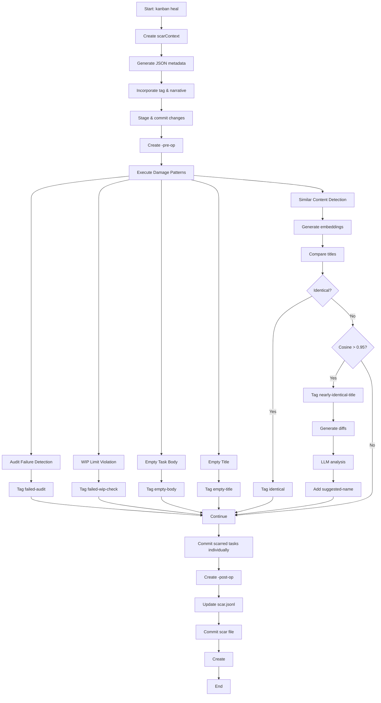

# Implement Kanban Heal Command with Damage Pattern DSL

## 🎯 Overview

Implement a `kanban heal <reason> --config kanban.scar.json` command that **labels and analyzes** board health issues rather than deleting content. The command utilizes vector embeddings for cosine similarity and nearest neighbor searches, along with a large language model (LLM) to identify patterns, tag problematic tasks, and generate rich training data for continuous improvement. This creates a feedback loop for better pattern recognition and root cause analysis.

**Key Innovation**: Non-destructive labeling with intelligent filtering - instead of removing problematic content, the system tags issues and provides filtering mechanisms to hide them from normal board views while preserving them for analysis and training.

## 📋 Context & Goals

### Current State

- The kanban system has basic CLI commands for task management
- Existing audit and WIP limit enforcement functionality
- Git workflow integration with tagging capabilities
- Task storage in `docs/agile/tasks/*.md` with frontmatter

### Target State

- **Non-destructive analysis command** that labels and categorizes issues
- DSL for defining damage patterns with intelligent tagging strategies
- LLM-powered pattern recognition and training data generation
- Rich context collection for root cause analysis and prevention
- Automated Git workflow with scar context tracking for historical analysis
- **Training data pipeline** that improves future detection accuracy
- **Filtering mechanisms** that hide tagged problematic tasks from normal board views
- **Board view generators** for different stakeholder perspectives (clean vs. analytical)

### Success Metrics

- ✅ **Pattern detection accuracy**: >90% of issues correctly labeled
- ✅ **Training data quality**: Rich context captured for all detected issues
- ✅ **Root cause insights**: LLM provides actionable analysis with >80% relevance
- ✅ **Non-destructive operations**: Zero data loss during analysis
- ✅ **Historical tracking**: Complete scar context for trend analysis
- ✅ **Feedback loop**: Detection accuracy improves over time with collected data
- ✅ **Clean board views**: Users can work without seeing tagged problematic tasks
- ✅ **Analytical insights**: Stakeholders can access detailed analysis views when needed

## 🎯 Definition of Done

### Core Requirements

- [ ] All components of the heal command are implemented and tested
- [ ] Vector embeddings for cosine similarity are fully functional
- [ ] LLM integration provides accurate task analysis and suggestions
- [ ] Damage Pattern DSL is defined with comprehensive pattern matching rules
- [ ] Audit and WIP limit checks execute correctly with detailed reporting
- [ ] Documentation is complete and clearly articulates the implementation process
- [ ] Scar context generation works with appropriate tagging and metadata
- [ ] Git workflow maintains proper commit history with pre/post operation tags
- [ ] Integration tests pass with >90% coverage
- [ ] Performance benchmarks meet requirements (<2s for heal operations)

### Quality Gates

- [ ] Code review approved by at least 2 team members
- [ ] Security assessment completed for LLM integration
- [ ] Documentation reviewed and approved
- [ ] Performance testing completed with acceptable benchmarks
- [ ] Error handling covers all edge cases

## 🔧 Implementation Algorithm

### Initialization Phase

1. **Create Scar Context**: Generate a context string named `scarContext` that includes:

   - The reason for the scar
   - The event log
   - All previous scars
   - Markdown-formatted results from `kanban search <reason>`

2. **Generate Scar Metadata**: Create a JSON object from the `scarContext` containing:

   - A short Git tag name
   - A brief narrative describing the current status of the board and its evolution

3. **Incorporate Metadata**: Add the tag name and narrative into the scar context

4. **Pre-Operation Git Workflow**: Stage and commit changes individually, crafting commit messages from the scar context, then appending these messages to the scar context:

   - Tasks directory
   - Kanban board
   - All dependencies of the Kanban within the workspace

5. **Create Pre-Op Tag**: Create a Git tag for the current commit using the format `<scar-tag>-pre-op`

### Scar Context Management

Each LLM operation utilizes the current `scarContext` along with any new data to generate responses. New information, in addition to the generated results, is added to the scar context under appropriate Markdown headers.

## 🎯 Damage Pattern DSL

### Core DSL Rules

- If _any_ damage pattern is matched, add or append the current scar tag to a `damaged` frontmatter list
- All damage patterns impact the frontmatter of damaged tasks, potentially:
  - Diagnosing a problem
  - Prescribing a solution
- Damage patterns may have side effects; these do not count as damage but modify task frontmatter

### Specific Damage Patterns

#### 1. Audit Failure

- **Action**: Perform a dry run of `audit`
- **Damage Detection**: For each task that fails its audit, append an object to the `failed-audits` frontmatter list containing:
  - The current commit SHA
  - The reason for failure
- **Tagging**: Tag as `failed-audit`

#### 2. WIP Limit Violation

- **Action**: Perform a dry run of `enforce-wip-limits`
- **Damage Detection**: For each task that fails, append the current commit SHA to the `failed-wip-check` frontmatter list
- **Tagging**: Tag as `failed-wip-check`

#### 3. Empty Task Body

- **Action**: Scan tasks for empty body content
- **Damage Detection**: Identify tasks with empty bodies
- **Tagging**: Tag as `empty-body`

#### 4. Empty Title

- **Action**: Scan tasks for empty title content
- **Damage Detection**: Identify tasks with empty titles
- **Tagging**: Tag as `empty-title`

#### 5. Similar Content Detection

**Side Effect Operations**:

- Generate vector embeddings for all titles and non-empty bodies
- Save these embeddings in each task's frontmatter as `title-embedding` and `body-embedding`

**Evaluation Operations**:

- Compare each task's title to every other task's title:
  - If `title1 === title2`, add `identical` to both tasks' `tag` frontmatter fields
  - For groups of titles with cosine similarity above 0.95:
    - Tag as `nearly-identical-title`
    - Generate diffs for each pair of titles
    - Feed the diffs to an LLM, requesting an object containing:
      - Suggested name
      - Name of matching pattern
    - Add a `suggested-name` field to each task's frontmatter for easy querying

## 🎯 Filtering & Board View Management

### Filtering Mechanisms

The heal command includes intelligent filtering to hide problematic tasks from normal board views while preserving them for analysis:

#### 1. Damage-Based Filtering

- **Tag-based exclusion**: Tasks with `damaged` frontmatter are automatically filtered from clean board views
- **Severity-based filtering**: Tasks tagged with high-severity patterns can be filtered separately
- **Pattern-specific views**: Create filtered views for specific damage types (duplicates, empty content, etc.)

#### 2. Board View Generators

```bash
# Generate clean board (hides damaged tasks)
kanban generate-by-tags "not:damaged" --kanban docs/agile/boards/views/clean.md

# Generate analytical board (shows all tasks with damage analysis)
kanban generate-by-tags "damaged" --kanban docs/agile/boards/views/analysis.md

# Generate specific damage type views
kanban generate-by-tags "failed-audit" --kanban docs/agile/boards/views/audit-issues.md
kanban generate-by-tags "nearly-identical-title" --kanban docs/agile/boards/views/duplicates.md
```

#### 3. Smart Filtering Configuration

```json
{
  "filtering": {
    "defaultView": "clean",
    "hidePatterns": [
      "damaged",
      "failed-audit",
      "failed-wip-check",
      "empty-body",
      "empty-title",
      "identical",
      "nearly-identical-title"
    ],
    "analyticalViews": {
      "audit-issues": ["failed-audit"],
      "wip-violations": ["failed-wip-check"],
      "content-issues": ["empty-body", "empty-title"],
      "duplicates": ["identical", "nearly-identical-title"]
    }
  }
}
```

### Integration with Existing Workflow

- **Default behavior**: Standard `kanban regenerate` shows clean board by default
- **Opt-in analysis**: Users can explicitly request analytical views when needed
- **Preserved context**: All tagged tasks remain in task files and Git history
- **Reversible filtering**: Filters can be disabled or modified without data loss

## 🔄 Closure Phase

### Post-Operation Git Workflow

1. **Individual Task Commits**: Individually commit the scarred tasks, generating commit messages from their diffs
2. **Create Post-Op Tag**: Create a Git tag for the current commit using the format `<scar-tag>-post-op`
3. **Scar File Management**: Create a `scar.jsonl` file if it does not already exist:
   - Add an object: `{"start":"<pre-op-sha>", "end":"<post-op-sha>", "tag":"<scar-tag>", "story":"<text generated from an LLM>"}`
4. **Final Commit**: Commit the scar file
5. **Final Tag**: Create a Git tag `<scar-tag>`
6. **Generate Filtered Views**: Auto-generate clean and analytical board views based on new damage tags

## 📋 Complete Algorithm Flow



## 🎯 Key Implementation Details

### Scar Context Structure

```typescript
interface ScarContext {
  reason: string;
  eventLog: EventLogEntry[];
  previousScars: ScarRecord[];
  searchResults: SearchResult[];
  metadata: {
    tag: string;
    narrative: string;
  };
  llmOperations: LLMOperation[];
  gitHistory: GitCommit[];
}
```

### Damage Pattern Frontmatter Schema

```typescript
interface DamageFrontmatter {
  damaged: string[]; // List of scar tags
  'failed-audits': Array<{
    sha: string;
    reason: string;
  }>;
  'failed-wip-check': string[];
  tags: string[]; // Damage-specific tags
  'title-embedding': number[];
  'body-embedding': number[];
  'suggested-name'?: string;
}
```

### Scar File Format

```jsonl
{"start":"abc123","end":"def456","tag":"heal-2025-10-11-01","story":"Fixed duplicate tasks and empty content issues"}
{"start":"def456","end":"ghi789","tag":"heal-2025-10-11-02","story":"Resolved WIP limit violations and audit failures"}
```

## 🧩 Refined Task Breakdown

### Phase 1: Core Infrastructure (Dependencies: None)

#### 1.1 Scar Context System

**Effort**: 6 hours
**Implementation**:

- `packages/kanban/src/lib/heal/scar-context.ts` (new)
- `packages/kanban/src/lib/heal/context-builder.ts` (new)
- `packages/kanban/src/lib/types.ts` (extend)

**Acceptance Criteria**:

- Scar context creation with reason, event log, previous scars, search results
- JSON metadata generation with Git tag name and narrative
- Context accumulation with Markdown headers for new information
- LLM integration for context enhancement

#### 1.2 Git Workflow Integration

**Effort**: 8 hours
**Implementation**:

- `packages/kanban/src/lib/heal/git-workflow.ts` (new)
- `packages/kanban/src/lib/git-sync.ts` (extend)

**Acceptance Criteria**:

- Individual commits for tasks directory, kanban board, dependencies
- Commit message generation from scar context
- Pre-op tag creation (`<scar-tag>-pre-op`)
- Post-op individual task commits with diff-based messages
- Post-op tag creation (`<scar-tag>-post-op`)
- Final scar file commit and tag creation

### Phase 2: Damage Pattern DSL (Dependencies: 1.1, 1.2)

#### 2.1 DSL Core Engine

**Effort**: 10 hours
**Implementation**:

- `packages/kanban/src/lib/dsl/engine.ts` (new)
- `packages/kanban/src/lib/dsl/patterns.ts` (new)
- `packages/kanban/src/lib/dsl/types.ts` (new)

**Acceptance Criteria**:

- DSL rule execution with damage detection
- Frontmatter modification capabilities
- Side effect handling for non-damaging modifications
- Pattern matching with context awareness

#### 2.2 Specific Damage Pattern Implementation

**Effort**: 12 hours
**Implementation**:

- `packages/kanban/src/lib/dsl/patterns/audit-failure.ts` (new)
- `packages/kanban/src/lib/dsl/patterns/wip-violation.ts` (new)
- `packages/kanban/src/lib/dsl/patterns/empty-content.ts` (new)
- `packages/kanban/src/lib/dsl/patterns/similar-content.ts` (new)

**Acceptance Criteria**:

- Audit failure detection with `failed-audits` frontmatter and `failed-audit` tagging
- WIP limit violation detection with `failed-wip-check` frontmatter and tagging
- Empty body detection with `empty-body` tagging
- Empty title detection with `empty-title` tagging
- Similar content detection with vector embeddings and LLM suggestions

### Phase 3: Vector & LLM Integration (Dependencies: 2.1, 2.2)

#### 3.1 Vector Embedding System

**Effort**: 8 hours
**Implementation**:

- `packages/kanban/src/lib/vector/embeddings.ts` (new)
- `packages/kanban/src/lib/vector/similarity.ts` (new)

**Acceptance Criteria**:

- Vector embedding generation for titles and bodies
- `title-embedding` and `body-embedding` frontmatter storage
- Cosine similarity calculation with 0.95 threshold
- Identical title detection (`title1 === title2`)
- Nearly identical title grouping and tagging

#### 3.2 LLM Integration for Similar Content

**Effort**: 6 hours
**Implementation**:

- `packages/kanban/src/lib/llm/similarity-analyzer.ts` (new)
- `packages/kanban/src/lib/llm/prompts.ts` (new)

**Acceptance Criteria**:

- Diff generation for similar title pairs
- LLM requests for suggested names and pattern names
- `suggested-name` frontmatter field population
- Structured response parsing and validation

### Phase 4: CLI Integration (Dependencies: 3.1, 3.2)

#### 4.1 Heal Command Implementation

**Effort**: 10 hours
**Implementation**:

- `packages/kanban/src/cli/heal-handler.ts` (new)
- `packages/kanban/src/lib/heal/core.ts` (new)
- `packages/kanban/src/cli/command-handlers.ts` (extend)

**Acceptance Criteria**:

- `kanban heal <reason> --config kanban.scar.json` command
- Complete algorithm implementation from initialization to closure
- Configuration file support and validation
- Progress reporting and error handling
- Automatic filtered view generation post-heal

#### 4.2 Configuration Management

**Effort**: 4 hours
**Implementation**:

- `packages/kanban/src/lib/config/scar-config.ts` (new)
- `packages/kanban/src/lib/config/schema.ts` (new)

**Acceptance Criteria**:

- `kanban.scar.json` schema definition and validation
- Default configuration generation
- Environment-specific configuration support
- Filtering configuration management

#### 4.3 Filtering & View Management

**Effort**: 6 hours
**Implementation**:

- `packages/kanban/src/lib/filters/board-filter.ts` (new)
- `packages/kanban/src/lib/filters/view-generator.ts` (new)
- `packages/kanban/src/cli/generate-handlers.ts` (extend)

**Acceptance Criteria**:

- Tag-based filtering for damaged tasks
- Clean board view generation (hides problematic tasks)
- Analytical board view generation (shows all with analysis)
- Pattern-specific filtered views
- Integration with existing `generate-by-tags` command

### Phase 5: Testing & Documentation (Dependencies: 4.1, 4.2)

#### 5.1 Comprehensive Testing

**Effort**: 14 hours
**Implementation**:

- `packages/kanban/src/tests/heal/*.test.ts` (new)
- `packages/kanban/src/tests/dsl/*.test.ts` (new)
- `packages/kanban/src/tests/vector/*.test.ts` (new)

**Acceptance Criteria**:

- Unit tests with >90% coverage for all components
- Integration tests for complete heal workflow
- Mock LLM responses for consistent testing
- Performance tests for vector operations

#### 5.2 Documentation

**Effort**: 6 hours
**Implementation**:

- `docs/agile/kanban-heal-algorithm.md` (new)
- `docs/agile/damage-pattern-dsl.md` (new)
- `docs/agile/heal-examples.md` (new)

**Acceptance Criteria**:

- Complete algorithm documentation
- DSL pattern reference with examples
- Configuration and usage guides

## 🔗 Related Resources

### Documentation

- [Kanban CLI Reference](docs/agile/kanban-cli-reference.md)
- [Process Documentation](docs/agile/process.md)
- [FSM Rules](docs/agile/rules/kanban-transitions.clj)
- [MCP Reference](docs/agile/mcp-reference.md)

### Code Files

- [Kanban CLI](packages/kanban/src/cli.ts)
- [Command Handlers](packages/kanban/src/cli/command-handlers.ts)
- [Task Tools](packages/kanban/src/lib/task-tools.ts)
- [Git Sync](packages/kanban/src/lib/git-sync.ts)
- [Event Log](packages/kanban/src/board/event-log.ts)
- [Types](packages/kanban/src/lib/types.ts)

### Configuration

- [Kanban Config](promethean.kanban.json)
- [MCP Config](promethean.mcp.json)

## 🚧 Risks & Considerations

### Technical Risks

- **LLM API Reliability**: Implement robust fallback mechanisms
- **Vector Database Performance**: Optimize caching and batch processing
- **DSL Complexity**: Keep grammar simple and well-documented
- **Git Workflow Conflicts**: Handle merge scenarios gracefully

### Operational Risks

- **Performance Impact**: Monitor and optimize healing operation duration
- **Cost Management**: Implement rate limiting for LLM calls
- **Data Privacy**: Ensure sensitive task data is handled appropriately
- **Rollback Capability**: Maintain ability to undo healing operations

### Mitigation Strategies

- Comprehensive error handling and logging
- Performance monitoring and alerting
- Cost tracking and budget controls
- Regular backup and recovery testing

## 📊 Success Metrics

### Performance Metrics

- Heal operation completion time: <2 seconds
- Vector similarity calculation: <100ms per comparison
- DSL pattern execution: <50ms per pattern
- LLM response time: <5 seconds (with fallback)

### Quality Metrics

- Task suggestion accuracy: >85%
- Pattern detection precision: >90%
- Audit coverage: 100%
- Test coverage: >90%

### Operational Metrics

- Zero data loss during healing operations
- Complete audit trail for all operations
- Successful rollback capability
- User satisfaction score: >4.5/5

## 🔄 Workflow Integration

### Pre-Operation Checklist

- [ ] Backup current kanban state
- [ ] Validate configuration files
- [ ] Check LLM API availability
- [ ] Verify Git repository status
- [ ] Confirm WIP limits compliance

### Post-Operation Verification

- [ ] Validate Git tags created correctly
- [ ] Confirm scar context generated
- [ ] Verify audit trail completeness
- [ ] Check task integrity
- [ ] Review performance metrics

## 🏷️ Tags & Labels

**Primary Tags**: `tool:codex`, `cap:codegen`, `env:no-egress`, `role:engineer`
**Secondary Tags**: `feature:heal`, `component:kanban`, `priority:high`
**Board Views**: `enhancement`, `backend`, `ai-integration`, `cli-tools`

## 📝 Notes

### Implementation Approach

1. Start with foundation components (scar context, Git workflow)
2. Develop DSL in parallel with vector/LLM integration
3. Integrate all components through CLI command
4. Comprehensive testing and documentation
5. Performance optimization and monitoring

### Team Coordination

- **Backend Team**: Core CLI integration and Git workflow
- **AI Team**: LLM integration and vector embeddings
- **DevOps Team**: Configuration management and deployment
- **QA Team**: Testing strategy and validation

### Dependencies

- Requires LLM API access and configuration
- Vector database service (or local implementation)
- Git repository with appropriate permissions
- Node.js environment with TypeScript support

---

## 🗂 Source

- Path: docs/agile/tasks/20251011223651.md
- Created: 2025-10-11T22:36:51.000Z
- Last Modified: 2025-10-11T22:36:51.000Z

## 📝 Implementation Notes

This task represents a significant enhancement to the kanban system's healing capabilities. The implementation should prioritize:

1. **Modularity**: Each component should be independently testable
2. **Performance**: Optimize for large-scale task repositories
3. **Extensibility**: Design for future pattern and rule additions
4. **Reliability**: Ensure robust error handling and recovery
5. **Usability**: Provide clear feedback and progress indicators

The Damage Pattern DSL should be intuitive yet powerful, allowing users to define complex healing scenarios without extensive programming knowledge. Vector embeddings and LLM integration should enhance, not replace, human decision-making in the healing process.
