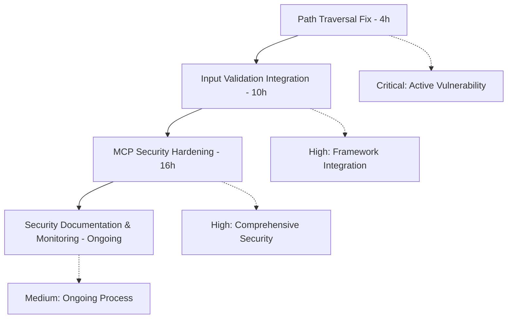

## 🚀 P0 Security Implementation Roadmap

### 📋 Executive Summary
This roadmap coordinates the implementation of all P0 security tasks across the Promethean Framework. It prioritizes critical vulnerabilities, manages dependencies, and ensures systematic security hardening.

---

## 🎯 Task Overview & Dependencies

---

## ⚡ Phase 1: Critical Vulnerability Response (First 4 hours)

### 🚨 IMMEDIATE ACTION REQUIRED

#### Task 1: Path Traversal Vulnerability Fix
**UUID**: `3c6a52c7`  
**Duration**: 4 hours  
**Priority**: CRITICAL - Active Exploit  
**Assigned To**: `security-specialist`

##### Timeline (Hours 0-4)
- **Hour 0-0.5**: Emergency code flow analysis
- **Hour 0.5-1.5**: Validation logic restructuring  
- **Hour 1.5-2.5**: Array input validation implementation
- **Hour 2.5-3.5**: Security testing and validation
- **Hour 3.5-4**: Documentation and deployment

##### Success Criteria
- [ ] Path traversal vulnerability eliminated
- [ ] All input types validated
- [ ] Security test coverage > 95%
- [ ] Production deployment complete

---

## 🔒 Phase 2: Security Framework Integration (Next 10 hours)

### Task 2: Input Validation Integration
**UUID**: `f44bbb50`  
**Duration**: 10 hours  
**Priority**: HIGH - Framework Integration  
**Assigned To**: `fullstack-developer`, `security-specialist`

##### Timeline (Hours 4-14)
- **Hour 4-5**: Integration gap analysis
- **Hour 5-8**: Service integration implementation
- **Hour 8-10**: Array validation enhancement
- **Hour 10-12**: Integration testing suite
- **Hour 12-14**: End-to-end security validation

##### Success Criteria
- [ ] Validation framework fully integrated
- [ ] All services using validation
- [ ] Integration test coverage > 95%
- [ ] Process violation resolved

---

## 🛡️ Phase 3: Comprehensive Security Hardening (Final 16 hours)

### Task 3: MCP Security Hardening
**UUID**: `d794213f`  
**Duration**: 16 hours  
**Priority**: HIGH - Comprehensive Security  
**Assigned To**: `security-specialist`, `devops-orchestrator`, `integration-tester`

##### Timeline (Hours 14-30)
- **Hour 14-16**: Security architecture audit
- **Hour 16-19**: Input validation framework
- **Hour 19-21**: Rate limiting & abuse prevention
- **Hour 21-23**: Security middleware implementation
- **Hour 23-25**: Secure file handling
- **Hour 25-27**: Comprehensive audit logging
- **Hour 27-30**: Security testing suite

##### Success Criteria
- [ ] All MCP endpoints secured
- [ ] Comprehensive input validation
- [ ] Rate limiting and abuse prevention
- [ ] Full audit logging
- [ ] Security test coverage > 95%

---

## 👥 Resource Allocation & Coordination

### Primary Security Team
- **Security Specialist**: Lead vulnerability fixes and security architecture
- **Full Stack Developer**: Service integration and implementation
- **Integration Tester**: Security testing and validation
- **DevOps Orchestrator**: Rate limiting and infrastructure security

### Supporting Roles
- **Code Reviewer**: Security code review and validation
- **Documentation Specialist**: Security documentation and processes
- **Monitoring Team**: Security monitoring and alerting

### Coordination Protocol
1. **Daily Standups**: Security task progress review
2. **Emergency Channel**: Critical vulnerability response
3. **Code Review**: All security changes require dual review
4. **Testing Gate**: No deployment without security validation

---

## 📊 Risk Management & Mitigation

### Risk Assessment Matrix

| Task | Risk Level | Impact | Mitigation Strategy |
|------|------------|--------|-------------------|
| Path Traversal | Critical | System Compromise | Immediate fix, hotfix deployment |
| Input Validation | High | Security Bypass | Framework integration, testing |
| MCP Hardening | High | Multiple Attack Vectors | Comprehensive implementation |

### Mitigation Strategies
1. **Immediate Response**: Hotfix critical vulnerabilities
2. **Staged Implementation**: Progressive security hardening
3. **Continuous Monitoring**: Real-time threat detection
4. **Rollback Planning**: Quick recovery capability

---

## 🔍 Quality Gates & Success Metrics

### Phase Gates
- **Phase 1 Gate**: Vulnerability eliminated, production deployed
- **Phase 2 Gate**: Framework integrated, tests passing
- **Phase 3 Gate**: Comprehensive security, monitoring active

### Success Metrics
- **Security Score**: Improve from 2/10 to 9/10
- **Vulnerability Count**: Reduce to zero critical vulnerabilities
- **Test Coverage**: Maintain >95% security test coverage
- **Response Time**: <1 hour for critical vulnerabilities

---

## 🚀 Deployment Strategy

### Deployment Sequence
1. **Hotfix Deployment** (Hour 4): Critical vulnerability fix
2. **Staged Rollout** (Hours 4-14): Framework integration
3. **Full Deployment** (Hours 14-30): Comprehensive security

### Environment Strategy
- **Development**: Implementation and unit testing
- **Staging**: Integration testing and security validation
- **Production**: Monitored deployment with rollback

### Monitoring Requirements
- **Security Events**: Real-time monitoring and alerting
- **Performance Impact**: Resource usage and response times
- **Attack Detection**: Attempt monitoring and blocking

---

## 📋 Implementation Checklist

### Phase 1: Critical Response (Hours 0-4)
- [ ] Path traversal vulnerability analysis
- [ ] Validation logic restructuring
- [ ] Array input validation
- [ ] Security testing
- [ ] Production deployment
- [ ] Monitoring activation

### Phase 2: Framework Integration (Hours 4-14)
- [ ] Integration gap analysis
- [ ] Service integration
- [ ] Enhanced validation
- [ ] Integration testing
- [ ] End-to-end validation

### Phase 3: Comprehensive Security (Hours 14-30)
- [ ] Security audit
- [ ] Input validation framework
- [ ] Rate limiting
- [ ] Security middleware
- [ ] Secure file handling
- [ ] Audit logging
- [ ] Security testing

---

## 🎯 Definition of Done

### Technical Requirements
- [ ] All critical vulnerabilities eliminated
- [ ] Comprehensive input validation implemented
- [ ] Security framework fully integrated
- [ ] Rate limiting and abuse prevention active
- [ ] Full audit logging implemented
- [ ] Security test coverage > 95%

### Process Requirements
- [ ] Security team approval obtained
- [ ] Documentation updated
- [ ] Monitoring and alerting active
- [ ] Incident response procedures established
- [ ] Team security training completed

### Quality Requirements
- [ ] Code review completed for all changes
- [ ] Penetration testing passed
- [ ] Performance impact acceptable
- [ ] Rollback procedures tested

---

## 🔄 Ongoing Security Management

### Continuous Monitoring
- **Security Events**: 24/7 monitoring and alerting
- **Vulnerability Scanning**: Automated daily scans
- **Performance Monitoring**: Resource usage tracking
- **Attack Detection**: Real-time threat monitoring

### Regular Reviews
- **Weekly**: Security status review
- **Monthly**: Security architecture review
- **Quarterly**: Comprehensive security assessment
- **Annually**: Security framework update

### Incident Response
- **Immediate**: Critical vulnerability response
- **24 Hours**: Security incident analysis
- **1 Week**: Security improvement implementation
- **1 Month**: Security process updates

---

## 📞 Emergency Contacts

### Security Team
- **Security Lead**: [Contact Information]
- **Incident Response**: [Contact Information]
- **DevOps Security**: [Contact Information]

### Escalation Protocol
1. **Level 1**: Security specialist on call
2. **Level 2**: Security team lead
3. **Level 3**: CTO/Engineering management
4. **Level 4**: Executive team

---

**ROADMAP STATUS**: READY FOR IMPLEMENTATION  
**TOTAL TIME**: 30 HOURS  
**PRIORITY**: CRITICAL - IMMEDIATE ACTION REQUIRED
