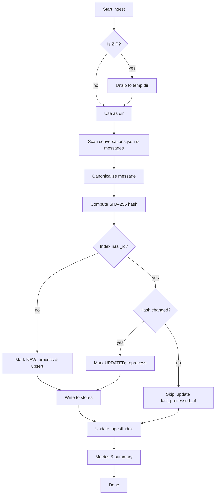

# Task: ChatGPT Export Ingest with De‑dup Index & Hashes
```
**Status:** blocked
```
## Objective

Ingest full ChatGPT export archives repeatedly without reprocessing previously seen items. Maintain a durable index of processed message/thread IDs and content hashes to support fast de‑duplication, resumability, and idempotent re‑runs.

---

## Definition of Done (DoD)

* [ ] CLI and/or service endpoint accepts a path to a ChatGPT export (zip or folder).
* [ ] Parser extracts conversations, messages, attachments, and metadata from the export.
* [ ] A persistent **IngestIndex** is created/updated with:

  * Stable `conversation_id`, `message_id` keys where available.
  * Content hash (SHA‑256) of canonicalized payload per message and attachment.
  * First‑seen timestamp and last‑processed timestamp.
  * Processing status new/updated/skipped/failed and error details if any.
* [ ] Re‑running against the same export yields **0 reprocessed messages** (all skipped) and finishes quickly.
* [ ] If a message’s content changes (hash diff), it is reprocessed exactly once and index is updated.
* [ ] Idempotent upsert to downstream stores e.g., Mongo + Chroma guarded by hash.
* [ ] Metrics + summary report printed: counts of new/updated/skipped/failed.
* [ ] Unit tests cover: hashing, canonicalization, index upsert logic, skip logic, resume from partial run.

---

## Inputs

* `EXPORT_PATH`: path to unzipped ChatGPT export directory (or a `.zip` handled by pre‑step).
* Optional filters: `--since <ISO8601>`, `--only-conv <id>`, `--dry-run`.

## Outputs

* Updated **IngestIndex** collection/table.
* Optional: line‑delimited JSON of newly processed items for piping.
* Summary stats in stdout.

---

## Data Model (proposed)

```json
// Collection: ingest_index_chatgpt
{
  "_id": "<conversation_id>:<message_id>",
  "conversation_id": "string",
  "message_id": "string",
  "parent_id": "string|null",
  "role": "system|user|assistant|tool",
  "created_at": "ISO8601",
  "canonical_text": "string", // normalized text used for hashing
  "content_hash": "sha256-hex",
  "attachments": [
    {
      "name": "string",
      "mimetype": "string",
      "bytes": "int",
      "hash": "sha256-hex"
    }
  ],
  "first_seen_at": "ISO8601",
  "last_processed_at": "ISO8601",
  "status": "new|updated|skipped|failed",
  "error": {
    "message": "string",
    "stack": "string"
  },
  "version": 1
}
```

> Note: If export lacks stable message IDs, derive `message_id` = `sha256conversation_id + index_in_thread + timestamp + canonical_text[:128]`.

---

## Canonicalization Rules

* Normalize line endings to `\n`.
* Trim trailing spaces; collapse 2+ blank lines to 1.
* Strip non‑semantic whitespace in markdown code fences.
* Normalize JSON within code blocks by parsing and stringifying with stable key order when possible.
* For attachments, hash the raw bytes; for images inside export, include EXIF‑stripped bytes if present.

---

## Hashing Strategy

* Message hash = `sha256role + "\n" + canonical_text + "\n" + join(att_hashes, ",")`.
* Thread hash (optional) = merkle root of ordered message hashes.
* Store both message‑level and thread‑level hashes to detect edits and reorderings.

---

## High‑Level Flow



---

## Pseudocode (Sibilant‑style)

```lisp
(defn process-export [export-path opts]
  (let [root (ensure-dir export-path)
        convs (read-conversations root)]
    (for-each (lambda (conv)
                (process-conversation conv opts))
              convs)
    (print-summary)))

(defn process-conversation [conv opts]
  (for-each (lambda (msg idx)
              (let* [canon (canonicalize (get msg "text"))
                     att-hashes (map sha256-bytes (attachments-bytes msg))
                     hash (sha256 (join "\n" [(get msg "role") canon (join "," att-hashes)]))
                     id (stable-id conv msg idx)
                     rec (ingest-index-get id)]
                (cond
                  (nil? rec) (ingest-new id conv msg hash canon att-hashes)
                  (= hash (get rec "content_hash")) (ingest-skip id)
                  :else (ingest-update id conv msg hash canon att-hashes))))
            (enumerate (get conv "messages"))))
```

---

## Implementation Tasks
```
1. **Scaffold**
```
   * [ ] Add `services/ts/chatgpt-ingest` (or integrate into existing ingest service).
   * [ ] CLI via `pnpm tsx src/cli.ts` with args: `--export <path> --since ISO --only-conv id --dry-run`.
```
2. **Parser**
```
   * [ ] Support official ChatGPT export structure `conversations.json`, `messages/`, `attachments/`.
   * [ ] Extract: conversation title, id, create time, per‑message role, text, code blocks, attachments.
```
3. **Canonicalizer & Hashing**
```
   * [ ] Implement text canonicalization module with tests.
   * [ ] Implement SHA‑256 helper for strings + files.
   * [ ] Optional: Merkle builder for thread hash.
```
4. **Index Store**
```
   * [ ] Create `ingest_index_chatgpt` in Mongo (or DualStore abstraction).
   * [ ] Upsert by `_id = conversation_id:message_id`.
   * [ ] Maintain `first_seen_at`, `last_processed_at`, `status`, `content_hash`.
```
5. **Processing Pipeline**
```
   * [ ] For NEW/UPDATED: emit to downstream sinks (Mongo docs, Chroma embeddings, file store) behind a hash guard.
   * [ ] For SKIPPED: only touch `last_processed_at`.
   * [ ] `--dry-run` prints plan without writes.
```
6. **Resumability & Partial Runs**
```
   * [ ] Maintain a run log with `run_id`, totals, and per‑conv cursors.
   * [ ] On crash, re‑invoke continues where left off.
```
7. **Reporting & Metrics**
```
   * [ ] At end: print counts new/updated/skipped/failed and timing.
   * [ ] Export `ingest-summary-YYYYMMDDTHHMMSS.json`.
```
8. **Tests**
```
   * [ ] Unit: canonicalize, hash, ID derivation, index upsert, skip logic.
   * [ ] Integration: run twice; second run should skip all.

---

## CLI Sketch

```bash
pnpm tsx src/cli.ts --export ~/Downloads/chatgpt-export \
  --since 2025-01-01T00:00:00Z --dry-run
```

---

## Failure Modes & Guards

* Export schema variations → feature‑flag parser versions; validate with JSON schema.
* Missing IDs → fall back to derived IDs; store `id_source = derived|native`.
* Large exports → stream read files; batch writes; backoff on DB.
* Hash collisions (practically negligible with SHA‑256) → also compare length + role.
* Time skew → prefer content‑based hashes over timestamps for change detection.

---

## Optional Enhancements

* Bloom filter of seen message hashes for ultra‑fast prechecks in memory.
* Secondary index on `content_hash` to detect duplicates across conversations.
* Attachment dedup store keyed by file hash with ref‑counts.
* Metrics to heartbeat service.

---

## Acceptance Checklist (Quick)

* [ ] Second run over same export yields only SKIPPED messages.
* [ ] Editing one message in export results in exactly one UPDATED.
* [ ] Index survives process restarts and supports resuming.
* [ ] Report artifact written with accurate counts.

## Blockers
- No active owner or unclear scope

#breakdown
