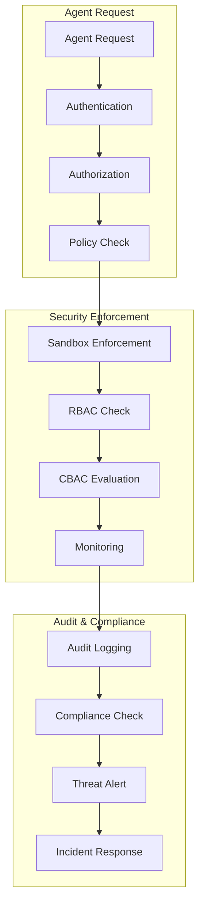

# Design Agent Security Architecture

## Overview
Design a comprehensive security architecture that ensures agent instances operate in a secure, isolated, and controlled environment. This architecture must protect against both external threats and internal agent compromises while maintaining operational efficiency.

## Scope
Design multi-layered security including agent sandboxing, authentication, authorization, audit trails, and compliance frameworks. The security model must balance strong protection with operational flexibility.

## Security Principles

### 1. Zero Trust Architecture
- **Never Trust, Always Verify**: All agent interactions require authentication and authorization
- **Principle of Least Privilege**: Agents receive only permissions necessary for their tasks
- **Micro-segmentation**: Each agent instance operates in an isolated security domain
- **Continuous Monitoring**: Real-time security monitoring and threat detection

### 2. Defense in Depth
- **Multiple Security Layers**: Network, application, container, and process-level protections
- **Fail-Safe Defaults**: Secure configurations requiring explicit permission to relax
- **Reduced Attack Surface**: Minimal exposure of agent capabilities and system resources
- **Security Diversity**: Different security mechanisms at each layer

### 3. Transparency & Auditability
- **Complete Traceability**: All agent actions are logged and auditable
- **Immutable Audit Trails**: Tamper-evident logging of all security-relevant events
- **Real-time Monitoring**: Continuous security monitoring and alerting
- **Compliance Reporting**: Automated compliance reporting and evidence collection

## Detailed Security Components

### 1. Agent Identity Management

#### Cryptographic Identity System
```typescript
interface AgentIdentity {
  // Cryptographic Identifiers
  instanceId: string;           // UUID v4
  
  // Security Credentials
  keyPair: {
    publicKey: string;          // Agent's public key
    privateKey: string;         // Encrypted private key
    keyAlgorithm: 'RSA-4096' | 'ECDSA-P384';
    keyUsage: string[];         // Allowed key usages
  };
  
  // Certificates
  certificates: {
    agentCertificate: X509Certificate;
    caChain: X509Certificate[];
    certificateFingerprint: string;
    validFrom: Date;
    validTo: Date;
  };
  
  // Authentication Tokens
  tokens: {
    accessToken: JWT;           // Short-lived access token
    refreshToken: JWT;          // Long-lived refresh token
    sessionToken: JWT;          // Session management token
  };
  
  // Identity Metadata
  createdAt: Date;
  lastRotated: Date;
  nextRotation: Date;
  status: 'active' | 'revoked' | 'expired' | 'compromised';
}
```

#### Authentication Framework
```typescript
interface AgentAuthentication {
  // Token Management
  generateTokens(agentId: string): Promise<TokenSet>;
  validateToken(token: string): Promise<TokenValidation>;
  refreshToken(refreshToken: string): Promise<TokenSet>;
  revokeToken(tokenId: string): Promise<void>;
  
  // Certificate Management
  generateCertificate(agentId: string): Promise<X509Certificate>;
  revokeCertificate(certificateId: string): Promise<void>;
  validateCertificate(certificate: X509Certificate): Promise<CertificateValidation>;
  
  // Identity Verification
  verifyIdentity(challenge: string, signature: string): Promise<boolean>;
  establishSecureChannel(agentId: string): Promise<SecureChannel>;
}
```

### 2. Agent Sandboxing & Isolation

#### Container Security Profile
```yaml
# Agent Security Profile Configuration
agent_security_profile:
  # Level 1: Process Isolation
  process_isolation:
    pid_namespace: true
    user_namespace: true
    mount_namespace: true
    network_namespace: true
    uts_namespace: true
    ipc_namespace: true
    cgroup_namespace: true
    
  # Level 2: User Permissions
  user_permissions:
    run_as_user: 65534          # nobody user
    run_as_group: 65534        # nogroup group
    no_new_privileges: true
    read_only_rootfs: true
    privileged: false
    
  # Level 3: Capability Restrictions
  capabilities:
    bounding: []
    effective: []
    inheritable: []
    permitted: []
    ambient: []
    # All capabilities dropped by default
    
  # Level 4: System Call Filtering
  seccomp:
    default_action: "SCMP_ACT_ERRNO"
    architectures: ["SCMP_ARCH_X86_64", "SCMP_ARCH_X86", "SCMP_ARCH_X32"]
    syscalls:
      - name: "read"
        action: "SCMP_ACT_ALLOW"
      - name: "write"
        action: "SCMP_ACT_ALLOW"
      - name: "open"
        action: "SCMP_ACT_ALLOW"
      - name: "close"
        action: "SCMP_ACT_ALLOW"
      - name: "stat"
        action: "SCMP_ACT_ALLOW"
      - name: "fstat"
        action: "SCMP_ACT_ALLOW"
      - name: "mmap"
        action: "SCMP_ACT_ALLOW"
      - name: "munmap"
        action: "SCMP_ACT_ALLOW"
      - name: "brk"
        action: "SCMP_ACT_ALLOW"
      # ... minimal syscalls required for operation
      
  # Level 5: Network Isolation
  network_isolation:
    disabled: false
    bridge: "agent-network"
    ip_address: "10.0.1.0/24"
    gateway: "10.0.1.1"
    dns_servers: ["8.8.8.8", "8.8.4.4"]
    egress_rules:
      - destination: "0.0.0.0/0"
        protocol: "tcp"
        ports: [443, 80]
        action: "allow"
      - destination: "0.0.0.0/0"
        protocol: "udp"
        ports: [53]
        action: "allow"
    # All other traffic denied
        
  # Level 6: File System Restrictions
  filesystem_restrictions:
    read_only_paths:
      - "/usr/lib/**"
      - "/lib/**"
      - "/lib64/**"
      - "/etc/ssl/**"
      - "/etc/ca-certificates/**"
    read_write_paths:
      - "/tmp/**"
      - "/var/tmp/**"
      - "/home/agent/workspace/**"
      - "/home/agent/.cache/**"
    forbidden_paths:
      - "/etc/**"
      - "/root/**"
      - "/home/**"
      - "/var/**"
      - "/sys/**"
      - "/proc/**"
      - "/dev/**"
      
  # Level 7: Resource Limits
  resource_limits:
    memory:
      limit: 1073741824        # 1GB
      swap: 1073741824          # 1GB swap
    cpu:
      shares: 512              # Relative CPU shares
      quota: 50000             # 50ms CPU quota per 100ms period
      period: 100000           # 100ms period
    pids:
      limit: 20                # Max 20 processes
    files:
      limit: 100               # Max 100 file descriptors
    network:
      limit: 10                # Max 10 network connections
```

#### Dynamic Capability Enforcement
```typescript
interface AgentCapabilityPolicy {
  // Policy Identification
  policyId: string;
  agentInstanceId: string;
  agentType: string;
  version: string;
  
  // Allowed Operations
  allowedSyscalls: string[];
  allowedFileOperations: {
    read: string[];             // Readable file patterns
    write: string[];            // Writable file patterns
    execute: string[];          // Executable file patterns
  };
  
  // Network Access Rules
  networkRules: {
    allowedHosts: string[];
    allowedPorts: number[];
    allowedProtocols: string[];
    maxConnections: number;
    dataTransferLimit: number;  // bytes per hour
  };
  
  // Tool Access Control
  toolAccess: {
    allowedTools: string[];
    toolConfigurations: Record<string, any>;
    usageLimits: Record<string, number>;
  };
  
  // Resource Constraints
  resourceConstraints: {
    maxMemory: number;
    maxCpuTime: number;
    maxFileSize: number;
    maxProcesses: number;
    maxExecutionTime: number;
  };
  
  // Security Monitoring
  monitoring: {
    logLevel: 'info' | 'warn' | 'error' | 'critical';
    alertThresholds: {
      failedAuthentications: number;
      resourceUsage: number;
      suspiciousOperations: number;
    };
    auditLevel: 'basic' | 'detailed' | 'comprehensive';
  };
  
  // Policy Metadata
  createdAt: Date;
  updatedAt: Date;
  effectiveFrom: Date;
  effectiveTo?: Date;
  status: 'active' | 'inactive' | 'deprecated';
}
```

### 3. Authorization & Permission System

#### Capability-Based Access Control (CBAC)
```typescript
interface AgentPermission {
  // Permission Identification
  permissionId: string;
  name: string;
  description: string;
  category: PermissionCategory;
  
  // Permission Scope
  scope: {
    resources: string[];        // Resource patterns this permission applies to
    operations: string[];       // Operations allowed
    conditions: Condition[];    // Conditions under which permission is valid
  };
  
  // Permission Attributes
  attributes: {
    inheritable: boolean;       // Can be inherited by child permissions
    delegable: boolean;         // Can be delegated to other agents
    temporary: boolean;         // Temporary permission with expiration
    contextAware: boolean;      // Permission varies based on context
  };
  
  // Permission Constraints
  constraints: {
    timeConstraints: TimeConstraint[];
    resourceConstraints: ResourceConstraint[];
    contextConstraints: ContextConstraint[];
    auditLevel: AuditLevel;
  };
  
  // Permission Metadata
  createdAt: Date;
  createdBy: string;
  approvedBy?: string;
  reviewedAt?: Date;
  version: number;
}

interface PermissionEvaluation {
  agentId: string;
  resourceId: string;
  operation: string;
  context: EvaluationContext;
  result: {
    allowed: boolean;
    reason: string;
    conditions: string[];
    expiresAt?: Date;
    auditRequired: boolean;
  };
}
```

#### Role-Based Access Control (RBAC) Integration
```typescript
interface AgentRole {
  roleId: string;
  name: string;
  description: string;
  
  // Role Permissions
  permissions: string[];       // Permission IDs
  capabilities: string[];      // Capability requirements
  
  // Role Hierarchy
  parentRoles?: string[];       // Inherited roles
  childRoles?: string[];        // Roles that inherit from this role
  
  // Role Constraints
  constraints: {
    maxAgents: number;          // Maximum agents with this role
    timeRestrictions: TimeRestriction[];
    resourceRestrictions: ResourceRestriction[];
  };
  
  // Role Metadata
  createdAt: Date;
  updatedAt: Date;
  status: 'active' | 'inactive' | 'deprecated';
}
```

### 4. Audit & Compliance Framework

#### Comprehensive Audit System
```typescript
interface AuditEvent {
  // Event Identification
  eventId: string;
  eventType: AuditEventType;
  category: AuditCategory;
  severity: AuditSeverity;
  
  // Event Context
  timestamp: Date;
  source: {
    agentId: string;
    component: string;
    ipAddress: string;
    userAgent: string;
  };
  
  // Event Data
  action: {
    operation: string;
    resource: string;
    result: 'success' | 'failure' | 'partial';
    details: Record<string, any>;
  };
  
  // Security Context
  security: {
    authenticated: boolean;
    authorized: boolean;
    permissions: string[];
    sessionContext: string;
  };
  
  // Impact Assessment
  impact: {
    dataAccess: DataAccessLevel;
    systemImpact: SystemImpactLevel;
    complianceImpact: ComplianceImpactLevel;
    riskLevel: RiskLevel;
  };
  
  // Chain of Custody
  provenance: {
    causationEventId?: string;
    correlationId: string;
    requestId?: string;
    traceId?: string;
  };
  
  // Event Hashing (for integrity)
  integrity: {
    eventHash: string;
    previousEventHash?: string;
    signature: string;
  };
}

interface AuditTrail {
  events: AuditEvent[];
  metadata: {
    retentionPeriod: number;
    complianceRequirements: ComplianceRequirement[];
    storageLocation: string;
    encryptionDetails: EncryptionDetails;
  };
}
```

#### Compliance Framework
```typescript
interface ComplianceFramework {
  // Compliance Standards
  standards: {
    iso27001: ISO27001Controls;
    soc2: SOC2Controls;
    gdpr: GDPRControls;
    hipaa: HIPAAControls;
    pciDSS: PCIDSSControls;
  };
  
  // Compliance Monitoring
  monitoring: {
    controls: ComplianceControl[];
    assessments: ComplianceAssessment[];
    reports: ComplianceReport[];
    alerts: ComplianceAlert[];
  };
  
  // Evidence Management
  evidence: {
    collection: EvidenceCollection[];
    storage: EvidenceStorage;
    retention: EvidenceRetention;
    retrieval: EvidenceRetrieval;
  };
  
  // Audit Support
  auditSupport: {
    auditTrails: AuditTrail[];
    auditReports: AuditReport[];
    auditorAccess: AuditorAccess;
    auditFindings: AuditFinding[];
  };
}
```

### 5. Security Monitoring & Threat Detection

#### Real-time Security Monitoring
```typescript
interface SecurityMonitoring {
  // Threat Detection
  threatDetection: {
    anomalyDetection: AnomalyDetector;
    behaviorAnalysis: BehaviorAnalyzer;
    threatIntelligence: ThreatIntelligence;
    patternMatching: PatternMatcher;
  };
  
  // Security Metrics
  metrics: {
    authenticationFailures: AuthenticationFailureMetric;
    authorizationViolations: AuthorizationViolationMetric;
    resourceAbuse: ResourceAbuseMetric;
    suspiciousActivity: SuspiciousActivityMetric;
  };
  
  // Alert System
  alerting: {
    alertRules: AlertRule[];
    alertEscalation: AlertEscalationPolicy;
    notificationChannels: NotificationChannel[];
    responseProcedures: ResponseProcedure[];
  };
  
  // Security Analytics
  analytics: {
    riskAssessment: RiskAssessment;
    securityPosture: SecurityPostureAssessment;
    complianceMetrics: ComplianceMetrics;
    trendAnalysis: SecurityTrendAnalysis;
  };
}

interface SecurityEvent {
  eventId: string;
  eventType: SecurityEventType;
  severity: SecuritySeverity;
  timestamp: Date;
  
  // Event Details
  details: {
    description: string;
    affectedAgents: string[];
    affectedResources: string[];
    impact: SecurityImpact;
  };
  
  // Response Actions
  response: {
    immediateActions: SecurityAction[];
    containmentActions: SecurityAction[];
    remediationActions: SecurityAction[];
    preventionActions: SecurityAction[];
  };
  
  // Investigation Support
  investigation: {
    evidence: SecurityEvidence[];
    timeline: SecurityTimeline;
    relatedEvents: string[];
    forensicData: ForensicData;
  };
}
```

### 6. Incident Response & Recovery

#### Security Incident Response
```typescript
interface IncidentResponse {
  // Incident Management
  incidentManagement: {
    detection: IncidentDetection;
    classification: IncidentClassification;
    containment: IncidentContainment;
    eradication: IncidentEradication;
    recovery: IncidentRecovery;
    lessonsLearned: LessonsLearned;
  };
  
  // Automated Response
  automatedResponse: {
    isolationProcedures: IsolationProcedure[];
    revocationProcedures: RevocationProcedure[];
    backupProcedures: BackupProcedure[];
    restorationProcedures: RestorationProcedure[];
  };
  
  // Human Response
  humanResponse: {
    escalationProcedures: EscalationProcedure[];
    communicationProcedures: CommunicationProcedure[];
    coordinationProcedures: CoordinationProcedure[];
    documentationProcedures: DocumentationProcedure[];
  };
  
  // Post-Incident Activities
  postIncident: {
    analysis: IncidentAnalysis;
    reporting: IncidentReporting;
    improvement: SecurityImprovement;
    training: SecurityTraining;
  };
}
```

## Implementation Architecture

### Security Service Components
```typescript
interface SecurityServiceArchitecture {
  // Core Security Services
  authService: AuthenticationService;
  authorizationService: AuthorizationService;
  auditService: AuditService;
  monitoringService: SecurityMonitoringService;
  
  // Enforcement Services
  sandboxService: SandboxService;
  policyEnforcementService: PolicyEnforcementService;
  threatDetectionService: ThreatDetectionService;
  incidentResponseService: IncidentResponseService;
  
  // Support Services
  keyManagementService: KeyManagementService;
  certificateService: CertificateService;
  complianceService: ComplianceService;
  forensicService: ForensicService;
}
```

### Security Data Flow


## Performance Requirements

### Security Performance
- **Authentication Latency**: < 100ms for token validation
- **Authorization Check**: < 50ms for permission evaluation
- **Policy Enforcement**: < 200ms for policy application
- **Audit Logging**: < 10ms per audit event
- **Threat Detection**: < 1 second for threat identification

### Resource Overhead
- **CPU Overhead**: < 5% CPU overhead for security operations
- **Memory Overhead**: < 50MB per 100 agents for security context
- **Storage Overhead**: < 1GB per day for audit logs
- **Network Overhead**: < 2% additional bandwidth for security

## Testing Strategy

### Security Testing
- **Penetration Testing**: Regular security assessments
- **Vulnerability Scanning**: Automated vulnerability detection
- **Security Code Review**: Secure code development practices
- **Threat Modeling**: Proactive threat identification and mitigation

### Compliance Testing
- **Compliance Audits**: Regular compliance assessments
- **Control Testing**: Internal control validation
- **Policy Testing**: Security policy enforcement validation
- **Documentation Review**: Compliance documentation verification

## Success Criteria

### Security Success Criteria
- ✅ Zero security incidents from agent compromise
- ✅ All agent operations are properly audited and traceable
- ✅ Security policies are enforced consistently
- ✅ Threat detection and response times meet requirements
- ✅ Compliance requirements are fully satisfied

### Operational Success Criteria
- ✅ Security measures don't impact agent performance significantly
- ✅ Security operations are automated and efficient
- ✅ Security monitoring provides actionable insights
- ✅ Incident response is effective and timely
- ✅ Security posture improves over time

## Deliverables

1. **Security Architecture Document**: Complete security design specification
2. **Security Policies**: Comprehensive security policy definitions
3. **Implementation Guidelines**: Step-by-step security implementation guide
4. **Compliance Documentation**: Compliance requirements and evidence collection
5. **Security Testing Plan**: Comprehensive security testing strategy
6. **Incident Response Plan**: Detailed incident response procedures
7. **Security Monitoring Dashboard**: Real-time security monitoring design

## Timeline Estimate

- **Week 1**: Core security architecture and identity management design
- **Week 2**: Sandboxing and enforcement mechanism design
- **Week 3**: Audit, compliance, and monitoring framework design
- **Week 4**: Incident response and testing strategy design

**Total Estimated Effort**: 120-140 hours of design work

## Dependencies

### Prerequisites
- Agent Registry Service design completion
- Regulatory and compliance requirements
- Security infrastructure and tooling
- Threat intelligence and security expertise

### Blockers
- Security review and approval
- Compliance validation
- Security infrastructure provisioning
- Security expertise availability

---

**This security architecture is critical for protecting the Agent OS system and must be thoroughly designed, reviewed, and tested before implementation.**


