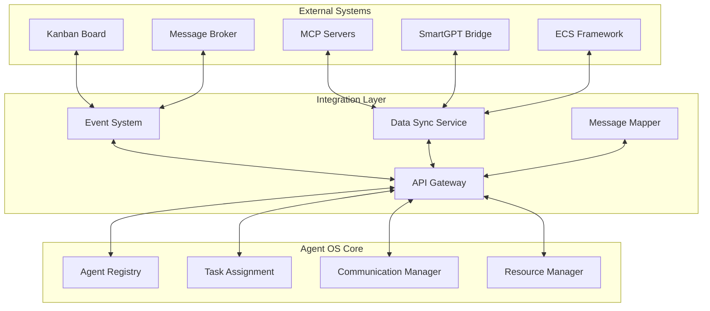

# Design Integration Architecture

## Overview
Design the comprehensive integration architecture that connects the Agent OS system with existing Promethean infrastructure including MCP servers, ECS framework, SmartGPT bridge, and kanban system. This integration must be seamless, maintainable, and leverage existing capabilities.

## Scope
Design integration patterns, interfaces, and data flows between Agent OS components and existing systems. The architecture must support bidirectional communication, event-driven updates, and maintain system coherence across all components.

## Integration Requirements

### 1. Existing System Integration
- **Kanban System**: Task management, status synchronization, performance metrics
- **MCP Infrastructure**: Service discovery, tool access, communication protocols
- **SmartGPT Bridge**: Agent process management, health monitoring, resource tracking
- **ECS Framework**: Agent entities, behavior systems, resource management
- **Message Broker**: Event-driven communication, pub/sub patterns

### 2. Integration Patterns
- **Event-Driven Architecture**: Loose coupling through events
- **API Gateway Pattern**: Centralized API management and routing
- **Service Mesh**: Inter-service communication and observability
- **Data Synchronization**: Consistent state across systems
- **Circuit Breaker Pattern**: Fault tolerance and resilience

### 3. Data Flow Architecture
- **Inbound Data**: External systems → Agent OS
- **Outbound Data**: Agent OS → External systems
- **Bidirectional Sync**: Real-time state synchronization
- **Event Propagation**: Event distribution across systems
- **Data Transformation**: Format conversion and mapping

## Detailed Integration Components

### 1. Kanban System Integration

#### Integration Architecture
```typescript
interface KanbanIntegration {
  // Synchronization Services
  taskSynchronization: TaskSynchronizationService;
  statusSynchronization: StatusSynchronizationService;
  performanceSynchronization: PerformanceSynchronizationService;
  
  // Event Handlers
  eventHandlers: {
    onTaskCreated: TaskCreatedHandler;
    onTaskUpdated: TaskUpdatedHandler;
    onTaskStatusChanged: TaskStatusChangedHandler;
    onAgentAssigned: AgentAssignedHandler;
    onTaskCompleted: TaskCompletedHandler;
  };
  
  // Data Mapping
  dataMapping: {
    taskMapping: TaskDataMapper;
    statusMapping: StatusMapper;
    agentMapping: AgentDataMapper;
    performanceMapping: PerformanceDataMapper;
  };
  
  // API Integration
  apiIntegration: {
    kanbanApiClient: KanbanApiClient;
    webhookEndpoints: WebhookEndpoint[];
    eventSubscription: EventSubscription;
  };
}

interface TaskSynchronizationService {
  // Task Creation
  syncTaskToKanban(task: AgentTask): Promise<KanbanTask>;
  createKanbanTaskFromAssignment(assignment: TaskAssignment): Promise<KanbanTask>;
  
  // Task Updates
  updateKanbanTask(taskId: string, updates: TaskUpdates): Promise<void>;
  syncTaskProgress(assignmentId: string, progress: TaskProgress): Promise<void>;
  
  // Task Completion
  markKanbanTaskComplete(taskId: string, completionData: TaskCompletion): Promise<void>;
  updateTaskQuality(taskId: string, qualityScore: number): Promise<void>;
}
```

#### Status Mapping
```typescript
interface StatusMapping {
  // Agent Status to Kanban Columns
  agentStatusToKanbanColumn: Record<AgentStatus, KanbanColumn>;
  
  // Assignment Status to Kanban Status
  assignmentStatusToKanbanStatus: Record<AssignmentStatus, KanbanStatus>;
  
  // Priority Mapping
  priorityMapping: Record<TaskPriority, KanbanPriority>;
  
  // WIP Limit Management
  wipLimitManagement: {
    checkWIPLimit: (column: KanbanColumn) => Promise<boolean>;
    enforceWIPLimit: (column: KanbanColumn) => Promise<void>;
    reportWIPViolation: (violation: WIPViolation) => Promise<void>;
  };
}

const STATUS_MAPPING = {
  // Agent Status → Kanban Impact
  agentStatusToKanbanColumn: {
    'idle': 'ready',              // Available for assignment
    'busy': 'in_progress',        // Currently working
    'collaborating': 'in_progress', // Working with others
    'maintenance': 'blocked',      // Unavailable
    'error': 'blocked',           // System issues
    'offline': 'icebox'           // Not available
  },
  
  // Assignment Status → Kanban Status
  assignmentStatusToKanbanStatus: {
    'proposed': 'ready',
    'assigned': 'todo',
    'accepted': 'todo',
    'in_progress': 'in_progress',
    'review': 'review',
    'completed': 'done',
    'failed': 'todo',
    'cancelled': 'incoming'
  }
};
```

### 2. MCP Infrastructure Integration

#### Service Discovery Integration
```typescript
interface MCPIntegration {
  // Service Registration
  serviceRegistration: {
    registerAgentService(agent: AgentInstance): Promise<void>;
    registerCapabilityService(capability: AgentCapability): Promise<void>;
    unregisterService(serviceId: string): Promise<void>;
  };
  
  // Tool Access Management
  toolManagement: {
    registerAgentTools(agent: AgentInstance): Promise<void>;
    updateToolPermissions(agentId: string, tools: string[]): Promise<void>;
    revokeToolAccess(agentId: string, toolId: string): Promise<void>;
  };
  
  // Communication Integration
  communicationIntegration: {
    establishMCPChannel(agentId: string): Promise<MCPChannel>;
    routeMCPMessage(message: MCPMessage): Promise<void>;
    handleMCPEvent(event: MCPEvent): Promise<void>;
  };
  
  // Context Management
  contextManagement: {
    createMCPContext(agent: AgentInstance): Promise<MCPContext>;
    updateMCPContext(contextId: string, updates: ContextUpdates): Promise<void>;
    syncMCPContext(contextId: string, agentState: AgentState): Promise<void>;
  };
}

interface MCPChannel {
  channelId: string;
  agentId: string;
  mcpServerId: string;
  protocol: MCPProtocol;
  status: ChannelStatus;
  createdAt: Date;
  lastActivity: Date;
  messageCount: number;
}
```

#### Tool Access Integration
```typescript
interface MCPToolIntegration {
  // Tool Registration
  registerTool(tool: MCPTool): Promise<void>;
  unregisterTool(toolId: string): Promise<void>;
  
  // Tool Permission Management
  assignToolToAgent(agentId: string, toolId: string, permissions: ToolPermissions): Promise<void>;
  revokeToolFromAgent(agentId: string, toolId: string): Promise<void>;
  
  // Tool Usage Tracking
  trackToolUsage(agentId: string, toolId: string, usage: ToolUsage): Promise<void>;
  getToolUsageStats(agentId: string, toolId: string): Promise<ToolUsageStats>;
  
  // Tool Discovery
  discoverAvailableTools(agentId: string): Promise<MCPTool[]>;
  filterToolsByCapability(agentId: string, capability: string): Promise<MCPTool[]>;
}
```

### 3. SmartGPT Bridge Integration

#### Process Management Integration
```typescript
interface SmartGPTBridgeIntegration {
  // Agent Process Management
  processManagement: {
    spawnAgentProcess(agent: AgentInstance): Promise<AgentProcess>;
    monitorAgentProcess(agentId: string): Promise<ProcessStatus>;
    terminateAgentProcess(agentId: string): Promise<TerminationResult>;
    restartAgentProcess(agentId: string): Promise<RestartResult>;
  };
  
  // Health Monitoring
  healthMonitoring: {
    startHealthMonitoring(agentId: string): Promise<void>;
    stopHealthMonitoring(agentId: string): Promise<void>;
    getHealthStatus(agentId: string): Promise<HealthStatus>;
    handleHealthAlert(alert: HealthAlert): Promise<void>;
  };
  
  // Resource Tracking
  resourceTracking: {
    trackResourceUsage(agentId: string): Promise<ResourceUsage>;
    getResourceMetrics(agentId: string): Promise<ResourceMetrics>;
    setResourceLimits(agentId: string, limits: ResourceLimits): Promise<void>;
    handleResourceViolation(violation: ResourceViolation): Promise<void>;
  };
  
  // Log Management
  logManagement: {
    subscribeToAgentLogs(agentId: string): Promise<LogStream>;
    getAgentLogs(agentId: string, filter: LogFilter): Promise<AgentLog[]>;
    archiveAgentLogs(agentId: string): Promise<void>;
  };
}
```

#### Data Synchronization
```typescript
interface SmartGPTDataSync {
  // Agent State Synchronization
  syncAgentState(agent: AgentInstance): Promise<void>;
  syncAgentCapabilities(agentId: string): Promise<void>;
  syncAgentPerformance(agentId: string): Promise<void>;
  
  // Real-time Updates
  subscribeToAgentUpdates(agentId: string): Promise<UpdateStream>;
  broadcastAgentUpdate(agentId: string, update: AgentUpdate): Promise<void>;
  
  // Event Handling
  handleSmartGPTEvent(event: SmartGPTEvent): Promise<void>;
  emitAgentEvent(agentId: string, event: AgentEvent): Promise<void>;
}
```

### 4. ECS Framework Integration

#### Entity-Component System Integration
```typescript
interface ECSIntegration {
  // Agent Entity Management
  entityManagement: {
    createAgentEntity(agent: AgentInstance): Promise<ECSEntity>;
    updateAgentEntity(entityId: string, agent: AgentInstance): Promise<void>;
    deleteAgentEntity(entityId: string): Promise<void>;
    getAgentEntity(agentId: string): Promise<ECSEntity>;
  };
  
  // Component Management
  componentManagement: {
    addAgentComponent(entityId: string, component: ECSComponent): Promise<void>;
    removeAgentComponent(entityId: string, componentType: string): Promise<void>;
    updateAgentComponent(entityId: string, component: ECSComponent): Promise<void>;
    getAgentComponents(entityId: string): Promise<ECSComponent[]>;
  };
  
  // System Integration
  systemIntegration: {
    registerAgentSystem(system: ECSSystem): Promise<void>;
    executeAgentSystems(world: ECSWorld): Promise<void>;
    getSystemMetrics(systemId: string): Promise<SystemMetrics>;
  };
  
  // Query Integration
  queryIntegration: {
    createAgentQuery(query: ECSQuery): Promise<ECSQueryResult>;
    executeQuery(query: ECSQuery): Promise<QueryResult>;
    subscribeToQuery(query: ECSQuery): Promise<QueryStream>;
  };
}
```

#### Agent Behavior Systems
```typescript
interface AgentBehaviorSystems {
  // Lifecycle Systems
  lifecycleSystems: {
    AgentCreationSystem: ECSSystem;
    AgentDestructionSystem: ECSSystem;
    AgentStateUpdateSystem: ECSSystem;
  };
  
  // Task Execution Systems
  taskSystems: {
    TaskAssignmentSystem: ECSSystem;
    TaskExecutionSystem: ECSSystem;
    TaskCompletionSystem: ECSSystem;
  };
  
  // Communication Systems
  communicationSystems: {
    MessageHandlingSystem: ECSSystem;
    CollaborationSystem: ECSSystem;
    EventProcessingSystem: ECSSystem;
  };
  
  // Resource Management Systems
  resourceSystems: {
    ResourceAllocationSystem: ECSSystem;
    ResourceMonitoringSystem: ECSSystem;
    ResourceCleanupSystem: ECSSystem;
  };
}
```

### 5. Message Broker Integration

#### Event-Driven Architecture
```typescript
interface MessageBrokerIntegration {
  // Event Publishing
  eventPublishing: {
    publishAgentEvent(event: AgentEvent): Promise<void>;
    publishTaskEvent(event: TaskEvent): Promise<void>;
    publishSystemEvent(event: SystemEvent): Promise<void>;
    publishCollaborationEvent(event: CollaborationEvent): Promise<void>;
  };
  
  // Event Subscription
  eventSubscription: {
    subscribeToAgentEvents(handler: EventHandler): Promise<Subscription>;
    subscribeToTaskEvents(handler: EventHandler): Promise<Subscription>;
    subscribeToSystemEvents(handler: EventHandler): Promise<Subscription>;
    unsubscribeFromEvents(subscriptionId: string): Promise<void>;
  };
  
  // Message Routing
  messageRouting: {
    routeMessage(message: BrokerMessage): Promise<void>;
    createRoutingRule(rule: RoutingRule): Promise<void>;
    updateRoutingRule(ruleId: string, rule: RoutingRule): Promise<void>;
    deleteRoutingRule(ruleId: string): Promise<void>;
  };
  
  // Queue Management
  queueManagement: {
    createQueue(config: QueueConfig): Promise<BrokerQueue>;
    deleteQueue(queueId: string): Promise<void>;
    getQueueStats(queueId: string): Promise<QueueStats>;
    purgeQueue(queueId: string): Promise<void>;
  };
}
```

#### Event Schema Definition
```typescript
interface AgentOSEvents {
  // Agent Lifecycle Events
  AgentCreated: {
    agentId: string;
    agentType: string;
    timestamp: Date;
    metadata: Record<string, any>;
  };
  
  AgentStatusChanged: {
    agentId: string;
    oldStatus: AgentStatus;
    newStatus: AgentStatus;
    timestamp: Date;
    reason?: string;
  };
  
  // Task Events
  TaskAssigned: {
    assignmentId: string;
    taskId: string;
    agentId: string;
    timestamp: Date;
    assignment: AssignmentDetails;
  };
  
  TaskCompleted: {
    assignmentId: string;
    taskId: string;
    agentId: string;
    timestamp: Date;
    outcome: TaskOutcome;
  };
  
  // Collaboration Events
  CollaborationStarted: {
    sessionId: string;
    participants: string[];
    taskId: string;
    timestamp: Date;
  };
  
  CollaborationMessage: {
    sessionId: string;
    fromAgentId: string;
    message: string;
    timestamp: Date;
  };
}
```

### 6. API Gateway Integration

#### Unified API Architecture
```typescript
interface APIGatewayIntegration {
  // Route Management
  routeManagement: {
    registerRoute(route: APIRoute): Promise<void>;
    updateRoute(routeId: string, route: APIRoute): Promise<void>;
    deleteRoute(routeId: string): Promise<void>;
    listRoutes(filter?: RouteFilter): Promise<APIRoute[]>;
  };
  
  // Request Routing
  requestRouting: {
    routeRequest(request: APIRequest): Promise<APIResponse>;
    routeWebSocketConnection(connection: WebSocketConnection): Promise<void>;
    handleAPIError(error: APIError): Promise<APIErrorResponse>;
  };
  
  // Authentication & Authorization
  authIntegration: {
    authenticateRequest(request: APIRequest): Promise<AuthResult>;
    authorizeRequest(request: APIRequest): Promise<AuthzResult>;
    validatePermissions(agentId: string, resource: string, action: string): Promise<boolean>;
  };
  
  // Rate Limiting
  rateLimiting: {
    checkRateLimit(agentId: string, endpoint: string): Promise<RateLimitResult>;
    applyRateLimit(agentId: string, limit: RateLimit): Promise<void>;
    getRateLimitStatus(agentId: string): Promise<RateLimitStatus>;
  };
}
```

## Data Flow Architecture

### System-Wide Data Flow


### Event-Driven Communication
```typescript
interface EventDrivenArchitecture {
  // Event Bus
  eventBus: {
    publish(event: DomainEvent): Promise<void>;
    subscribe(eventType: string, handler: EventHandler): Promise<Subscription>;
    unsubscribe(subscriptionId: string): Promise<void>;
  };
  
  // Event Sourcing
  eventSourcing: {
    saveEvent(event: DomainEvent): Promise<void>;
    getEvents(aggregateId: string, fromVersion?: number): Promise<DomainEvent[]>;
    replayEvents(aggregateId: string): Promise<AggregateState>;
  };
  
  // CQRS Integration
  cqrs: {
    executeCommand(command: Command): Promise<CommandResult>;
    queryReadModel(query: Query): Promise<QueryResult>;
    updateReadModel(event: DomainEvent): Promise<void>;
  };
}
```

## Performance Requirements

### Integration Performance
- **API Response Time**: < 100ms for integration API calls
- **Event Processing**: < 50ms event processing latency
- **Data Synchronization**: < 1 second for state synchronization
- **Message Throughput**: > 1,000 messages/second per integration point

### Scalability Requirements
- **Concurrent Integrations**: > 100 simultaneous integration connections
- **Horizontal Scaling**: Support for multiple integration service instances
- **Resource Efficiency**: < 200MB memory per integration service
- **Network Efficiency**: < 5% additional bandwidth overhead

## Security Requirements

### Integration Security
- **API Security**: Authentication, authorization, rate limiting for all integration APIs
- **Data Protection**: Encryption for data in transit between systems
- **Access Control**: Fine-grained access control for integration endpoints
- **Audit Trail**: Complete logging of all integration activities

### Compliance Requirements
- **Data Governance**: Proper data handling and privacy protection
- **Security Standards**: Compliance with security standards and regulations
- **Audit Requirements**: Comprehensive audit trail for integration activities
- **Incident Response**: Security incident handling for integration systems

## Testing Strategy

### Integration Testing
- **Contract Testing**: Test integration contracts between systems
- **End-to-End Testing**: Test complete workflows across systems
- **Performance Testing**: Test integration performance under load
- **Failure Testing**: Test behavior during system failures

### Compatibility Testing
- **Version Compatibility**: Test compatibility with different system versions
- **API Compatibility**: Test backward and forward compatibility
- **Data Format Compatibility**: Test data format compatibility
- **Protocol Compatibility**: Test communication protocol compatibility

## Success Criteria

### Functional Success Criteria
- ✅ All existing systems integrate seamlessly with Agent OS
- ✅ Data synchronization is accurate and timely
- ✅ Event-driven communication works reliably
- ✅ API gateway provides unified access to all services
- ✅ Integration monitoring and observability is comprehensive

### Non-Functional Success Criteria
- ✅ Integration performance meets requirements
- ✅ System is scalable and maintainable
- ✅ Security and compliance requirements are met
- ✅ System is resilient to failures
- ✅ Integration is well-documented and understood

## Deliverables

1. **Integration Architecture Document**: Complete integration design specification
2. **API Gateway Specification**: Unified API design and routing rules
3. **Event Schema Documentation**: Complete event definitions and schemas
4. **Data Mapping Specifications**: Detailed data transformation rules
5. **Integration Testing Strategy**: Comprehensive testing plan and test cases
6. **Monitoring Dashboard**: Integration monitoring and observability design
7. **Troubleshooting Guide**: Common integration issues and resolution procedures

## Timeline Estimate

- **Week 1**: Kanban and MCP integration design
- **Week 2**: SmartGPT bridge and ECS integration design
- **Week 3**: Message broker and API gateway integration design
- **Week 4**: Performance optimization, security, and testing strategy

**Total Estimated Effort**: 60-80 hours of design work

## Dependencies

### Prerequisites
- All individual component designs completed
- Existing system integration requirements
- API specifications for existing systems
- Performance and security requirements

### Blockers
- Integration contract validation and approval
- External system dependencies
- Integration testing infrastructure
- Security review and approval

---

**This integration architecture is critical for connecting the Agent OS system with existing Promethean infrastructure and must be designed for reliability, performance, and maintainability.**


