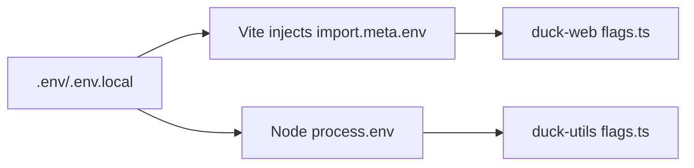

# Duck Revival

Goal: resurrect the voice assistant ("Duck") with a safer, faster media path:
- Control stays JSON-over-WS (small).
- Media images/audio streams as **binary WS chunks** with checksums & TTL.
- STT/TTS run behind **docker-compose** on a private network.
- Reuse existing queue semantics ACK/NACK/MODACK in `packages/ws`.

## Scope
- ✅ WS "blob" sub-protocol: `BLOB_PUT_START/CHUNK/END`, `BLOB_GET_STREAM`
- ✅ STT/TTS proxying (PCM in, audio out)
- ✅ Pragmatic rate limits + quotas, per-route limits
- ✅ Operational runbook (healthchecks, envs, smoke tests)
- ❌ No UI overhaul follow-up
- ❌ Model retraining out-of-scope

## Definition of Done
- Can capture mic → STT → LLM → TTS → speaker end-to-end on localhost.
- 16× large image batch delivered via WS blobs without OOM/proxy breaks.
- Blob TTL reaping works; disk bounded; checksums verified.
- Docs + smoke tests pass in CI.
# Duck Revival – Tasks

## Milestone M0 – “Quack Again” (minimum viable sound)
- [ ] Wire envs in `voice/transcriber.ts` and `voice/voice-synth.ts` to STT/TTS docker #duck-m0-env
- [ ] Compose file for private `stt`, `tts`; expose only `ws` #duck-m0-compose
- [ ] Smoke: mic → STT → echo text → TTS → speaker, local only #duck-m0-smoke
- [ ] Add `reqId` to logs across `voice/*`, `llm`, `ws` #duck-m0-reqid

## Milestone M1 – “Blob Path”
- [ ] Implement WS ops: START/CHUNK/END/GET server + client helpers #duck-m1-ws
- [ ] Blob spool dir + TTL janitor + metrics #duck-m1-janitor
- [ ] Rate limits: per-IP + per-topic (reuse `server.rate.ts`) #duck-m1-limit
- [ ] Feature flag `DUCK_USE_BLOBS=1`; dual-path clients #duck-m1-flag
- [ ] 16× large images benchmark; ensure no single message > `WS_MAX_PAYLOAD_MB` #duck-m1-bench

## Milestone M2 – “Stability”
- [ ] MODACK at expensive phases; redelivery test #duck-m2-modack
- [ ] Checksums enforced; rejection path tested #duck-m2-checksum
- [ ] Operational runbook + alerts #duck-m2-runbook

## Stretch
- [ ] Pre-signed uploads to object store instead of local spool #duck-s-presign
- [ ] UI component `<duck-status>` for health (Web Component) #duck-s-ui

## Acceptance
- [ ] End-to-end loop stable for 60 minutes under load images+audio
- [ ] Disk bounded by TTL; no leaked temp files
- [ ] No base64 media in JSON on the wire

# Operational Playbook

## Env
- WS_MAX_PAYLOAD_MB=16
- WS_BLOB_DIR=/var/spool/ws
- WS_BLOB_TTL_MS=1800000
- STT_HOST=stt; STT_PORT=8080; STT_PATH=/stt/transcribe_pcm
- TTS_HOST=tts; TTS_PORT=8080; TTS_PATH=/tts/synth_voice

## Healthchecks
- `/healthz` on ws (accepts; janitor alive; disk > 10%)
- STT/TTS 200 check every 30s

## Run
- `docker compose up -d stt tts`
- start ws with those envs
- smoke: send short PCM; expect interim + final; TTS file length > 0

## On-call quick fixes
- Blob dir full → increase TTL or free space; confirm janitor running
- Many NACKs → inspect worker crashes; increase lease; place MODACKs
- Checksum mismatch → client chunking bug or proxy corruption; dump reqId


# Design: WS Binary Blobs + Private STT/TTS

## Why
Base64-in-JSON balloons memory, stresses GC, and collides with proxies. We keep JSON for control and move media to binary frames with backpressure and checksums.

## Architecture
- **WS Gateway `packages/ws`**
  - JSON ops: AUTH / SUBSCRIBE / PUBLISH / ACK / NACK / MODACK
  - New binary ops: see Protocol
  - Blob spool dir with TTL janitor
- **Blob Store (ephemeral)**
  - Path: `WS_BLOB_DIR` (default tmp)
  - Content-addressed by `sha256`
  - Enforced TTL `WS_BLOB_TTL_MS`
- **STT service** Docker-internal
  - Endpoint: `STT_HOST:STT_PORTSTT_PATH` default `stt:8080/stt/transcribe_pcm`
- **TTS service** Docker-internal
  - Endpoint: `TTS_HOST:TTS_PORTTTS_PATH` default `tts:8080/tts/synth_voice`
- **Workers**
  - Pull JSON events, MODACK around expensive steps, push replies with blob refs

### ASCII sequence (media upload)
```

Client -> WS: BLOB_PUT_START { mime }

## Enso Protocol Integration — v1

### Goals
- Replace legacy Broker STT pathway in Cephalon with Enso envelopes.
- Use `voice.frame` streams @ `pcm16le/16000/1` with 20ms frames (640 bytes).
- Expect transcript as `event:content.post` in the same room.

### Client wiring (Cephalon)
- New `EnsoTranscriber` bridges Discord PCM → Enso `voice.frame`.
- Downmix & resample 48k stereo → 16k mono using a simple 3:1 decimator with pre-average LPF.
- Per-utterance room key: `voice:<discordUserId>:<startMs>`.
- Flow control via `client.voice.register(streamId)`; EOF emits `eof: true`.

### Server expectations (STT)
- Accept handshake with caps: `can.voice.stream`, `can.send.text`.
- Consume frames for the `room` and reply with a transcript:`,`
  ```
  { kind: "event", type: "content.post", room, payload: {
    message: { role: "agent", parts: [{ kind: "text", text } ] }
  }}
  ```

### Migration
- Feature-flag: `DISABLE_BROKER=1` and set `ENSO_WS_URL=ws://host:7766`.
- Fallback: if `ENSO_WS_URL` unset, legacy Broker path remains.

## Enso Protocol Integration — v1

### Goals
- Replace legacy Broker STT pathway in Cephalon with Enso envelopes.
- Use `voice.frame` streams @ `pcm16le/16000/1` with 20ms frames (640 bytes).
- Expect transcript as `event:content.post` in the same room.

### Client wiring (Cephalon)
- New `EnsoTranscriber` bridges Discord PCM → Enso `voice.frame`.
- Downmix & resample 48k stereo → 16k mono using a simple 3:1 decimator with pre-average LPF.
- Per-utterance room key: `voice:<discordUserId>:<startMs>`.
- Flow control via `client.voice.register(streamId)`; EOF emits `eof: true`.

### Server expectations (STT)
- Accept handshake with caps: `can.voice.stream`, `can.send.text`.
- Consume frames for the `room` and reply with a transcript:`,`
  ```
  { kind: "event", type: "content.post", room, payload: {
    message: { role: "agent", parts: [{ kind: "text", text } ] }
  }}
  ```

### Migration
- Feature-flag: `DISABLE_BROKER=1` and set `ENSO_WS_URL=ws://host:7766`.
- Fallback: if `ENSO_WS_URL` unset, legacy Broker path remains.

## Enso Protocol Integration — v1

### Goals
- Replace legacy Broker STT pathway in Cephalon with Enso envelopes.
- Use `voice.frame` streams @ `pcm16le/16000/1` with 20ms frames (640 bytes).
- Expect transcript as `event:content.post` in the same room.

### Client wiring (Cephalon)
- New `EnsoTranscriber` bridges Discord PCM → Enso `voice.frame`.
- Downmix & resample 48k stereo → 16k mono using a simple 3:1 decimator with pre-average LPF.
- Per-utterance room key: `voice:<discordUserId>:<startMs>`.
- Flow control via `client.voice.register(streamId)`; EOF emits `eof: true`.

### Server expectations (STT)
- Accept handshake with caps: `can.voice.stream`, `can.send.text`.
- Consume frames for the `room` and reply with a transcript:`,`
  ```
  { kind: "event", type: "content.post", room, payload: {
    message: { role: "agent", parts: [{ kind: "text", text } ] }
  }}
  ```

### Migration
- Feature-flag: `DISABLE_BROKER=1` and set `ENSO_WS_URL=ws://host:7766`.
- Fallback: if `ENSO_WS_URL` unset, legacy Broker path remains.
WS -> Client: OK { id }
Client -> WS: [binary CHUNK]* (1 MiB each, SHA-256 running)
Client -> WS: BLOB_PUT_END { id, size, sha256 }
WS -> Client: OK { id, size, sha256 }
Client -> WS: PUBLISH { topic, payload: { blobId: id, mime, meta } }

```

## Protocol (additions)
- `BLOB_PUT_START { mime } -> { id }`
- Binary chunk frame: `1 byte ver=1`1 byte op=0x01`16-byte blobId prefix$4-byte BE len[chunk]`
- `BLOB_PUT_END { id, size?, sha256? } -> { id, size, sha256 }`
- `BLOB_GET_STREAM { id }` -> server emits header EVENT + binary frames with `op=0x02`

### Limits and guards
- `WS_MAX_PAYLOAD_MB` – hard cap per WS frame (keep small; we stream)
- Chunk size: 1 MiB (tunable)
- Blob TTL: default 30m; janitor reaps old blobs
- Per-IP and per-topic token buckets (reuse `server.rate.ts`)
- Checksums required for END → reject mismatch

## STT/TTS via docker-compose
- No public ports for STT/TTS; only `ws` is optionally exposed.
- Env wiring in `voice/transcriber.ts` and `voice/voice-synth.ts`:
  - `STT_HOST`, `STT_PORT`, `STT_PATH`
  - `TTS_HOST`, `TTS_PORT`, `TTS_PATH`

## Migration plan
1. Keep old JSON paths working during transition behind a flag.
2. Add blob ops + feature flag `DUCK_USE_BLOBS=1`.
3. Switch clients to send blobs 16-image batches.
4. Remove base64 handling after a week of soak.

## Observability
- Correlate by `reqId` per message log & event payload
- Metrics: blob sizes, chunk counts, checksum fails, TTL reaps, NACK/REDLV
- Healthchecks: WS accept, janitor status, disk free, STT/TTS 200


# DUCK Feature Flags

Canonical flags and where they are consumed.

## Web (Vite)
- `VITE_DUCK_USE_BLOBS` — enable Blob-backed storage paths in duck-web.
- `VITE_STT_TTS_ENABLED` — toggle STT/TTS UI features.

Access with `import.meta.env`.

## Node / Server
- `DUCK_USE_BLOBS` — enable Blob-backed paths in node utilities.
- `STT_TTS_ENABLED` — toggle STT/TTS features server-side.

Access with `process.env`.

## Parsing
Both sides parse strictly as strings: `"true"|"false"` (anything else falls back to defaults).

## Diagram


## Example
```env
# web
VITE_DUCK_USE_BLOBS=true
VITE_STT_TTS_ENABLED=false

# node
DUCK_USE_BLOBS=false
STT_TTS_ENABLED=true
```

## References
- PR #1447 duck-web flags
- PR #1446 (openWs)
- PR #1445 (throttled sender)
# DUCK feature flags

Default: disabled (most paths are off by default).

Values other than the case-insensitive strings `true` or `false` fall back to their default values.

## Web `apps/duck-web`

- `VITE_DUCK_USE_BLOBS`: enables WS binary-blob path (default: `false`)
- `VITE_STT_TTS_ENABLED`: turns on STT/TTS integrations (default: `false`)

_Source: `apps/duck-web/src/flags.ts`$../../apps/duck-web/src/flags.ts_

> Non-`true`/`false` strings fall back to the default value.

## Node `packages/duck-utils`

- `DUCK_USE_BLOBS`: boolean read from `process.env` (default: `false`)
- `STT_TTS_ENABLED`: boolean read from `process.env` (default: `false`)

_Source: `packages/duck-utils/src/flags.ts`$../../packages/duck-utils/src/flags.ts_

> Non-`true`/`false` strings fall back to the default value.

### Examples
```
**Vite (.env)**
```
```
VITE_DUCK_USE_BLOBS=true
VITE_STT_TTS_ENABLED=true
```
```
**Node**
```
```
DUCK_USE_BLOBS=true
STT_TTS_ENABLED=true
```

# ADR-0001: Move media to WS binary blobs

- **Context**: Duck needs to ship 50–100 MB payloads (16× large images, audio). JSON+base64 caused memory bloat and intermittent proxy failures.
- **Decision**: Add a WS sub-protocol for binary blob upload/download with checksums and TTL. Control path stays JSON.
- **Consequences**:
  - Pros: lower memory, backpressure-friendly, proxy-safe, re-usable blob references
  - Cons: more protocol surface, spool on disk, janitor responsibilities
- **Status**: Accepted


# Duck WebRTC Chat

A simple two-way browser interface for talking to **Duck** without Discord, built on **ENSO** and **WebRTC**.

## Architecture

````text
[Browser UI: @promethean/duck-web]            [Gateway: @promethean/enso-browser-gateway]          [ENSO]
+------------------------------+   WS / WebRTC   +-----------------------------+   WS   +-------------------+
| <duck-chat> Web Component    |<--------------->| WebSocket + WebRTC bridge   |<----->| Enso server       |
| - mic → 16k PCM16 frames     |                 | - forwards voice.frames     |       | (Duck agent)      |
| - text box + TTS / audio out |                 | - mirrors content.post      |       |                   |
+------------------------------+                 +-----------------------------+       +-------------------+
````

## Packages
- **`@promethean/duck-web`** — browser client (Vite, Web Components).
- **`@promethean/enso-browser-gateway`** — Node signaling + ENSO bridge WebSocket + wrtc.

## Features
### Browser UI
- `<duck-chat>` element with mic toggle, text box, and log.
- Captures mic audio, downsamples to 16kHz PCM16 mono, sends via WebRTC.
- Receives text messages (`content.post`) and logs them.
- Optionally speaks replies via browser TTS.
- Receives `audio` channel frames and plays them with WebAudio.
- Configurable signaling URL, optional auth token, and ICE servers.

### Gateway
- WebSocket signaling endpoint at `/ws`.
- Auth optional: pass `?token=...` if `DUCK_TOKEN` is set.
- WebRTC channels:
  - `voice` browser → gateway → ENSO.
  - `events` gateway → browser.
- `audio` gateway → browser, optional ENSO audio.
- Forwards mic frames as `voice.frame` events to ENSO.
- Mirrors ENSO `content.post` events to browser.
- Configurable ICE servers via `ICE_SERVERS` env var.
- `RTCDataChannel.protocol` is not guaranteed across browsers; Safari, for
  example, can surface an empty string. If the `voice` channel does not
  negotiate a `frameDurationMs`, the gateway falls back to 20 ms frames to keep
  sequenced timestamps aligned with the expected 50fps audio cadence.

## Setup
```bash
# 1. install dependencies
pnpm -w install

# 2. run gateway (with ENSO running)
ENSO_WS_URL=ws://localhost:7766 \
DUCK_TOKEN=secret123 \
ICE_SERVERS='[{"urls":"stun:stun.l.google.com:19302"}]' \
npx nx run @promethean/enso-browser-gateway:serve

# 3. run browser client
npx nx run @promethean/duck-web:serve
```

Visit `http://localhost:5173` in your browser.

## ICE servers
To add STUN/TURN in the browser UI:
```js
localStorage.setItem('duck.iceServers', JSON.stringify([{ urls: 'stun:stun.l.google.com:19302' }]));
```

## Production notes
- Use **TURN servers** in `ICE_SERVERS` for NAT traversal.
- Run signaling `enso-browser-gateway` behind TLS.
- Set `DUCK_TOKEN` for auth.
- Replace browser TTS with actual audio once ENSO provides `voice.frame` replies.

## Nx targets
- `nx run @promethean/duck-web:serve` → run browser client.
- `nx run @promethean/duck-web:build` → build client.
- `nx run @promethean/enso-browser-gateway:serve` → run gateway.
