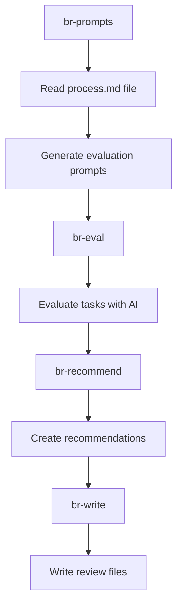

## 🛠️ Task: Fix board-review pipeline incorrect Process.md file reference

## 🐛 Problem Statement

The board-review pipeline fails because it's looking for the wrong file path:

```
missing input: docs/agile/Process.md
```

The actual file exists at `docs/agile/process.md` (lowercase 'p'), but the pipeline is looking for `Process.md` (uppercase 'P').

## 🎯 Desired Outcome

The board-review pipeline should successfully:

- Find and read the correct process documentation file
- Generate prompts for task evaluation based on process criteria
- Evaluate tasks using AI models with process context
- Create actionable task review recommendations
- Work with the new level-cache kanban system

## 📋 Requirements

### Phase 1: File Path Correction
- [ ] Update board-review pipeline to reference correct file path
- [ ] Add case-insensitive file lookup for process documentation
- [ ] Implement proper error handling for missing process files
- [ ] Add fallback mechanisms for file discovery

### Phase 2: Pipeline Integration
- [ ] Ensure prompt generation works with correct process file
- [ ] Fix AI model integration with proper context
- [ ] Validate task evaluation criteria alignment
- [ ] Test with actual kanban tasks

## 🔧 Technical Implementation Details

### Files to Investigate/Update
1. **packages/boardrev/src/02-process-prompts.js** - File path reference
2. **Pipeline configuration** - Input file specifications
3. **Error handling** - Missing file fallback logic

### Root Cause Analysis
The board-review pipeline has a hardcoded reference to `docs/agile/Process.md` but the actual file is `docs/agile/process.md`. This is a simple case-sensitivity issue.

### Expected Pipeline Flow


### Fix Implementation
```javascript
// Update file reference in boardrev package
const processFilePath = path.join(process.cwd(), 'docs/agile/process.md');

// Add fallback for case-insensitive file systems
const possiblePaths = [
  'docs/agile/process.md',
  'docs/agile/Process.md'
];

for (const filePath of possiblePaths) {
  if (fs.existsSync(filePath)) {
    processFilePath = filePath;
    break;
  }
}
```

## ✅ Acceptance Criteria

1. **File Resolution**: Pipeline finds process.md regardless of case
2. **Prompt Generation**: Successfully generates evaluation prompts
3. **AI Integration**: Task evaluation works with proper process context
4. **Complete Pipeline**: All 6 steps execute successfully
5. **Error Handling**: Graceful handling of missing process files
6. **Kanban Integration**: Works with level-cache kanban system

## 🔗 Related Resources

- **Pipeline Definition**: `pipelines.json` - board-review section
- **Process Documentation**: `docs/agile/process.md` - source file
- **Board Review Logic**: `packages/boardrev/` - evaluation logic
- **AI Model Integration**: OLLAMA configuration for task evaluation

This is a simple but critical fix that will enable AI-powered task review capabilities for the kanban system.


