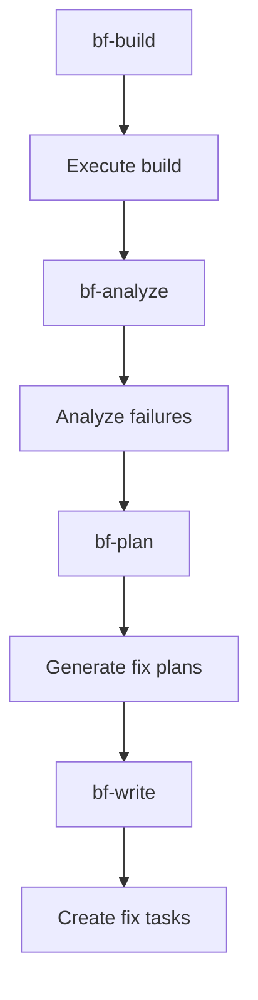

## 🛠️ Task: Fix buildfix pipeline timeout and configuration issues

## 🐛 Problem Statement

The buildfix pipeline times out after 2 minutes during execution, preventing completion of automated build failure analysis and fix generation.

## 🎯 Desired Outcome

The buildfix pipeline should successfully:

- Analyze build failures and errors
- Generate automated fix strategies
- Create actionable build repair tasks
- Apply fixes where safe and appropriate
- Complete within reasonable time limits

## 📋 Requirements

### Phase 1: Timeout Investigation
- [ ] Identify which step is causing the timeout
- [ ] Analyze build execution time and bottlenecks
- [ ] Add progress logging for long-running operations
- [ ] Implement proper timeout handling per step

### Phase 2: Pipeline Configuration
- [ ] Configure appropriate timeouts for different operations
- [ ] Add build caching and optimization
- [ ] Implement incremental build analysis
- [ ] Add early termination for non-critical failures

### Phase 3: Error Handling
- [ ] Add graceful failure handling for build timeouts
- [ ] Implement partial analysis capabilities
- [ ] Add retry logic for transient build issues
- [ ] Create fallback mechanisms for complex builds

## 🔧 Technical Implementation Details

### Files to Investigate
1. **packages/buildfix/** - Build analysis and fix generation logic
2. **Pipeline configuration** - Timeout and execution parameters
3. **Build scripts** - Actual build commands being executed
4. **Cache management** - Build result caching

### Potential Timeout Causes
1. **Long-running builds**: Full project build taking too long
2. **Infinite loops**: Build processes getting stuck
3. **Resource exhaustion**: Memory or CPU constraints
4. **Network timeouts**: Dependency resolution issues

### Pipeline Flow Analysis


### Timeout Configuration Strategy
```javascript
// Add per-step timeout configuration
const pipelineConfig = {
  timeouts: {
    'bf-build': 300000,  // 5 minutes for build
    'bf-analyze': 60000, // 1 minute for analysis
    'bf-plan': 120000,   // 2 minutes for planning
    'bf-write': 30000    // 30 seconds for writing
  },
  fallback: {
    enablePartialAnalysis: true,
    continueOnTimeout: false,
    generateTimeoutTasks: true
  }
};
```

### Implementation Areas

#### 1. Build Execution Timeout
```javascript
// Add timeout to build execution
const buildTimeout = 300000; // 5 minutes
const buildPromise = executeBuild();
const timeoutPromise = new Promise((_, reject) =>
  setTimeout(() => reject(new Error('Build timeout')), buildTimeout)
);

try {
  await Promise.race([buildPromise, timeoutPromise]);
} catch (error) {
  if (error.message === 'Build timeout') {
    logger.warn('Build timed out, generating timeout task');
    await generateTimeoutTask();
    return;
  }
  throw error;
}
```

#### 2. Progressive Analysis
```javascript
// Implement progressive build analysis
async function analyzeBuildWithTimeout(buildLog, timeout) {
  const chunks = splitBuildLog(buildLog);
  const results = [];

  for (const chunk of chunks) {
    const analysis = await analyzeChunk(chunk);
    results.push(analysis);

    // Check if we have enough information
    if (hasEnoughInformation(results)) {
      break;
    }
  }

  return results;
}
```

#### 3. Caching Strategy
```javascript
// Cache build results to avoid re-running long builds
const buildCache = new BuildCache({
  ttl: 3600000, // 1 hour
  key: sourceHash
});

if (await buildCache.has(sourceHash)) {
  return buildCache.get(sourceHash);
}
```

## ✅ Acceptance Criteria

1. **Timeout Handling**: Pipeline completes within reasonable time
2. **Progressive Analysis**: Works with partial build information
3. **Error Recovery**: Graceful handling of build timeouts
4. **Cache Integration**: Avoids re-running long builds unnecessarily
5. **Task Generation**: Creates meaningful fix tasks even with partial data
6. **Configurable Timeouts**: Adjustable timeouts per step and project

## 🔗 Related Resources

- **Pipeline Definition**: `pipelines.json` - buildfix section
- **Build Logic**: `packages/buildfix/` - build analysis and fix generation
- **Build Scripts**: Project build configuration files
- **Cache System**: Level-cache integration for build results

## 📝 Technical Notes

### Timeout Strategy
- Start with conservative timeouts and adjust based on actual build times
- Implement progressive analysis to work with incomplete data
- Use caching to avoid re-running successful builds

### Expected Benefits
Once fixed, the buildfix pipeline will provide:
- Automated build failure analysis
- Quick identification of common build issues
- Generation of targeted fix strategies
- Reduced manual debugging time
- Improved developer productivity

This fix will enable automated build issue resolution, significantly reducing the time developers spend on build problems.


