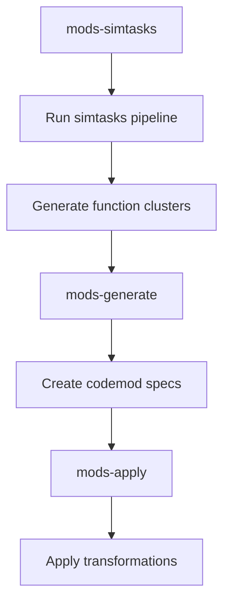

## 🛠️ Task: Fix codemods pipeline missing simtasks dependencies and schema issues

## 🐛 Problem Statement

The codemods pipeline fails due to dependency issues with the simtasks pipeline:

1. **Missing simtasks output**: `missing input: .cache/simtasks/clusters.json`
2. **Schema mismatch**: `output schema mismatch for .cache/simtasks/clusters.json: data must be object`
3. **Missing transform specs**: `missing input: .cache/codemods/specs.json`
4. **Missing transform files**: `missing input: codemods/**/transform.ts`

## 🎯 Desired Outcome

The codemods pipeline should successfully:

- Run simtasks as a dependency to generate function clusters and plans
- Generate codemod specifications based on simtasks analysis
- Create transform files for automated code modifications
- Apply codemods to the codebase
- Work with the new level-cache kanban system

## 📋 Requirements

### Phase 1: Simtasks Dependency Fix
- [ ] Ensure simtasks pipeline runs successfully and produces valid output
- [ ] Fix schema validation for .cache/simtasks/clusters.json
- [ ] Verify all simtasks outputs are properly formatted
- [ ] Add proper error handling for missing simtasks dependencies

### Phase 2: Codemods Generation
- [ ] Fix codemods specification generation logic
- [ ] Ensure transform files are created from simtasks clusters
- [ ] Add validation for codemod specifications
- [ ] Implement proper caching for codemod specs

### Phase 3: Pipeline Integration
- [ ] Fix dependency chain between simtasks and codemods
- [ ] Ensure proper input validation for each step
- [ ] Add rollback capability for failed codemod applications
- [ ] Test codemod application on sample code

## 🔧 Technical Implementation Details

### Files to Investigate
1. **packages/codemods/src/** - Codemod generation logic
2. **Pipeline configuration** - Dependency definition in pipelines.json
3. **Schema definitions** - Cluster and spec validation schemas
4. **Cache management** - Proper cache state tracking

### Pipeline Flow After Fix

### Expected Behavior
1. **mods-simtasks**: Successfully runs simtasks pipeline
2. **mods-generate**: Creates codemod specifications from simtasks output
3. **mods-apply**: Applies generated codemods to target files

## ✅ Acceptance Criteria

1. **Simtasks Integration**: Codemods pipeline successfully triggers simtasks
2. **Schema Compliance**: All intermediate outputs match expected schemas
3. **Spec Generation**: Valid codemod specifications created
4. **Transform Application**: Codemods successfully applied to code
5. **Error Handling**: Graceful failure handling for missing dependencies
6. **Cache Integration**: Works with level-cache kanban system

## 🔗 Related Resources

- **Pipeline Definition**: `pipelines.json` - codemods section
- **Simtasks Pipeline**: `packages/simtask/` - dependency pipeline
- **Codemods Logic**: `packages/codemods/` - transformation logic
- **Schema Definitions**: Validation schemas for cluster and spec files

Fixing the codemods pipeline will enable powerful automated code refactoring capabilities based on AI analysis of code patterns.