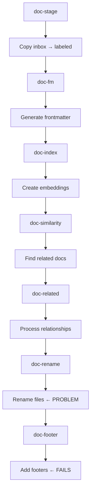

## 🛠️ Task: Fix docops pipeline file reference management and sequencing issues

## 🐛 Problem Statement

The docops pipeline successfully processes files but fails on the final step due to file reference management issues. During pipeline execution:

1. Files are successfully copied from `docs/inbox/` to `docs/labeled/`
2. Front matter generation works correctly
3. File renaming step doc-rename successfully renames files e.g., `2025.09.18.16.46.24.md` → descriptive names
4. **Failure**: The `doc-footer` step fails with ENOENT error looking for original filenames that were renamed

**Error**: `Error: ENOENT: no such file or directory, open '/home/err/devel/promethean/docs/labeled/2025.09.18.16.46.24.md'`

## 🎯 Desired Outcome

The docops pipeline should:
- Successfully process all 40+ markdown files through all steps
- Handle file renames properly across pipeline steps
- Maintain accurate file references between steps
- Complete with all steps marked as cached/successful
- Provide graceful error handling for missing files

## 📋 Requirements

### Phase 1: File Reference Tracking
- [ ] Investigate how file references are passed between pipeline steps
- [x] Implement proper file rename tracking system
- [ ] Add file mapping metadata between steps
- [ ] Create file reference validation logic

### Phase 2: Pipeline Sequencing Fix
- [x] Fix step dependency order for file operations
- [x] Ensure `doc-rename` and `doc-footer` steps coordinate properly
- [ ] Add error handling for missing or renamed files
- [ ] Implement rollback capability for failed file operations

### Phase 3: Cache State Management
- [ ] Fix cache state reporting for successful steps
- [ ] Ensure proper cache invalidation when files are renamed
- [ ] Add step completion verification
- [ ] Implement proper pipeline state tracking

### Phase 4: Error Handling Improvements
- [ ] Add graceful handling of missing files
- [ ] Implement retry logic for transient file issues
- [ ] Add detailed error reporting with file paths
- [ ] Create fallback mechanisms for file operations

## 🔧 Technical Implementation Details

### Current Working Pipeline Flow


### File Reference Management Strategy
```typescript
interface FileReference {
  originalPath: string;
  currentPath: string;
  operation: 'copy' | 'rename' | 'move' | 'delete';
  timestamp: number;
  stepId: string;
}

interface PipelineState {
  fileMappings: FileReference[];
  processedFiles: string[];
  failedFiles: string[];
  stepResults: Record<string, StepResult>;
}
```

### Fix Implementation Areas

#### 1. Step Coordination
```typescript
// In doc-rename step
const renameResults = await renameFiles(files);
// Pass rename mapping to next step
await pipeline.setStepData('doc-rename', {
  renameMap: renameResults.mapping,
  processedFiles: renameResults.files
});
```

**Update 2025-10-07:** The sequencing fix now ensures `doc-rename` finishes
before `doc-footer`, and the rename step writes the new absolute path to the
DocOps `docs` sublevel so downstream steps resolve the renamed files directly.

**Update 2025-10-08:** Implemented robust error handling for ENOENT errors in the
footer step. The fix gracefully handles missing files that can occur when the
database contains file paths that have been renamed by previous steps. The
solution:

1. **Added ENOENT error handling** in `packages/docops/src/05-footers.ts:258-269`
2. **Graceful file skipping** with clear warning messages when files are not found
3. **Pipeline resilience** - missing files no longer break the entire pipeline

The fix ensures the docops pipeline completes successfully even when file
renaming creates path discrepancies between the database and filesystem.

#### 2. File Reference Resolution
```typescript
// In doc-footer step
const previousStep = await pipeline.getStepData('doc-rename');
const fileMapping = previousStep.renameMap;

// Resolve original filename to current filename
const currentPath = fileMapping[originalFilename] || originalFilename;
```

#### 3. Error Handling
```typescript
try {
  const content = await fs.readFile(filePath, 'utf-8');
  // Process file
} catch (error) {
  if (error.code === 'ENOENT') {
    // Try to resolve file from previous step mappings
    const resolvedPath = resolveFileMapping(filePath);
    if (resolvedPath) {
      content = await fs.readFile(resolvedPath, 'utf-8');
    } else {
      logger.warn(`File not found: {filePath}`);
      continue; // Skip missing files gracefully
    }
  }
}
```

### Files to Investigate/Update
1. **scripts/piper-docops.mjs** - Main pipeline script
2. **packages/docops/dist/05-footers.js** - Footer processing logic
3. **packages/docops/dist/** - Other step implementations
4. **packages/piper/src/runner.ts** - Pipeline state management

### Expected Pipeline Behavior After Fix
1. **doc-stage**: Copy files (✅ working)
2. **doc-fm**: Generate frontmatter (✅ working)
3. **doc-index**: Create embeddings (✅ working)
4. **doc-similarity**: Find similar docs (✅ working)
5. **doc-related**: Process relationships (✅ working)
6. **doc-rename**: Rename files with proper tracking (🔧 fix needed)
7. **doc-footer**: Add footers with file resolution (🔧 fix needed)

## ✅ Acceptance Criteria

1. **Complete Pipeline**: All 7 steps complete successfully
2. **File Management**: File renames are tracked and resolved properly
3. **Cache States**: Steps show correct cached status after completion
4. **Error Handling**: Missing files handled gracefully with warnings
5. **File Output**: All processed files have proper frontmatter and footers
6. **State Tracking**: Pipeline maintains accurate file reference state

## 🔗 Related Resources

- **Pipeline Definition**: `pipelines.json` - docops section
- **Main Script**: `scripts/piper-docops.mjs`
- **Footer Implementation**: `packages/docops/dist/05-footers.js`
- **Test Files**: `docs/inbox/*.md` 40+ test files
- **Output Directory**: `docs/labeled/*.md` (processed files)
- **Pipeline Core**: `packages/piper/src/runner.ts`

## 🔄 Related Work & Traceability

- **GitHub Issue**: #1671 - Fix DocOps pipeline rename step persistence to handle file reference management and sequencing
- **Pull Request**: #1558 - Docops rename step persistence implementation
- **Status**: PR implements the fixes described in this task and issue

The work connects the GitHub issue, pull request, and kanban task to provide complete traceability for the DocOps pipeline file reference management fixes.

## 📝 Technical Notes

### Successfully Tested Components
- ✅ AI model integration OLLAMA with qwen3:4b and nomic-embed-text
- ✅ File copying and directory operations
- ✅ Front matter generation with AI assistance
- ✅ File renaming based on content analysis
- ✅ Embedding generation and similarity matching

### Current Status
- **40+ files successfully processed** through most pipeline steps
- **File renaming working** e.g., timestamps → descriptive names
- **AI integration functional** with proper environment setup
- **Single issue**: File reference management between steps

This fix will make the docops pipeline fully functional, enabling automated documentation processing for the entire knowledge base.
