## 🛠️ Task: Fix docops pipeline file reference management and sequencing issues

## 🐛 Problem Statement

The docops pipeline successfully processes files but fails on the final step due to file reference management issues. During pipeline execution:

1. Files are successfully copied from `docs/inbox/` to `docs/labeled/`
2. Front matter generation works correctly
3. File renaming step doc-rename successfully renames files e.g., `2025.09.18.16.46.24.md` → descriptive names
4. **Failure**: The `doc-footer` step fails with ENOENT error looking for original filenames that were renamed

**Error**: `Error: ENOENT: no such file or directory, open '/home/err/devel/promethean/docs/labeled/2025.09.18.16.46.24.md'`

## 🎯 Desired Outcome

The docops pipeline should:
- Successfully process all 40+ markdown files through all steps
- Handle file renames properly across pipeline steps
- Maintain accurate file references between steps
- Complete with all steps marked as cached/successful
- Provide graceful error handling for missing files

## 📋 Requirements

### Phase 1: File Reference Tracking
- [ ] Investigate how file references are passed between pipeline steps
- [ ] Implement proper file rename tracking system
- [ ] Add file mapping metadata between steps
- [ ] Create file reference validation logic

### Phase 2: Pipeline Sequencing Fix
- [ ] Fix step dependency order for file operations
- [ ] Ensure `doc-rename` and `doc-footer` steps coordinate properly
- [ ] Add error handling for missing or renamed files
- [ ] Implement rollback capability for failed file operations

### Phase 3: Cache State Management
- [ ] Fix cache state reporting for successful steps
- [ ] Ensure proper cache invalidation when files are renamed
- [ ] Add step completion verification
- [ ] Implement proper pipeline state tracking

### Phase 4: Error Handling Improvements
- [ ] Add graceful handling of missing files
- [ ] Implement retry logic for transient file issues
- [ ] Add detailed error reporting with file paths
- [ ] Create fallback mechanisms for file operations

## 🔧 Technical Implementation Details

### Current Working Pipeline Flow

```mermaid
graph TD
    A[doc-stage] --> B[Copy inbox → labeled]
    B --> C[doc-fm]
    C --> D[Generate frontmatter]
    D --> E[doc-index]
    E --> F[Create embeddings]
    F --> G[doc-similarity]
    G --> H[Find related docs]
    H --> I[doc-related]
    I --> J[Process relationships]
    J --> K[doc-rename]
    K --> L[Rename files ← PROBLEM]
    L --> M[doc-footer]
    M --> N[Add footers ← FAILS]
```


### File Reference Management Strategy
```typescript
interface FileReference {
  originalPath: string;
  currentPath: string;
  operation: 'copy' | 'rename' | 'move' | 'delete';
  timestamp: number;
  stepId: string;
}

interface PipelineState {
  fileMappings: FileReference[];
  processedFiles: string[];
  failedFiles: string[];
  stepResults: Record<string, StepResult>;
}
```

### Fix Implementation Areas

#### 1. Step Coordination
```typescript
// In doc-rename step
const renameResults = await renameFiles(files);
// Pass rename mapping to next step
await pipeline.setStepData('doc-rename', {
  renameMap: renameResults.mapping,
  processedFiles: renameResults.files
});
```

#### 2. File Reference Resolution
```typescript
// In doc-footer step
const previousStep = await pipeline.getStepData('doc-rename');
const fileMapping = previousStep.renameMap;

// Resolve original filename to current filename
const currentPath = fileMapping[originalFilename] || originalFilename;
```

#### 3. Error Handling
```typescript
try {
  const content = await fs.readFile(filePath, 'utf-8');
  // Process file
} catch (error) {
  if (error.code === 'ENOENT') {
    // Try to resolve file from previous step mappings
    const resolvedPath = resolveFileMapping(filePath);
    if (resolvedPath) {
      content = await fs.readFile(resolvedPath, 'utf-8');
    } else {
      logger.warn(`File not found: {filePath}`);
      continue; // Skip missing files gracefully
    }
  }
}
```

### Files to Investigate/Update
1. **scripts/piper-docops.mjs** - Main pipeline script
2. **packages/docops/dist/05-footers.js** - Footer processing logic
3. **packages/docops/dist/** - Other step implementations
4. **packages/piper/src/runner.ts** - Pipeline state management

### Expected Pipeline Behavior After Fix
1. **doc-stage**: Copy files (✅ working)
2. **doc-fm**: Generate frontmatter (✅ working)
3. **doc-index**: Create embeddings (✅ working)
4. **doc-similarity**: Find similar docs (✅ working)
5. **doc-related**: Process relationships (✅ working)
6. **doc-rename**: Rename files with proper tracking (🔧 fix needed)
7. **doc-footer**: Add footers with file resolution (🔧 fix needed)

## ✅ Acceptance Criteria

1. **Complete Pipeline**: All 7 steps complete successfully
2. **File Management**: File renames are tracked and resolved properly
3. **Cache States**: Steps show correct cached status after completion
4. **Error Handling**: Missing files handled gracefully with warnings
5. **File Output**: All processed files have proper frontmatter and footers
6. **State Tracking**: Pipeline maintains accurate file reference state

## 🔗 Related Resources

- **Pipeline Definition**: `pipelines.json` - docops section
- **Main Script**: `scripts/piper-docops.mjs`
- **Footer Implementation**: `packages/docops/dist/05-footers.js`
- **Test Files**: `docs/inbox/*.md` 40+ test files
- **Output Directory**: `docs/labeled/*.md` (processed files)
- **Pipeline Core**: `packages/piper/src/runner.ts`

## 📝 Technical Notes

### Successfully Tested Components
- ✅ AI model integration OLLAMA with qwen3:4b and nomic-embed-text
- ✅ File copying and directory operations
- ✅ Front matter generation with AI assistance
- ✅ File renaming based on content analysis
- ✅ Embedding generation and similarity matching

### Current Status
- **40+ files successfully processed** through most pipeline steps
- **File renaming working** e.g., timestamps → descriptive names
- **AI integration functional** with proper environment setup
- **Single issue**: File reference management between steps

This fix will make the docops pipeline fully functional, enabling automated documentation processing for the entire knowledge base.