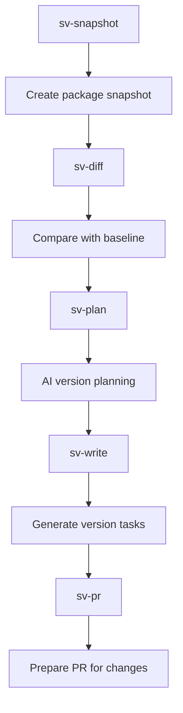

## 🛠️ Task: Fix semver-guard pipeline incorrect directory scanning and configuration issues

## 🐛 Problem Statement

The semver-guard pipeline fails due to incorrect directory path resolution. The error shows:

```
Error: ENOENT: no such file or directory, scandir '/home/err/devel/promethean/packages/semverguard/packages'
```

The semverguard tool is looking for packages in the wrong directory (`packages/semverguard/packages` instead of `packages` from the project root).

## 🎯 Desired Outcome

The semver-guard pipeline should successfully:
- Scan packages from the correct root directory
- Create snapshots of current package versions
- Compare against baseline to detect changes
- Generate semantic versioning plans using AI
- Create actionable tasks for version updates
- Optionally prepare pull requests for version changes

## 🔍 Clarifications & Plan

- Verified that `pnpm --filter @promethean/semverguard sv:01-snapshot` runs with `cwd=packages/semverguard`, leading to incorrect relative path resolution for packages, cache, and output directories.
- Planned to introduce repo-aware path helpers shared by snapshot and PR steps, normalize script defaults, and restore the missing PR command wiring.

## ✅ Implementation Notes

- Added repo-root aware path resolution utilities in `src/01-snapshot.ts` and `src/05-pr.ts`, ensuring packages, cache, and output paths resolve correctly even when commands execute inside the package directory.
- Updated git/PR orchestration to default to the repository root, preventing relative-path mistakes during branch preparation.
- Registered the missing `sv:05-pr` script/binary so every pipeline stage is invokable through `pnpm` and the Piper harness.
- Left the integration-testing checklist items open for a future slice.

## 📋 Requirements

### Phase 1: Directory Path Resolution
- [x] Fix semverguard to scan packages from project root, not its own directory
- [x] Correct path resolution in snapshot creation logic
- [x] Ensure proper working directory context
- [x] Validate directory structure before scanning

### Phase 2: Pipeline Configuration
- [x] Fix semverguard package scripts and command-line arguments
- [x] Ensure proper tsconfig.json path resolution
- [x] Fix cache directory paths and permissions
- [x] Validate all file system operations

### Phase 3: Missing Script Fix
- [x] Add missing `sv:05-pr` script to semverguard package.json
- [x] Ensure all pipeline steps have corresponding npm scripts
- [ ] Fix any missing dependencies or build issues
- [ ] Test all semverguard CLI commands individually

### Phase 4: Integration Testing
- [ ] Test semverguard with actual package changes
- [ ] Validate snapshot creation and comparison
- [ ] Test AI-powered version planning
- [ ] Verify task generation for version updates

## 🔧 Technical Implementation Details

### Root Cause Analysis
The semverguard package is trying to scan packages from within its own directory structure instead of the project root:
- **Incorrect path**: `/home/err/devel/promethean/packages/semverguard/packages`
- **Correct path**: `/home/err/devel/promethean/packages`

### Files to Investigate/Update
1. **packages/semverguard/src/01-snapshot.ts** - Fix directory scanning logic
2. **packages/semverguard/package.json** - Add missing sv:05-pr script
3. **scripts/piper-semverguard.mjs** - Verify command argument passing
4. **Pipeline configuration** - Ensure proper working directory

### Expected Directory Structure
```
/home/err/devel/promethean/
├── packages/
│   ├── agent/
│   ├── kanban/
│   ├── semverguard/
│   └── ... (other packages)
└── semverguard should scan from here (packages/), not from within its own directory
```

### Fix Implementation Areas

#### 1. Path Resolution in Snapshot
```typescript
// Current (incorrect):
const packagesDir = path.join(process.cwd(), 'packages');

// Should be (correct):
const packagesDir = path.join(process.cwd(), '../../packages');
// Or better: accept packages path as argument
```

#### 2. Working Directory Context
```typescript
// Ensure semverguard runs from project root
const projectRoot = process.env.PWD || process.cwd();
const packagesDir = path.join(projectRoot, 'packages');
```

#### 3. Missing Script Addition
```json
{
  "scripts": {
    "sv:01-snapshot": "tsx src/01-snapshot.ts",
    "sv:02-diff": "tsx src/02-diff.ts",
    "sv:03-plan": "tsx src/03-plan.ts",
    "sv:04-write": "tsx src/04-write.ts",
    "sv:05-pr": "tsx src/05-pr.ts"
  }
}
```

### Pipeline Flow After Fix


## ✅ Acceptance Criteria

1. **Correct Directory Scanning**: Semverguard scans packages from project root
2. **Complete Pipeline**: All 5 steps execute without path errors
3. **Snapshot Creation**: Valid package snapshots created in cache
4. **Version Planning**: AI-powered version change analysis works
5. **Task Generation**: Meaningful version update tasks created
6. **PR Preparation**: Optional PR generation for version updates

## 🔗 Related Resources

- **Pipeline Definition**: `pipelines.json` - semver-guard section
- **Snapshot Logic**: `packages/semverguard/src/01-snapshot.ts`
- **Diff Logic**: `packages/semverguard/src/02-diff.ts`
- **Planning Logic**: `packages/semverguard/src/03-plan.ts`
- **Write Logic**: `packages/semverguard/src/04-write.ts`
- **PR Logic**: `packages/semverguard/src/05-pr.ts` (missing)
- **Pipeline Script**: `scripts/piper-semverguard.mjs`

## 📝 Technical Notes

### Expected Benefits Once Fixed
- Automated semantic versioning for all packages
- AI-powered version change analysis and planning
- Automatic detection of breaking changes
- Version bump task generation with proper justification
- Automated PR creation for version updates (optional)

### Integration with CI/CD
This pipeline is designed to integrate with CI/CD workflows to:
- Detect when package versions need updates
- Generate version bump tasks with AI analysis
- Create PRs for version changes
- Maintain semantic versioning compliance

Fixing the directory scanning issue will enable powerful automated version management capabilities across the entire monorepo.