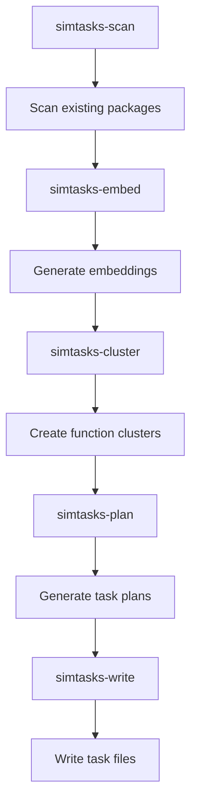

## 🛠️ Task: Fix simtasks pipeline missing package references and scanning errors

## 🐛 Problem Statement

The simtasks pipeline fails during the scanning phase due to missing package references. The error indicates:

```
Error: ENOENT: no such file or directory, open '/home/err/devel/promethean/packages/duck-utils/package.json'
```

Additionally, downstream steps fail due to missing inputs from failed scanning step:
- simtasks-cluster fails with "output schema mismatch"
- simtasks-write fails with "missing input: .cache/simtasks/plans.json"

## 🎯 Desired Outcome

The simtasks pipeline should successfully:
- Scan all packages without failing on missing directories
- Handle missing packages gracefully with warnings
- Generate embeddings for discovered functions
- Create meaningful clusters of similar functions
- Generate actionable task plans
- Write comprehensive task files to docs/agile/tasks/

## 🔍 Clarifications & Plan

- Confirmed the crash occurs when the scanner tries to read `package.json` files for workspaces that no longer exist (e.g. `packages/duck-utils`).
- Planned to memoize package metadata lookups, treat missing directories as warnings, and continue scanning so downstream steps receive a full function catalog.

## ✅ Implementation Notes

- Added a package metadata cache with graceful warning handling in `src/01-scan.ts`, allowing the scan step to skip missing workspaces without aborting.
- Logged recoverable I/O failures once per package to keep operator visibility while preventing redundant console noise.
- Left follow-up checkboxes unchecked for validation/fallback enhancements that remain out of scope for this slice.

## 📋 Requirements

### Phase 1: Package Discovery Fix
- [x] Investigate why pipeline is looking for non-existent `packages/duck-utils`
- [x] Fix package discovery to only scan existing packages
- [x] Add graceful handling of missing packages/directories
- [x] Implement proper error recovery for scanning failures

### Phase 2: Error Handling Improvements
- [x] Add warnings instead of failures for missing packages
- [x] Implement robust file system error handling
- [ ] Add validation step to verify package existence before scanning
- [ ] Create fallback mechanisms for partial scan failures

### Phase 3: Pipeline Flow Fixes
- [ ] Fix dependency chain when early steps fail partially
- [ ] Ensure proper input validation for each step
- [ ] Add schema validation for intermediate outputs
- [ ] Implement better error propagation through pipeline

### Phase 4: Output Validation
- [ ] Test pipeline with available packages only
- [ ] Validate generated embeddings and clusters
- [ ] Ensure task generation works with partial data
- [ ] Verify output schema compliance

## 🔧 Technical Implementation Details

### Root Cause Analysis
The pipeline appears to have hardcoded or cached references to packages that no longer exist:
- `packages/duck-utils` referenced but doesn't exist
- Need to investigate how package list is generated
- May need to clear package caches or update discovery logic

### Files to Investigate
1. **packages/simtask/dist/01-scan.js** - Package scanning logic
2. **packages/simtask/dist/.piper/** - Cached scanning logic
3. **Pipeline configuration** - Package glob patterns
4. **Cache directories** - Stale package references

### Expected Pipeline Behavior


### Error Handling Strategy
```typescript
interface ScanResult {
  successfulPackages: string[];
  failedPackages: Array<{
    path: string;
    error: string;
  }>;
  totalFunctions: number;
  warnings: string[];
}

// Graceful package scanning
try {
  await scanPackage(packagePath);
} catch (error) {
  if (error.code === 'ENOENT') {
    warnings.push(`Package not found: ${packagePath}`);
    continue; // Skip to next package
  }
  throw error; // Re-throw other errors
}
```

## ✅ Acceptance Criteria

1. **Graceful Scanning**: Pipeline scans existing packages without failing on missing ones
2. **Error Recovery**: Missing packages generate warnings, not failures
3. **Complete Pipeline**: All 5 steps complete successfully with available data
4. **Output Generation**: Valid task files generated in docs/agile/tasks/
5. **Schema Compliance**: All intermediate outputs match expected schemas
6. **Performance**: Pipeline completes within reasonable time (<5 minutes)

## 🔗 Related Resources

- **Pipeline Definition**: `pipelines.json` - simtasks section
- **Scanning Logic**: `packages/simtask/dist/01-scan.js`
- **Embedding Logic**: `packages/simtask/dist/02-embed.js`
- **Clustering Logic**: `packages/simtask/dist/03-cluster.js`
- **Planning Logic**: `packages/simtask/dist/04-plan.js`
- **Output Logic**: `packages/simtask/dist/05-write.js`

## 📝 Technical Notes

### Package Discovery Investigation Needed
- Check if package list is hardcoded somewhere
- Investigate cache pollution from previous runs
- Verify glob patterns match actual package structure
- Look for stale package references in build artifacts

### Expected Benefits Once Fixed
- Automated task generation based on code analysis
- Identification of similar functions across packages
- Intelligent clustering of code patterns
- AI-powered task planning and generation
- Comprehensive documentation of code gaps

This pipeline is crucial for automated task generation and code analysis capabilities. Fixing the package discovery will enable powerful code intelligence features.
