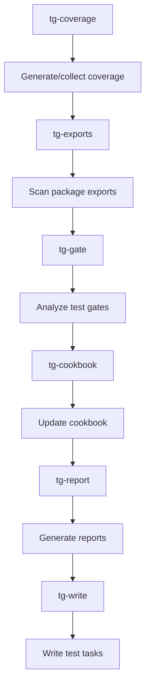

## 🛠️ Task: Fix test-gap pipeline missing coverage and incorrect package scanning

## 🐛 Problem Statement

The test-gap pipeline fails with two main issues:

1. **Missing coverage reports**: `missing input: coverage/lcov.info`
2. **Incorrect package scanning**: `ENOENT: no such file or directory, scandir '/home/err/devel/promethean/packages/testgap/packages'`

The testgap package is trying to scan packages from within its own directory instead of the project root.

## 🎯 Desired Outcome

The test-gap pipeline should successfully:

- Generate and collect test coverage reports from all packages
- Scan project packages correctly from the root directory
- Identify test coverage gaps and untested code
- Generate comprehensive test improvement plans
- Create actionable testing tasks

## 📋 Requirements

### Phase 1: Coverage Report Generation
- [ ] Ensure test coverage is generated during test runs
- [ ] Configure coverage collection for all packages
- [ ] Fix lcov.info file location and accessibility
- [ ] Add coverage report aggregation

### Phase 2: Package Scanning Fix
- [ ] Fix testgap to scan packages from project root, not its own directory
- [ ] Correct path resolution in export scanning logic
- [ ] Ensure proper working directory context
- [ ] Add validation for package existence

### Phase 3: Pipeline Integration
- [ ] Test pipeline with actual coverage data
- [ ] Validate gap analysis and report generation
- [ ] Ensure proper integration with cookbook generation
- [ ] Add error handling for missing coverage data

## 🔧 Technical Implementation Details

### Root Cause Analysis

#### Issue 1: Missing Coverage Reports
- Pipeline expects `coverage/lcov.info` but file doesn't exist
- Need to ensure tests run with coverage collection enabled
- Coverage reports may be in different locations per package

#### Issue 2: Incorrect Package Scanning
- testgap looking in `/home/err/devel/promethean/packages/testgap/packages`
- Should look in `/home/err/devel/promethean/packages`
- Same path resolution issue as semver-guard pipeline

### Files to Investigate/Update
1. **packages/testgap/src/01-scan-exports.ts** - Fix package scanning path
2. **Test configuration** - Coverage collection setup
3. **Pipeline configuration** - Coverage file paths and patterns
4. **Package scripts** - Ensure coverage generation in test commands

### Expected Directory Structure
```
/home/err/devel/promethean/
├── packages/
│   ├── agent/
│   ├── kanban/
│   ├── testgap/
│   └── ... (other packages)
└── testgap should scan from here (packages/), not from within its own directory
```

### Fix Implementation Areas

#### 1. Package Scanning Path Fix
```typescript
// In packages/testgap/src/01-scan-exports.ts
// Current (incorrect):
const packagesDir = path.join(process.cwd(), 'packages');

// Should be (correct):
const projectRoot = path.join(process.cwd(), '../..');
const packagesDir = path.join(projectRoot, 'packages');

// Or better: accept packages path as argument
const packagesPath = args.find(arg => arg.startsWith('--root='))?.split('=')[1] ||
                     path.join(process.cwd(), '../../packages');
```

#### 2. Coverage Generation Setup
```json
// In root package.json
{
  "scripts": {
    "test:coverage": "pnpm -r test --coverage",
    "coverage:merge": "npx nyc merge coverage/ coverage/lcov.info",
    "coverage:report": "npx nyc report --reporter=lcov"
  }
}
```

#### 3. Coverage File Path Configuration
```javascript
// Update pipeline to look for coverage in multiple locations
const coverageGlobs = [
  'coverage/lcov.info',
  'packages/**/coverage/lcov.info',
  '.cache/coverage/lcov.info',
  'packages/*/lcov.info'
];
```

### Pipeline Flow After Fix


## ✅ Acceptance Criteria

1. **Coverage Generation**: Tests run with coverage collection enabled
2. **Package Scanning**: testgap scans project packages from correct location
3. **Gap Analysis**: Identifies untested functions and modules
4. **Report Generation**: Creates comprehensive test gap reports
5. **Task Creation**: Generates actionable test improvement tasks
6. **Cookbook Integration**: Updates testing cookbook with gap findings

## 🔗 Related Resources

- **Pipeline Definition**: `pipelines.json` - test-gap section
- **TestGap Logic**: `packages/testgap/` - coverage analysis logic
- **Coverage Configuration**: NYC/Jest coverage setup
- **Test Scripts**: Package-specific test commands

## 📝 Technical Notes

### Coverage Strategy
- Use NYC for coverage aggregation across monorepo packages
- Configure coverage thresholds and reporting
- Generate both HTML and LCOV format reports

### Expected Benefits
Once fixed, the test-gap pipeline will provide:
- Comprehensive test coverage analysis
- Identification of untested code paths
- Automated test case generation suggestions
- Integration with developer cookbook
- Improved test coverage across the project

This fix will enable intelligent test gap analysis and help maintain high test coverage standards across the entire codebase.


