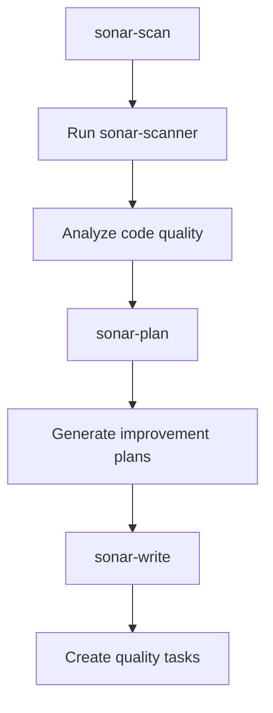

## 🛠️ Task: Install and configure sonar-scanner for code quality pipeline

## 🐛 Problem Statement

The sonar pipeline fails because the `sonar-scanner` tool is not installed:

```
/bin/sh: 1: sonar-scanner: not found
```

This prevents the pipeline from performing automated code quality analysis and generating quality reports.

## 🎯 Desired Outcome

The sonar pipeline should successfully:

- Scan codebase for code quality issues using SonarQube
- Generate comprehensive quality reports
- Integrate with SonarCloud or self-hosted SonarQube
- Create actionable quality improvement tasks
- Work with CI/CD workflows

## 📋 Requirements

### Phase 1: Sonar Scanner Installation
- [ ] Install sonar-scanner tool (npm package or binary)
- [ ] Configure sonar-scanner in project PATH
- [ ] Verify sonar-scanner installation and connectivity
- [ ] Add sonar-scanner to development dependencies

### Phase 2: SonarQube Configuration
- [ ] Set up SonarCloud account or self-hosted SonarQube
- [ ] Configure project with proper project key
- [ ] Set up authentication tokens
- [ ] Configure sonar-project.properties file

### Phase 3: Pipeline Integration
- [ ] Test sonar pipeline with proper credentials
- [ ] Verify code scanning and report generation
- [ ] Configure quality gates and thresholds
- [ ] Test integration with kanban task generation

## 🔧 Technical Implementation Details

### Installation Options

#### Option 1: NPM Package
```bash
pnpm add -D sonar-scanner
# Add to package.json scripts
"sonar": "sonar-scanner"
```

#### Option 2: Global Installation
```bash
# Using npm
npm install -g sonar-scanner

# Using yarn
yarn global add sonar-scanner

# Using pnpm
pnpm add -g sonar-scanner
```

#### Option 3: Docker Integration
```bash
# Use sonar-scanner in Docker container
docker run --rm -v (pwd):/usr/src sonarsource/sonar-scanner-cli
```

### Configuration Files

#### sonar-project.properties
```properties
# Project identification
sonar.projectKey=promethean
sonar.organization=your-organization

# Project structure
sonar.sources=packages/src,src
sonar.tests=packages/test,test
sonar.exclusions=**/node_modules/**,**/dist/**,**/coverage/**

# Language-specific settings
sonar.javascript.lcov.reportPaths=coverage/lcov.info
sonar.typescript.lcov.reportPaths=coverage/lcov.info

# Quality gates
sonar.qualitygate.wait=true
```

### Environment Variables
```bash
# SonarCloud configuration
SONAR_HOST_URL=https://sonarcloud.io
SONAR_TOKEN=your_sonar_token
SONAR_ORGANIZATION=your_organization

# Self-hosted SonarQube
SONAR_HOST_URL=http://localhost:9000
SONAR_TOKEN=your_local_token
```

### Pipeline Flow After Fix


## ✅ Acceptance Criteria

1. **Tool Installation**: sonar-scanner installed and accessible
2. **Configuration**: Proper SonarQube/SonarCloud setup
3. **Pipeline Success**: Sonar pipeline completes without errors
4. **Quality Reports**: Comprehensive code quality analysis generated
5. **Task Generation**: Quality improvement tasks created in kanban
6. **CI/CD Integration**: Pipeline works in automated workflows

## 🔗 Related Resources

- **SonarScanner Documentation**: https://docs.sonarqube.org/latest/analysis/scan/sonarscanner/
- **SonarCloud Setup**: https://sonarcloud.io/documentation
- **Pipeline Definition**: `pipelines.json` - sonar section
- **Sonar Package**: `packages/sonar/` - analysis logic

## 📝 Technical Notes

### Installation Recommendation
Use the npm package approach for better dependency management and reproducibility across development environments.

### Security Considerations
- Store SONAR_TOKEN securely in environment variables
- Use project-specific tokens with minimal required permissions
- Consider using SonarCloud for managed service or self-hosted for privacy

### Integration Benefits
Once configured, the sonar pipeline will provide:
- Automated code quality analysis
- Technical debt tracking
- Security vulnerability detection
- Test coverage analysis
- Quality gate enforcement

This setup will enable continuous code quality monitoring and automated task generation for quality improvements.

