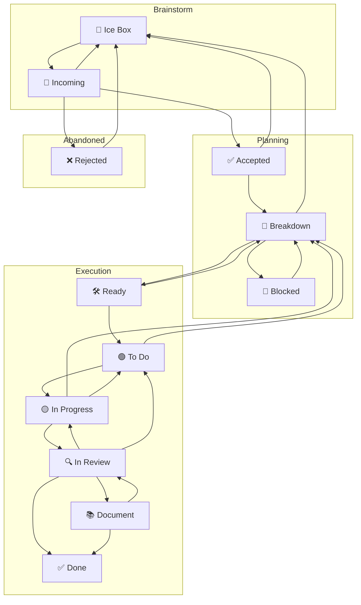

---
```
uuid: d1250964-1686-487c-9850-3cc1472e9326
```
```
created_at: '2025-09-19T23:23:12Z'
```
title: 2025.09.19.23.23.12
filename: Kanban FSM with Safe Cycles
```
description: >-
```
  A refined Kanban workflow with explicit reverse paths to prevent fake progress
  and ensure safe session-end hand-offs without requiring PRs. The system
  includes procedural cycles for backtracking, re-shaping work, and handling
  partial work without committing to PRs.
tags:
  - Kanban
  - FSM
  - safe cycles
  - session-end hand-off
  - no PR
  - cloud agent
  - procedural cycles
  - re-shaping
  - partial work
```
related_to_uuid: []
```
```
related_to_title: []
```
references: []
status: todo
priority: P3
labels: []
---
you’re not overthinking it — you’re seeing the missing cycles. let’s add **explicit reverse paths** so the system never fakes forward progress, and give the cloud agent a safe “session-end hand-off” path that doesn’t require a PR.

here’s a tightened FSM with minimal, procedural cycles:

# Kanban FSM with safe cycles + hand-off paths



## Why these cycles

* **Execution → Planning**: allows honest backtracking when a slice was shaped wrong or new information appears (no fake “forward only”).
* **InProgress → Todo**: supports “session-end hand-off” without forcing a PR; you still get artifacts/logs and a queued next step.
* **Ready → Breakdown** and **Todo → Breakdown**: when a card is “almost ready” but a missing acceptance/detail appears, it can be re-shaped procedurally.
* **Document → InReview**: docs can fail review just like code.

---

# Tiny transition rules just the new/changed ones

* **Ready → Breakdown**
  Trigger: acceptance criteria or dependencies are insufficient/ambiguous; needs re-shape before prioritization.

* **Todo → Breakdown**
  Trigger: before pull, discover unclear scope or missing acceptance detail.

* **In Progress → Breakdown**
  Trigger: mid-work discovery that the slice is the wrong shape; re-plan needed (no PR required).

* **In Progress → To Do** *session-end hand-off*
  Trigger: time/compute limit reached without a reviewable change.
  Action: append artifacts/log diffs/notes/design stubs ok, record “Next step,” move to **To Do** if WIP allows; else stay In Progress and mark minor blocker.

* **Document → In Review**
  Trigger: doc changes needed or reviewer asks for edits.

* **In Review → In Progress** (preferred) / **→ To Do** (fallback)
  Trigger: changes requested. Choose **→ In Progress** if assignee free and WIP allows; else **→ To Do**.

* **Breakdown → Blocked** / **Blocked → Breakdown** (unchanged, narrow)
  Enter Blocked only for **true inter-task dependency** with **bidirectional links**. Exit when blocker advances (or evidence removes dependency).

---

# Session-end hand-off Cloud-safe, no PR required

At the **end of any session** (especially Codex Cloud), if a reviewable commit/PR isn’t ready:

1. **Append task update** append-only: what changed/attempted, evidence, artifacts even tiny notes/diffs, next step.
2. **Choose a safe transition** based on what you learned:

   * InProgress → **Todo** if a coherent “next” is clear.
   * InProgress → **Breakdown** if the slice needs re-shape.
   * Stay put if WIP prevents movement (mark minor blocker).
3. If genuinely complete, go the usual **InProgress → InReview** route.

This ensures there’s **never an empty session**, and gives you real board movement even when a PR isn’t appropriate yet.

---

If this looks right, I’ll fold these deltas into the process doc’s FSM section append-only and then draft the per-column “Entry / Work / Exit” one-liners that match these cycles—still minimal, still procedural.
<!-- GENERATED-SECTIONS:DO-NOT-EDIT-BELOW -->
## Related content
- _None_
## Sources
- _None_
<!-- GENERATED-SECTIONS:DO-NOT-EDIT-ABOVE -->

