---
```
uuid: 2c588732-0024-4392-895e-de78dccb55a7
```
```
created_at: '2025-09-19T22:32:47Z'
```
title: 2025.09.19.22.32.47
filename: Kanban FSM
```
description: >-
```
  A cleaned-up Kanban state machine diagram with explicit transitions for
  incoming items, acceptance, rejection, and ice-boxing. Includes blocked states
  and unblock paths for workflow management.
tags:
  - kanban
  - state machine
  - workflow
  - transitions
  - blocked
  - ice box
  - incoming
  - accepted
  - rejected
```
related_to_uuid: []
```
```
related_to_title: []
```
references: []
status: todo
priority: P3
labels: []
---
got it—here’s the cleaned-up **Kanban FSM** mermaid, with your tweaks:

* “New” → **Incoming**
* Incoming can go to **Accepted**, **Rejected**, or **Ice Box**
* **Blocked** reachable from **any** state (explicit edges shown), and returns to **Breakdown**
* Ice-boxing may occur in **Brainstorm** or **Planning** (not Execution)
* Kept `InReview → Done` and `Done → Ice Box`

```mermaid
flowchart TD

    %% ====== Lanes ======
    subgraph Brainstorm
        IceBox["🧊 Ice Box"]
        Incoming["💭 Incoming"]
    end

    subgraph Planning
        Accepted["✅ Accepted"]
        Breakdown["🧩 Breakdown"]
        Blocked["🚧 Blocked"]
    end

    subgraph Execution
        Ready["🛠 Ready"]
        Todo["🟢 To Do"]
        InProgress["🟡 In Progress"]
        InReview["🔍 In Review"]
        Document["📚 Document"]
        Done["✅ Done"]
    end

    subgraph Abandoned
        Rejected["❌ Rejected"]
    end

    %% ====== Normal flow ======
    IceBox --> Incoming
    Incoming --> Accepted
    Incoming --> Rejected
    Incoming --> IceBox

    Accepted --> Breakdown
    Breakdown --> Ready
    Breakdown --> Rejected
    Ready --> Todo
    Todo --> InProgress
    InProgress --> InReview
    InReview --> Document
    InReview --> Done
    Document --> Done

    %% ====== Defer/Archive loops ======
    Done --> IceBox
    Rejected --> IceBox

    %% ====== IceBox from Brainstorm/Planning ======
    Accepted --> IceBox
    Breakdown --> IceBox

    %% ====== Blocked reachable from any state ======
    Incoming --> Blocked
    Accepted --> Blocked
    Breakdown --> Blocked
    Ready --> Blocked
    Todo --> Blocked
    InProgress --> Blocked
    InReview --> Blocked
    Document --> Blocked
    Done --> Blocked

    %% ====== Unblock path ======
    Blocked --> Breakdown
```



if this matches your intent, next micro-step: I’ll list each column’s **allowed outbound transitions** (one concise line per state) so we have a human-readable rules table to pair with the diagram.
<!-- GENERATED-SECTIONS:DO-NOT-EDIT-BELOW -->
## Related content
- _None_
## Sources
- _None_
<!-- GENERATED-SECTIONS:DO-NOT-EDIT-ABOVE -->

