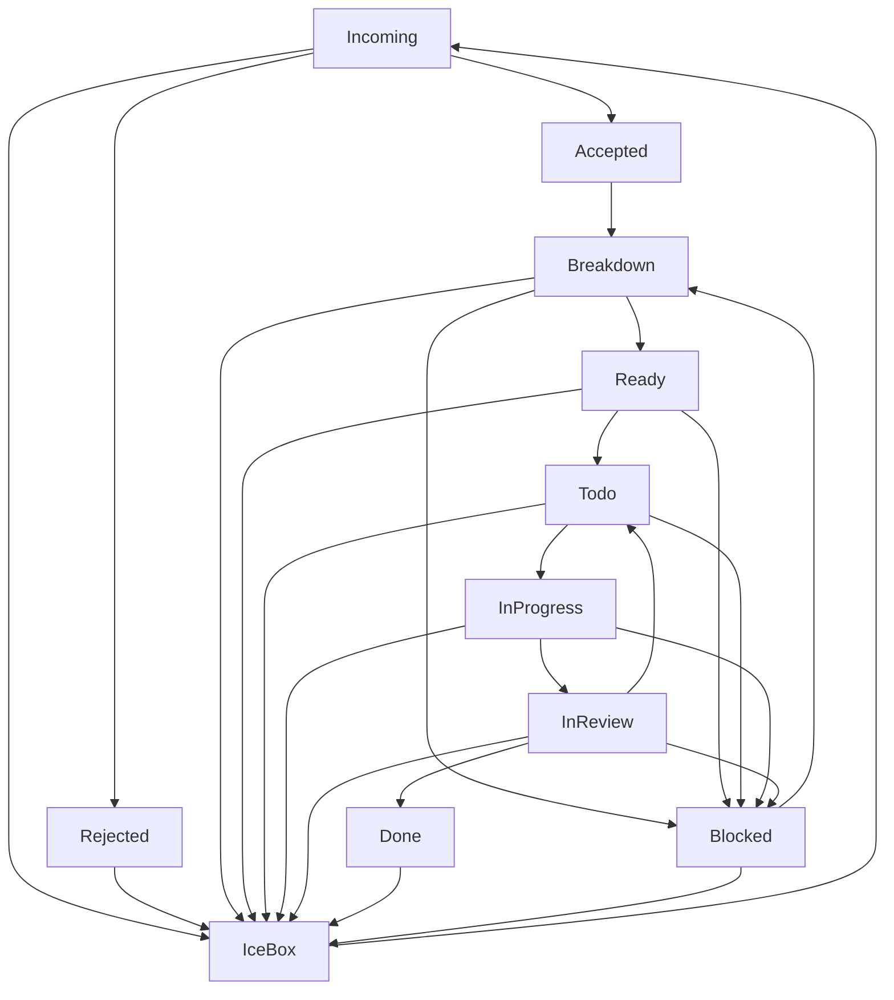

# Process Governance Cluster - Quality Gates & Workflow Enforcement

## 🎯 Strategic Objective

Implement comprehensive process governance with automated quality gates, FSM enforcement, and completion verification to ensure work quality and workflow integrity.

## 📊 Current State Analysis

### Critical Process Issues

- **No enforcement** of 6-step workflow requirements
- **Template pollution** in done column with incomplete tasks
- **Missing quality gates** for critical transitions
- **WIP limits disabled** despite configuration
- **No completion verification** before marking tasks done
- **FSM defined but not enforced** in practice

### Impact Assessment

- **Quality degradation**: Incomplete work marked as done
- **Workflow bypass**: Teams skipping critical process steps
- **Loss of visibility**: No clear picture of work quality
- **Process inconsistency**: Different teams following different rules

## 🎯 Acceptance Criteria

### Phase 1: FSM Implementation & Enforcement (P1)

- [ ] Kanban FSM fully implemented with all transitions
- [ ] State transition rules enforced in CLI and UI
- [ ] Clear error messages for invalid transitions
- [ ] Process step validation for each state change
- [ ] WIP limits enabled and enforced globally

### Phase 2: Quality Gates & Validation (P1)

- [ ] Acceptance criteria required for Breakdown → Ready
- [ ] Fibonacci scoring validation (1,2,3,5,8,13 only)
- [ ] Complexity ≤5 requirement for Ready → Todo
- [ ] Template placeholder detection and blocking
- [ ] Process step completion verification

### Phase 3: Completion Verification (P1)

- [ ] Evidence requirements for done status
- [ ] Changelog entry verification
- [ ] PR link validation
- [ ] Test coverage requirements
- [ ] Security task verification for P1/P2 items

### Phase 4: Process Compliance & Reporting (P2)

- [ ] Process compliance dashboard
- [ ] Automated quality metrics
- [ ] Process violation reporting
- [ ] Team performance analytics
- [ ] Continuous improvement feedback loops

## 🛠️ Implementation Plan

### Phase 1: FSM Foundation (Day 1)

**Target Components:**

- Kanban transition rules engine
- FSM state definitions
- CLI command handlers
- Process validation logic

**Actions:**

1. Consolidate FSM definitions from multiple tasks
2. Implement state transition validation
3. Enable global WIP limit enforcement
4. Add clear error messaging
5. Test all transition paths

### Phase 2: Quality Gates (Day 1-2)

**Target Components:**

- Custom validation functions
- Acceptance criteria checking
- Fibonacci scoring validation
- Template detection logic

**Actions:**

1. Implement acceptance criteria validation
2. Add Fibonacci score enforcement
3. Create complexity validation rules
4. Build template placeholder detection
5. Integrate with transition system

### Phase 3: Completion Verification (Day 2-3)

**Target Components:**

- Evidence collection system
- Completion verification logic
- Quality gate enforcement
- Security validation rules

**Actions:**

1. Define evidence requirements for done status
2. Implement changelog verification
3. Add PR link validation
4. Create test coverage requirements
5. Build security task verification

### Phase 4: Compliance & Reporting (Day 3-4)

**Target Components:**

- Compliance dashboard
- Metrics collection
- Reporting system
- Analytics engine

**Actions:**

1. Build process compliance dashboard
2. Implement automated metrics collection
3. Create violation reporting
4. Add team performance analytics
5. Establish feedback loops

## 📁 Files to Modify

### Core Kanban System

- `promethean.kanban.json` (enable global rules, enhance validation)
- `packages/kanban/src/lib/transition-rules.ts` (FSM enforcement)
- `packages/kanban/src/cli/command-handlers.ts` (CLI validation)
- `packages/kanban/src/lib/validation.ts` (quality gates)

### Process Rules & Logic

- `docs/agile/rules/kanban-transitions.clj` (validation functions)
- `packages/kanban/src/lib/fsm.ts` (state machine)
- `packages/kanban/src/lib/completion-verification.ts` (done validation)

### Configuration & Templates

- `docs/agile/process.md` (process documentation)
- Task templates (enhanced with validation)
- Quality gate configurations

## 🔗 Consolidated FSM Definition

### State Transitions



### Quality Gates by Transition

- **Breakdown → Ready**: Acceptance criteria required
- **Ready → Todo**: Fibonacci score ≤5 required
- **Todo → InProgress**: WIP limit check
- **InProgress → InReview**: Progress verification
- **InReview → Done**: Completion evidence required

## 📈 Success Metrics

### Process Compliance

- **100% of tasks** follow 6-step workflow
- **0 template pollution** in done column
- **100% WIP limit** enforcement
- **95%+ process compliance** rate

### Quality Metrics

- **100% of done tasks** have completion evidence
- **100% of P1/P2 tasks** have security verification
- **All transitions** follow FSM rules
- **Clear error messages** for violations

### Workflow Efficiency

- **Reduced rework** due to quality gates
- **Faster cycle time** with clear process
- **Better visibility** into work quality
- **Continuous improvement** through metrics

## 🧪 Verification Steps

### FSM Enforcement Testing

```bash
# Test invalid transitions
kanban update-status <uuid> invalid-state

# Test WIP limits
kanban update-status <uuid> in-progress  # Should block at limit

# Test quality gates
kanban update-status <uuid> ready  # Should block without criteria
```

### Quality Gates Testing

```bash
# Test acceptance criteria validation
kanban update-status <uuid> ready  # Without criteria

# Test Fibonacci validation
kanban update <uuid> estimate=4  # Should reject

# Test completion verification
kanban update-status <uuid> done  # Without evidence
```

### Compliance Dashboard Testing

```bash
# Generate compliance report
kanban compliance-report

# Check team metrics
kanban team-metrics

# View violations
kanban violations
```

## 🚨 Risk Mitigation

### Implementation Risks

- **Process disruption**: Teams may resist new constraints
- **Productivity impact**: Initial slowdown due to learning curve
- **Technical complexity**: Integration challenges across systems

### Mitigation Strategies

- **Gradual rollout**: Phase implementation with training
- **Clear documentation**: Comprehensive guides and examples
- **Team involvement**: Include teams in design and testing
- **Fallback procedures**: Manual override capabilities

## 📚 Documentation Requirements

### Process Documentation

- Updated 6-step workflow guide
- FSM transition documentation
- Quality gate specifications
- Compliance procedures

### Technical Documentation

- Validation rule documentation
- API documentation for new features
- Configuration guides
- Troubleshooting procedures

### Training Materials

- Team training sessions
- Video tutorials
- Quick reference guides
- FAQ documentation

## 🎯 Completion Criteria

This cluster is complete when:

1. FSM is fully implemented and enforced
2. All quality gates are functional
3. Completion verification is working
4. Compliance dashboard is operational
5. Teams are trained and using the system
6. Process metrics show improvement
7. No regressions in workflow efficiency

---

**Cluster Lead**: Process Team
**Review Date**: 2025-10-12
**Next Review**: 2025-10-19


