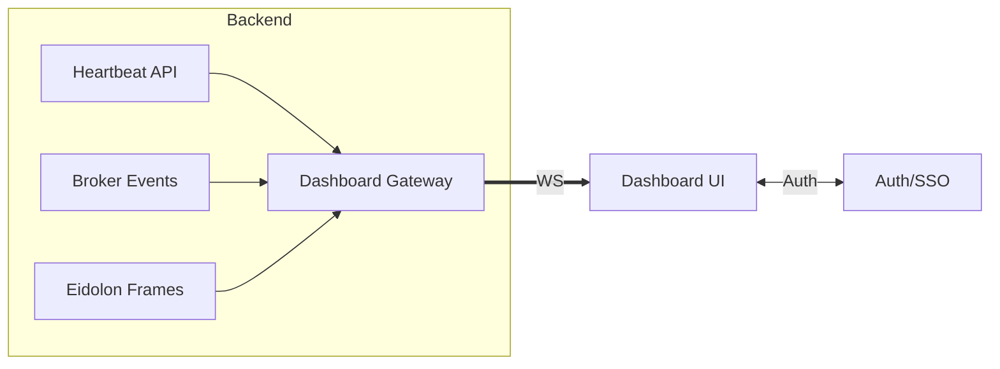

# 🛠️ Description

Build a **real‑time system dashboard** that gives an at‑a‑glance view of Promethean’s state:

* **Health metrics** per service CPU, mem, NPU/GPU, net I/O, uptime, heartbeat status
* **Eidolon field visualizations** live/paused, scalar & vector field views, probes
* **Broker message graph** services/agents as nodes, topics/queues as edges; volume, latency

The dashboard must be low‑latency, drill‑down friendly, and safe for on‑stream viewing with redaction modes.

---

# 🎯 Goals

* Single pane of glass for **status, performance, and cognition**.
* Interactive **visual diagnostics** for Eidolon fields.
* Real‑time **message‑passing graph** to spot bottlenecks and dead letters.
* Clear **alerts** and **SLO** views healthy / degraded / failing with drill‑downs.

---

# 📦 Requirements

* [ ] **Data collection**

  * Pull from Heartbeat service liveness, CPU/mem/net/NPU/GPU.
  * Subscribe to broker events publish/consume, queue depth, latency, error counts.
  * Eidolon field snapshots/streams downsampled vector/scalar tiles.
* [ ] **Transport**

  * WebSocket channels for push updates (metrics, broker events, field frames).
  * Backpressure + client rate limiting; replay window for last N minutes.
* [ ] **UI/UX**

  * Cards for per‑service health; sparkline trends; quick filter/search.
  * Broker **graph view** force‑directed / dagre with edge thickness by throughput, color by error rate.
  * Eidolon **field viz**: toggle scalar heatmap vs vector quiver/flow; pause, step, record GIF/MP4.
  * Global status bar with SLO indicators; alert drawer with acknowledge/assign.
  * Redaction mode hide secrets/paths/IDs; show aggregates only.
* [ ] **Controls**

  * Time window (live, 1m, 5m, 15m) and playback scrubber.
  * Per‑service drill‑down (logs tail link, last incidents, config snapshot).
  * Broker filters (by topic, service, severity, error type).
* [ ] **Persistence & History**

  * Optional metrics store Prometheus/OpenTelemetry/Timeseries for trends & SLOs.
  * Event archive for incident review.
* [ ] **Security**

  * Auth (token or SSO) and RBAC (viewer, operator, admin).
  * CORS and origin pinning; redaction by role.

---

# ✅ Acceptance Criteria

* p95 UI update latency **< 500 ms** for new broker messages & health ticks.
* Broker graph reflects **topic throughput** changes within the selected window; node hover shows CPU/mem & queue depth.
* Eidolon field renders **≥ 20 FPS** at default resolution (downsampled), with pause/step working.
* **Alerts** raised when:

  * Service heartbeat missing > timeout
  * Queue depth exceeds threshold
  * Error rate spikes > threshold
* Redaction mode hides secrets/IDs and any PII paths; screenshot‑safe.

---

# 📋 Subtasks

* [ ] **Back‑end gateway** Node/TS: unify heartbeat, broker, and eidolon feeds → WS topics.
* [ ] **Metrics adapters**: heartbeat → metrics DTO; broker → graph events; eidolon → frame tiles.
* [ ] **Schema**: define WS message types and versioning.
* [ ] **Front‑end shell** (React, Tailwind, shadcn): layout, theming (dark‑first), auth gate.
* [ ] **Health cards** + service table with sorting, filters, sparklines.
* [ ] **Broker graph** force simulation; zoom/pan; edge bundling; tooltips; filters.
* [ ] **Eidolon viz** WebGL/Canvas: scalar heatmap + vector field; controls.
* [ ] **Alerts system** thresholds, rules, acknowledge/assign; toast + drawer.
* [ ] **Redaction layer** + role‑based routes.
* [ ] **Timeseries storage** (optional, feature‑flagged) + SLO pages.
* [ ] **E2E hook** to open logs/links in existing ops tools.

---

# 🔌 Data Sources & APIs

* Heartbeat service: `/heartbeats` + WS; includes pid, name, uptime, CPU/mem/net, limits, status.
* Broker: WS tap on publish/consume; queue depth; delivery latency; errors.
* Eidolon field service: streaming frames (binary tiles) or periodic PNG/JSON with vectors.
* Auth: JWT/OAuth2 (configurable).

---

# 🧱 Message Schemas (WS examples)

```json
// health.tick
{
  "t": "health.tick",
  "ts": 1712345678,
  "svc": "stt",
  "cpu": 0.41,
  "mem": 512e6,
  "npu": 0.32,
  "gpu": 0.05,
  "net": {"rx": 20480, "tx": 40960},
  "state": "online"
}
```

```json
// broker.edge
{
  "t": "broker.edge",
  "ts": 1712345679,
  "src": "stt",
  "dst": "cephalon",
  "topic": "transcript.partial",
  "rate": 120,          
  "latency_ms": 18,
  "errors": 0
}
```

```json
// eidolon.frame (metadata for tiled payload)
{
  "t": "eidolon.frame",
  "ts": 1712345680,
  "layer": "uptime",
  "mode": "vector|scalar",
  "tileId": "a1b2",
  "w": 256,
  "h": 256,
  "byteLength": 65536
}
```

---

# 🧭 Architecture



---

# 🧰 Implementation Notes

* **Front‑end**: React + Tailwind + shadcn/ui; broker viz via **d3‑force** or **Cytoscape.js**; Eidolon via **PixiJS** or raw WebGL (regl).
* **Back‑end**: Node/TS WS gateway; fast JSON (uWebSockets.js or ws); optional **OpenTelemetry** export.
* **Perf**: binary frames for fields; delta compression; requestAnimationFrame for render loop.
* **Testing**: mocked WS server; time‑travel playback for deterministic tests; visual regression with Playwright.

---

# 🔒 Security & Access

* Roles: `viewer` (redacted), `operator` (full metrics), `admin` config/alerts.
* Signed URLs for frame tiles; CORS allowlist.
* No raw PII; redact paths/IDs; configurable data retention.

---

# 📈 Metrics & SLOs

* UI p95 update latency; dropped‑frame % for viz.
* Broker throughput, queue depth p95, error rate.
* Alert MTTA/MTTR.
* Eidolon viz FPS; frame decode time.

---

# 🧭 Non‑Goals (v1)

* Historical analytics beyond 24h without enabling the optional store.
* Editing service configs from the dashboard (view‑only v1).
* Deep video/stream overlays (future add‑on).

---

# ⚠️ Risks & Mitigations

* **High event volume** → server‑side sampling & client throttling.
* **Viz jank** → binary tiles + GPU rendering + decoupled render loop.
* **Secret leakage on stream** → redaction mode default; role gating; sanitized logs.

---

# 🚥 Phased Delivery

1. **MVP**: health cards + broker throughput table (no graphs), basic WS.
2. **Graph pass**: broker graph + filters + alerts.
3. **Eidolon viz**: scalar heatmap then vector flow; recording.
4. **SLO & history**: metrics store + SLO views; incident timeline.

---

#IceBox

## Notes
- Tests or documentation are missing; acceptance criteria not fully met.
- Story Points: 8

#ready
