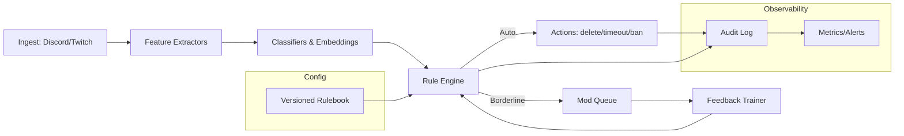

Got you. Here’s a tightened, build-ready version with the “learned rules + formal policy” vibe, plus a quick diagram.

---

## 🛠️ Description

Build a **cross‑platform automoderation service** for Discord and Twitch that:

* Enforces a **formally defined rulebook** (timeouts, mutes, deletions, bans, escalations).
* **Learns abstract patterns** of rule violations (semantic similarity, embeddings, few‑shot prompts) to generalize beyond exact keywords.
* Runs **real‑time** with human‑in‑the‑loop review for borderline cases and continuous self‑improvement.

---

## 🎯 Goals

* Ship a **single service** that moderates Discord + Twitch with shared logic and per‑platform actions.
* Maintain a **versioned rulebook** policy DSL + YAML/JSON with precedence, exceptions, and penalties.
* Achieve **low latency** <300ms decision budget for deletes/timeouts and **high precision** (minimize false positives).
* Provide **transparent logs**, appeals, and **continuous learning** from staff decisions.

---

## 📦 Requirements

* [ ] **Rulebook & Policy Engine**

  * Versioned rules (IDs, severity, actions, duration, cooldowns).
  * Composables: keyword, regex, URL/domain, user state, rate/volume, **semantic** match (embedding cosine), toxicity/NSFW scores.
  * Precedence/override, server-specific toggles, allowlists.

* [ ] **Inference & Scoring**

  * Text: toxicity/offense classifier, embeddings for semantic rule mapping, promptable LLM fallback for edge cases.
  * Images: optional NSFW/violence classifier hashing + model, OCR for text-on-image.
  * Confidence thresholds with auto, queue, or ignore routes.

* [ ] **Connectors**

  * Discord gateway & REST message create/edit, member actions.
  * Twitch chat + moderation endpoints timeouts/bans, slow/followers/sub‑only toggles.
  * Identity map (link users cross‑platform when possible).

* [ ] **Actions & Escalation**

  * Delete, warn DM/reply, timeout/mute, ban, shadowban, quarantine channel, slowmode.
  * Progressive discipline (strike system), decay over time.

* [ ] **Human Review**

  * Moderation queue for “yellow zone” events.
  * One‑click uphold/overturn that **feeds back** into thresholds and examples.

* [ ] **Observability & Safety**

  * Structured event log (decision, scores, rule IDs, evidence).
  * Metrics: FP/FN, action counts, latency, rule hit‑rates.
  * Data privacy, redaction, retention windows; per‑server audit export.

* [ ] **Ops**

  * Rate‑limit aware; retries, backoff.
  * Config hot‑reload; blue/green rule deployment.
  * E2E tests with synthetic abuse corpora.

---

## 📋 Subtasks

* [ ] Define **policy schema** YAML/JSON + parser; build rule engine (precedence, thresholds, actions).
* [ ] Implement **Discord/Twitch connectors** ingest + actions with rate‑limit handling.
* [ ] Add **feature extractors**: tokenization, URLs, mentions, caps/emoji ratios, repetition, new‑account heuristics.
* [ ] Integrate **text classifiers** + **embeddings**; wire cosine match to rule predicates.
* [ ] (Optional) Integrate **image NSFW/violence** + OCR.
* [ ] Build **moderation queue UI/CLI** approve/deny; add to training examples.
* [ ] Implement **progressive discipline** (strikes, decay, ban thresholds).
* [ ] Logging/metrics pipeline; dashboards + alerting.
* [ ] Seed **few‑shot examples** per rule; tune thresholds from pilot runs.
* [ ] Write **playbooks** (appeals, overrides, emergency lockdown).

---

## 🔗 Related Epics
```
\#framework-core
```
\#observability
```
\#multimodal-context
```
\#risk‑and‑policy

---

## 🧭 Non‑Goals (for now)

* Full multilingual coverage (start with EN; add locales iteratively).
* Deep video moderation images/text first.
* Perfect auto‑ban: keep humans in the loop for high‑impact actions.

---

## 📈 Success Metrics

* <1% confirmed false positives on auto actions.
* p95 decision latency <300ms for text, <700ms if image scoring enabled.
* ≥70% of incidents handled automatically without staff intervention after tuning.

---

## 🧩 Architecture (high level)



If you want, I can spin this into a canvas-ready policy DSL starter schema + a few exemplar rules so you can start committing rules immediately.
#IceBox


