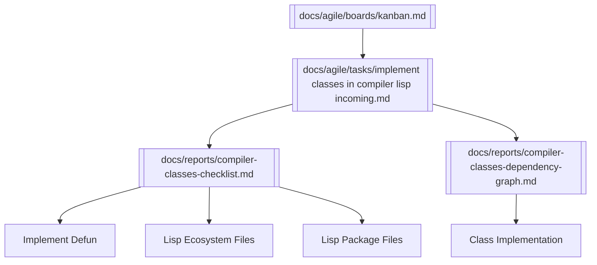

# 🧩 Knowledge Graph — Lisp `defclass`

This graph connects the artifacts related to implementing `defclass` in the Lisp compiler.

---

## 🔗 Obsidian Graph View

---

## 📝 Notes
- **Kanban board** → task → reports flow.
- **Checklist** = detailed subtasks.
- **Dependency graph** shows relation to `defun`, ecosystem, packages.
- This task completes the **OO foundation** for Promethean Lisp.

---

> 🌐 Use this file in Obsidian to visualize the `defclass` initiative and its role in the Lisp compiler roadmap.