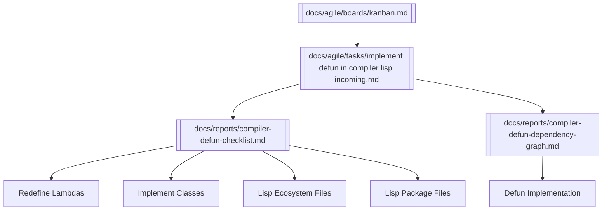

# 🧩 Knowledge Graph — Lisp `defun`

This graph connects the artifacts related to implementing `defun` in the Lisp compiler.

---

## 🔗 Obsidian Graph View

---

## 📝 Notes
- **Kanban board** links card → task → reports.
- **Task file** defines rationale + requirements.
- **Checklist** tracks substeps.
- **Dependency graph** shows relation to lambdas, classes, ecosystem, packages.

---

> 🌐 Use this file in Obsidian to visualize the `defun` initiative and its role in the Lisp compiler roadmap.