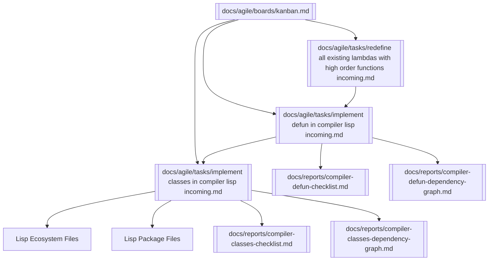

# 🧩 Knowledge Graph — Lisp Compiler Evolution

This graph connects all major tasks in the Lisp compiler evolution: lambdas, defun, classes, ecosystem, and packages.

---

## 🔗 Obsidian Graph View

---

## 📝 Notes
- **Lambda redefinition** underpins `defun`.
- **Defun** enables named functions + recursion.
- **Classes** build on `defun` and unlock OO.
- **Ecosystem + packages** depend on classes for modularity.

---

> 🌐 Use this file in Obsidian to see the **full roadmap of Lisp compiler evolution**.