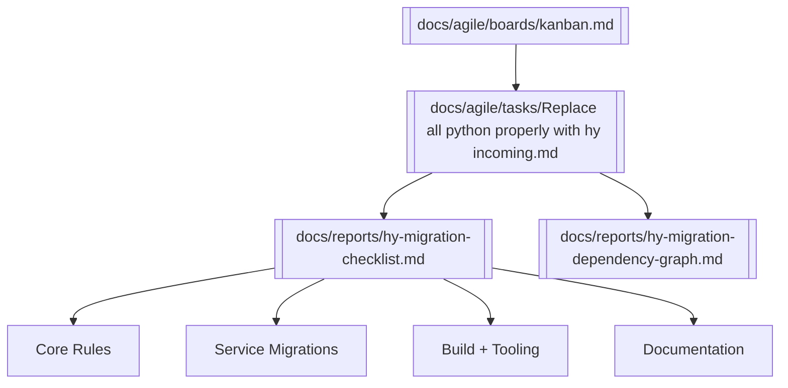

# 🧩 Knowledge Graph — Hy Migration High-Level

This graph provides a high-level overview of the Hy migration initiative.

---

## 🔗 Obsidian Graph View

---

## 📝 Notes
- **Kanban → Task → Checklist/Graph** flow captured.
- Tracks four main streams: core rules, service migrations, tooling, docs.
- Everything converges on banning Python and enforcing Hy.

---

> 🌐 Use this file in Obsidian to view the **Hy migration cluster** at a glance.