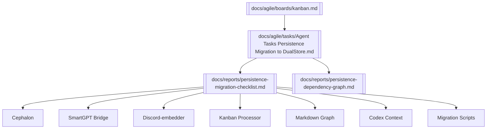

---
tags:
  - knowledge-graph 
  - dualstore 
  - migration 
  - persistence
---

# 🧩 Knowledge Graph — DualStore Migration High-Level

This graph provides a high-level overview of the persistence migration initiative.

---

## 🔗 Obsidian Graph View

---

## 📝 Notes
- **Kanban → Task → Checklist/Graph** flow captured.
- Tracks all services migrating away from raw Mongo.
- Everything converges on `DualStore` + `ContextStore`.

---

> 🌐 Use this file in Obsidian to view the **DualStore migration cluster** at a glance.