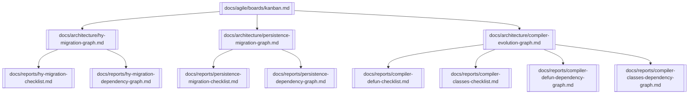

# 🧩 Master Knowledge Graph — Project Evolution

This graph connects the three major Promethean initiatives: **Hy Migration**, **DualStore Migration**, and **Lisp Compiler Evolution**.

---

## 🔗 Obsidian Graph View

---

## 📝 Notes
- This meta-graph shows **all three strategic migrations/evolutions**.
- Each major initiative links to its own subgraph cluster.
- Use this view to track Promethean’s **long-term architectural direction**.

---

> 🌐 In Obsidian, this file becomes the *strategic overview map* for Promethean’s roadmap.