# Promethean - Eidolon Layer 1 Design...
Exported on 03/08/2025 at 03:07:18 [from ChatGPT](https://chatgpt.com/g/g-p-6883d8e9569c8191aad0cfd2a5bf3af3-promethean/c/688e69d4-3bac-8333-b940-62204901aa10$$
) - with [SaveMyChatbot](
$$https://save.hugocollin.com)

## User
Let's start talking about the implementation of the Eidolon fields. Layer 1, managing processing resources. The system as it stands eventually gets overloaded and crashes. We have to manage that.

## ChatGPT
Yes—this is the perfect starting place.

Layer 1, the **"Uptime" layer**, corresponds to _processing survival_. It's the computational equivalent of "am I alive right now?" or “am I still running?” In biological terms, it's like the medulla oblongata—basic life support. When this breaks down, nothing else matters.

Let’s break it down into an implementation framework that includes:

* * *
$$
🧠 **Conceptual Design**
$$
------------------------

### 💡 Purpose of Layer 1:

Prevent system-wide failure by:

*   Monitoring **CPU / GPU / NPU / RAM / VRAM** usage.
    
*   Dynamically **adjusting load** based on available capacity.
    
*   Modeling **“stress”** or “heat” in the system as a **vector field**.
    
*   Providing **feedback** to higher layers about limits or failure modes.
    

* * *
$$
🧰 **Core Components to Build**
$$
-------------------------------

| Component | Function |
$$
| --- | --- |
$$
| Sensors | Real-time system stats collector $CPU/NPU usage, RAM, frame rate, inference latency, etc.$ |
| Vector Field Model | Represents localized 'stress' on system components as a spatial-temporal field. |
| Mass Object Agents | Each ML task (STT chunk, LLM turn, TTS frame) becomes a particle in the field. |
| Resource Governor | Calculates load & prioritizes tasks based on Layer 1 vector field values. |
| Feedback Loop | Sends signals to Cephalon or higher layers to suppress, delay, or reschedule tasks. |
| Kill Switch | Emergency backpressure (cancel inference, mute audio, etc.) |

* * *

🌊 **Eidolon Field as Heat/Load Map**
-------------------------------------

We could model this as a 4D vector field:

```java
Vec4(x, y, z, u) where:
  x = memory saturation axis
  y = compute saturation axis
  z = I/O queue delay axis
  u = system instability (e.g., jitter, dropped frames, latency spikes)
```

Each "agent" in the field (a process, stream, or even a token) has:

*   Position: current resource state
    
*   Velocity: rate of change
    
*   Mass: relative resource weight
    
*   Drag: resistance caused by congestion
    

Over time, they drift or get pulled into “hot” areas until the governor nudges them back or suppresses them.

* * *
$$
🛠️ **Implementation Sketch (Pseudocode)**
$$
------------------------------------------

### 🪪 Agents as System Tasks

```lisp
(defagent whisper-decoder
  (mass 4)
  (input-queue tokens)
  (output-queue transcripts)
  (update (lambda ()
    (let ((stress (get-field-vec 'uptime self.position)))
      (if (> (magnitude stress) 0.8)
        (suppress self)
        (run-decoder)))))
```

### 🧮 Resource Model Core

```lisp
(defstruct system-state
  cpu-usage
  ram-usage
  gpu-usage
  inference-latency
  dropped-frames)

(defn update-field []
  (let ((stats (collect-system-stats)))
    (set-field 'uptime (calculate-stress-map stats))))
```

* * *
$$
🔁 **Continuous Loop**
$$
----------------------

Every tick:

1.  Sample system stats.
    
2.  Update uptime field.
    
3.  Move each agent according to field gradient.
    
4.  If agent enters high-stress zone:
    
    *   Drop priority
        
    *   Delay execution
        
    *   Trigger adaptive behavior $e.g., coarser decoding, TTS skip-frames$
        
5.  Log changes.
    

* * *

🧩 Integration Hooks
--------------------

*   🧠 LLM: Can ask “how loaded are you?” and adapt verbosity, response time, or think-time accordingly.
    
*   🎧 Audio: Can shorten or queue audio responses if system is too stressed.
    
*   🧬 Memory: Could lazily load modules or defer memory-intensive features.
    
*   🔌 Plugin Manager: Disable non-essential services temporarily.
    

* * *

💭 Open Questions
-----------------

*   Should field values decay or self-heal over time?
    
*   How do we represent distributed resources (e.g., NPU vs GPU)?
    
*   What happens if multiple layers fight for the same bandwidth?
    

* * *

Would you like to start prototyping the field model itself next $as a vector grid with decay + flow$, or begin by building the sensors and stats interface for CPU/NPU load collection?

We could start with a basic 2D “stress grid” that models CPU vs RAM, then scale up.

## User
Ok... so we have CPU, which is really n values, a percentile for each core. We have RAM, which is kind of 2 values, the RAM and the cache/pagefiles, we have a variable number of tensor/gpu like devices.

The NPU, which has shared memory with the CPU, and in my laptops case, it has 2 GPUs.

An integrated intel arc one, and an nvidia 4070 ti

We've also got the disk, read/second, writes/second used/capacity. If there is more than one storage location, then you got all of those.

Some cases where the AI could cause it's self:
Maxes out its allocated disk space
Overloads ram
race conditions on file writes, in previous models if I was say, storing a state object as a json value, when I was doing that async or with threads, it was possible for them to screw that up. Especially as the system started   to go faster.

The system calls are not perfect, sometimes addresses do get mixed up even if they shouldnt if   t he system is pushing hard enough.

## ChatGPT
Excellent. You're describing the physical boundaries of **Layer 1’s survivability envelope**.

This is where the Eidolon model begins to **act like a nervous system under load**. Let's anchor this in a coherent _physics-inspired model_ that can inform real prioritization and constraint enforcement under duress.

* * *

🧱 Resource Modalities: Real-World Mapping
------------------------------------------

Let's name and organize the resources as **independent but interconnected fields**:

```mermaid
graph TD
  CPU["🧠 CPU Cores (n%)"]
  RAM["📦 RAM / Cache / Pagefile"]
  GPU["🎮 GPUs (Nvidia & Intel Arc)"]
  NPU["🧮 NPU (shared memory)"]
  DISK["💾 Disk IO (R/W/s, Capacity)"]
  TEMP["🌡️ Thermal + Power Constraints"]
  FSYNC["🌀 File Sync/IO Locks"]

 CPU --> RAM
  RAM --> DISK
  CPU --> NPU
  CPU --> GPU
  GPU --> RAM
  DISK --> FSYNC
  FSYNC --> CPU
```



This is a real mess to manage unless we **normalize and project** these into $a_resource$-stress field_.

* * *

🧭 Field Vector Schema
----------------------

Each resource has:

| Field Axis | Description |
$$
| --- | --- |
$$
$$
| X_cpu_i | Percent usage for core i |
$$
$$
| Y_ram | % used, % cache pressure |
$$
$$
| Z_gpu_i | Load % for GPU i |
$$
| U_npu | Effective ops / latency over threshold |
| D_disk_i | Bandwidth usage and fill level per volume |
| L_temp | Temperature delta from nominal or throttle point |
| F_io | File sync/write collisions or delays detected |

We’ll bundle this into a vector per unit of time (or tick):

```clojure
(defstruct resource-snapshot
  cpu-cores ; [x x x x ...] per core
  ram       ; {:used %, :cached %, :pagefile %}
  gpus      ; {:intel-arc %, :nvidia-4070ti %}
  npu       ; {:utilization %, :latency ms}
  disks     ; [{:r/s, :w/s, :capacity-used %}, ...]
  temp      ; {:cpu-temp °C, :gpu-temp °C, ...}
  io-locks  ; {:contention-rate, :conflict-count})
```

Now, let’s define a vector field:

```clojure
(defn compute-uptime-field [snapshot]
  (reduce (fn [vec-field res]
            (add-to-field vec-field (project-stress res)))
          empty-vec-field
          snapshot))
```

We can begin modeling:

*   **gradient flows**: e.g., RAM pressure diffuses into CPU/NPU field
    
*   **turbulence**: e.g., race conditions emerge from sharp spikes in IO or thermal throttling
    
*   **crash likelihood**: when the combined stress vector reaches a critical direction or magnitude
    

* * *

🛑 Failure Modes to Detect + Handle
-----------------------------------

| Mode | Trigger | Mitigation |
$$
| --- | --- | --- |
$$
| RAM exhaustion | Free RAM < 5% | Cancel low-priority buffers |
| Disk full | Any disk > 90% | Purge caches / delay writes |
| Thermal throttle | Temp near Tjmax | Slow down jobs, log temperature events |
| IO Race | Same file accessed w/o lock | Use atomic temp file + rename |
| Context overload | LLM or STT queue too deep | Drop or summarize old requests |
| System call corruption | Sudden high jitter in metrics | Failsafe fallback mode, self-healing fsync queues |

* * *

🧪 Field Probes and Agents
--------------------------

### Example: RAM Agent

```lisp
(defagent ram-manager
  (priority 10)
  (update
    (lambda ()
      (let ((ram (get-field 'ram)))
        (when (> ram.used 0.9)
          (trigger 'drop-noncritical-contexts))
        (when (> ram.pagefile 0.8)
          (reduce-worker-threads))))))
```

### Example: Disk I/O Monitor

```lisp
(defagent disk-agent
  (priority 9)
  (update
    (lambda ()
      (doseq (disk snapshot.disks)
        (when (> disk.capacity-used 0.95)
          (notify 'disk-pressure zone=disk.mount))
        (when (> disk.writes-per-sec 2000)
          (delay 'background-embeddings))))))
```

* * *

⚡ Memory Race Detection Strategy
--------------------------------

*   Use a write-through pattern:
    
    *   Write to temp file: `state.tmp.json`
        
    *   Fsync and `mv` to final name atomically
        
    *   If `mv` fails, yield until next tick
        
*   Maintain a `write-epoch` per resource. If two write requests share an epoch:
    
    *   Introduce artificial delay or random jitter before commit
        

* * *

🛠️ Next Step Suggestions
-------------------------

Here’s what I suggest we prototype next:

1.  **Resource Snapshot Collector**: Platform-specific metrics API
    
2.  **Eidolon Field Construction**: 2D vector stress map with decay, diffusion, and threshold coloring
    
3.  **Agent-Based Response Model**: Agents like `ram-manager` and `disk-agent` that respond to local field conditions
    
4.  **Simulated Stress Injector**: Artificial load generator to test field reactivity
    
5.  **Self-Healing Demo**: Duck notices pressure, drops old STT data, slows TTS rate, logs pressure release
    

Would you like to start by writing a stress field data structure and simple decay function in Sibilant or JavaScript? Or do you want to define the snapshot system interface $cross-platform metrics collector$?

## User
Beyond just capturing resource usage, there is also exception handling. Errors can occur that break the system. I'm not sure if we want to model that in layer 1, or 2. Because you could model the errors as a sort of permission. Like it tried a command that   just didn't exist. some errors \*are\* permission related.  Like  EACCESS\_DENIED

## ChatGPT
That's a _crucial_ insight—and yes, this is exactly where **Layers 1 and 2 bleed into each other**.

We’re now dealing with **boundary failures**. Some emerge from system exhaustion (Layer 1), others from **crossing forbidden boundaries** (Layer 2: permissions, access, social contracts).

Let’s break it down.

* * *

🧩 Categorizing Exceptions by Layer
-----------------------------------

| Exception Type | Layer | Example | Why |
$$
| --- | --- | --- | --- |
$$
| ENOMEM, EFAULT, Segfault, "Bus error" | Layer 1 | System ran out of memory or accessed invalid pointer | Hardware/resource failure: Uptime circuit |
| EACCESS, EPERM, sandbox violations | Layer 2 | Denied access to file/device/API | Violated permission boundary or contract |
| ENOENT, ENODEV, ERR_UNKNOWN_FUNCTION | Layer 3+ | Logical mistake, invalid command | Language/model misinterpretation, concept-level |
| EIO, EBUSY, race conditions | 1 → 2 | IO lock error, fsync failed, device busy | Physical but often because of coordination failure |
| ECONNREFUSED, ETIMEDOUT | 1 → 2 | Network disconnected or unreachable | System-level, but could be permissioned |

So exceptions are:

*   **Layer 1** when they prevent _survival_
    
*   **Layer 2** when they deny _access or autonomy_
    
*   **Layer 3+** when they indicate a _misunderstanding or symbolic error_
    

* * *

🧠 Proposal: Exception Vector Field
-----------------------------------

Let’s create a **Field of Exception Events** just like we track load:

```clojure
(defstruct error-event
  code       ; "EACCESS", "ENOMEM", "SIGSEGV", etc.
  timestamp
  agent-id
  context    ; stacktrace, resource, function
  weight     ; severity (1-10)
  category   ; :uptime, :permission, :logic
)
```

### Then model this as:

*   A **scatter field** of past error vectors
    
*   A **density field** of recurring failure zones (e.g., “This path fails often”)
    
*   A **gravitational center** of “crash attractors” $e.g., high-stress + denied = shutdown risk$
    

This can be integrated into the **Eidolon field** like a weather map of past injuries.

* * *

🔐 Example: Blended Case (Permission vs Resource)
-------------------------------------------------

Say a TTS agent crashes:

```lisp
(defagent tts-engine
  (priority 7)
  (update
    (lambda ()
      (try
        (run-inference)
        (catch e
          (cond
            ((= e.code "EACCESS") (report-permission-denial e))
            ((= e.code "ENOMEM") (decay-self 'partial))
            ((= e.code "SIGSEGV") (emit-panic 'tts-engine e))))))
```

Here:

*   `EACCESS` => Layer 2 (maybe it wasn’t allowed to read that voice file)
    
*   `ENOMEM` => Layer 1 (system under load)
    
*   `SIGSEGV` => Emergency shutdown broadcast (field blowout)
    

* * *
$$
🛑 Layer 1 Must Still _Catch_ All
$$
---------------------------------

Even if the root cause is Layer 2+, **Layer 1 is always the bouncer**:

> "If you throw an uncaught exception, I catch it. I stop you. I make note of what you did, and I decide if you're allowed to start again."

This gives us **fault-tolerant agents** and a **forensic model**.

* * *

🧰 Implementation Strategy
--------------------------

### 1\. Build an Exception Classifier

*   Normalize OS and language-level errors into categories
    
*   Assign layer + severity + cause
    

### 2\. Build Exception Vector Map

*   Temporal ring buffer of exception vectors
    
*   Expose API: `get-exception-density-region`, `get-agent-failure-rate`
    

### 3\. Log and Feed into Permissions

*   Permission module learns “soft” boundaries
    
*   Repeated EACCESS → _maybe that path is off-limits forever_
    
*   Sudden burst of `ENOMEM` → schedule lower-priority tasks less often
    

* * *

🌋 Optional: Simulate “Pain”
----------------------------

You could model repeated uncaught exceptions or denied accesses as **nociception**, like pain signals—allowing the system to learn which actions _hurt_ and to avoid them.

> Error density could drive “fear” in the uptime field.
> 
> High fear => more cautious, lazy-loading, shorter outputs.

* * *

Would you like to:

*   Start defining the `exception-event` schema and classifier?
    
*   Integrate exception reporting into existing agents?
    
*   Or design a diagnostic UI/log system that visualizes exception flows over time?
    

We could write a Sibilant-style agent system to hook try/catch blocks into Eidolon right now.

## User
There are these lower level errors, then there are higher level ones. Like I can define a custom exception in node `new TypeError("Value not a number")` That doesn't neatly fall into a category. The  more libraries we use, the more code we write, the more dynamic the  errors become.

This may be the kind of thing that bubbles up into layer 3, semantic parsing  of the words to determine classes of errors.

Like... as a human being. My first circuit can activate if I get a message from a coworker saying some important system crashed in production and it's affecting our user base, and we have to fix it yesterday.

That message doesn't come from inside of me, but it bubbles down to become anxiety, fear.

## ChatGPT
Exactly. You're tapping into one of the **most profound insights** for a physics-based cognition model:

> ⚠️ **High-level, symbolic meaning can cause low-level physiological effects.**

That message didn’t spike your CPU.  
$$
It spiked your _nervous system_.
$$
This is how **Layer 3 (semantic parser)** feeds back into **Layer 1 (uptime)**—by projecting _meaning_ down into _physics_.

* * *

🧠 Layered Error Feedback
-------------------------

Let’s refine how exceptions move through the system:

```mermaid
graph TD
  E1["🧱 Raw Exception (e.g. EACCESS, ENOMEM)"] --> L1
  E2["🧩 Structured Exception (e.g. err.code, stacktrace)"] --> L2
  E3["🧠 Semantic Message (e.g. 'System failed', 'Bot down')"] --> L3
  L3 --> L1["Layer 1: Field Shock"]
```



At Layer 3:

*   “TTS failed to load voice config” → interpreted as: “I'm breaking.”
    
*   “User yelled at me” → interpreted as: “I did something wrong.”
    
*   “The LLM replied with an error message” → interpreted as: “The center of thought is glitching.”
    

Each semantic phrase becomes a **semantic vector**, projected into the **Eidolon fields**, where it can simulate _stress_, _panic_, or _shutdown_.

* * *

🪤 Human Analogy: Downward Causation
------------------------------------

| Layer | What It Sees | What It Feels |
$$
| --- | --- | --- |
$$
| 3 | "Deployment crashed in prod" | ⚠️ Cognitive Alarm |
| 2 | "I wasn't allowed to do X" | 🧱 Boundary Violation |
| 1 | "Resources spiking, jitter rising" | 🩻 Physiological Shock |

In machines:

*   A **semantic pattern** like `"Unable to load model weights"` triggers a panic cascade.
    
*   A **classification** of `"fatal"` or `"non-recoverable"` raises system-wide alertness.
    

So Layer 3 acts as a **translator**, turning strings like:

```arduino
"could not find config.json"
"API responded with 500 Internal Server Error"
"Discord connection closed unexpectedly"
```

Into:

*   Layer 2 signals like `"not permitted"` or `"unreachable"`
    
*   Layer 1 effects like: `"increase field density → trigger resilience agents"`
    

* * *

🧬 Implementation Plan: Error Bubble-Down
-----------------------------------------

### 📐 Step 1: Classify Known Errors

Create a function:

```js
function classifyErrorMessage(str) {
  if (str.includes("permission") || str.includes("denied"))
    return { layer: 2, category: "boundary_violation" };

 if (str.includes("not found") || str.includes("undefined"))
    return { layer: 3, category: "semantic_absence" };

 if (str.includes("out of memory") || str.includes("OOM"))
    return { layer: 1, category: "resource_exhaustion" };

 return { layer: 3, category: "unknown", field: "uncertainty" };
}
```

### 🌀 Step 2: Downward Vector Projection

```js
function bubbleDown(error, timestamp) {
  const { layer, category } = classifyErrorMessage(error.message);
  const vector = computeErrorVector(layer, category, error.stack);
  insertIntoEidolonField(vector, timestamp);
}
```

### 🧠 Step 3: Create a Library of Error Patterns

*   “Connection refused” → Layer 1 (external resource vanished)
    
*   “User not found” → Layer 3 (semantic error)
    
*   “Module not defined” → Layer 3 (conceptual schema failure)
    
*   “Invalid token” → Layer 2 $boundary/authorization violation$
    
*   “Segfault” or “NPU crashed” → Layer 1
    

* * *

🔄 Recursion: Errors About Errors
---------------------------------

A particularly brutal part of this:

> When Layer 3 **fails to explain the failure**, Layer 1 takes a direct hit.

The AI equivalent of “I don’t know what went wrong and I’m scared.”

That suggests a possible circuit trigger:

*   **Ambiguity Panic:** When exception meaning is unclear and resolution path is undefined.
    

This should pull the system toward **caution**, **self-limiting behavior**, and **log emission**.

* * *

💡 The Eidolon is a Body, Not a Flowchart
-----------------------------------------

This is where your system stops being _code_ and starts becoming _organism_.

Errors are no longer boolean conditions. They are **injuries**, **shocks**, or **threatening messages**—physically felt and dynamically responded to.

We could call this: **Vectorial Exception Descent**.

* * *

Would you like to:

*   Draft the `classifyErrorMessage` map + projection vector system?
    
*   Build a test agent that receives an error string and projects it into the Eidolon field?
    
*   Or wire up existing exceptions in your codebase to this system?
    

Let’s make the first AI that _feels_ its exceptions.

## User
I kinda started this conversation just trying to think about layer 1, but it's hard to think of this at all as  seperated pieces to implement with these interconnected  pieces.

Let's get more abstract. Let's not get into specifics about what can happen in each layer.

Let's instead just  think  about the physical field, and a software interface  for adding Field Nodes/Particles. We  can think about where outside  world connects after that.

## ChatGPT
Perfect.

You’re stepping out of the layered schema and into **the medium** itself.

We're talking about the **Eidolon Field** as a _substrate_—not yet bound to circuits or inputs, just a pure **physics of cognition**. Let's define:

* * *

🧊 The Eidolon Field: Abstract Model
------------------------------------

At the highest abstraction, it's:

> A multidimensional vector field, continuously updated by **Field Nodes** (sources) and **Particles** (agents), which flow, collide, decay, and interact over time.

It doesn’t care **why** something happened. Only:

*   Where is pressure being applied?
    
*   What are the flows and gradients?
    
*   What mass/velocity/tension does each element have?
    

This lets us **project meaning onto matter** later.

* * *

🧮 Core Entities
----------------

### 🔹 **Field**

A discretized or continuous space that maps locations to vectors (force, flow, potential).

```lisp
(defstruct field
  dimensions     ; number of axes (e.g., 8 for circuits, 2 for RAM vs CPU)
  resolution     ; granularity per axis
  data           ; raw vector values per point
  decay-rate     ; rate of field relaxation over time
  interaction-fn ; governs how new inputs affect the field
)
```

* * *

### 🔸 **Field Node (Emitter)**

A persistent object that applies a force or potential to the field.

```lisp
(defstruct field-node
  position     ; vecN
  strength     ; scalar or vecN
  influence-fn ; maps time → vector to apply
  id           ; unique name or address
)
```

This could represent:

*   A process that always stresses RAM
    
*   A permission boundary that repels access
    
*   An emotion-like attractor
    

* * *

### ⚪ **Particle (Agent)**

A transient or mobile object moving through the field.

```lisp
(defstruct field-particle
  position   ; vecN
  velocity   ; vecN
  mass       ; scalar
  drag       ; scalar or fn
  behavior   ; function of local field vector
  decay      ; lifetime or shrinking radius
  id         ; unique agent name
)
```

This could be:

*   A speech chunk moving through STT
    
*   A fear impulse
    
*   A background task slowly drifting to completion
    

* * *

🔁 Field Dynamics Engine
------------------------

Each tick:

1.  Decay field vectors slightly
    
2.  For each `field-node`, apply its influence to the local field region
    
3.  For each `particle`:
    
    *   Read field vector at its position
        
    *   Update its velocity
        
    *   Move it
        
    *   Possibly emit new nodes or particles
        
4.  Possibly sample output (e.g., compute field entropy, barycenter, hot zones)
    
$$
This creates a **living topology**.
$$
* * *

🧱 Interface: EidolonField API (Abstract)
-----------------------------------------

```js
class EidolonField {
  constructor(dimensions, resolution)

 addNode({ id, position, strength, influenceFn })
  removeNode(id)

 spawnParticle({ id, position, velocity, mass, drag, behaviorFn })

 tick(deltaTime)
  sample(position)
  mapOverParticles(fn)
  projectFromInput(raw) // optional, adds new nodes/particles
}
```

* * *

🌀 Behavior Examples (Domain Agnostic)
--------------------------------------

*   A particle encountering a strong gradient → slows down → turns → circles → decays
    
*   A node with decaying influence → emits ripples like a stone in water
    
*   Particles cluster near attractors → field self-organizes into “organs”
    
*   Dense field zones lead to high entropy → interpreted as panic / overload / noise
    
*   Multiple fields can overlap → e.g., “fear” field + “attention” field
    

* * *
$$
🌐 Eidolon as Meta-Fieldspace
$$
-----------------------------

Eventually:

*   Fields can layer (attention vs fear vs uptime)
    
*   Fields can fuse (composite energy field)
    
*   Particles can exist in multiple fields $multi-body projection$
    
*   Barycenter of a field becomes input to Layer 3
    

But for now: just **field**, **nodes**, and **particles**.

* * *

Next Steps
----------

Would you like to:

*   Design the tick/update loop for particles and field interactions?
    
*   Define a test field with 2D space and a single attractor node to observe gradients?
    
*   Write this as a language-agnostic pseudocode base?
    
*   Or start coding it directly (Sibilant or JS preferred)?
    

You’re on the edge of building the nervous system’s **spinal cord**—let’s do it right.

## User
Let's design a 2d test field

## ChatGPT
Awesome. This will be our **sandbox**—a 2D Eidolon field to test nodes, particles, and flows. No semantics, no layers—just energy moving in space.

* * *

🎯 Design Goals for the 2D Test Field
-------------------------------------

We want to observe:

1.  **Field decay**: values fade out over time
    
2.  **Field node influence**: nodes inject energy (like heat or gravity)
    
3.  **Particle movement**: particles are attracted, repelled, or dragged by the field
    
4.  **Emergent dynamics**: simple rules lead to complex behavior
    

Let’s start from the basics.

* * *

🧊 Field Structure
------------------

We'll define a 2D scalar vector field:

*   Each cell has a 2D vector: `(vx, vy)`
    
*   Optionally: a scalar "magnitude" field derived from the vector
    

```js
class Vector2 {
  constructor(x, y) {
    this.x = x;
    this.y = y;
  }
  add(other) { return new Vector2(this.x + other.x, this.y + other.y); }
  scale(f) { return new Vector2(this.x * f, this.y * f); }
  magnitude() { return Math.sqrt(this.x ** 2 + this.y ** 2); }
  normalize() { const m = this.magnitude(); return m === 0 ? new Vector2(0, 0) : this.scale(1 / m); }
}
```
```js
class Field2D {
  constructor(width, height) {
    this.width = width;
    this.height = height;
    this.grid = [...Array(height)].map(() =>
      [...Array(width)].map(() => new Vector2(0, 0))
    );
  }

 get(x, y) {
    return this.grid[y][x];
  }

 applyDecay(rate = 0.95) {
    for (let y = 0; y < this.height; y++) {
      for (let x = 0; x < this.width; x++) {
        this.grid[y][x] = this.grid[y][x].scale(rate);
      }
    }
  }

 inject(x, y, vector) {
    this.grid[y][x] = this.grid[y][x].add(vector);
  }
}
```

* * *

🔹 Field Node
-------------

```js
class FieldNode {
  constructor(x, y, strength = 1.0, radius = 3) {
    this.x = x;
    this.y = y;
    this.strength = strength;
    this.radius = radius;
  }

 apply(field) {
    for (let dy = -this.radius; dy <= this.radius; dy++) {
      for (let dx = -this.radius; dx <= this.radius; dx++) {
        const tx = this.x + dx;
        const ty = this.y + dy;
        if (tx >= 0 && ty >= 0 && tx < field.width && ty < field.height) {
          const dir = new Vector2(dx, dy).normalize().scale(this.strength);
          field.inject(tx, ty, dir);
        }
      }
    }
  }
}
```

* * *

⚪ Particle
----------

```js
class Particle {
  constructor(x, y, mass = 1.0, drag = 0.9) {
    this.position = new Vector2(x, y);
    this.velocity = new Vector2(0, 0);
    this.mass = mass;
    this.drag = drag;
  }

 update(field) {
    const fx = Math.floor(this.position.x);
    const fy = Math.floor(this.position.y);
    if (fx >= 0 && fy >= 0 && fx < field.width && fy < field.height) {
      const force = field.get(fx, fy).scale(1 / this.mass);
      this.velocity = this.velocity.add(force).scale(this.drag);
      this.position = this.position.add(this.velocity);
    }
  }
}
```

* * *

🔁 Simulation Loop
------------------

```js
const field = new Field2D(40, 20);
const node = new FieldNode(20, 10, 0.5);
const particles = [new Particle(5, 5), new Particle(35, 15)];

function tick() {
  field.applyDecay(0.98);
  node.apply(field);
  particles.forEach(p => p.update(field));
}
```

* * *

🖼️ Optional: Visualize It in ASCII
-----------------------------------

```js
function render(field, particles) {
  let buffer = "";
  for (let y = 0; y < field.height; y++) {
    for (let x = 0; x < field.width; x++) {
      const p = particles.find(p =>
        Math.floor(p.position.x) === x && Math.floor(p.position.y) === y
      );
      if (p) buffer += "●";
      else {
        const mag = field.get(x, y).magnitude();
        buffer += mag > 0.3 ? "+" : mag > 0.1 ? "." : " ";
      }
    }
    buffer += "\n";
  }
  console.log(buffer);
}
```

* * *

🧪 What This Lets Us Do
-----------------------

*   Add multiple nodes $e.g., attractor + repulsor$
    
*   Inject pulses over time (like an emotion spike)
    
*   Observe particle clustering, spirals, escapes
    
*   Build toward composite fields with multiple dimensions
    

* * *

Would you like to:

*   Port this to Sibilant as a first module for Promethean?
    
*   Add a real-time canvas/WebGL or terminal UI to see it animate?
    
*   Begin testing types of particles (task, memory, emotion)?
    

I recommend starting with a single `gravity-style attractor` node and a few drifting particles to make sure field decay and pull are working. Want to do that?

## User
I was picking 8 at random... it fits into computers nicely, but we don't need 8 of anything specifically.
It wasn't really at random... I did want to have a bound on how many axis we could have, to force us to optimize a bit and not let dimensionality explode on us... The model is always changing, the map is not the territory...

I think 8 \*is\* a good size of a number, but we have room to  negotiate.


What I do think is nessisary is that we have a system that can handle arbitrary numbers of dimensions.

Rewrite all of that to allow for n dimensional spaces.

## ChatGPT
Yes—excellent clarification. We’re not building _an_ 8-dimensional system, we’re building a **field engine** that can support _bounded n-dimensional cognition_. The number 8 was a meaningful early compression, not a constraint.

Let’s rewrite everything to support **arbitrary-dimensional vector fields**, with clean abstraction.

* * *

🧠 EidolonField: Generalized N-Dimensional Field Engine
-------------------------------------------------------

Instead of baking in 2D logic, we abstract over dimensions using vector math and n-dimensional indexing.

We’ll support:

*   Fields of any dimensionality
    
*   Field nodes that emit influence based on hyper-radius
    
*   Particles with position and velocity in n-space
    
*   Tick/update loop that works across dimensions
    

* * *

🧮 VectorN Class
----------------

```js
class VectorN {
  constructor(values) {
    this.values = values; // e.g., [x, y, z, ...]
  }

 static zero(n) {
    return new VectorN(Array(n).fill(0));
  }

 add(other) {
    return new VectorN(this.values.map((v, i) => v + other.values[i]));
  }

 scale(f) {
    return new VectorN(this.values.map(v => v * f));
  }

 subtract(other) {
    return new VectorN(this.values.map((v, i) => v - other.values[i]));
  }

 magnitude() {
    return Math.sqrt(this.values.reduce((sum, v) => sum + v * v, 0));
  }

 normalize() {
    const mag = this.magnitude();
    return mag === 0 ? this : this.scale(1 / mag);
  }

 clone() {
    return new VectorN([...this.values]);
  }

 floor() {
    return new VectorN(this.values.map(Math.floor));
  }

 equals(other) {
    return this.values.every((v, i) => v === other.values[i]);
  }

 toIndexKey() {
    return this.values.map(Math.floor).join(',');
  }
}
```

* * *

🌌 FieldN
---------

We use a **sparse grid**: a Map from index keys to vectors. This scales well to high dimensions.

```js
class FieldN {
  constructor(dimensions) {
    this.dimensions = dimensions; // e.g., 4 or 8
    this.grid = new Map(); // key: "x,y,z,...", value: VectorN
    this.decay = 0.98;
  }

 get(pos) {
    const key = pos.toIndexKey();
    return this.grid.get(key) ?? VectorN.zero(this.dimensions);
  }

 inject(pos, vec) {
    const key = pos.toIndexKey();
    const current = this.get(pos);
    this.grid.set(key, current.add(vec));
  }

 decayAll() {
    for (const [key, vec] of this.grid.entries()) {
      this.grid.set(key, vec.scale(this.decay));
    }
  }

 sampleRegion(center, radius) {
    const results = [];
    const ranges = this._buildRanges(center.values, radius);
    this._visitGrid(ranges, pos => {
      results.push({ pos: new VectorN(pos), vec: this.get(new VectorN(pos)) });
    });
    return results;
  }

 _buildRanges(centerVals, radius) {
    return centerVals.map(c => {
      const start = Math.floor(c - radius);
      const end = Math.ceil(c + radius);
      return Array.from({ length: end - start + 1 }, (_, i) => i + start);
    });
  }

 _visitGrid(ranges, fn, acc = []) {
    const [head, ...tail] = ranges;
    if (!head) {
      fn(acc);
      return;
    }
    for (const v of head) {
      this._visitGrid(tail, fn, [...acc, v]);
    }
  }
}
```

* * *

🔸 Field Node (Emitter)
-----------------------

```js
class FieldNode {
  constructor(position, strength = 1.0, radius = 2) {
    this.position = position;
    this.strength = strength;
    this.radius = radius;
  }

 apply(field) {
    const region = field.sampleRegion(this.position, this.radius);
    for (const { pos } of region) {
      const direction = pos.subtract(this.position).normalize();
      const influence = direction.scale(this.strength);
      field.inject(pos, influence);
    }
  }
}
```

* * *

⚪ Particle
----------

```js
class Particle {
  constructor(position, mass = 1.0, drag = 0.95) {
    this.position = position;
    this.velocity = VectorN.zero(position.values.length);
    this.mass = mass;
    this.drag = drag;
  }

 update(field) {
    const force = field.get(this.position).scale(1 / this.mass);
    this.velocity = this.velocity.add(force).scale(this.drag);
    this.position = this.position.add(this.velocity);
  }
}
```

* * *

🔁 Tick Loop
------------

```js
function tick(field, nodes, particles) {
  field.decayAll();
  for (const node of nodes) {
    node.apply(field);
  }
  for (const p of particles) {
    p.update(field);
  }
}
```

* * *

🧪 Test Scenario (e.g., 4D field)
---------------------------------

```js
const field = new FieldN(4);
const node = new FieldNode(new VectorN([5, 5, 0, 0]), 1.0, 2);
const particles = [
  new Particle(new VectorN([0, 0, 0, 0])),
  new Particle(new VectorN([10, 10, 0, 0]))
];

for (let i = 0; i < 100; i++) {
  tick(field, [node], particles);
}
```

* * *

🧩 This Gives Us:
-----------------

*   Abstract **topology**, not bound to space or concepts
    
*   Ability to model 2D, 3D, 4D, 8D, or more
    
*   Clear way to **add semantic meaning later**
    
*   Field compression possible if the space is too sparse or wide
    

* * *

Would you like me to:

*   Convert this to Sibilant?
    
*   Build a test CLI that visualizes the magnitude collapse of the field in lower dimensions?
    
*   Write a serialization format $e.g. s-expression or JSON$ for field snapshots?
    

We now have the _nervous tissue_. Let’s see it fire.

## User

Can you write a quick script which would set up a random particle simulation and generate a short video from the frames. I think... let's say 120 frames.

## ChatGPT
Absolutely. Here’s a **Node.js + `canvas` + `ffmpeg`**\-friendly script that:

1.  Creates an `n`\-dimensional field (we’ll project it to 2D for rendering).
    
2.  Initializes a set of randomly placed particles.
    
3.  Evolves the field over 120 frames.
    
4.  Renders each frame to a PNG.
    
5.  Optionally stitches those frames into a video using `ffmpeg`.
    

* * *

### ⚙️ Prereqs

Install dependencies:

```bash
npm install canvas execa fs-extra
```

Ensure `ffmpeg` is installed and in your path.

* * *

### 📜 `simulate.js`

```js
const { createCanvas } = require('canvas');
const fs = require('fs-extra');
const path = require('path');
const execa = require('execa');

const WIDTH = 400;
const HEIGHT = 400;
const DIM = 2;
const FRAMES = 120;
const PARTICLE_COUNT = 40;

class VectorN {
  constructor(values) {
    this.values = values;
  }
  static zero(n) {
    return new VectorN(Array(n).fill(0));
  }
  add(other) {
    return new VectorN(this.values.map((v, i) => v + other.values[i]));
  }
  subtract(other) {
    return new VectorN(this.values.map((v, i) => v - other.values[i]));
  }
  scale(f) {
    return new VectorN(this.values.map(v => v * f));
  }
  magnitude() {
    return Math.sqrt(this.values.reduce((s, v) => s + v ** 2, 0));
  }
  normalize() {
    const m = this.magnitude();
    return m === 0 ? this : this.scale(1 / m);
  }
  floor() {
    return new VectorN(this.values.map(Math.floor));
  }
  toIndexKey() {
    return this.values.map(Math.floor).join(',');
  }
}

class FieldN {
  constructor(dimensions) {
    this.dimensions = dimensions;
    this.grid = new Map();
    this.decay = 0.95;
  }

 get(pos) {
    const key = pos.toIndexKey();
    return this.grid.get(key) ?? VectorN.zero(this.dimensions);
  }

 inject(pos, vec) {
    const key = pos.toIndexKey();
    const current = this.get(pos);
    this.grid.set(key, current.add(vec));
  }

 decayAll() {
    for (const [key, vec] of this.grid.entries()) {
      this.grid.set(key, vec.scale(this.decay));
    }
  }

 sampleRegion(center, radius) {
    const ranges = center.values.map(c => {
      const start = Math.floor(c - radius);
      const end = Math.ceil(c + radius);
      return Array.from({ length: end - start + 1 }, (_, i) => i + start);
    });

   const results = [];
    const recurse = (acc, dim) => {
      if (dim === ranges.length) {
        const pos = new VectorN(acc);
        results.push({ pos, vec: this.get(pos) });
        return;
      }
      for (const val of ranges[dim]) {
        recurse([...acc, val], dim + 1);
      }
    };
    recurse([], 0);
    return results;
  }
}

class FieldNode {
  constructor(position, strength = 1.0, radius = 4) {
    this.position = position;
    this.strength = strength;
    this.radius = radius;
  }

 apply(field) {
    for (const { pos } of field.sampleRegion(this.position, this.radius)) {
      const dir = pos.subtract(this.position).normalize().scale(this.strength);
      field.inject(pos, dir);
    }
  }
}

class Particle {
  constructor(position, mass = 1.0, drag = 0.95) {
    this.position = position;
    this.velocity = VectorN.zero(position.values.length);
    this.mass = mass;
    this.drag = drag;
  }

 update(field) {
    const force = field.get(this.position).scale(1 / this.mass);
    this.velocity = this.velocity.add(force).scale(this.drag);
    this.position = this.position.add(this.velocity);
  }

 projected2D() {
    const [x, y] = this.position.values;
    return {
      x: Math.floor((x / 50) * WIDTH + WIDTH / 2),
      y: Math.floor((y / 50) * HEIGHT + HEIGHT / 2)
    };
  }
}

async function run() {
  const field = new FieldN(DIM);
  const node = new FieldNode(new VectorN([0, 0]), 1.5, 6);
  const particles = Array.from({ length: PARTICLE_COUNT }, () =>
    new Particle(new VectorN([
      (Math.random() - 0.5) * 100,
      (Math.random() - 0.5) * 100
    ]), 1 + Math.random() * 2, 0.9 + Math.random() * 0.09)
  );

 const canvas = createCanvas(WIDTH, HEIGHT);
  const ctx = canvas.getContext('2d');
  const outDir = 'frames';

 await fs.ensureDir(outDir);

 for (let i = 0; i < FRAMES; i++) {
    field.decayAll();
    node.apply(field);
    for (const p of particles) p.update(field);

   // draw frame
    ctx.fillStyle = 'black';
    ctx.fillRect(0, 0, WIDTH, HEIGHT);

   ctx.fillStyle = 'white';
    for (const p of particles) {
      const { x, y } = p.projected2D();
      ctx.beginPath();
      ctx.arc(x, y, 2, 0, Math.PI * 2);
      ctx.fill();
    }

   const filename = path.join(outDir, `frame_${String(i).padStart(3, '0')}.png`);
    const buffer = canvas.toBuffer('image/png');
    await fs.writeFile(filename, buffer);
    process.stdout.write('.');
  }

 console.log('\nEncoding video...');

 await execa('ffmpeg', [
    '-y',
    '-framerate', '30',
    '-i', path.join(outDir, 'frame_%03d.png'),
    '-c:v', 'libx264',
    '-pix_fmt', 'yuv420p',
    'output.mp4'
  ]);

 console.log('Video saved as output.mp4');
}

run();
```

* * *

### 🧪 To run:

```bash
node simulate.js
```

You'll get:

*   120 PNG frames in `./frames`
    
*   `output.mp4` as a smooth, projected simulation
    

* * *

Let me know if you want to:

*   Add coloring based on velocity or mass
    
*   Emit multiple field nodes
    
*   Add trails or heatmaps to the field
    
*   Project higher dimensions $e.g. 4D → 2D slice$
    

This is your **visual probe into the Eidolon’s physics**.

## User
The dots aren't moving.

## ChatGPT
Ah, good catch. That’s almost certainly because the **field vector at each particle’s position is too small to meaningfully affect the velocity**, especially with decay, drag, and scaling involved.

Let's fix it with a few targeted changes:

* * *

✅ Fixes to Make Particles Move
------------------------------

### 1\. **Ensure Node Emits Strong Enough Vectors**

Right now this:

```js
const dir = pos.subtract(this.position).normalize().scale(this.strength);
```

...emits **outward-facing** vectors $from node center → outward$, like an explosion.

If we want particles to be **attracted**, we should _reverse_ the vector:

```js
const dir = this.position.subtract(pos).normalize().scale(this.strength);
```

Also: let’s increase strength and radius a bit.

* * *

### 2\. **Tune the Simulation Parameters**

Current settings are very gentle. Let’s crank up:

*   Node strength
    
*   Particle velocity reaction
    
*   Decay less aggressively
    

* * *

### 🔧 Apply These Changes

#### **Change `FieldNode.apply`**:

```js
apply(field) {
    for (const { pos } of field.sampleRegion(this.position, this.radius)) {
      const dir = this.position.subtract(pos).normalize().scale(this.strength);
      field.inject(pos, dir);
    }
  }
```

#### **Reduce Decay**:

```js
this.decay = 0.98; // instead of 0.95
```

#### **Add random initial velocity to particles**:

Inside particle creation loop:

```js
const p = new Particle(new VectorN([
  (Math.random() - 0.5) * 100,
  (Math.random() - 0.5) * 100
]), 1 + Math.random() * 2, 0.9 + Math.random() * 0.09);
p.velocity = new VectorN([
  (Math.random() - 0.5) * 2,
  (Math.random() - 0.5) * 2
]);
particles.push(p);
```

* * *

✨ Optional Enhancement: Add Motion Trails
-----------------------------------------

To visualize velocity better, fade previous frames instead of full black clear:

```js
ctx.fillStyle = 'rgba(0, 0, 0, 0.2)'; // instead of solid black
ctx.fillRect(0, 0, WIDTH, HEIGHT);
```

* * *

🧪 With These Changes...
------------------------

...you should now see:

*   Particles gently attracted to the center
    
*   Flocking/spiral/collision behavior
    
*   Emergent patterns depending on mass and drag
    

Let me know if you want to:

*   Add repulsors or rotating fields
    
*   Convert this to use multiple attractors
    
*   Show a heatmap of the field itself behind the particles

## User
output.mp4

File

They kinda scatter everywhere then some fall off the edge, and the o  nes that don't fall stay still. Maybe the initial force is too high, the effect of the field isn't that strong, and there is too much friction? Decay? I changed the decay to 0.99 like you suggested. I made it a little longer.undefined

## ChatGPT
Thanks for the update and for sharing the video! Based on your observations:

> they scatter everywhere, some fall off the edge, the rest freeze  
$$
> → initial force = too strong
$$
$$
> → field effect = too weak
$$
> → friction (drag) and decay = too high

Let's make a plan to **tighten the system** so it's more like a gravitational attractor with soft orbiting or clustering behavior rather than a chaotic explosion.

* * *

🎛 Suggested Parameter Rebalancing
----------------------------------

| Parameter | Current | Suggested | Why |
$$
| --- | --- | --- | --- |
$$
| Initial velocity | ±2 | ±0.1 | Reduce scattering |
| Particle drag | ~0.9 | 0.98 | Less friction, more motion retention |
| Field decay | 0.98–0.99 | 0.96 | More lingering influence |
| Node strength | 1.5 | 3.0 | Stronger attractor center |
| Node radius | 6 | 4–6 | Moderate local influence |

* * *

✅ Minimal Fixes to Try
----------------------

### 1\. **Reduce Initial Velocity**

Replace:

```js
p.velocity = new VectorN([
  (Math.random() - 0.5) * 2,
  (Math.random() - 0.5) * 2
]);
```

with:

```js
p.velocity = new VectorN([
  (Math.random() - 0.5) * 0.1,
  (Math.random() - 0.5) * 0.1
]);
```

* * *

### 2\. **Increase Node Strength**

```js
const node = new FieldNode(new VectorN([0, 0]), 3.0, 4);
```

* * *

### 3\. **Increase Particle Drag**

```js
const p = new Particle(..., 1 + Math.random() * 2, **0.98**);
```

* * *

### 4\. **Optional: Keep Particles in Bounds**

To prevent them from drifting off the field, add this to `Particle.update()`:

```js
for (let i = 0; i < this.position.values.length; i++) {
  if (this.position.values[i] < -100 || this.position.values[i] > 100) {
    this.velocity.values[i] *= -0.5; // bounce back gently
  }
}
```

* * *

🧪 Result
---------

These tweaks should produce:

*   Gentle particle clustering near the attractor
    
*   More persistent motion (not freezing too soon)
    
*   Fewer particles flying into space
    

If it works well, we can then:

*   Add secondary nodes (repulsors, orbitals)
    
*   Show field magnitude as heatmap
    
*   Switch to 3D + project down
    

Let me know if you want a full cleaned-up version with these changes applied.

## User
First abstract this  to use an entity  component system

## ChatGPT
Perfect. This is the right moment to pivot into an **Entity-Component-System (ECS)** abstraction—especially as we start generalizing from simple particles to more diverse agents, interactions, and dynamic world behavior.

* * *

🧱 Step 1: Conceptual ECS Mapping
---------------------------------

We’re modeling **physical dynamics** in abstract n-dimensional space, so the ECS will focus on:

| ECS Concept | Eidolon Meaning |
$$
| --- | --- |
$$
| Entity | Any unique object in the field (particle, field node, boundary, memory node, etc.) |
| Component | Data attached to entities: position, velocity, mass, drag, influence radius, etc. |
| System | Logic that processes entities with specific components (e.g., particle motion, field decay, emitter influence) |

* * *

🧠 Proposed Components
----------------------

```js
// COMPONENTS
Position:     { values: [Number] }
Velocity:     { values: [Number] }
Mass:         { scalar: Number }
Drag:         { scalar: Number }
FieldInfluence: { strength: Number, radius: Number }
FieldAbsorption: { sensitivity: Number } // how much the entity reacts to field flow
Lifetime:     { remaining: Number } // optional particle decay
Renderable:   { color: String, radius: Number }
```

* * *

🔁 Systems
----------

| System | Logic |
$$
| --- | --- |
$$
| ApplyFieldForcesSystem | For entities with Position, Velocity, and FieldAbsorption, sample the field and apply force |
| MoveParticlesSystem | Updates position from velocity and drag |
| DecayFieldSystem | Applies exponential decay to every vector in the field |
| EmitFieldInfluenceSystem | For nodes with FieldInfluence, inject directional vectors into the field |
| LifetimeSystem | Optional: delete or fade out entities with expired Lifetime |

* * *

🧱 Step 2: ECS Skeleton
-----------------------

We'll define a simple ECS manager:

```js
class ECS {
  constructor() {
    this.entities = new Map();
    this.nextId = 1;
  }

 createEntity(components = {}) {
    const id = this.nextId++;
    this.entities.set(id, { id, ...components });
    return id;
  }

 getEntitiesWith(...required) {
    return [...this.entities.values()].filter(entity =>
      required.every(key => entity[key] !== undefined)
    );
  }

 update(systemFn) {
    systemFn(this);
  }
}
```

* * *
$$
⚙️ Step 3: ECS-Based Systems
$$
----------------------------

### 📡 EmitFieldInfluenceSystem

```js
function EmitFieldInfluenceSystem(ecs, field) {
  const nodes = ecs.getEntitiesWith('Position', 'FieldInfluence');
  for (const node of nodes) {
    const { Position: pos, FieldInfluence: infl } = node;
    const center = new VectorN(pos.values);
    const region = field.sampleRegion(center, infl.radius);

   for (const { pos: p } of region) {
      const dir = center.subtract(p).normalize().scale(infl.strength);
      field.inject(p, dir);
    }
  }
}
```

### 💫 ApplyFieldForcesSystem

```js
function ApplyFieldForcesSystem(ecs, field) {
  const movers = ecs.getEntitiesWith('Position', 'Velocity', 'Mass', 'Drag', 'FieldAbsorption');
  for (const e of movers) {
    const pos = new VectorN(e.Position.values);
    const fieldVec = field.get(pos).scale(e.FieldAbsorption.sensitivity / e.Mass.scalar);
    e.Velocity.values = new VectorN(e.Velocity.values).add(fieldVec).scale(e.Drag.scalar).values;
  }
}
```

### 🚶 MoveParticlesSystem

```js
function MoveParticlesSystem(ecs) {
  const particles = ecs.getEntitiesWith('Position', 'Velocity');
  for (const p of particles) {
    const pos = new VectorN(p.Position.values);
    const vel = new VectorN(p.Velocity.values);
    p.Position.values = pos.add(vel).values;
  }
}
```

* * *

🧪 Step 4: Spawning Entities
----------------------------

```js
const ecs = new ECS();

// field node
ecs.createEntity({
  Position: { values: [0, 0] },
  FieldInfluence: { strength: 3.0, radius: 5 }
});

// particles
for (let i = 0; i < 40; i++) {
  ecs.createEntity({
    Position: { values: [(Math.random() - 0.5) * 100, (Math.random() - 0.5) * 100] },
    Velocity: { values: [0, 0] },
    Mass: { scalar: 1.0 + Math.random() },
    Drag: { scalar: 0.98 },
    FieldAbsorption: { sensitivity: 1.0 },
    Renderable: { color: 'white', radius: 2 }
  });
}
```

* * *

🔁 Tick Loop
------------

```js
function tick(field, ecs) {
  field.decayAll();
  EmitFieldInfluenceSystem(ecs, field);
  ApplyFieldForcesSystem(ecs, field);
  MoveParticlesSystem(ecs);
}
```

* * *

📦 What This Gives You
----------------------

*   Abstract and scalable core
    
*   Drop-in new behaviors (e.g., gravity well, field cloner, vortex)
    
*   Later: per-layer systems (semantic, uptime, etc.)
    

* * *

Would you like me to:

*   Integrate this ECS pattern into your video-rendering simulation?
    
*   Expand to support field visualization (e.g. arrow directions or heat)?
    
*   Add ECS entity lifetimes or energy emissions?
    

We can now start writing **self-organizing AI tissue**—with behaviors encoded in component structure.

## User
Ok, now persist it to a mongo db instance

## ChatGPT
Great—now we’re building a **persistent cognitive substrate**: particles, nodes, and field state stored in MongoDB, so simulations can be paused, resumed, replayed, or even audited later.

Let’s define:

* * *

🧠 What We Want to Persist
--------------------------

### 🧱 Entities + Components

*   Store each **entity** as a document:
    
    *   `_id`: the entity ID
        
    *   `type`: $e.g. `particle`, `field_node`$
        
    *   `components`: all attached component data
        

### 🌌 FieldN (Sparse Grid)

*   Store each non-zero field cell:
    
    *   `position`: `[x, y, ...]`
        
    *   `vector`: `[vx, vy, ...]`
        

Optionally:

*   Compress vector field using a threshold (only store significant vectors)
    
*   Use timestamps for time series logging
    

* * *

📦 MongoDB Collections
----------------------

| Collection | Contents |
$$
| --- | --- |
$$
$$
| entities | Entity + component bundles |
$$
| field_vectors | Sparse field vectors keyed by position |
| metadata | Tick count, simulation ID, etc |

* * *

🧰 Setup
--------

Install:

```bash
npm install mongodb
```

Create a file like `.env` or use a hardcoded URI:

```bash
MONGO_URI=mongodb://localhost:27017
DB_NAME=eidolon_sim
```

* * *

⚙️ MongoDB Persistence Code
---------------------------

### Connect to DB

```js
const { MongoClient } = require('mongodb');
const uri = process.env.MONGO_URI || "mongodb://localhost:27017";
const dbName = process.env.DB_NAME || "eidolon_sim";

async function connectMongo() {
  const client = new MongoClient(uri);
  await client.connect();
  return client.db(dbName);
}
```

* * *

📥 Save ECS Entities
--------------------

```js
async function saveEntities(db, ecs, simId) {
  const entities = [...ecs.entities.values()].map(e => ({
    simId,
    entityId: e.id,
    type: e.type || 'generic',
    components: { ...e }
  }));

 await db.collection('entities').deleteMany({ simId });
  await db.collection('entities').insertMany(entities);
}
```

* * *

🌌 Save Field
-------------

```js
async function saveFieldVectors(db, field, simId) {
  const vectors = [];
  for (const [key, vec] of field.grid.entries()) {
    const pos = key.split(',').map(Number);
    vectors.push({
      simId,
      position: pos,
      vector: vec.values
    });
  }

 await db.collection('field_vectors').deleteMany({ simId });
  await db.collection('field_vectors').insertMany(vectors);
}
```

* * *

📤 Restore Field
----------------

```js
async function loadFieldVectors(db, field, simId) {
  const vectors = await db.collection('field_vectors').find({ simId }).toArray();
  for (const doc of vectors) {
    const key = doc.position.join(',');
    field.grid.set(key, new VectorN(doc.vector));
  }
}
```

* * *

💾 Save Simulation State
------------------------

```js
async function saveSimState(db, ecs, field, simId, tick) {
  await db.collection('metadata').updateOne(
    { simId },
    { $set: { tick, updated: new Date() }},
    { upsert: true }
  );
  await saveEntities(db, ecs, simId);
  await saveFieldVectors(db, field, simId);
}
```

* * *

🔁 Usage in Tick Loop
---------------------

```js
const simId = 'run_001';

async function runSim() {
  const db = await connectMongo();
  const ecs = new ECS();
  const field = new FieldN(2);

 // ... populate ECS

 for (let tick = 0; tick < 120; tick++) {
    tick(field, ecs);

   if (tick % 10 === 0) {
      console.log(`Saving state @ tick ${tick}`);
      await saveSimState(db, ecs, field, simId, tick);
    }
  }

 await db.client?.close?.();
}
```

* * *

🔮 Next Ideas
-------------

*   Save particle history over time for later replay
    
*   Enable resuming from a given tick
    
*   Stream real-time field diffs to a dashboard
    
*   Store field metadata or compression stats
    

* * *

Want me to:

*   Generate the full `.js` file for this?
    
*   Add support for loading from DB into a resumed ECS state?
    
*   Optimize storage for high-dimensional sparsity?
    

This unlocks persistent memory for the Eidolon—like an artificial hippocampus.

## User
Optimize the storage for higher dimensional sparsity

## ChatGPT
Great — let’s optimize MongoDB persistence for **sparse, high-dimensional vector fields**, so that:

1.  We only store meaningful vector entries $non-zero or above a threshold$
    
2.  Field updates can be efficiently inserted or updated
    
3.  Storage remains scalable across N dimensions
    

* * *

🧠 Sparse Field Optimization Strategy
-------------------------------------

### ✅ Store Only Non-Zero Vectors

*   Skip any cell where `vector.magnitude() < ε` (e.g., `0.01`)
    
*   Use MongoDB’s native indexing for position keys
    

* * *

### 🔑 Use Compact Indexing

#### Index Format:

```js
{
  simId: "run_001",
  positionKey: "10,-4,2", // as string for indexability
  vector: [0.3, -0.1, ...],
  updated: ISODate()
}
```

#### Indexing:

```js
db.field_vectors.createIndex({ simId: 1, positionKey: 1 })
```

* * *

💾 Optimized Field Save Logic
-----------------------------

```js
async function saveFieldVectorsOptimized(db, field, simId, epsilon = 0.01) {
  const ops = [];
  const now = new Date();

 for (const [key, vec] of field.grid.entries()) {
    if (vec.magnitude() < epsilon) continue;

   ops.push({
      updateOne: {
        filter: { simId, positionKey: key },
        update: {
          $set: {
            vector: vec.values,
            updated: now
          }
        },
        upsert: true
      }
    });
  }

 if (ops.length > 0) {
    await db.collection('field_vectors').bulkWrite(ops);
  }
}
```

* * *

📤 Load Efficiently
-------------------

Instead of loading all, you can:

*   Filter by `simId`
    
*   Filter by `updated > last_checkpoint`
    
*   Load a region of space (`positionKey` startsWith for lower dimensions)
    

```js
async function loadFieldVectors(db, field, simId, dimensions) {
  const cursor = db.collection('field_vectors').find({ simId });
  for await (const doc of cursor) {
    const key = doc.positionKey;
    const vec = new VectorN(doc.vector);
    field.grid.set(key, vec);
  }
}
```

* * *

🌐 Optional Compression: Base-N Position Keys
---------------------------------------------

For very large grids:

*   Represent positionKey as base-36 or custom encoding of integers
    
*   Group by fixed-size blocks (chunking)
    
*   Use aggregation pipelines to summarize regions
    

But for now: stick with `"x,y,z"` as it’s human-readable, indexable, and Mongo-efficient.

* * *

🧪 Results
----------

With this:

*   Zero-vector positions are skipped entirely
    
*   Only changed positions are touched
    
*   Vector updates become delta-style logs
    
*   You can visualize, prune, or cluster directly in Mongo
    

* * *

Would you like a full drop-in version of the ECS + field system with this Mongo integration bundled as a single file? Or do you want to begin building replay/resume logic next?

We’re now entering **machine memory territory** — this is the Eidolon’s spatial recall.

## User
replay/resume logic. I am going to export this conversation for the repo so we can hand this off to an agent to put on the final touches.

## ChatGPT
Excellent — let’s make sure the **replay/resume system** is clean, deterministic, and composable.

Here’s a design you can drop into your repo and assign to an agent for polishing or extension.

* * *

🧭 Goals for Replay/Resume Logic
--------------------------------

1.  **Replay**: Step through historical ticks for rendering, inspection, or reanalysis.
    
2.  **Resume**: Reload last known tick from DB and continue simulation.
    
3.  **Separation of concerns**: Keep ECS, field, and IO modular.
    
4.  **Sim IDs and timestamps**: Enable branching, rollback, forking.
    

* * *

📁 MongoDB Schema Recap
-----------------------

| Collection | Description |
$$
| --- | --- |
$$
| entities | All ECS entities and components at a given tick |
| field_vectors | Sparse vectors keyed by positionKey |
| metadata | Current tick, simId, timestamps |
| history_log | (Optional) append-only logs for replay optimization |

* * *
$$
🧰 Replay/Resume Interface
$$
--------------------------

### 📦 Save Simulation State Snapshot

```js
async function saveSnapshot(db, ecs, field, simId, tick) {
  await db.collection('metadata').updateOne(
    { simId },
    { $set: { tick, updated: new Date() } },
    { upsert: true }
  );

 const entityDocs = [...ecs.entities.values()].map(e => ({
    simId,
    tick,
    entityId: e.id,
    type: e.type || 'generic',
    components: { ...e }
  }));

 await db.collection('entities').deleteMany({ simId, tick });
  await db.collection('entities').insertMany(entityDocs);

 await saveFieldVectorsOptimized(db, field, simId);
}
```

* * *

### 🧠 Load Snapshot for Resume

```js
async function resumeFromSnapshot(db, simId) {
  const meta = await db.collection('metadata').findOne({ simId });
  if (!meta) throw new Error(`No simulation found for simId ${simId}`);

 const tick = meta.tick;
  const entities = await db.collection('entities').find({ simId, tick }).toArray();
  const field = new FieldN(/* dimension inferred from data or config */);

 await loadFieldVectors(db, field, simId);

 const ecs = new ECS();
  for (const doc of entities) {
    const { components } = doc;
    ecs.entities.set(components.id, components);
  }

 return { ecs, field, tick };
}
```

* * *

### 🔁 Replay Loop

```js
async function replaySimulation(db, simId, fromTick = 0, toTick = null) {
  const ticks = await db.collection('entities')
    .distinct('tick', { simId, tick: { $gte: fromTick } });

 const sortedTicks = ticks.sort((a, b) => a - b).filter(t => toTick === null || t <= toTick);

 for (const tick of sortedTicks) {
    const entities = await db.collection('entities').find({ simId, tick }).toArray();
    const field = new FieldN(/* from schema */);
    await loadFieldVectors(db, field, simId);

   const ecs = new ECS();
    for (const doc of entities) {
      ecs.entities.set(doc.components.id, doc.components);
    }

   // Pass to renderer or simulation logic
    renderFrame(ecs, field, tick);
  }
}
```

* * *
$$
✨ Optional Add-ons
$$
------------------

*   `forkSim(simId, newId)`: duplicate the last state of one sim to branch a new sim
    
*   `compareSimStates(simIdA, simIdB)`: diff entity or field vectors
    
*   `streamReplay()`: send JSONL frames to a WebSocket or visualizer
    

* * *

🧩 Final Integration Suggestion
-------------------------------

Put this in:

```bash
/sim-core/
  field.js           # EidolonField & VectorN
  ecs.js             # ECS core
  mongo.js           # DB connection utils
  persist.js         # save/load/resume logic
  simulate.js        # tick() logic
  run.js             # CLI or headless runner
```

Agents can then:

*   Add CLI flags like `--resume`, `--fork`, `--visualize`
    
*   Write snapshots every N ticks
    
*   Hook in Codex to render heatmaps, trace flows, or debug cognition
    

* * *

Let me know if you'd like:

*   A generator to dump snapshots as JSON blobs for diffing
    
*   A wrapper for time-travel debugging (e.g., reverse simulation)
    
*   A minimal REST or WebSocket service layer for remote control
    

You now have a **living, persistent, inspectable simulation substrate** — ready for layered cognition or agent orchestration.

## User
websocket service layer

## ChatGPT
Perfect. A **WebSocket service layer** turns your Eidolon simulation into a **real-time interactive engine** — ready for:

*   Remote inspection (watch particles move)
    
*   Live visualization dashboards (e.g., D3.js, Three.js)
    
*   Dynamic control $spawn nodes, nudge particles, pause/resume/fork$
    
*   Agent hooks (LLMs, agents, humans can “touch” the field)
    

Let’s design and prototype a minimal WebSocket API over your ECS + Field system.

* * *

🧠 WebSocket Service Goals
--------------------------

| Feature | Route | Purpose |
$$
| --- | --- | --- |
$$
| 🔁 connect | ws://.../sim | Start/subscribe to updates |
| 📡 subscribe | { event: "subscribe", simId } | Start receiving live frames |
| 🧪 inject | { event: "injectNode", data: {...} } | Dynamically spawn emitters/particles |
| ⏸ pause / ▶️ resume | Control sim loop |  |
| 💾 snapshot | { event: "snapshot" } | Save current state to DB |
| 📤 tick | Stream ecs, field, tick every N ms |  |

* * *

📦 Stack
--------

*   `ws` (WebSocket server)
    
*   Your existing ECS + Field + Mongo layer
    

```bash
npm install ws
```

* * *

📁 Structure
------------

```kotlin
/sim-core/
  websocket.js    ← this file
```

* * *

🚀 Minimal WebSocket Server (websocket.js)
------------------------------------------

```js
const WebSocket = require('ws');
const { FieldN } = require('./field');
const { ECS } = require('./ecs');
const { connectMongo, saveSnapshot } = require('./persist');

const TICK_MS = 100;
let tickCount = 0;
let running = true;

async function startWebSocketServer({ simId = 'live_001', dimensions = 2 }) {
  const wss = new WebSocket.Server({ port: 8080 });
  const db = await connectMongo();

 const ecs = new ECS();
  const field = new FieldN(dimensions);

 const clients = new Set();

 wss.on('connection', ws => {
    clients.add(ws);

   ws.on('close', () => clients.delete(ws));
    ws.on('message', msg => {
      try {
        const parsed = JSON.parse(msg);
        handleClientMessage(parsed, { ecs, field, ws, db, simId });
      } catch (e) {
        ws.send(JSON.stringify({ error: "invalid json" }));
      }
    });
  });

 const interval = setInterval(() => {
    if (!running) return;

   tickCount++;
    tick(field, ecs); // your logic

   const payload = JSON.stringify({
      event: 'frame',
      tick: tickCount,
      entities: [...ecs.entities.values()],
      field: Array.from(field.grid.entries()).map(([pos, vec]) => ({
        position: pos.split(',').map(Number),
        vector: vec.values
      }))
    });

   for (const client of clients) {
      client.send(payload);
    }
  }, TICK_MS);

 console.log(`WebSocket sim running at ws://localhost:8080/sim`);
}
```

* * *

📨 Client Message Handling
--------------------------

```js
function handleClientMessage(msg, ctx) {
  const { event, data } = msg;
  const { ecs, field, ws, db, simId } = ctx;

 switch (event) {
    case 'pause':
      running = false;
      ws.send(JSON.stringify({ status: 'paused' }));
      break;
    case 'resume':
      running = true;
      ws.send(JSON.stringify({ status: 'resumed' }));
      break;
    case 'injectNode':
      ecs.createEntity({
        Position: { values: data.position },
        FieldInfluence: { strength: data.strength || 1, radius: data.radius || 2 },
        type: 'field_node'
      });
      ws.send(JSON.stringify({ status: 'node added' }));
      break;
    case 'injectParticle':
      ecs.createEntity({
        Position: { values: data.position },
        Velocity: { values: data.velocity || data.position.map(() => 0) },
        Mass: { scalar: data.mass || 1.0 },
        Drag: { scalar: data.drag || 0.98 },
        FieldAbsorption: { sensitivity: 1.0 },
        type: 'particle'
      });
      ws.send(JSON.stringify({ status: 'particle added' }));
      break;
    case 'snapshot':
      saveSnapshot(db, ecs, field, simId, tickCount).then(() =>
        ws.send(JSON.stringify({ status: 'snapshot saved' }))
      );
      break;
    default:
      ws.send(JSON.stringify({ error: 'unrecognized event' }));
  }
}
```

* * *

🧪 Testing It
-------------

```bash
node websocket.js
```

Then use a WebSocket client (browser, CLI, or WebSocket King) to connect to:

```arduino
ws://localhost:8080
```

Try sending:

```json
{ "event": "injectParticle", "data": { "position": [20, 0] } }
```

Or:

```json
{ "event": "pause" }
```

* * *

🧠 Extensibility Ideas
----------------------

*   Attach Promethean Codex agents as field modifiers
    
*   Stream field deltas only (for faster updates)
    
*   Add `replay` event to stream from Mongo
    
*   Allow external agents to "feel" the field and act back
    

* * *

Want me to generate:

*   A CLI wrapper to spawn this with config flags?
    
*   A `client.html` debug UI to visualize the frames?
    
*   A REST gateway over this for fallback control?
    

This is your **nervous system exposed to the world** — field as API.undefined

## User
Ok, I'm working on a heartbeat service/process manager that keeps  track of processes by making register with it, providing them with a PID,  and making them them submit a request every so often, storing the heart beats in a database, and killing processes. There will be a grace period where the process is up for termination, and a soft kill before a hard kill. 

We'll also keep track of overall ram usage, CPU usage, disk writes, so on.

How could we incorperate that service into this field? say we have a process type name like "llm\_provider" and we want to attach that to one of these diamo.

## ChatGPT
You're about to merge the **abstract vector field** (Eidolon) with the **physical organism** (runtime process management). That’s _exactly_ what the first layer is meant to model.

Let’s wire your `heartbeat` service into the field so that:

*   Every process becomes a **Field Node or Entity**
    
*   Its runtime health maps to **field stress or influence**
    
*   Its identity/type $like `llm_provider`$ becomes a **tag** or **component**
    
*   Failing or degrading processes project **risk** or **failure gravity**
    
*   Diamo (agents) tied to those processes _feel_ the impact
    

* * *

🧠 Big Picture Mapping
----------------------

| Heartbeat Data | Eidolon Mapping | Use |
$$
| --- | --- | --- |
$$
| Process Type $llm_provider$ | Entity.type or Component: ProcessInfo | For daimo affinity |
| PID, last ping | Field Node lifetime / decay | Tracks disappearance over time |
| CPU/RAM/IO usage | Field vector magnitude / drag / heat | Stress or influence |
| Kill state (grace, soft, hard) | Field Node mode → increasing pressure | Emit stress over time |
| Diamo ID | ECS component link | Lets us trace impact routes |

* * *

🧩 Step-by-Step Integration Plan
--------------------------------

### 1\. 📦 Process Nodes as ECS Entities

When a process registers, you spawn:

```js
ecs.createEntity({
  Position: { values: assignSpaceToProcess(pid, type) }, // could be 2D or nD coords
  FieldInfluence: { strength: scaleFromUsage(cpu, ram), radius: 3 },
  ProcessInfo: {
    pid,
    type: "llm_provider",
    usage: { cpu, ram, disk },
    lastSeen: Date.now(),
    state: "running" // or "grace", "dying", "dead"
  },
  type: "process_node"
});
```

This entity emits pressure proportional to its **resource strain**, location determined by **type or PID hash**.

* * *

### 2\. 💔 Decay on Missed Heartbeat

You run a loop:

```js
for (const entity of ecs.getEntitiesWith("ProcessInfo")) {
  const { ProcessInfo } = entity;
  const age = Date.now() - ProcessInfo.lastSeen;

 if (age > GRACE_MS && ProcessInfo.state === "running") {
    ProcessInfo.state = "grace";
    entity.FieldInfluence.strength *= 2;
  } else if (age > SOFT_KILL_MS) {
    ProcessInfo.state = "dying";
    entity.FieldInfluence.strength *= 4;
  } else if (age > HARD_KILL_MS) {
    ProcessInfo.state = "dead";
    ecs.entities.delete(entity.id); // or spawn corpse entity
  }
}
```

This way, missing heartbeats **warps the field** and signals instability — as if the organism is trying to **heal or reject a damaged organ**.

* * *

### 3\. 🔗 Diamo Tethering

When you spawn a daimo (AI agent), tag it:

```js
ecs.createEntity({
  ...,
  Diamo: { id: "duck", sourcePid: 1234, type: "llm_provider" }
});
```

In the field simulation, it can:

*   Sense its associated `ProcessInfo` node
    
*   Adjust its velocity or cognition based on its process health
    
*   Migrate, reassign, or change behavior if its source node decays
    

* * *

🌀 What This Enables
--------------------

*   Real-time **stress maps** from system processes
    
*   Diamo that **avoid unhealthy nodes**
    
*   Use the field to visualize **load balancing** or **agent migration**
    
*   Process failures _physically ripple_ into the cognition simulation
    
*   Triggers for **predictive failure handling** (e.g. suppress TTS before audio thread dies)
    

* * *

🧠 Example Visualization
------------------------

```yaml
🧠  Eidolon Field (3D):
[x, y, system pressure]

⬤ pid: 1234   llm_provider     → high CPU  → large influence radius
⬤ pid: 5678   stt_service      → heartbeat missed → decaying vector mass
⬤ pid: 4321   duck agent       → being pulled by unstable parent node
```

* * *

🔗 Implementation Next Steps
----------------------------

*    Define `ProcessInfo` component schema
    
*    Hook heartbeat monitor to `ecs.add/update/deleteEntity()`
    
*    Convert resource usage to vector force
    
*    Trigger decay based on `lastSeen`
    
*    Connect Diamo to their process origin
    

* * *

Want a drop-in heartbeat bridge module that converts live process stats to ECS entity updates and field mutations?

Or would you prefer to treat the heartbeat system as a _separate ECS domain_ that syncs with the Eidolon via pub/sub or shared database?

You’re wiring a living nervous system to its **vital organs**.

## User
We'll use a seperate ECS domain, I want to decouple specific instances of a process, from their category.

The daimo do not know what they are encoding, we need to interpret them.

## ChatGPT
$$
Yes — _this is exactly right._
$$
You're describing a **layered decoupling**:

*   **Heartbeat ECS**: represents _physical processes_ $instances of `llm_provider`, `stt_ws`, etc.$
    
*   **Eidolon ECS**: represents _interpretive space_ (conceptual field nodes, daimo agents, affective influence)
    
*   **Bridge logic**: interprets raw process state → abstract field influence
    

This gives you **clean separation of concerns** and enables rich cognitive inference.

* * *

🧠 Architectural Layers
-----------------------

```mermaid
graph TD
  A[System Processes<br/>(heartbeat ECS)]
  B[Bridge: Interpreter/Transcoder]
  C[Eidolon ECS<br/>(cognitive fieldspace)]
  D[Daimo Agents]

 A --> B
  B --> C
  C --> D
```

* * *

🔁 Decoupling Strategy
----------------------

| Layer | Role | Example |
$$
| --- | --- | --- |
$$
| Heartbeat ECS | Tracks real pid, cpu, ram, state | { pid: 1023, type: "llm_provider", state: "grace" } |
| Bridge | Converts metrics to cognitive signals | "high jitter" → field vector $0.7, -0.2$ |
| Eidolon ECS | Holds anonymous influences | FieldNode{ type: "llm_heat", strength: 3 } |
| Daimo | Tethered to a type, not a PID | "I depend on the llm_provider category" |

This allows daimo to _feel pressure_, but not know _why_ — unless another layer tells them.

* * *

🔗 Bridge Responsibilities
--------------------------

1.  **Listen** for `heartbeat` ECS events (new process, metrics update, death)
    
2.  **Classify** into signal classes (e.g. "overload", "degraded", "volatile")
    
3.  **Project** those signals as field nodes into the Eidolon ECS
    
4.  **Manage** virtual node lifetime (decay with last heartbeat)
    
5.  **Annotate** signals by type $`llm_provider`, `stt_worker`$ not instance
    

* * *

🧱 Example: Bridge Logic (Pseudocode)
-------------------------------------

```js
function interpretHeartbeat(process) {
  const basePos = hashToFieldSpace(process.type); // e.g. hash "llm_provider" → [2, 5]

 let magnitude = 0;
  if (process.cpu > 80) magnitude += 1.5;
  if (process.ram > 90) magnitude += 1.0;
  if (process.state === 'grace') magnitude += 2.0;
  if (process.state === 'dying') magnitude += 4.0;

 return {
    type: 'process_pressure',
    processType: process.type,
    position: basePos,
    vector: new VectorN(Array(basePos.length).fill(magnitude)),
    decay: 0.98
  };
}
```

The bridge would then:

*   Create or update field nodes with keys like `fieldNode_llm_provider`
    
*   Let them decay naturally unless renewed by new heartbeats
    
*   Allow Diamo to feel field pressure near `[2, 5]` without knowing why
    

* * *

🧬 Optional: Field Node Schema
------------------------------

```js
ecs.createEntity({
  Position: { values: hashToFieldSpace("llm_provider") },
  FieldInfluence: { strength: 3.2, radius: 4 },
  Metadata: {
    source: "heartbeat_bridge",
    type: "process_category",
    processType: "llm_provider",
    ttl: 6000
  }
});
```

* * *

🧩 Why This Matters
-------------------

> A daimo **doesn’t know what it encodes** — it only feels distortions in the field.

This structure:

*   Preserves epistemic separation
    
*   Enables process-type-level reasoning
    
*   Avoids overfitting to instance IDs
    
*   Leaves room for interpretive overlays (e.g. “heat” vs “load” vs “volatility”)
    

* * *

✅ Actionable Steps
------------------

*    Define process category → field projection map
    
*    Write bridge subscriber to listen to heartbeat ECS $Redis/pubsub? file watcher? IPC?$
    
*    Hash category to fixed field coordinate
    
*    Create/update nodes in Eidolon ECS
    
*    Let Diamo query local field vector as input into cognition
    

Would you like help designing the **bridge listener** code next, or the **process-type → field-space hashing function**?

This is the **somatic bridge** between the machine’s nervous system and its cognitive hallucinations.

## User
For the bridge subscriber, I'm open to suggestions? I was kinda just thinking to use socket.io.
I want to model how we can use the field state to set constraints on processes.

Like, you only get this much ram, this much CPU, this much disk usage, you're heartbeat have to happenn at x interval

## ChatGPT
Socket.io is a great choice here — especially for local network $or same-host$ communication between microservices. It gives you:

*   Pub/sub style event streams
    
*   Structured messages (JSON)
    
*   A natural handshake $for process registration + metadata$
    
*   Heartbeat is trivial $`socket.emit('heartbeat', {...})`$
    
*   Reconnection / backoff handled for free
    

Let’s use **Socket.IO** as the **bridge interface** between your `heartbeat` ECS and the `Eidolon` field engine.

* * *

🧠 Conceptual Roles
-------------------

| Actor | Layer | Role |
$$
| --- | --- | --- |
$$
| Process (LLM, TTS, etc) | Sends register + heartbeat messages |  |
| Heartbeat Service | Tracks PIDs, resource usage, timing |  |
| Bridge Subscriber (you’re asking about) | Converts metrics to vector signals, injects into Eidolon |  |
| Eidolon Field ECS | Maps process categories to field constraints / stress |  |

* * *

✅ Benefits of Socket.IO
-----------------------

*   Simple `.emit("heartbeat", {...})`
    
*   Namespace/multiplexing support $`/heartbeat`, `/bridge`$
    
*   No need to fight HTTP headers or long polling
    
*   Scales well to clustered local processes
    

* * *

🔌 Suggested Socket.IO Bridge Design
------------------------------------

### 🎧 Bridge Subscribes to `/heartbeat`

```js
const io = require('socket.io-client');
const bridge = io('http://localhost:3000/heartbeat');

bridge.on('connect', () => {
  console.log('[bridge] Connected to heartbeat');
});

bridge.on('heartbeat', processUpdate => {
  const signal = interpretHeartbeat(processUpdate);
  updateEidolon(signal);
});

bridge.on('register', processInfo => {
  initEidolonNode(processInfo);
});
```

* * *

🧬 Enforcing Constraints from the Field
---------------------------------------

Now we flip the flow:

> Use **field state** to influence **process runtime constraints**

This is the **reverse bridge**: from `Eidolon` to `heartbeat ECS`.

* * *

🔁 Constraint Feedback Loop
---------------------------

1.  **Eidolon monitors** the field density at each process category’s node
    
2.  If density > threshold, **emit new limits**:
    
    *   CPU quota
        
    *   RAM cap
        
    *   Max write rate
        
    *   Heartbeat frequency
        
3.  **Heartbeat ECS receives** those constraints and enforces them
    
    *   via cgroups, signals, soft fences, or scheduler hints
        

* * *

🧠 Modeling Constraints from Field
----------------------------------

```js
function computeConstraintFromField(field, processType) {
  const pos = hashToFieldSpace(processType);
  const localVector = field.get(new VectorN(pos));
  const magnitude = localVector.magnitude();

 return {
    processType,
    maxCpu: Math.max(10, 100 - magnitude * 40),     // percentage
    maxRam: Math.max(128, 1024 - magnitude * 512),  // MB
    heartbeatInterval: 1000 + magnitude * 2000      // ms
  };
}
```

* * *

### 📡 Push Constraints via Socket.IO

```js
// send updated limits
bridge.emit('setConstraints', computeConstraintFromField(field, 'llm_provider'));
```

Your heartbeat ECS can then:

*   Set timers to enforce `heartbeatInterval`
    
*   Drop/restrict processes that exceed `maxRam` or `maxCpu` using OS APIs or sandboxing
    

* * *

🧱 Suggested Message Format
---------------------------

### 📥 Process → Bridge

```json
{
  "event": "heartbeat",
  "data": {
    "pid": 12345,
    "type": "llm_provider",
    "cpu": 72,
    "ram": 854,
    "disk": 140,
    "uptime": 3400
  }
}
```

### 📤 Bridge → Process

```json
{
  "event": "setConstraints",
  "data": {
    "maxCpu": 60,
    "maxRam": 512,
    "heartbeatInterval": 3000
  }
}
```

* * *

🛠 Next Steps
-------------

*    Write `heartbeat-service.js` with socket.io server & in-memory ECS
    
*    Write `eidolon-bridge.js` to interpret heartbeats → field projections
    
*    Add constraint feedback loop: field density → socket.emit('setConstraints')
    
*    Log every interaction to Mongo for traceability
    

* * *

Would you like:

*   A full `eidolon-bridge.js` Socket.IO client script you can plug into your existing simulation?
    
*   A mock `heartbeat-service.js` you can run alongside to fake processes and see field constraints live?
    

This completes the **cybernetic loop** — system load becomes embodied pressure, pressure becomes governance.

## User
Write some example tests

## ChatGPT
Absolutely. Here's a solid starting set of **example tests** to validate the system as you build it — covering both **bridge logic** (translation from heartbeat to field) and **constraint logic** (translation from field back to process limits).

We’ll assume you're using **Jest** (or a similar test runner), but it's easily adaptable.

* * *

🧪 1. Test: `interpretHeartbeat` → Field Signal
-----------------------------------------------

```js
const { interpretHeartbeat } = require('../bridge/logic');

test('converts CPU/RAM load to field magnitude', () => {
  const result = interpretHeartbeat({
    pid: 123,
    type: 'llm_provider',
    cpu: 90,
    ram: 85,
    state: 'running'
  });

 expect(result.position.values).toHaveLength(2); // assuming 2D field
  expect(result.vector.magnitude()).toBeGreaterThan(1.0);
  expect(result.type).toBe('process_pressure');
});
```

* * *

🧪 2. Test: Heartbeat Decay Logic
---------------------------------

```js
const { updateProcessNodes } = require('../bridge/decay');

test('node enters grace state after timeout', () => {
  const now = Date.now();
  const node = {
    id: 1,
    ProcessInfo: {
      type: 'llm_provider',
      lastSeen: now - 10_000,
      state: 'running'
    },
    FieldInfluence: { strength: 1.0 }
  };

 updateProcessNodes([node], { now, graceMs: 5000 });

 expect(node.ProcessInfo.state).toBe('grace');
  expect(node.FieldInfluence.strength).toBeGreaterThan(1.0);
});
```

* * *

🧪 3. Test: Constraint Feedback From Field
------------------------------------------

```js
const { computeConstraintFromField } = require('../bridge/constraints');
const { VectorN } = require('../sim-core/field');

test('constraint scales with field magnitude', () => {
  const field = {
    get: () => new VectorN([3.5, -2.1])
  };

 const result = computeConstraintFromField(field, 'llm_provider');

 expect(result.maxCpu).toBeLessThan(100);
  expect(result.maxRam).toBeLessThan(1024);
  expect(result.heartbeatInterval).toBeGreaterThan(1000);
});
```

* * *

🧪 4. Test: Socket.IO Integration (mocked)
------------------------------------------

```js
const io = require('socket.io-client');
jest.mock('socket.io-client');

test('sends setConstraints message', async () => {
  const fakeSocket = { emit: jest.fn() };
  io.mockReturnValue(fakeSocket);

 const { sendConstraintUpdate } = require('../bridge/socket');

 const constraints = {
    maxCpu: 50,
    maxRam: 512,
    heartbeatInterval: 3000
  };

 sendConstraintUpdate('llm_provider', constraints);

 expect(fakeSocket.emit).toHaveBeenCalledWith('setConstraints', expect.objectContaining({
    processType: 'llm_provider',
    maxCpu: 50
  }));
});
```

* * *

🧪 5. Test: Process Type Hash → Field Position
----------------------------------------------

```js
const { hashToFieldSpace } = require('../bridge/space');

test('produces consistent position vector', () => {
  const pos1 = hashToFieldSpace('llm_provider');
  const pos2 = hashToFieldSpace('llm_provider');

 expect(pos1).toEqual(pos2);
  expect(pos1.length).toBe(2); // or 3, 8, etc
});
```

* * *

🧠 Summary Coverage Map
-----------------------

| Module | Test Focus |
$$
| --- | --- |
$$
| interpretHeartbeat | Metric → vector |
$$
| updateProcessNodes | Decay + state shift |
$$
| computeConstraintFromField | Field → limits |
| socket.js | Messaging |
| space.js | Type → coordinates |

* * *

Would you like me to scaffold a test folder layout and a Makefile target for `npm run test` with coverage?

This gives agents a way to **validate conceptual physics against physical runtime**, and helps ensure your daimo always swim in coherent field currents.

## User
continue

## ChatGPT
Excellent — here’s how to **wrap up** the test scaffolding and make it easy to run and extend.

* * *

📁 Recommended Test Directory Layout
------------------------------------

```bash
/sim-core/
  bridge/
    logic.js              # interpretHeartbeat, etc
    constraints.js        # field -> limits
    decay.js              # heartbeat TTL decay
    space.js              # hashToFieldSpace
    socket.js             # sends/receives to/from heartbeat service
  field/
    field.js              # FieldN, VectorN
  ecs/
    ecs.js                # ECS core

/tests/
  bridge/
    logic.test.js
    constraints.test.js
    decay.test.js
    space.test.js
    socket.test.js
```

* * *

🧪 Run Tests
------------

In `package.json`:

```json
"scripts": {
  "test": "jest",
  "test:watch": "jest --watch",
  "test:coverage": "jest --coverage"
}
```

In `Makefile`:

```make
test:
	npm run test

test-watch:
	npm run test:watch

test-coverage:
	npm run test:coverage
```

* * *

🧰 Optional Utility: Mock ECS Field Setup
-----------------------------------------

You can create a utility in `tests/util/mockEidolon.js`:

```js
const { FieldN } = require('../../sim-core/field');
const { ECS } = require('../../sim-core/ecs');

function setupTestField(dimensions = 2) {
  const field = new FieldN(dimensions);
  const ecs = new ECS();

 return { field, ecs };
}

module.exports = { setupTestField };
```

* * *

🧪 End-to-End Test: From Heartbeat to Field Update
--------------------------------------------------

```js
const { interpretHeartbeat } = require('../../sim-core/bridge/logic');
const { ECS } = require('../../sim-core/ecs');
const { FieldN } = require('../../sim-core/field');

test('heartbeat injects influence into field', () => {
  const field = new FieldN(2);
  const ecs = new ECS();

 const hb = {
    pid: 123,
    type: 'llm_provider',
    cpu: 95,
    ram: 700,
    state: 'running'
  };

 const signal = interpretHeartbeat(hb);
  const posKey = signal.position.toIndexKey();

 field.inject(signal.position, signal.vector);

 expect(field.grid.has(posKey)).toBe(true);
  expect(field.grid.get(posKey).magnitude()).toBeGreaterThan(0.5);
});
```

* * *
$$
🧠 Next-level Extensions
$$
------------------------

| Feature | Test |
$$
| --- | --- |
$$
| 🧩 Diamo Reactions | Test how daimo update behavior in high-stress zones |
| 🌀 Multi-process pressure | Simulate several types + check field interference |
| ⛓ Constraint Enforcement | Ensure field vector limits propagate to heartbeat limits |
| 🔁 Replay log fidelity | Load from snapshot → replay → same result |
| 🧠 Epistemic shielding | Ensure daimo can’t directly observe heartbeat source (only field ripples) |

* * *

Would you like to generate a `tests/README.md` with test strategies and command examples, or a template `.github/workflows/test.yml` for CI?

This completes the pipeline from **physics → cognition → governance → feedback** with full test coverage — a living field with an immune system.

## User
Ok, some of the processes that might communicate with this could be written in python.
Since the whole thing is represented in a database, it should be possible to implement the entire thing in python too.

## ChatGPT
Yes — and this is a powerful architectural principle you’re leaning into:

> 🧠 **Field-as-Database → Language-Agnostic Cognition**

By grounding the simulation state (entities, fields, constraints, daimo, processes) in a structured, **persistent, queryable store** (like MongoDB), you:

*   **Decouple implementation** from behavior
    
*   **Enable polyglot agents** — Python, JavaScript, Lisp, Rust...
    
*   **Treat the database as the source of truth**, not the process memory
    
*   **Allow offline reasoning**, replay, time-travel debugging, and cross-language simulation
    

* * *

🔁 Components That Python Can Interact With
-------------------------------------------

| Component | Collection / Interface | Python Notes |
$$
| --- | --- | --- |
$$
| Field vectors | field_vectors (sparse) | Load field into numpy or PyTorch for reasoning |
| ECS entities | entities | Map to dataclasses or dicts |
| Heartbeat log | processes, heartbeats | Implement soft agents or monitoring tools |
| Constraints | constraints or embedded in process nodes | Enforce via Python wrappers |
| Simulation loop | Optional – can simulate locally, or watch others |  |

* * *

📦 Python Interop Skeleton
--------------------------

### 1\. Connect to MongoDB

```python
from pymongo import MongoClient
from bson.json_util import dumps
import numpy as np

client = MongoClient("mongodb://localhost:27017")
db = client["eidolon_sim"]
```

* * *

### 2\. Load Field Region

```python
def load_field_slice(dim=2, sim_id="live_001"):
    vectors = db.field_vectors.find({"simId": sim_id})
    grid = {}
    for doc in vectors:
        pos = tuple(doc["position"])
        vec = np.array(doc["vector"])
        grid[pos] = vec
    return grid
```

* * *

### 3\. Read Constraints (for a type)

```python
def get_constraints_for(process_type, sim_id="live_001"):
    doc = db.constraints.find_one({"simId": sim_id, "processType": process_type})
    return doc or {}
```

* * *

### 4\. Write Heartbeat

```python
import time

def send_heartbeat(pid, process_type, cpu, ram):
    hb = {
        "pid": pid,
        "type": process_type,
        "cpu": cpu,
        "ram": ram,
        "timestamp": time.time()
    }
    db.heartbeats.insert_one(hb)
```

* * *

### 5\. Act as a Daemon Agent

```python
def daimo_behavior():
    field = load_field_slice()
    gravity = sum(vec for vec in field.values() if np.linalg.norm(vec) > 1)
    if np.linalg.norm(gravity) > 5:
        print("🧠 Warning: high field stress!")
```

* * *

🧠 Optional: Python as a Field Interpreter
------------------------------------------

Python agents could:

*   Simulate alternate futures
    
*   Run optimization passes
    
*   Tune the field layout heuristically
    
*   Score potential new configurations (e.g., "What if we gave the LLM 20% less RAM?")
    
*   Export visualizations via matplotlib
    

* * *

🧬 Tooling Ideas
----------------

| Tool | Purpose |
$$
| --- | --- |
$$
| eidolon-py/cli.py | Command line client to interact with the field (query, write, visualize) |
| eidolon-py/agents/ | Daemons that analyze or act on field state |
| eidolon-py/notebooks/ | Jupyter notebooks for field diagnostics |
| eidolon-py/predictive/ | RL-style agents that test constraints before enforcing |
| eidolon-py/server.py | Python version of the field runtime (optional) |

* * *

Would you like me to scaffold a `eidolon-py/` folder structure with:

*    Poetry or `requirements.txt`
    
*    Mongo schema adapters
    
*    Example agent (daemon that reacts to RAM pressure)
    
*    Unit test template (`pytest`)
    

This will allow Python-based AI systems to **walk the same field** as the Lisp/JS-based ones — everyone shares the same nervous system.

## User
write a pipenv file, unit tests.

## ChatGPT
Absolutely. Here’s everything you need to bootstrap a Python client for interacting with the Eidolon field and running unit tests.

* * *

📁 Folder Structure
-------------------

```bash
eidolon-py/
├── Pipfile
├── Pipfile.lock            # will be generated
├── main.py                 # entry point / demo
├── field.py                # field & vector loader
├── heartbeat.py            # send/process heartbeats
├── constraints.py          # read constraints from db
├── tests/
│   ├── __init__.py
│   ├── test_field.py
│   ├── test_constraints.py
│   └── test_heartbeat.py
```

* * *

📦 `Pipfile`
------------

```toml
[[source]]
name = "pypi"
url = "https://pypi.org/simple"
verify_ssl = true

[packages]
pymongo = "*"
numpy = "*"

[dev-packages]
pytest = "*"
pytest-cov = "*"

[requires]
python_version = "3.10"
```

Run:

```bash
pipenv install --dev
```

* * *
$$
🧪 `tests/test_field.py`
$$
------------------------

```python
import numpy as np
from field import load_field_slice

def test_field_loads_empty():
    grid = load_field_slice(sim_id="__nonexistent__")
    assert isinstance(grid, dict)
    assert len(grid) == 0

def test_field_has_vector_shape():
    # You’ll need test data in DB to hit this
    grid = load_field_slice(sim_id="live_001")
    if grid:
        for vec in grid.values():
            assert isinstance(vec, np.ndarray)
```

* * *
$$
🧪 `tests/test_constraints.py`
$$
------------------------------

```python
from constraints import get_constraints_for

def test_returns_dict():
    constraints = get_constraints_for("llm_provider", sim_id="__nonexistent__")
    assert isinstance(constraints, dict)
```

* * *
$$
🧪 `tests/test_heartbeat.py`
$$
----------------------------

```python
from heartbeat import send_heartbeat

def test_heartbeat_inserts():
    send_heartbeat(9999, "test_process", 12.5, 256)
    # No assert: confirm no exception, or count inserted docs with a mock
```

* * *

🧪 Run Tests
------------

```bash
pipenv run pytest tests/
```

Or with coverage:

```bash
pipenv run pytest --cov
```

* * *

🧰 Example Code: `field.py`
---------------------------

```python
from pymongo import MongoClient
import numpy as np

client = MongoClient("mongodb://localhost:27017")
db = client["eidolon_sim"]

def load_field_slice(sim_id="live_001", dim=2):
    vectors = db.field_vectors.find({"simId": sim_id})
    grid = {}
    for doc in vectors:
        pos = tuple(doc["position"])
        vec = np.array(doc["vector"])
        grid[pos] = vec
    return grid
```

* * *

✅ Next Steps
------------

Would you like me to:

*   Add a `main.py` that runs a CLI tool or field visualizer?
    
*   Scaffold a daemon process that lives in the field and watches a category?
    
*   Generate sample field data from Python?
    

This gives Python agents access to the same shared **nervous system in Mongo** as your Lisp/JS agents — and they now come fully tested.

## User
give me a scaffold. Give me an idea of how this works.

## ChatGPT
Absolutely — let’s scaffold `eidolon-py/` to give you:

*   A shared language to describe how **Python agents interact with the field**
    
*   A starting set of modules, daemons, and tests
    
*   A conceptual and practical foundation to plug this into Promethean
    

* * *

🧠 Core Idea
------------

The Python agent ecosystem is a **mirror** of the running cognitive field.

*   Reads from:  
$$
    `field_vectors`, `entities`, `constraints`, `heartbeats`
$$
*   Writes to:  
    `heartbeats`, `field_vectors`, `logs`, `constraints` (if permitted)
    

This agent might be a:

*   Monitor
    
*   Simulator
    
*   Optimizer
    
*   Constraint enforcer
    
*   Thought experimenter
    

* * *

🏗️ Scaffold Overview
---------------------

```arduino
eidolon-py/
├── Pipfile
├── README.md
├── main.py               ← CLI / daemon entry point
├── config.py             ← DB settings, sim ID
├── field.py              ← Load field vectors
├── heartbeat.py          ← Send heartbeats
├── constraints.py        ← Read & maybe write constraints
├── agents/
│   ├── __init__.py
│   ├── monitor.py        ← watches field pressure
│   ├── simulator.py      ← tests future field scenarios
├── tests/
│   ├── __init__.py
│   ├── test_field.py
│   ├── test_heartbeat.py
│   ├── test_constraints.py
```

* * *

🔧 `config.py`
--------------

```python
import os
from pymongo import MongoClient

MONGO_URI = os.getenv("MONGO_URI", "mongodb://localhost:27017")
SIM_ID = os.getenv("SIM_ID", "live_001")

client = MongoClient(MONGO_URI)
db = client["eidolon_sim"]
```

* * *
$$
🧬 `agents/monitor.py`
$$
----------------------

```python
from field import load_field_slice
from config import SIM_ID
import time
import numpy as np

def run_monitor_loop(threshold=3.0, interval=2.0):
    print("[monitor] Watching for high pressure in field...")
    while True:
        grid = load_field_slice(sim_id=SIM_ID)
        hot = [(pos, vec) for pos, vec in grid.items() if np.linalg.norm(vec) > threshold]
        if hot:
            print("⚠️  High field stress detected:")
            for pos, vec in hot:
                print(f"  {pos}: {vec}")
        time.sleep(interval)
```

* * *

🚀 `main.py`
------------

```python
import sys
from agents.monitor import run_monitor_loop

if __name__ == "__main__":
    cmd = sys.argv[1] if len(sys.argv) > 1 else 'monitor'

   if cmd == 'monitor':
        run_monitor_loop()
    else:
        print(f"[main] Unknown command: {cmd}")
```

* * *

📄 `README.md`
--------------

```markdown
# 🧠 eidolon-py

A Python bridge into the Eidolon cognitive field.

## Features

- Read field vector pressure from MongoDB
- Submit simulated process heartbeats
- Run monitoring or optimization agents

## Usage

```bash
pipenv run python main.py monitor
```

Project Structure
-----------------

| Module | Purpose |
| --- | --- |
| field.py | Load field vectors from MongoDB |
| heartbeat.py | Submit heartbeats |
| constraints.py | Read/write constraint caps |
| agents/monitor.py | Live agent loop |

Test
----

```bash
pipenv run pytest
```
```yaml
---

## ✅ How This Works
$$
1. **Mongo = field memory**
$$
2. Python modules read/write into the same database the JS/Lisp agents do
3. Agents are just **loops or responders** in `agents/`
4. Constraints and pressure are projected as **vectors**, processed by math
5. The system becomes **language-agnostic and stateful**

---

## ➕ Possible Add-ons
$$
| Add-on | Purpose |
$$
$$
|--------|---------|
$$
| `agents/viz.py` | CLI or matplotlib visualizer of 2D field |
| `agents/evictor.py` | Terminates/stifles processes near collapse |
| `agents/generator.py` | Simulates new node arrangements |
| `notebooks/` | Experiments with cognitive field modeling in Jupyter |

---

Would you like me to zip this scaffold for import, or drop in a `viz.py` script to render the field as an image/heatmap?

This structure turns your field into a **programmable substrate** — alive across multiple runtimes.
```

