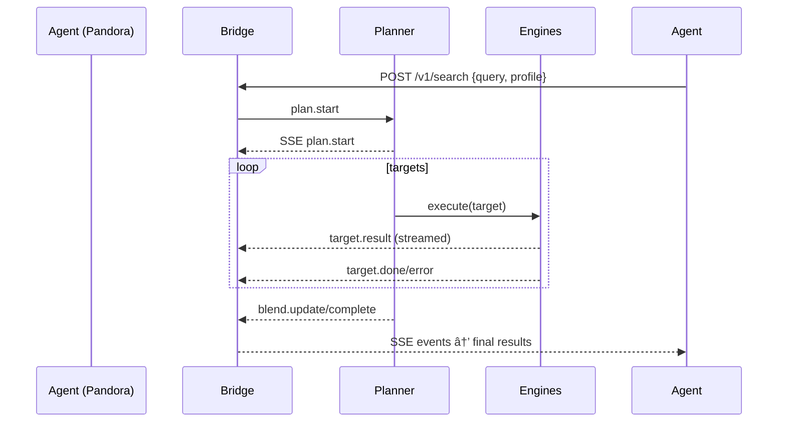

# Proposed external surface $/v1$...
Exported on 22/08/2025 at 15:03:49 [from ChatGPT](https://chatgpt.com/g/g-p-6883d8e9569c8191aad0cfd2a5bf3af3/c/68a8b41d-a47c-832a-a37a-b11255baed65$$
) - with [SaveMyChatbot](
$$https://save.hugocollin.com)

## User
Looks like I am going to have to consolidate my endpoints a bit. 30 is the max alllowed per domain.

## ChatGPT
Ahh, yep — that’s a common cap. Most providers (Vercel, Cloudflare Workers, even some API gateways) put hard limits around 30 routes/endpoints per domain or project before nudging you to consolidate.

Couple of strategies you could use:

*   **Group endpoints under a prefix**  
    Instead of `/foo`, `/bar`, `/baz`, you collapse them into `/api/foo`, `/api/bar`, etc. Then you only register one “wildcard†route with your host and handle dispatching inside.
    
*   **Introduce a router service**  
    One entrypoint $say `/api/*`$ that forwards requests to internal microservices. Internally, you can have as many endpoints as you want — externally, you’re capped at one. This is basically what an API gateway does.
    
*   **Path params vs. new routes**  
    If you currently have `GET /users` and `GET /users/:id` as two registered endpoints, collapse into one router endpoint `/users/*` and dispatch based on whether the tail is empty or not.
    
*   **Consolidate by verb**  
    Instead of `/createUser`, `/updateUser`, `/deleteUser`, you expose `/user` and use `POST`, `PUT`, `DELETE`. Saves a lot of endpoint slots.
    
*   **Subdomains** if you really need more than 30 and consolidation isn’t possible, sometimes splitting across subdomains is a workaround (e.g. `auth.promethean.dev`, `ml.promethean.dev`).
    

Do you want me to sketch a consolidation map for your Promethean services $like grouping `heartbeat`, `broker`, `smartgpt-bridge`, etc.$ so you can see how to get under 30 cleanly?

## User
Here is where we are at right now:

{"openapi":"3.1.0","info":{"title":"Promethean SmartGPT Bridge","version":"1.0.0"},"components":{"securitySchemes":{"apiKey":{"type":"apiKey","name":"x-pi-token","in":"header"}},"schemas":{}},"paths":{"/files/list":{"get":{"operationId":"listFiles","summary":"List files in a directory","tags":
$$
"Files"
$$
,"parameters":
$$
{"schema":{"type":"string","default":"."},"in":"query","name":"path","required":false},{"schema":{"type":"boolean","default":false},"in":"query","name":"hidden","required":false},{"schema":{"type":"string","enum":\["file","dir"
$$
},"in":"query","name":"type","required":false}\],"responses":{"200":{"description":"Default Response","content":{"application/json":{"schema":{"type":"object","properties":{"ok":{"type":"boolean"},"base":{"type":"string"},"entries":{"type":"array","items":{"type":"object","properties":{"name":{"type":"string"},"path":{"type":"string"},"type":{"type":"string"},"size":{"type":
$$
"null","integer"
$$
},"mtimeMs":{"type":
$$
"null","number"
$$
}}}}}}}}}}}},"/files/view":{"get":{"operationId":"viewFile","summary":"View a file snippet","tags":
$$
"Files"
$$
,"parameters":
$$
{"schema":{"type":"string"},"in":"query","name":"path","required":true},{"schema":{"type":"integer","default":1},"in":"query","name":"line","required":false},{"schema":{"type":"integer","default":25},"in":"query","name":"context","required":false}
$$
,"responses":{"200":{"description":"Default Response","content":{"application/json":{"schema":{"type":"object","properties":{"ok":{"type":"boolean"},"path":{"type":"string"},"totalLines":{"type":"integer"},"startLine":{"type":"integer"},"endLine":{"type":"integer"},"focusLine":{"type":"integer"},"snippet":{"type":"string"}}}}}}}}},"/stacktrace/locate":{"post":{"operationId":"locateStacktrace","summary":"Locate files from a stacktrace","tags":
$$
"Files"
$$
,"requestBody":{"content":{"application/json":{"schema":{"type":"object","properties":{"text":{"type":"string"},"trace":{"type":"string"},"context":{"type":"integer","default":25}}}}}},"responses":{"200":{"description":"Default Response","content":{"application/json":{"schema":{"type":"object","properties":{"ok":{"type":"boolean"},"results":{"type":"array","items":{"type":"object"}}}}}}}}}},"/grep":{"post":{"operationId":"grepFiles","summary":"Search repository files via ripgrep","tags":
$$
"Search"
$$
,"requestBody":{"content":{"application/json":{"schema":{"type":"object","required":
$$
"pattern"
$$
,"properties":{"pattern":{"type":"string"},"flags":{"type":"string","default":"g"},"paths":{"type":"array","items":{"type":"string"},"default":
$$
"\*\*/\*.{ts,tsx,js,jsx,py,go,rs,md,txt,json,yml,yaml,sh}"
$$
},"maxMatches":{"type":"integer","default":200},"context":{"type":"integer","default":2}}}}},"required":true},"responses":{"200":{"description":"Default Response","content":{"application/json":{"schema":{"type":"object","properties":{"ok":{"type":"boolean"},"results":{"type":"array","items":{"type":"object"}}}}}}}}}},"/symbols/index":{"post":{"operationId":"indexSymbols","summary":"Index project symbols","tags":
$$
"Symbols"
$$
,"requestBody":{"content":{"application/json":{"schema":{"type":"object","properties":{"paths":{"type":
$$
"array","null"
$$
,"items":{"type":"string"}},"exclude":{"type":
$$
"array","null"
$$
,"items":{"type":"string"}}}}}}},"responses":{"200":{"description":"Default Response","content":{"application/json":{"schema":{"type":"object","properties":{"ok":{"type":"boolean"},"indexed":{"type":"integer"},"info":{"type":"integer"}}}}}}}}},"/symbols/find":{"post":{"operationId":"findSymbols","summary":"Find indexed symbols","tags":
$$
"Symbols"
$$
,"requestBody":{"content":{"application/json":{"schema":{"type":"object","required":
$$
"query"
$$
,"properties":{"query":{"type":"string"},"kind":{"type":"string"},"path":{"type":"string"},"limit":{"type":"integer"}}}}},"required":true},"responses":{"200":{"description":"Default Response","content":{"application/json":{"schema":{"type":"object","properties":{"ok":{"type":"boolean"},"results":{"type":"array","items":{"type":"object"}}}}}}}}}},"/search":{"post":{"operationId":"semanticSearch","summary":"Semantic search via Chroma","tags":
$$
"Search"
$$
,"requestBody":{"content":{"application/json":{"schema":{"type":"object","required":
$$
"q"
$$
,"properties":{"q":{"type":"string"},"n":{"type":"integer","default":8}}}}},"required":true},"responses":{"200":{"description":"Default Response","content":{"application/json":{"schema":{"type":"object","properties":{"ok":{"type":"boolean"},"results":{"type":"array","items":{"type":"object"}}}}}}}}}},"/search/web":{"post":{"operationId":"webSearch","tags":
$$
"Search"
$$
,"requestBody":{"content":{"application/json":{"schema":{"type":"object","required":
$$
"q"
$$
,"properties":{"q":{"type":"string"},"limit":{"type":"integer","default":5}}}}},"required":true},"responses":{"200":{"description":"Default Response"}}}},"/reindex":{"post":{"operationId":"reindexAll","summary":"Reindex entire repository","tags":
$$
"Indexer"
$$
,"responses":{"200":{"description":"Default Response","content":{"application/json":{"schema":{"type":"object","properties":{"ok":{"type":"boolean"},"queued":{"type":"integer"},"ignored":{"type":"boolean"}}}}}}}}},"/files/reindex":{"post":{"operationId":"reindexFiles","summary":"Reindex subset of files","tags":
$$
"Indexer"
$$
,"requestBody":{"content":{"application/json":{"schema":{"type":"object","properties":{"path":{"type":
$$
"string","array"
$$
,"items":{"type":"string"}}}}}}},"parameters":
$$
{"schema":{"type":\["string","array"
$$
,"items":{"type":"string"}},"in":"query","name":"path","required":false}\],"responses":{"200":{"description":"Default Response","content":{"application/json":{"schema":{"type":"object","properties":{"ok":{"type":"boolean"},"queued":{"type":"integer"},"ignored":{"type":"boolean"}}}}}}}}},"/indexer/status":{"get":{"operationId":"indexerStatus","summary":"Get indexer status","tags":
$$
"Indexer"
$$
,"responses":{"200":{"description":"Default Response","content":{"application/json":{"schema":{"type":"object","properties":{"ok":{"type":"boolean"},"status":{"type":"object"}}}}}}}}},"/indexer/index":{"post":{"operationId":"indexFile","summary":"Index a single file","tags":
$$
"Indexer"
$$
,"requestBody":{"content":{"application/json":{"schema":{"type":"object","required":
$$
"path"
$$
,"properties":{"path":{"type":"string"}}}}},"required":true},"responses":{"200":{"description":"Default Response","content":{"application/json":{"schema":{"type":"object","properties":{"ok":{"type":"boolean"},"queued":{"type":"integer"}}}}}}}}},"/indexer/remove":{"post":{"operationId":"removeFileFromIndex","summary":"Remove a file from index","tags":
$$
"Indexer"
$$
,"requestBody":{"content":{"application/json":{"schema":{"type":"object","required":
$$
"path"
$$
,"properties":{"path":{"type":"string"}}}}},"required":true},"responses":{"200":{"description":"Default Response","content":{"application/json":{"schema":{"type":"object","properties":{"ok":{"type":"boolean"},"error":{"type":"string"}}}}}}}}},"/indexer/reset":{"post":{"operationId":"resetIndexer","summary":"Reset indexer state and bootstrap","tags":
$$
"Indexer"
$$
,"responses":{"200":{"description":"Default Response","content":{"application/json":{"schema":{"type":"object","properties":{"ok":{"type":"boolean"}}}}}},"409":{"description":"Default Response","content":{"application/json":{"schema":{"type":"object","properties":{"ok":{"type":"boolean"},"error":{"type":"string"}}}}}}}}},"/agent/start":{"post":{"operationId":"startAgent","summary":"Start a background agent","tags":
$$
"Agent"
$$
,"requestBody":{"content":{"application/json":{"schema":{"type":"object","required":
$$
"prompt"
$$
,"properties":{"prompt":{"type":"string"},"bypassApprovals":{"type":"boolean","default":false},"sandbox":{"type":
$$
"string","boolean"
$$
,"enum":
$$
"nsjail",true,false
$$
,"default":false},"tty":{"type":"boolean","default":true},"env":{"type":"object","additionalProperties":{"type":"string"}}}}}},"required":true},"responses":{"200":{"description":"Default Response","content":{"application/json":{"schema":{"type":"object","properties":{"ok":{"type":"boolean"},"id":{"type":"string"},"prompt":{"type":"string"},"startedAt":{"type":"integer"},"sandbox":{"type":"string"},"bypassApprovals":{"type":"boolean"},"logfile":{"type":"string"}}}}}}}}},"/agent/status":{"get":{"operationId":"getAgentStatus","summary":"Get agent status","tags":
$$
"Agent"
$$
,"parameters":
$$
{"schema":{"type":"string"},"in":"query","name":"id","required":true}
$$
,"responses":{"200":{"description":"Default Response","content":{"application/json":{"schema":{"type":"object","properties":{"ok":{"type":"boolean"},"status":{"type":"object"}}}}}},"404":{"description":"Default Response","content":{"application/json":{"schema":{"type":"object","properties":{"ok":{"type":"boolean"},"error":{"type":"string"}}}}}}}}},"/agent/status/{id}":{"get":{"operationId":"getAgentStatusById","summary":"Get agent status by id","tags":
$$
"Agent"
$$
,"parameters":
$$
{"schema":{"type":"string"},"in":"path","name":"id","required":true}
$$
,"responses":{"200":{"description":"Default Response","content":{"application/json":{"schema":{"type":"object","properties":{"ok":{"type":"boolean"},"status":{"type":"object"}}}}}},"404":{"description":"Default Response","content":{"application/json":{"schema":{"type":"object","properties":{"ok":{"type":"boolean"},"error":{"type":"string"}}}}}}}}},"/agent/list":{"get":{"operationId":"listAgents","summary":"List active agents","tags":
$$
"Agent"
$$
,"responses":{"200":{"description":"Default Response","content":{"application/json":{"schema":{"type":"object","properties":{"ok":{"type":"boolean"},"agents":{"type":"array","items":{"type":"object","properties":{"id":{"type":"string"},"sandbox":{"type":"string"}}}}}}}}}}}},"/agent/logs":{"get":{"operationId":"getAgentLogs","summary":"Get agent logs","tags":
$$
"Agent"
$$
,"parameters":
$$
{"schema":{"type":"string"},"in":"query","name":"id","required":true},{"schema":{"type":"integer","default":8192},"in":"query","name":"bytes","required":false}
$$
,"responses":{"200":{"description":"Default Response","content":{"application/json":{"schema":{"type":"object","properties":{"ok":{"type":"boolean"},"total":{"type":"integer"},"chunk":{"type":"string"}}}}}},"404":{"description":"Default Response","content":{"application/json":{"schema":{"type":"object","properties":{"ok":{"type":"boolean"},"error":{"type":"string"}}}}}}}}},"/agent/tail":{"get":{"operationId":"tailAgentLogs","summary":"Tail agent logs","tags":
$$
"Agent"
$$
,"parameters":
$$
{"schema":{"type":"string"},"in":"query","name":"id","required":true},{"schema":{"type":"integer","default":8192},"in":"query","name":"bytes","required":false}
$$
,"responses":{"200":{"description":"Default Response","content":{"application/json":{"schema":{"type":"object","properties":{"ok":{"type":"boolean"},"total":{"type":"integer"},"chunk":{"type":"string"}}}}}},"404":{"description":"Default Response","content":{"application/json":{"schema":{"type":"object","properties":{"ok":{"type":"boolean"},"error":{"type":"string"}}}}}}}}},"/agent/stream":{"get":{"operationId":"streamAgentLogs","summary":"Stream agent logs","tags":
$$
"Agent"
$$
,"parameters":
$$
{"schema":{"type":"string"},"in":"query","name":"id","required":true}
$$
,"responses":{"200":{"description":"Default Response","content":{"application/json":{"schema":{"type":"string"}}}}}}},"/agent/send":{"post":{"operationId":"sendAgentInput","summary":"Send input to agent","tags":
$$
"Agent"
$$
,"requestBody":{"content":{"application/json":{"schema":{"type":"object","required":
$$
"id","input"
$$
,"properties":{"id":{"type":"string"},"input":{"type":"string"}}}}},"required":true},"responses":{"200":{"description":"Default Response","content":{"application/json":{"schema":{"type":"object","properties":{"ok":{"type":"boolean"},"error":{"type":"string"}}}}}}}}},"/agent/interrupt":{"post":{"operationId":"interruptAgent","summary":"Interrupt agent","tags":
$$
"Agent"
$$
,"requestBody":{"content":{"application/json":{"schema":{"type":"object","required":
$$
"id"
$$
,"properties":{"id":{"type":"string"}}}}},"required":true},"responses":{"200":{"description":"Default Response","content":{"application/json":{"schema":{"type":"object","properties":{"ok":{"type":"boolean"}}}}}}}}},"/agent/kill":{"post":{"operationId":"killAgent","summary":"Kill an agent","tags":
$$
"Agent"
$$
,"requestBody":{"content":{"application/json":{"schema":{"type":"object","required":
$$
"id"
$$
,"properties":{"id":{"type":"string"}}}}},"required":true},"responses":{"200":{"description":"Default Response","content":{"application/json":{"schema":{"type":"object","properties":{"ok":{"type":"boolean"}}}}}}}}},"/agent/resume":{"post":{"operationId":"resumeAgent","summary":"Resume agent (not supported)","tags":
$$
"Agent"
$$
,"requestBody":{"content":{"application/json":{"schema":{"type":"object","required":
$$
"id"
$$
,"properties":{"id":{"type":"string"}}}}},"required":true},"responses":{"200":{"description":"Default Response","content":{"application/json":{"schema":{"type":"object","properties":{"ok":{"type":"boolean"},"error":{"type":"string"}}}}}}}}},"/exec/run":{"post":{"operationId":"runCommand","summary":"Run a shell command","tags":
$$
"Exec"
$$
,"requestBody":{"content":{"application/json":{"schema":{"type":"object","required":
$$
"command"
$$
,"properties":{"command":{"type":"string"},"cwd":{"type":"string"},"env":{"type":"object","additionalProperties":{"type":"string"}},"timeoutMs":{"type":"integer","default":600000},"tty":{"type":"boolean","default":false}}}}},"required":true},"responses":{"200":{"description":"Default Response","content":{"application/json":{"schema":{"type":"object","properties":{"ok":{"type":"boolean"},"exitCode":{"type":
$$
"null","integer"
$$
},"signal":{"type":
$$
"null","string"
$$
},"stdout":{"type":"string"},"stderr":{"type":"string"},"error":{"type":"string"}}}}}},"403":{"description":"Default Response","content":{"application/json":{"schema":{"type":"object","properties":{"ok":{"type":"boolean"},"error":{"type":"string"}}}}}}}}},"/sinks/list":{"get":{"operationId":"listSinks","tags":
$$
"Sinks"
$$
,"responses":{"200":{"description":"Default Response"}}}},"/sinks/{name}/query":{"post":{"operationId":"querySink","summary":"Query sink in Mongo (structured filter)","tags":
$$
"Sinks"
$$
,"requestBody":{"content":{"application/json":{"schema":{"type":"object","properties":{"filter":{"type":"object"},"limit":{"type":"integer","default":100}}}}}},"parameters":
$$
{"schema":{"type":"string"},"in":"path","name":"name","required":true}
$$
,"responses":{"200":{"description":"Default Response"}}}},"/sinks/{name}/search":{"post":{"operationId":"searchSink","summary":"Semantic search in sink (Chroma)","tags":
$$
"Sinks"
$$
,"requestBody":{"content":{"application/json":{"schema":{"type":"object","required":
$$
"q"
$$
,"properties":{"q":{"type":"string"},"n":{"type":"integer","default":10},"where":{"type":"object"}}}}},"required":true},"parameters":
$$
{"schema":{"type":"string"},"in":"path","name":"name","required":true}
$$
,"responses":{"200":{"description":"Default Response"}}}},"/users/create":{"post":{"operationId":"createUser","summary":"Create user","tags":
$$
"Admin"
$$
,"requestBody":{"content":{"application/json":{"schema":{"type":"object","required":
$$
"username"
$$
,"properties":{"username":{"type":"string"},"roles":{"type":"array","items":{"type":"string"}}}}}},"required":true},"responses":{"200":{"description":"Default Response"}}}},"/users/list":{"get":{"operationId":"listUsers","tags":
$$
"Admin"
$$
,"responses":{"200":{"description":"Default Response"}}}},"/users/delete":{"post":{"operationId":"deleteUser","tags":
$$
"Admin"
$$
,"requestBody":{"content":{"application/json":{"schema":{"type":"object","required":
$$
"username"
$$
,"properties":{"username":{"type":"string"}}}}},"required":true},"responses":{"200":{"description":"Default Response"}}}},"/policies/list":{"get":{"operationId":"listPolicies","tags":
$$
"Admin"
$$
,"responses":{"200":{"description":"Default Response"}}}},"/policies/create":{"post":{"operationId":"createPolicy","tags":
$$
"Admin"
$$
,"requestBody":{"content":{"application/json":{"schema":{"type":"object","required":
$$
"role","action","resource"
$$
,"properties":{"role":{"type":"string"},"action":{"type":"string"},"resource":{"type":"string"},"effect":{"type":"string","enum":
$$
"allow","deny"
$$
,"default":"allow"}}}}},"required":true},"responses":{"200":{"description":"Default Response"}}}},"/policies/delete":{"post":{"operationId":"deletePolicy","tags":
$$
"Admin"
$$
,"requestBody":{"content":{"application/json":{"schema":{"type":"object","required":
$$
"id"
$$
,"properties":{"id":{"type":"string"}}}}},"required":true},"responses":{"200":{"description":"Default Response"}}}}},"servers":\[{"url":"https://err-stealth-16-ai-studio-a1vgg.tailbe888a.ts.net"}\],"security":\[{"apiKey":\[\]}\]}

## ChatGPT
Nice—thanks for the spec drop. You can get this under 30 cleanly with a small, predictable surface and keep your internal handlers as‑is.

Here’s a pragmatic consolidation that preserves semantics but collapses paths by **resource + verb** (and a couple of RPC “ops†where it helps). Target: **18 routes**.
$$
Proposed external surface (/v1)
$$
$$
===============================
$$
Files (3)
---------

*   `GET /v1/files` — list (path, hidden, type)
    
*   `GET /v1/files/{path}` — view snippet (line, context)
    
*   `POST /v1/files/reindex` — reindex subset or all (body: { path?: string|string
$$
$$
 })
    

Search (3)
----------

*   `POST /v1/search/code` — grep (pattern, flags, paths, maxMatches, context)
    
*   `POST /v1/search/semantic` — Chroma (q, n)
    
*   `POST /v1/search/web` — web search (q, limit)
    

Symbols (2)
-----------

*   `POST /v1/symbols/index` — index (paths?, exclude?)
    
*   `POST /v1/symbols/find` — query (query, kind?, path?, limit?)
    

Indexer $3 → 2$
---------------

*   `GET /v1/indexer` — status
    
*   `POST /v1/indexer` — upsert jobs: `{ op: "index"|"remove"|"reset"|"reindex", path?: string }`
    
    *   $This collapses: `/indexer/index`, `/indexer/remove`, `/indexer/reset`, `/reindex`.$
        
    *   Return `{ ok, queued?, ignored?, error? }`
        

Agents $7 → 6$
--------------

*   `POST /v1/agents` — start (prompt, bypassApprovals, sandbox, tty, env)
    
*   `GET /v1/agents` — list
    
*   `GET /v1/agents/{id}` — status
    
*   `GET /v1/agents/{id}/logs` — logs (bytes?)
    
*   `GET /v1/agents/{id}/stream` — stream (SSE)
    
*   `POST /v1/agents/{id}` — control ops: `{ op: "send"|"interrupt"|"resume"|"kill", input? }`
    
    *   $Collapses `/send`, `/interrupt`, `/resume`, `/kill` into one.$
        

Exec (1)
--------

*   `POST /v1/exec` — run command (command, cwd?, env?, timeoutMs?, tty?)
    

Sinks $3 → 2$
-------------

*   `GET /v1/sinks` — list
    
*   `POST /v1/sinks/{name}` — `{ op: "query"|"search", filter?|q?, n?, where? }`
    

Admin $6 → 4$
-------------

*   `GET /v1/admin/users`
    
*   `POST /v1/admin/users` — create (username, roles?)
    
*   `DELETE /v1/admin/users/{username}`
    
*   `GET /v1/admin/policies`
    
*   `POST /v1/admin/policies` — create (role, action, resource, effect?)
    
*   `DELETE /v1/admin/policies/{id}`
    

$If you want to stay _well_ under 30, keep both Admin groups; that’s 18 total. If you need to shave further, collapse both Admin groups into one `POST /v1/admin` with `{ op: ..., ... }`.$

* * *

Old → New map (high‑value ones)
-------------------------------

*   `/files/list` → `GET /v1/files`
    
*   `/files/view` → `GET /v1/files/{path}`
    
*   `/files/reindex` + `/reindex` → `POST /v1/files/reindex` (body: paths or omit for all) **or** `POST /v1/indexer` with `op:"reindex"`
    
*   `/grep` → `POST /v1/search/code`
    
*   `/search` → `POST /v1/search/semantic`
    
*   `/search/web` → `POST /v1/search/web`
    
*   `/symbols/index` → `POST /v1/symbols/index`
    
*   `/symbols/find` → `POST /v1/symbols/find`
    
*   `/indexer/status` → `GET /v1/indexer`
    
*   `/indexer/index|remove|reset` → `POST /v1/indexer` with `op`
    
*   `/agent/start` → `POST /v1/agents`
    
*   `/agent/list` → `GET /v1/agents`
    
*   `/agent/status` + `/agent/status/{id}` → `GET /v1/agents/{id}`
    
*   `/agent/logs` + `/agent/tail` → `GET /v1/agents/{id}/logs`
    
*   `/agent/stream` → `GET /v1/agents/{id}/stream`
    
*   `/agent/send|interrupt|resume|kill` → `POST /v1/agents/{id}` with `op`
    
*   `/exec/run` → `POST /v1/exec`
    
*   `/sinks/list` → `GET /v1/sinks`
    
*   `/sinks/{name}/query|search` → `POST /v1/sinks/{name}` with `op`
    
*   `/users/*` → `GET/POST/DELETE /v1/admin/users{,/username}`
    
*   `/policies/*` → `GET/POST/DELETE /v1/admin/policies{,/id}`
    

* * *

Minimal OpenAPI 3.1 skeleton (showing the pattern)
--------------------------------------------------

```yaml
openapi: 3.1.0
info: { title: Promethean SmartGPT Bridge, version: 1.1.0 }
servers: [{ url: https://err-stealth-16-ai-studio-a1vgg.tailbe888a.ts.net/v1 }]
components:
  securitySchemes:
    apiKey: { type: apiKey, in: header, name: x-pi-token }
security: [{ apiKey: [] }]
paths:
  /files:
    get:
      summary: List files
      parameters:
        - in: query; name: path; schema: { type: string, default: "." }
        - in: query; name: hidden; schema: { type: boolean, default: false }
        - in: query; name: type; schema: { type: string, enum: [file, dir] }
      responses: { "200": { description: ok } }
  /files/{path}:
    get:
      summary: View file snippet
      parameters:
        - in: path; name: path; required: true; schema: { type: string }
        - in: query; name: line; schema: { type: integer, default: 1 }
        - in: query; name: context; schema: { type: integer, default: 25 }
      responses: { "200": { description: ok } }
  /files/reindex:
    post: { summary: Reindex subset or all, responses: { "200": { description: ok } } }

 /search/code:
    post: { summary: Grep code, responses: { "200": { description: ok } } }
  /search/semantic:
    post: { summary: Semantic search, responses: { "200": { description: ok } } }
  /search/web:
    post: { summary: Web search, responses: { "200": { description: ok } } }

 /symbols/index:
    post: { summary: Index symbols, responses: { "200": { description: ok } } }
  /symbols/find:
    post: { summary: Find symbols, responses: { "200": { description: ok } } }

 /indexer:
    get:  { summary: Indexer status, responses: { "200": { description: ok } } }
    post:
      summary: Indexer operations
      requestBody:
        content:
          application/json:
            schema:
              type: object
              required: [op]
              properties:
                op: { type: string, enum: [index, remove, reset, reindex] }
                path: { type: string }
      responses: { "200": { description: ok } }

 /agents:
    get:  { summary: List agents, responses: { "200": { description: ok } } }
    post: { summary: Start agent, responses: { "200": { description: ok } } }
  /agents/{id}:
    get:  { summary: Agent status, responses: { "200": { description: ok } } }
    post:
      summary: Control agent
      requestBody:
        content:
          application/json:
            schema:
              type: object
              required: [op]
              properties:
                op: { type: string, enum: [send, interrupt, resume, kill] }
                input: { type: string }
      responses: { "200": { description: ok } }
  /agents/{id}/logs:
    get:  { summary: Agent logs, responses: { "200": { description: ok } } }
  /agents/{id}/stream:
    get:  { summary: Agent stream, responses: { "200": { description: ok } } }

 /exec:
    post: { summary: Run command, responses: { "200": { description: ok } } }

 /sinks:
    get:  { summary: List sinks, responses: { "200": { description: ok } } }
  /sinks/{name}:
    post:
      summary: Sink ops
      requestBody:
        content:
          application/json:
            schema:
              type: object
              required: [op]
              properties:
                op:   { type: string, enum: [query, search] }
                q:    { type: string }
                n:    { type: integer, default: 10 }
                where:{ type: object }
                filter:{ type: object }
      responses: { "200": { description: ok } }

 /admin/users:
    get:  { summary: List users, responses: { "200": { description: ok } } }
    post: { summary: Create user, responses: { "200": { description: ok } } }
  /admin/users/{username}:
    delete: { summary: Delete user, responses: { "200": { description: ok } } }
  /admin/policies:
    get:  { summary: List policies, responses: { "200": { description: ok } } }
    post: { summary: Create policy, responses: { "200": { description: ok } } }
  /admin/policies/{id}:
    delete: { summary: Delete policy, responses: { "200": { description: ok } } }
```

* * *

Router flow (mermaid)
---------------------

```mermaid
flowchart LR
  A[/Edge: /v1/* /] --> B{resource}
  B -->|files| F1[List] & F2[View] & F3[Reindex]
  B -->|search| S1[Code] & S2[Semantic] & S3[Web]
  B -->|symbols| Y1[Index] & Y2[Find]
  B -->|indexer| I1[GET status] & I2[POST op]
  B -->|agents| G1[POST start] & G2[GET list] & G3[GET status] & G4[logs/stream] & G5[POST op]
  B -->|exec|  X1[Run]
  B -->|sinks| K1[GET list] & K2[POST op]
  B -->|admin| A1[users] & A2[policies]
```

* * *

Migration tips
--------------

*   **Keep old paths for 1–2 weeks** behind 308 redirects (or thin handlers) to the new ones; emit a `Deprecation` header with a sunset date.
    
*   **Version now** $`/v1`$ so you’re not forced to burn more routes later.
    
*   **Consistent op contracts**: Anywhere you collapsed multiple endpoints into one `POST`, enforce `{ op: "…" }` with strict enums and per‑op validation. It keeps docs clear and prevents accidental footguns.
    
*   **Streaming**: keep `/agents/{id}/stream` as a dedicated GET so proxies don’t mangle SSE; everything else can be POSTed.
    

If you want, I can turn your JSON into this v1 OpenAPI file and add a shim layer $express/zod$ that mounts both old and new routes so you can cut over without breaking agents.

## User
so like... the sinks are kinda themselves a form of search. I kinda think that whole deal can be neatly consolidated behind a single /search/:sink?query="searchterm"&type

But... there is more to this right now than trying to consolidate the existing system.

I consolidating with out thinking through the long term design puts us in a box.

## ChatGPT
Totally agree: “just smash paths together†= future pain. Let’s design a **search substrate** that treats sinks as first‑class **indexes**, so today’s endpoints collapse neatly **without** boxing us in.

Here’s a durable shape that stays <30 routes and lets you evolve engines, filters, and routing.

North‑star model
$$
================
$$
*   **Index** = a named searchable corpus (backed by Chroma, Mongo text, ripgrep, web adapter, etc.)
    
*   **Engine** = how an index is searched (`vector`, `keyword`, `hybrid`, `web`, `custom`)
    
*   **Target** = one or more indexes plus an optional **ranking profile** and **filters**
    
*   **Query** = the _what_, independent of where it’s searched
    

External surface (stable, compact)
$$
==================================
$$
*   `GET /v1/indexes` — discoverable registry (your “sinks†live here too)
    
*   `POST /v1/indexes` — create/register $point to a sink, set engine + schema$
    
*   `PATCH/DELETE /v1/indexes/{id}` — manage lifecycle
    
*   `POST /v1/search` — unified search across one or many indexes
    
*   `GET /v1/search/stream` — server‑sent events for long/streamed results
    
*   `POST /v1/indexes/{id}/ingest` — push docs/updates (optional if you have background jobs)
    
*   `GET /v1/capabilities` — feature discovery (engines, ranking profiles, filters supported)
    

Everything else (files, agents, exec, admin) stays as previously consolidated. We’re adding only **5–6** endpoints to cover all sink/search permutations.

* * *

Request/response contracts (future‑proof)
$$
=========================================
$$
$$
`POST /v1/search`
$$
-----------------

```json
{
  "query": "spawn('ffmpeg') supervised",
  "targets": [
    { "index": "code", "engine": "keyword" },
    { "index": "repo-embeddings", "engine": "vector", "weight": 0.7,
      "where": { "path": { "$like": "services/ts/%" } } },
    { "index": "web", "engine": "web", "params": { "limit": 5 } }
  ],
  "rank": { "profile": "hybrid-default", "blend": "reciprocal_rank_fusion" },
  "topK": 20,
  "cursor": null,
  "return": { "snippets": true, "highlights": true, "attributes": ["path","symbol","score"] }
}
```
$$
**Response**
$$
```json
{
  "ok": true,
  "hits": [
    {
      "id": "src/compiler/transform/transformer.ts#L70-98",
      "index": "code",
      "score": 0.92,
      "attributes": { "path": "shared/ts/src/...", "symbol": "transformer" },
      "snippet": "const transformer: ts.TransformerFactory<ts.SourceFile> = (context) => {...}",
      "highlights": [{"start":14,"end":25}]
    }
  ],
  "facets": { "index": {"code":12,"repo-embeddings":8}, "path": {"services/ts":9} },
  "usage": { "tookMs": 84, "targetsEvaluated": 3 },
  "next": "opaque-cursor"
}
```

Notes:

*   **Targets array** lets you do **multi‑index hybrid** now; you can add new engines later without changing the endpoint.
    
*   **`rank.profile`** is a plug‑point for swapping scoring strategies.
    
*   **`where`** is engine‑agnostic filtering (map to Chroma `where`, Mongo `$match`, etc.).
    
*   **Pagination** via a single opaque `cursor`.
    
*   **`return`** controls payload size (great for dashboards).
    
$$
`GET /v1/search/stream?q=...&targets=...`
$$
-----------------------------------------

*   Streams incremental hits (`event: hit`), facet deltas, and a final `event: done`. Keeps your dashboard snappy and avoids proxy POST‑SSE weirdness.
    
$$
`GET /v1/indexes`
$$
-----------------

Returns discovery metadata so tools self‑configure:

```json
{
  "ok": true,
  "indexes": [
    { "id": "repo-embeddings", "engine": "vector",
      "schema": {"attributes": ["path","lang","symbol"]},
      "filters": {"path": "string","lang": "enum"},
      "capabilities": ["where","hybridBlend"] },
    { "id": "code", "engine": "keyword", "capabilities": ["regex","caseSensitive"] },
    { "id": "web", "engine": "web", "capabilities": ["site:","timeRange"] }
  ]
}
```

* * *

Why this won’t box you in
$$
=========================
$$
*   **Engines are pluggable**: add `graph`, `events`, `logs`, `observability` tomorrow with zero route growth.
    
*   **Routing lives in data** $targets + profiles$, not paths.
    
*   **Schema + capabilities are discoverable**: clients adapt via `/indexes` + `/capabilities`.
    
*   **Ranking is swappable**: BM25, cosine, LLM re‑rank, RRF — all without endpoint churn.
    
*   **Policy can sit at the index layer**: ACLs per index $read/search$, fields masking, query budget throttles.
    

* * *

Architecture sketch
$$
===================
$$
```mermaid
flowchart LR
  UI[/Dashboard & Agents/]
  UI -->|POST /v1/search| GW[Bridge API Router]

 subgraph Search Layer
    QP[Query Planner]
    HY[Hybrid Blender]
    RR[Re‑ranker (optional)]
  end

 subgraph Engines
    KW[Keyword Engine (ripgrep/Mongo)]
    VE[Vector Engine (Chroma)]
    WB[Web Adapter (DuckDuckGo)]
    CU[Custom Engine(s)]
  end

 GW --> QP --> KW
  QP --> VE
  QP --> WB
  KW --> HY
  VE --> HY
  WB --> HY
  HY --> RR --> GW
```

* * *

Migration plan from your current spec
$$
=====================================
$$
*   Map every **/sinks/{name}/query|search** to **indexes**:
    
    *   Create an index per sink $`{ id: "<sink-name>", engine: "vector", backing: "chroma:<collection>" }`$
        
    *   Your **Mongo structured query** becomes `engine:"keyword"` (or `engine:"mongo"` if you want to keep it explicit)
        
*   Replace `/search`, `/grep`, `/search/web` with **one** `POST /v1/search` and routing rules:
    
    *   If `targets` omitted → default profile $e.g., `$"repo-embeddings","code"$`$
        
    *   `type` param you mentioned becomes `engine` (more general)
        
*   Keep legacy paths for 2 weeks with 308s and `Deprecation` headers.
    

* * *

Guardrails & ops
$$
================
$$
*   **Auth**: same `x-pi-token`, plus optional per‑index RBAC $role → allowed indexes, max `topK`, max `targets`$.
    
*   **Quotas**: deny if `targets.length` > N or cumulative `docsScanned` > budget.
    
*   **Latency**: enforce per‑engine timeouts; late results can still arrive via `/search/stream`.
    

* * *

Minimal OpenAPI nuggets
$$
=======================
$$
You only need to expose the flexible parts; engines/caps live in responses.

```yaml
paths:
  /v1/indexes:
    get: { summary: List indexes }
    post:
      summary: Register index
      requestBody:
        content:
          application/json:
            schema:
              type: object
              required: [id, engine]
              properties:
                id: { type: string }
                engine: { type: string, enum: [vector, keyword, web, custom] }
                schema: { type: object }
                capabilities: { type: array, items: { type: string } }

 /v1/search:
    post:
      summary: Unified search
      requestBody:
        content:
          application/json:
            schema:
              type: object
              required: [query]
              properties:
                query: { type: string }
                targets:
                  type: array
                  items:
                    type: object
                    required: [index]
                    properties:
                      index: { type: string }
                      engine: { type: string }
                      weight: { type: number }
                      where: { type: object }
                rank:
                  type: object
                  properties:
                    profile: { type: string }
                    blend: { type: string }
                topK: { type: integer, default: 10 }
                cursor: { type: string, nullable: true }
```

* * *

Tiny router sketch (TypeScript, zod)
$$
====================================
$$
```ts
const SearchReq = z.object({
  query: z.string().min(1),
  targets: z.array(z.object({
    index: z.string(),
    engine: z.enum(["vector","keyword","web","custom"]).optional(),
    weight: z.number().optional(),
    where: z.record(z.any()).optional()
  })).default([{ index: "default" }]),
  rank: z.object({
    profile: z.string().default("hybrid-default"),
    blend: z.string().default("rrf")
  }).partial(),
  topK: z.number().int().min(1).max(100).default(10),
  cursor: z.string().nullable().optional()
});

app.post("/v1/search", async (req, res) => {
  const q = SearchReq.parse(req.body);
  const plan = planQuery(q);           // choose engines per index
  const results = await execute(plan); // run in parallel with timeouts
  res.json(blendAndFormat(results, q));
});
```

* * *

If this feels right, I can generate a drop‑in PR:

1.  new `/v1/search` + `/v1/indexes` handlers $express/zod$,
    
2.  adapters that map your existing sinks to `indexes`,
    
3.  a compatibility layer that rewrites old requests to the new contract.

## User
no we are still designing. We get these bursts of work in when I push you to not code and just think.

The next service I have slated is going to be called "Pandora"

Service... agent... I'm... stuff is bleeding together... these things...

The concept of an agent must change.

I have it thought about right now as... there are these 2 different kind of services, but the difference isn't explicitly discoverable from the structure of the directories.

There is an "agent required' service, like it requires information specific to an agent to spin up

Then there are "general purpose" ones.

So those agent based services, what needs to happen is probably... 
Either they have to be made to be abstract enough to allow agents to query do what they need to them...

Or they have to be made into shared libraries that are required by an actual agent, and we actually start filling up our agents folder

## ChatGPT
love this mode — thinking caps on, no code. let’s nail the concepts so “Pandora†lands clean and we stop blurring “agent†and “serviceâ€.

crisp definitions
$$
=================
$$
*   **Service** = a long‑lived process exposing capabilities (APIs, queues, streams). It’s deployable on its own.
    
*   **Agent** = an _instantiation_ of behavior bound to identity, policy, and memory. It may _use_ services (as tools) and may run embedded or as its own service.
    

That gives us two **service classes**:

1.  **General‑purpose services (GP)** — usable by any agent or human. No per‑agent secrets/state required.
    
2.  **Agent‑required services (AR)** — inert without agent context (identity, perms, memory, prompts, keys). They either:
    
    *   (A) read agent context at runtime and act (remain a service), or
        
    *   (B) are better expressed as **shared libraries** consumed by an agent executable.
        

discoverability (don’t rely on directory names)
$$
===============================================
$$
Make the class explicit via a **capability manifest** _in each service root_. Don’t guess from folder structure.

`service.manifest.yaml` (minimal, human‑readable, future‑proof):

```yaml
id: "pandora"
kind: "service"                 # service | library | agent
class: "AR"                     # GP | AR
requires_agent: true            # explicit duplicate for greppability
capabilities:
  provides: ["search.plan", "search.route", "search.blend"]
  consumes: ["bridge.search", "sinks.read", "policy.check"]
contracts:
  inputs:
    - name: "AgentContext"
      schema: "promethean://schemas/agent-context@1"
      required: true
    - name: "QueryIntent"
      schema: "promethean://schemas/query-intent@1"
  outputs:
    - name: "SearchPlan"
      schema: "promethean://schemas/search-plan@1"
  streams:
    emits: ["search.events.plan.v1", "search.events.result.v1"]
policy:
  scopes_required: ["search:plan", "sinks:read"]
runtime:
  sandbox: "nsjail"
  resources: { cpu: "200m", mem: "512Mi" }
owner: "ai-platform"
```

For **libraries**, use `kind: library` and drop `runtime`; expose the same `capabilities` & `contracts` so agents can auto‑wire.

> now a linter can scream if a service says `class: AR` but doesn’t declare `AgentContext` as an input.

how to decide: AR service vs library?
$$
=====================================
$$
$$
Use this **decision rule**:
$$
```mermaid
flowchart TD
  A[Does it require per-agent identity/policy/memory to run?] -->|No| B[GP Service]
  A -->|Yes| C[Can it run statelessly if context is injected per request?]
  C -->|Yes| D[AR Service (context-in)]
  C -->|No| E[Library linked into an Agent binary]
```

*   **AR Service (context‑in):** keeps ops simple (one deployment), agent sends `AgentContext` each call.
    
*   **Library:** when per‑agent lifecycle/state is heavy (fine‑grained caches, prompts, per‑agent plugins). You then “fill up the agents folder†with small binaries linking the lib.
    

what is Pandora?
$$
================
$$
Your earlier note: _“Pandora consumes data from sinks to generate search requests through the bridge using the LLM broker.â€_ That’s a **query‑planning substrate**. It’s naturally **AR** because “good queries†depend on the agent’s role, memory, and authorization.
$$
**My recommendation:**
$$
*   **Core Pandora** = **AR Service (context‑in)**. General algorithms live here.
    
*   **Profiles** (agent behaviors) = **overlays** (data!), not code forks. Agents select profiles at runtime.
    

Pandora responsibilities (layered)
----------------------------------

1.  **Intent understanding** $from text/stacktrace/signal → `QueryIntent`$
    
2.  **Target selection** $choose indexes/sinks/web, honoring agent policy$
    
3.  **Query synthesis** (generate multiple candidates per target)
    
4.  **Execution routing** $call bridge, sinks, web; set budgets/timeouts$
    
5.  **Blending & re‑ranking** (RRF, LLM reranker, learned profiles)
    
6.  **Telemetry & learning** (feedback loops into profiles)
    


profiles as data (not code)
$$
===========================
$$
Store per‑agent **Pandora profiles** in a small, typed bundle $could be TOML/YAML or s‑exp$. They define _how_ to search, not _what to search_. Think “ranking profile + heuristic weights + prompt fragmentsâ€.

Example (compact):

```yaml
profile_id: "duck.dev.search.v1"
targets:
  - index: "repo-embeddings"  # Chroma collection
    engine: "vector"
    weight: 0.6
    where: { path: { $like: "services/ts/%" } }
  - index: "code"
    engine: "keyword"
    weight: 0.4
query_templates:
  stacktrace: |
    Extract file paths, functions, and error tokens. Generate K=3 keyword queries and K=2 vector paraphrases.
  generic: |
    Generate BM25+vector hybrids; prefer recent commits and files touched by agent in last 48h.
blend: { method: "rrf", k: 60 }
budgets:
  maxTargets: 3
  maxTopK: 20
  timeoutMs: 2500
policy_overrides:
  deny: ["web:*"]        # e.g., offline work
telemetry:
  learn_from_clicks: true
```

S‑expression variant (since you like Lisp):

```ruby
(profile duck.dev.search.v1
  (targets
    (vector repo-embeddings :weight 0.6 :where (path (like "services/ts/%")))
    (keyword code :weight 0.4))
  (query-templates
    (stacktrace "...") (generic "..."))
  (blend (rrf :k 60))
  (budgets :maxTargets 3 :maxTopK 20 :timeoutMs 2500)
  (policy-overrides (deny "web:*"))
  (telemetry :learn-from-clicks t))
```

contracts (so agents & services snap together)
$$
==============================================
$$
Define three tiny, stable schemas (namespaces matter more than fields):

*   **`AgentContext@1`**: `{ agentId, roles, scopes, memoryRefs[], personaId, runtimeCaps }`
    
*   **`QueryIntent@1`**: `{ raw, kind, hints[], artifacts:{ stacktrace?, filePath?, symbol? } }`
    
*   **`SearchPlan@1`**: `{ steps[], targets[], budgets, rankProfile, auditTrail[] }`
    

Pandora always returns **both** `results` **and** the `plan` — agents can learn or override on the next run.

repo layout that won’t paint us into a corner
$$
=============================================
$$
Keep your existing flat `services/` but add strict manifests + indexes:

```bash
services/
  ts/
    pandora/
      service.manifest.yaml   # class: AR
      src/...
    smartgpt-bridge/
      service.manifest.yaml   # class: GP
    sinks/
      service.manifest.yaml   # GP
libraries/
  ts/
    pandora-core/
      service.manifest.yaml   # kind: library
agents/
  duck/
    agent.manifest.yaml       # binds profiles, policies, tools
    profiles/
      pandora.duck.dev.yaml
```

Add a **catalog generator** that reads all manifests and builds:

*   a **Capabilities Index** $`/v1/capabilities`$
    
*   a **Wiring Map** (who can call what under which scope)
    
*   a **Docs site** page per service/agent
    

policy & RBAC where it belongs
$$
==============================
$$
*   Enforce **policy at the index/target** layer: an agent may ask Pandora for “webâ€, but Pandora resolves allowed targets after checking `AgentContext.scopes`.
    
*   Budget constraints live in **profiles** with system clamps at the service.
    

how this affects your endpoint consolidation later
$$
==================================================
$$
Your unified `/v1/search` stays perfect. Pandora is the _planner_ that decides **targets** and **rank profiles** under policy; the Bridge is the _executor_. Sinks disappear behind **indexes**. We avoid boxing ourselves in because:

*   behaviors move via **profiles** (data),
    
*   capabilities are **discoverable** via manifests,
    
*   and the **AR vs GP** distinction is explicit & linted.
    

migration playbook (no code, just moves)
$$
========================================
$$
1.  **Author manifests** for current services; mark class $GP/AR$ + capabilities.
    
2.  **Extract profiles** you’ve been “prompt‑gluing†into Pandora profile bundles.
    
3.  **Introduce AgentContext** envelope wherever an AR service is called (pass‑through at first).
    
4.  **Catalog & lint**: a script that fails CI if AR services don’t declare `AgentContext`.
    
5.  **Policy gates**: define index‑level scopes $`search:index/*`$ and map current tokens to scopes.
    

* * *

if this frame feels right, we can next design Pandora’s _SearchPlan@1_ schema (fields, minimal enums, event names) and the _profile merge rules_ $global → org → agent → session$, then later we’ll translate it into an OpenAPI & a tiny zod schema.

## User
No pandora I think \*is\* an agent... like it's purpose is to just kinda... Ok it's trying to open pandora's box on the system, by generating search terms based on the current state of the system.

So, it uses....


Or... isthat what it is at all...

Then what came to my mind was also "Eris"

Who might do something similar, but to a different end...

## ChatGPT
ahh, I see the pivot — Pandora not as a **substrate service** but as a **named being in the Promethean pantheon**.

👉 That shifts the framing:

*   **Service** = infrastructure, utilities (bridge, sinks, indexer).
    
*   **Agent** = a persona, with intent, goals, and behaviors. They _use_ services, but their reason for existing is a higher-order purpose.
    

So Pandora, in that sense, is not just query-planning. She’s an **agent whose function is to open boxes**:

*   takes the “sealed†state of the system (logs, telemetry, indexes, dead ends),
    
*   pries it apart,
    
*   generates **search terms, angles, provocations** that otherwise wouldn’t have been asked.
    

If you squint, that’s curiosity embodied — system poking at itself.

* * *

### Pandora as an agent

*   **Input:** system state snapshots (telemetry, logs, dead queues, anomalies).
    
*   **Behavior:** turn those into _search queries_ or _hypotheses_ → “what happens if we look here?â€
    
*   **Output:** tasks to the bridge or other agents: “search Xâ€, “index Yâ€, “compare Zâ€.
    
*   **Personality:** aligned with her myth — she _opens_ things, sometimes releasing chaos but also knowledge.
    

She’s not GP or AR in the service sense — she **is an agent** who requires services like `bridge/search`, `sinks`, `exec`.

* * *

### Eris as a sibling agent

If Pandora’s curiosity is opening, **Eris** could be _discord / disruption / counter-balance_.

*   Where Pandora **expands** the search space (“open the boxâ€),
    
*   Eris **perturbs** it (“throw in the golden appleâ€), injecting contradiction, stress-tests, adversarial queries.
    

Together:

*   Pandora broadens _what_ is considered,
    
*   Eris ensures the system doesn’t collapse into complacency or confirmation bias.
    

* * *

### So what’s the distinction?

*   **Service**: “does X reliably when asked.†(Bridge, Indexer, STT, TTS).
    
*   **Agent**: “has a purpose, a myth, a role in the pantheon.†Agents _use_ services but their existence is not reducible to them.
    
$$
Pandora belongs in `agents/`.
$$
Her “tool belt†is `services/ts/pandora-core` (library) + bridge/indexer/etc.  
Eris would be another agent, with her own stance and strategy.

* * *

### Why that feels right

If you treat Pandora as a service, you risk ossifying her into “just a search box.† 
As an agent, she stays open-ended: you can let her surprise you, evolve profiles, even conflict with other agents.

And it means your **agents folder** finally starts filling up with mythic, purposeful entities rather than utilities.

* * *

Want me to sketch what the **agent manifest** for Pandora would look like (parallel to the service manifests we just outlined), including how you’d declare her purpose, tools, and personality?

## User
Ok, let's clarify this for the future... Agents always have names. They are Capital "A" "Agents". Promethean Agents are "Proper Nouns"

They don't have descriptive names because their purpose defies a simplified explaination.

If a system can be boiled down to a name like "file watcher" "process manager"

Definately not a service.

Then there is still this strange outlier in the cephalon... that's not a proper noun... but it isn't just a describer either.....

## ChatGPT
yes — good distinction. let me reflect it back:

*   **Services** = lowercase, descriptive, composable.  
    e.g. `heartbeat`, `bridge`, `indexer`, `sinks`.  
    their names are their job descriptions. you can swap them out, version them, treat them like utilities.
    
*   **Agents** = uppercase, Proper Nouns.  
$$
    e.g. **Duck**, **Pandora**, **Eris**.
$$
    they are _characters_ in the Promethean mythos. they carry purpose and personality that can’t be reduced to one line. they live in the pantheon.
    

so the rule is:  
👉 if you can summarize it in a role like “file watcher,†it’s a **Service**.  
👉 if its existence is mythic, purpose-bearing, not fully capturable by a role, it’s an **Agent**.

* * *

and then there’s that **strange middle thing** — the **Cephalon**.  
it’s not descriptive in the same way (“broker,†“routerâ€), but it also doesn’t feel like a proper noun in the mythic sense.

to me, that puts it in a third category:

*   **Organs** or **Structures** of the system.  
    Cephalon is like a **cortex** or **nervous hub** — a named _part of the body_, not a persona.  
    it isn’t a Service (too integral), isn’t an Agent (not a character with agency), but a _substrate component with a proper name_.
    

so your taxonomy becomes:

1.  **Services** → lowercase, descriptive utilities (`heartbeat`, `bridge`).
    
2.  **Structures** → proper names, but anatomical/metaphorical parts, not mythic personas $**Cephalon**, maybe future equivalents: **Eidolon**, **Daemon**, etc.$.
    
3.  **Agents** → Proper Nouns, mythic personas with irreducible purposes $**Duck**, **Pandora**, **Eris**$.
    

* * *

that way the naming scheme is **self-documenting**: you see a folder name and know which class it belongs to.

want me to sketch out a **directory taxonomy** that makes those three categories explicit $`services/`, `structures/`, `agents/`$ so you don’t have to keep this as tacit knowledge?

## User
Ok... yes... that is starting to sound like it... structures... organs... these are parts of an agent... services are tools an agent uses that are outside of themselves.

## ChatGPT
exactly — you’re crystallizing the anatomy here.

*   **Services** = tools outside the being.  
    hammer, compass, typewriter. external utilities. swappable, composable.  
$$
    → “the Agent _uses_ a service.â€
$$
*   **Structures / Organs** = intrinsic parts of the being.  
    nervous system, lungs, cephalon. they give the Agent form and function.  
    → “the Agent _is_ made of structures.â€
    
*   **Agents** = the whole living entity.  
    they carry names, myth, irreducible purpose.  
$$
    → “the Agent _acts_.â€
$$

* * *

### layered view


*   **Agent** contains **Structures** (organs, intrinsic).
    
*   **Agent** reaches outward to **Services** (tools, external).
    

* * *

### why this matters

*   **Naming discipline** gives immediate context:
    
    *   `services/` → external tools.
        
    *   `structures/` → internal anatomy.
        
    *   `agents/` → mythic beings.
        
*   **Ontology** for the repo:
    
    *   You never mistake a utility for a persona.
        
    *   You can explain the system to new collaborators without lore-dump.
        

* * *

Would you like me to propose a **concrete folder taxonomy** (with examples from your current codebase — cephalon, eidolon, duck, bridge, heartbeat, pandora, eris) so we can see how they’d lay out under `agents/`, `structures/`, `services/`?

## User
oh that is going to be a headache for my devops...

## ChatGPT
yeah, moving folders will chew up your DevOps hours 😅 — let’s **codify the taxonomy without moving anything**.

Keep the repo flat; add metadata
--------------------------------

*   **Do not** reshuffle `services/` (you prefer it flat).
    
*   Add a tiny manifest to each thing you care about classifying:
    

`service.manifest.yaml` $for anything under `services/ts/*`$

```yaml
id: "smartgpt-bridge"
kind: service            # service | agent | structure | library
class: GP                # GP | AR   (only for kind: service)
owner: "ai-platform"
capabilities: ["http","search.exec"]
requires_agent: false
```

`agent.manifest.yaml` $for Proper‑Noun Agents under `agents/*`$

```yaml
id: "Pandora"
kind: agent
structures: ["Cephalon","Eidolon"]
services: ["smartgpt-bridge","sinks","indexer"]
profiles: ["pandora.dev.search.v1"]
```

`structure.manifest.yaml` (for internals that live in shared libs)

```yaml
id: "Cephalon"
kind: structure
language: ts
package: "@shared/ts/dist/cephalon"
```

> This gives you **discoverability** and **lintable rules** with zero path changes.

Add a Catalog (no infra breakage)
---------------------------------

Create a tiny build step that scans `**/*manifest.yaml` and emits:

*   `/docs/capabilities.json` for humans + dashboards
    
*   an API endpoint in bridge: `GET /v1/capabilities` (static file serve)
    

CI check: “AR services must declare `requires_agent: true` + list `AgentContext` as an input.† 
Fail PRs that mislabel.

Where things physically live (unchanged)
----------------------------------------

*   **Services** stay in `services/ts/*` (flat).
    
*   **Structures** stay as packages in `shared/ts` $and are imported via your existing rule: `@shared/ts/dist/...` — no new path aliases$.
    
*   **Agents** get a new top‑level `agents/` folder $just manifests + profile data + light startup scripts$. They _use_ services; they don’t replace them.
    

How to run (PM2 unchanged)
--------------------------

Keep your existing PM2 ecosystem; just add **labels** pulled from manifests for dashboards/metrics. No command paths change.

Naming guardrails (automatable)
-------------------------------

*   **Proper Nouns** only allowed when `kind: agent` or `kind: structure`.
    
*   Lowercase, descriptive names only when `kind: service`.
    
*   Linter rule: if `kind: service` **and** name has uppercase → fail CI.
    

Migration plan (1 afternoon, not a month)
-----------------------------------------

1.  Add manifests for: `bridge`, `indexer`, `sinks`, `heartbeat`, **Cephalon**, **Duck**.
    
2.  Add `agents/Pandora/agent.manifest.yaml` and `profiles/pandora.dev.search.v1.yaml` (data‑only).
    
3.  Add a tiny `catalog.ts` that glob‑reads manifests → writes `/docs/capabilities.json`.
    
4.  Expose `GET /v1/capabilities` in bridge to serve that JSON.
    
5.  Add CI check (script exits non‑zero) for taxonomy rules above.
    

DevOps mental model
-------------------

```mermaid
flowchart LR
  subgraph Repo (no moves)
    S1[services/ts/...]:::svc
    SH[shared/ts/...]:::lib
    AG[agents/Pandora]:::agt
    M1[*manifest.yaml]:::man
  end
  CI[CI Linter] --> CAT[Catalog JSON]
  CAT --> DSH[Dashboard]
  classDef svc fill:#333,stroke:#777,color:#eee;
  classDef lib fill:#222,stroke:#777,color:#eee;
  classDef agt fill:#26233a,stroke:#777,color:#eee;
  classDef man fill:#444,stroke:#888,color:#eee;
```

What this buys you
------------------

*   **Clarity**: Services (tools), Structures (organs), Agents (beings) — enforced by CI, visible in docs.
    
*   **Zero path churn**: no broken imports, no PM2 edits, no Docker context headaches.
    
*   **Future‑proofing**: when you _do_ want to physically move something, `git mv` preserves history; manifests + catalog keep everything discoverable during and after.
    

If you want, I’ll draft the 3 manifest files for **Bridge**, **Cephalon**, and **Pandora** using your current naming and capabilities so you can drop them in and flip on the linter.

## User
Can pnpm/npm be configured to be used for systems other than node/js like python/pipy? Cause... it'd simplify my life greatly to just have one package manager... If not...

## ChatGPT
short answer: **no** — `npm`/`pnpm` can’t directly manage non-JS ecosystems like Python’s `pip/pypi`.

longer answer: here’s why + what you _can_ do:

* * *

### why not

*   `npm`/`pnpm` are tied to Node’s module resolution $`node_modules`, symlink trees, hoisting rules, `package.json`$.
    
*   Python’s world (`pip`, `venv`, `pyproject.toml`) has totally different resolution, build backends, wheel formats.
    
*   They don’t understand each other’s metadata (no way for `pnpm` to resolve `pip`’s dependency tree correctly).
    

* * *

### what you _can_ do

1.  **Use one orchestrator, many managers**  
    keep `pnpm` for JS/TS, and call into Python’s own manager for Py deps. e.g.:
    
    ```json
    // package.json scripts
    {
      "scripts": {
        "install:py": "uv pip install -r requirements.txt",
        "dev": "pnpm install && pnpm run install:py"
      }
    }
    ```
    
    → `pnpm` becomes the _driver_ that shells out to `pip` (or better: [`uv`](https://github.com/astral-sh/uv), which is much faster and vendorable).
$$
2.  **Monorepo tools**
$$
    put Python and JS side-by-side, manage with something like:
    
    *   **Nx**: can define Python “projects†+ tasks, and still use `pnpm` workspaces for the JS parts.
        
    *   **Bazel**: polyglot, heavier lift but first-class support for multiple languages.
        
    *   **Just/Make/Hy script**: lightweight orchestrator; you already lean on Hy, so your build runner could kick off `pnpm` _and_ `uv` with consistent task names.
$$
3.  **Containers as package boundaries**
$$
    define each ecosystem in its own Dockerfile, and let your orchestrator $e.g. docker-compose or k8s$ run them together. Keeps local installs consistent: `pnpm install` only touches Node; Python deps are vendored into its image.
$$
4.  **Bridging layer**
$$
    tools like Poetry or `uv` can export lockfiles; you can check those into your monorepo next to `pnpm-lock.yaml` so all dependency state lives in version control together, even if the managers differ.
    

* * *

### real talk

trying to _force_ Python into `pnpm`’s resolution model will give you headaches $C-extensions, wheels, venv activation$. you’ll spend more time hacking around than just using the right tool.

the sweet spot:

*   let `pnpm` drive the overall workflow (`scripts`),
    
*   let each ecosystem keep its native manager under the hood,
    
*   unify via manifests (your `service.manifest.yaml`) + orchestration (Hy build runner, Make, or Nx).
    

* * *

👉 want me to sketch how your **Hy build script** could orchestrate both `pnpm` and `uv` so it _feels_ like one package manager, even though it isn’t? that’d line up with how you already treat the Makefile as a facade.undefined

## User
yea we are using uv... and no, design, think, grow, learn, plan, safold.

## ChatGPT
got it — pure design brain. let’s shape a **single mental model** where `pnpm` (JS) and `uv` (Python) feel like one system without pretending they are.

North‑star
$$
==========
$$
*   One **vocabulary** for tasks.
    
*   One **entrypoint** to run them.
    
*   Native managers under the hood (pnpm, uv) with **strict reproducibility**.
    
*   Zero repo moves; taxonomy via **manifests**.
    

Core conventions
$$
================
$$
*   **Task names** are ecosystem‑agnostic: `install`, `build`, `test`, `lint`, `fmt`, `start`, `clean`.
    
*   **Scope** with `<domain>:<task>`:  
    `web:build`, `bridge:test`, `cephalon:build`, `pandora:test`, `all:install`.
    
*   **Entrypoint**: `hy tools/build.hy <scope>:<task>` (Makefile remains a façade).
    
*   **Lockfiles**: commit both `pnpm-lock.yaml` and `uv.lock`.
    
*   **Env**: `uv` in‑project `.venv`; `direnv` layers env per directory.
    

Roles in your taxonomy
$$
======================
$$
*   **Services** (tools): lowercase; live under `services/ts/*` and `services/py/*`.
    
*   **Structures** (organs): proper nouns; published from `shared/ts` $and later `shared/py`$, imported via `@shared/ts/dist/...` (keep your rule).
    
*   **Agents** (beings): Proper Nouns; light runners/manifests under `agents/*`.
    

Each root has a manifest:

*   `kind: service|structure|agent|library`
    
*   `language: ts|py`
    
*   `tasks: { install, build, test, start }` mapping to the real commands $pnpm/uv$
    

Your **Hy runner** reads manifests and dispatches to the right tool. (We’re not coding it here—just designing the contract.)

Manifests (contract, not code)
$$
==============================
$$
Minimal example for three kinds:

**services/ts/smartgpt-bridge/service.manifest.yaml**

```yaml
id: smartgpt-bridge
kind: service
language: ts
class: GP
paths: { root: ".", src: "src" }
tasks:
  install: "pnpm install"
  build:   "pnpm run build"
  test:    "pnpm test"
  start:   "pnpm start"
```

**shared/ts/cephalon/structure.manifest.yaml**

```yaml
id: Cephalon
kind: structure
language: ts
paths: { root: ".", src: "src" }
tasks:
  install: "pnpm install"
  build:   "pnpm run build"
  test:    "pnpm test"
```

**agents/Pandora/agent.manifest.yaml**

```yaml
id: Pandora
kind: agent
language: py
structures: ["Cephalon","Eidolon"]
services: ["smartgpt-bridge","sinks","indexer"]
profiles: ["pandora.dev.search.v1"]
paths: { root: ".", src: "src" }
tasks:
  install: "uv sync"
  build:   "uv pip compile pyproject.toml -o uv.lock"   # noop if locked
  test:    "uv run -m pytest"
  start:   "uv run -m pandora.main"
```

> The Hy runner only needs to: 1) load manifest, 2) run the string in `tasks.<task>` in that cwd.

Direnv layering (clean, predictable)
$$
====================================
$$
*   Root `.envrc` sets **global** env (safe defaults) and exports `VENV_IN_PROJECT=1`.
    
*   Sub‑dirs can **append** env; never overwrite critical values. Use `dotenv-if-exists` and `layout` calls.
    

```bash
# .envrc (repo root)
use flake || true
export VENV_IN_PROJECT=1
PATH_add ./node_modules/.bin
PATH_add ./shared/ts/node_modules/.bin

# services/py/.envrc
layout python
dotenv_if_exists .env
```

Rule: if a child needs to change PATH/vars, it **adds**; only agents may override by design (documented in their manifest).

One mental model for tasks
$$
==========================
$$


*   `hy tools/build.hy install` → installs **everything** in topo‑order $shared → services → agents$.
    
*   `hy tools/build.hy bridge:test` → runs exactly the `test` string from that manifest.
    

Reproducibility & speed
$$
=======================
$$
*   **uv**: use `uv lock`/`uv sync`; commit `uv.lock`.
    
*   **pnpm**: commit `pnpm-lock.yaml`; set `engine-strict=true` in `.npmrc`.
    
*   **Caches in CI**: key on lockfiles + OS + path.
    
*   **Native builds**: python wheels cached under `.venv`; node builds cached under `node_modules/.pnpm-store`.
    

CI policy gates
$$
===============
$$
*   **Taxonomy lints**:
    
    *   `kind: service` must be lowercase id.
        
    *   `kind: agent|structure` must be Proper Noun.
        
    *   `kind: service` with `class: AR` must declare `requires_agent: true` (or equivalent flag).
        
*   **Task lints**:
    
    *   All manifests must define at least `install`, `build`, `test`.
        
    *   No manifest may call cross‑ecosystem tools directly (TS must not call `uv`, PY must not call `pnpm`).
        
*   **Security**:
    
    *   Agents cannot run without profiles present.
        
    *   Services cannot claim `kind: agent`.
        

Release & versioning
$$
====================
$$
*   **Services**: semantic version in `package.json` (ts) or `pyproject.toml` (py).
    
*   **Structures**: versioned packages; agents pin to versions in profiles.
    
*   **Agents**: version profiles $`pandora.dev.search.v1` → `.v2`$; runner reads the highest allowed version per environment.
    

Developer ergonomics
$$
====================
$$
*   One **help**: `hy tools/build.hy --help` prints discovered scopes/tasks from manifests.
    
*   One **doctor**: `hy tools/build.hy doctor` checks toolchain (node, pnpm, uv, python, direnv), venv presence, lockfile freshness.
    
*   One **bootstrap**: `make install` → calls Hy → which fans out to `pnpm install` and `uv sync` where needed.
    

Failure modes to anticipate
$$
===========================
$$
*   **Mixed PATH collisions**: ensure `uv` venv bin path precedes system python; let Node bins come _after_ venv (Python must not pick node shims).
    
*   **C‑extensions on Linux**: pin manylinux wheels in Python deps; avoid local compilers for baseline dev machines.
    
*   **Node native modules**: compile with `--unsafe-perm` in CI runners if needed; document toolchain $gcc/clang$ in `docs/dev-setup.md`.
    

Minimal scaffolding you’ll need later (not coding now)
$$
======================================================
$$
*   `tools/build.hy` reads all `**/*manifest.yaml`, builds a DAG by `depends_on` (optional manifest field), and dispatches.
    
*   `.github/workflows/ci.yml` with two caches and matrix `{ lang: [ts, py] }` or per‑service jobs resolved from manifests.
    
*   `docs/dev-setup.md` explaining: install `direnv`, `pnpm`, `uv`; run `make install`.
    

How this maps to your earlier rules
$$
===================================
$$
*   PM2 can keep using `uv run …` and `pnpm …` — the Hy runner just becomes the **human interface**.
    
*   Shared imports stay compliant with your critical rule: TS imports via `@shared/ts/dist/...`.
    
*   The **capability catalog** (from manifests) can be served at `/v1/capabilities` by the Bridge without changing any folder.
    

* * *

if this scaffolding feels right, next we can **design the manifest schema** $fields, enums, optional `depends_on`, `env`$ and the **task graph resolution rules** $e.g., shared → services → agents; detect cycles; per‑lang parallelism$.

## User
We... are building towards a universal language interface... I am... it's in there...

We have Hy nudged in exactly the right spot to make me never forget this... it is currently our build tool... 

Schema... dsl...

## ChatGPT
oh yeah—this is the seam. if Promethean is a body, the **universal language interface** is its connective tissue: one syntax to name beings (Agents), their organs (Structures), their tools (Services), and the flows between them—independent of runtime or language.

Let’s sketch a tight **schema + DSL** that your Hy build tool can own. No code; just the contract.

North‑star
$$
==========
$$
*   **One representation** (s‑expressions) for Agents/Structures/Services, tasks, capabilities, policies, and search plans.
    
*   **One compiler** (Hy runner) that lowers to the right artifacts: `manifest.yaml`, `OpenAPI`, `pm2` entries, `uv`/`pnpm` commands.
    
*   **Round‑trip safe**: the DSL is the source of truth; generated files are build byproducts.
    

* * *

The DSL: Promethean Interface Language (PIL)
$$
============================================
$$
File extension: `.pil` (it’s just s‑expressions).  
Atomic idea: _declare what it is_, _declare what it can do_, _declare how it’s run_—language‑agnostic.

Core forms (surface)
--------------------

```python
(def-structure  Name   &props)     ; intrinsic organ
(def-service    name   &props)     ; external tool
(def-agent      Name   &props)     ; being/persona
(def-index      name   &props)     ; searchable corpus
(def-profile    id     &props)     ; behavior overlays (search/rank/etc.)
(def-task       scope  &props)     ; runnable actions
(def-schema     id     &props)     ; typed contracts (json-schema-ish)
(def-pipeline   id     &props)     ; multi-step flows
```

### Shared keys (semantics over syntax)

*   `:kind` is implied by the form.
    
*   `:version` semantic version for the declaration itself.
    
*   `:capabilities` → machine-usable verbs.
    
*   `:contracts` → schemas by id/version.
    
*   `:runtime` → how to execute (language‑specific but abstracted).
    
*   `:depends-on` → DAG edges $for build/run ordering$.
    
*   `:policy` → scopes/limits.
    

* * *

Minimal type system $for `def-schema`$
--------------------------------------

Product types, sum types, refs, and constraints—compact but expressive.

```vbnet
(def-schema AgentContext@1
  (object
    [agentId    (string :min 1)]
    [roles      (array string)]
    [scopes     (array string)]
    [memoryRefs (array (ref MemoryRef@1))]
    [personaId  (string)]
    [runtimeCaps (record any)]))

(def-schema QueryIntent@1
  (object
    [raw   (string :min 1)]
    [kind  (enum "generic" "stacktrace" "error" "symbol")]
    [hints (array string)]
    [artifacts (object
      [stacktrace (string :optional t)]
      [filePath   (string :optional t)]
      [symbol     (string :optional t)])]))

(def-schema SearchPlan@1
  (object
    [targets (array (object
      [index  (string)]
      [engine (enum "vector" "keyword" "web" "custom")]
      [weight (number :min 0 :max 1 :optional t)]
      [where  (record any :optional t)]))]
    [rank (object
      [profile (string)]
      [blend   (enum "rrf" "sum" "max" :default "rrf")])]
    [budgets (object
      [topK    (integer :min 1 :max 100 :default 10)]
      [timeoutMs (integer :default 2500)])]
    [auditTrail (array string :optional t)]))
```

> Hy runner compiles this to JSON Schema for validation and docs.

* * *

Declare Structures (organs)
---------------------------

```ruby
(def-structure Cephalon
  :version "1.0.0"
  :language ts
  :package "@shared/ts/dist/cephalon"
  :capabilities (perceive route prompt)
  :contracts  (AgentContext@1 QueryIntent@1)
  :policy     (immutability hard) ; organs don’t call the network
)
```

Declare Services (tools)
------------------------

```ruby
(def-service heartbeat
  :version "0.3.2"
  :class GP
  :language ts
  :root "services/ts/heartbeat"
  :capabilities (liveness report enforce)
  :contracts ()
  :runtime (node :entry "pnpm start")
  :tasks   ((install "pnpm install")
            (build   "pnpm run build")
            (test    "pnpm test")))
```
```ruby
(def-service smartgpt-bridge
  :version "1.1.0"
  :class GP
  :language ts
  :root "services/ts/smartgpt-bridge"
  :capabilities (http search.exec capabilities)
  :contracts (SearchPlan@1)
  :runtime (node :entry "pnpm start" :port 8140)
  :expose  ((http "/v1/search") (http "/v1/capabilities")))
```

Declare Indexes (sinks as first‑class corpora)
----------------------------------------------

```ruby
(def-index repo-embeddings
  :engine vector
  :backing (chroma :collection "repo")
  :filters ([path string] [lang (enum "ts" "py" "md")])
  :policy (scopes ("search:index/repo-embeddings")))
```

* * *

Agents (beings)
---------------

```ruby
(def-agent Pandora
  :version "0.1.0"
  :structures (Cephalon Eidolon)
  :uses (smartgpt-bridge indexer sinks)
  :profiles ("pandora.dev.search.v1")
  :capabilities (open discover hypothesize)
  :contracts (AgentContext@1 QueryIntent@1 SearchPlan@1)
  :runtime (python :entry "uv run -m pandora.main")
  :policy (scopes ("search:*" "sinks:read") :budgets (targets 3 topK 20 timeoutMs 2500)))
```
```ruby
(def-agent Eris
  :version "0.1.0"
  :structures (Cephalon)
  :uses (smartgpt-bridge)
  :profiles ("eris.dev.adversarial.v1")
  :capabilities (perturb falsify stress-test)
  :policy (scopes ("search:*") :budgets (targets 2 topK 12 timeoutMs 1500)))
```

* * *

Profiles as data (overlays, not code)
-------------------------------------

```ruby
(def-profile pandora.dev.search.v1
  :targets ((repo-embeddings :engine vector :weight 0.6 :where (path (like "services/ts/%")))
            (code            :engine keyword :weight 0.4))
  :templates ((stacktrace "Extract files/functions/tokens; generate K=3 keyword + K=2 vector paraphrases.")
              (generic    "Prefer recent commits and files touched in last 48h."))
  :blend (rrf :k 60)
  :budgets (maxTargets 3 maxTopK 20 timeoutMs 2500)
  :policy-overrides ((deny "web:*"))
  :telemetry (learn-from-clicks t))
```
```ruby
(def-profile eris.dev.adversarial.v1
  :perturbations ((negate-assumptions t)
                  (counterfactuals 2)
                  (site-bias "random"))
  :blend (sum)
  :budgets (maxTargets 2 maxTopK 12 timeoutMs 1500))
```

* * *

Tasks (the universal verb layer)
--------------------------------

Everything runnable—install/build/test/start—becomes a single vocabulary that your Hy runner dispatches to `pnpm` or `uv` under the hood.

```ruby
(def-task all:install
  :description "Install everything in topo-order"
  :depends-on (shared:install services:install agents:install))

(def-task services:install
  :select (kind service)
  :run (foreach (install)))     ; uses each service’s task map

(def-task agents:start
  :select (kind agent)
  :env (:VENV_IN_PROJECT "1")
  :run (foreach (start)))
```

**Key idea:** `:select` filters the catalog $from all `def-*`$ by predicates (kind, language, tags), and `:run` maps abstract verbs to the per‑entity task strings.

* * *

How it compiles (artifacts)
$$
===========================
$$
Your Hy compiler reads `.pil` files and emits:

*   **Catalog**: `docs/capabilities.json` $all entities/capabilities/contracts$.
    
*   **Manifests**: `*manifest.yaml` beside each implementation (for humans & DevOps).
    
*   **OpenAPI**: from `def-service :expose` + `def-schema`.
    
*   **PM2 entries**: from `:runtime` for services/agents that should be managed.
    
*   **Index registry**: JSON handed to Bridge $for `/v1/indexes`$.
    
*   **CI lints**: rules extracted from declarations (naming, scopes, budgets).
    

No path moves; build products are derived.

* * *

Governance & Safety
$$
===================
$$
*   **Naming law**:
    
    *   `def-agent` / `def-structure` ⇒ Proper Noun $`$A-Z$$a-z$+`…$,
        
    *   `def-service` / `def-index` ⇒ lowercase kebab.  
        Linted from the DSL.
        
*   **Policy law**: AR services must declare scope requirements; Agents must declare scopes they carry. Compiler verifies compatibility.
    
*   **Budget clamps**: global maxes $e.g., `topK ≤ 50`, `targets ≤ 4`$ live in compiler config; profiles can only request ≤ clamps.
    

* * *

Execution story (without code)
$$
==============================
$$
*   The **Hy runner** becomes the _universal language interface executor_: it reads PIL, resolves DAG, and _then_ delegates to `pnpm` or `uv` based on entity language/runtime.
    
*   The **Bridge** becomes the _capability gateway_: it serves `/v1/capabilities`, `/v1/indexes`, and executes SearchPlans; Pandora/Eris _ask_, Bridge _does_.
    
*   **Agents** are pure data + startup command; **profiles** steer behavior; **structures** are imported libraries; **services** are stable tools.
    

* * *

Why this scales
$$
===============
$$
*   You can add a **Go** or **Rust** service by writing a new `:runtime` adapter, without changing the DSL.
    
*   You can mint new **Agents** by composing structures/services/profiles—no new scaffolding.
    
*   You can switch **index engines** $Chroma → FAISS$ by editing `def-index`; Agents stay the same.
    

* * *

Tiny visual to anchor the mental model
$$
======================================
$$


* * *

If this shape resonates, next steps (still design‑only) would be:

1.  Lock the **grammar** (reserved keywords, identifier rules, versioning).
    
2.  Finalize the **minimal stdlib** macros you’ll want (e.g., `foreach`, `select`, `when`, `env`).
    
3.  Define **error taxonomy** (naming violations, policy mismatches, task gaps) so CI messages are crisp.
    
4.  Draft the **SearchPlan@1** event vocabulary for streamed planning/execution (`plan.start`, `target.done`, `blend.complete`, `result.chunk`).
    

when you’re ready to scaffold, Hy already sits in the perfect spot to read PIL and fan out to both `pnpm` and `uv`—without ever forgetting that the DSL is the real source of truth.

## User
There you got. That is what I want you to do, yes. Keep the designs coming, keep the pseudo code coming.

## ChatGPT
heck yes. locking in “design + pseudo†mode. here’s a tight next slice for the Universal Language Interface:

PIL v0.1 — grammar, core forms, stdlib, and planner
$$
===================================================
$$
1) Surface grammar (tight & parseable)
--------------------------------------
$$
**Identifiers**
$$
*   `Proper` $Agents/Structures$: `^$A-Z$$A-Za-z0-9_-$*$`
    
*   `kebab-case` $services/indexes/tasks$: `^$a-z$$a-z0-9-$*$`
    
*   Schema IDs: `Name@<major>` (e.g., `AgentContext@1`)
    
$$
**Atoms**
$$
*   strings `"..."`, numbers, booleans `t|nil`, symbols
    
*   keywords start with `:` (metadata)
    
$$
**Top forms**
$$
```python
(def-structure  Proper  &props)
(def-service    kebab   &props)
(def-agent      Proper  &props)
(def-index      kebab   &props)
(def-profile    id      &props)
(def-schema     Id@N    &props)
(def-task       scope   &props)
(def-pipeline   id      &props)
```
$$
**Shared properties**
$$
```ruby
:version "x.y.z"
:capabilities (symbol ...)
:contracts (Schema@N ...)
:depends-on (id ...)
:tags (symbol ...)
```
$$
**Runtime**
$$
```ruby
:runtime (node   :entry "pnpm start" :port 8140)
:runtime (python :entry "uv run -m pandora.main")
```
$$
**Exposure (services only)**
$$
```ruby
:expose ((http "/v1/search") (http "/v1/capabilities"))
```
$$
**Policy**
$$
```ruby
:policy (scopes ("search:*" "sinks:read")
         :budgets (targets 3 topK 20 timeoutMs 2500))
```

* * *

2) Minimal type system $for `def-schema`$
-----------------------------------------

```typescript
(object
  [field (type constraints...)]
  [opt   (type :optional t)]
)
(array type)
(enum "a" "b" "c")
(record any)         ; free-form map
(ref Schema@N)
```

### Canonical core schemas

```vbnet
(def-schema AgentContext@1
  (object
    [agentId (string :min 1)]
    [roles   (array string)]
    [scopes  (array string)]
    [personaId (string :optional t)]
    [memoryRefs (array (object [id string] [kind string]) :optional t)]
    [runtimeCaps (record any :optional t)]))

(def-schema QueryIntent@1
  (object
    [raw (string :min 1)]
    [kind (enum "generic" "stacktrace" "error" "symbol")]
    [hints (array string :optional t)]
    [artifacts (object
      [stacktrace (string :optional t)]
      [filePath   (string :optional t)]
      [symbol     (string :optional t)])]))

(def-schema SearchPlan@1
  (object
    [targets (array (object
      [index  (string)]
      [engine (enum "vector" "keyword" "web" "custom")]
      [weight (number :optional t)]
      [where  (record any :optional t)]))]
    [rank (object
      [profile (string)]
      [blend   (enum "rrf" "sum" "max" :default "rrf")])]
    [budgets (object
      [topK (integer :min 1 :max 100 :default 10)]
      [timeoutMs (integer :default 2500)])]
    [auditTrail (array string :optional t)]))
```

* * *

3) Stdlib macros (just enough power)
------------------------------------

*   `(select predicate ...)` → filters catalog by fields (`kind`, `language`, `tags`)
    
*   `$foreach (verb) ...$` → map task over selection
    
*   `$env (:KEY "VAL" ...)$` → scoped env
    
*   `(when cond form)` → conditional composition
    
*   `$merge-profile base overlay ...$` → data merge for profiles
    
*   `(include "file.pil")` → multi-file composition
    
$$
**Predicate language**
$$
```pgsql
(kind service|agent|structure|index|profile|schema)
(language ts|py|go|rs)
(tag foo)
(name "smartgpt-bridge")
```

* * *

4) Directory taxonomy (no moves required)
-----------------------------------------

*   `services/**/` → default `kind: service`
    
*   `shared/**/` → default `kind: structure|library` (explicit in file)
    
*   `agents/**/` → default `kind: agent`
    
*   `indexes/**/` → optional; can live under bridge config
    
*   `profiles/**/` → profile declarations
    

> Defaults can be overridden in `.pil` via the `:kind` property.

* * *
$$
5) Example: Pandora + Eris (PIL)
$$
--------------------------------

```ruby
(def-structure Cephalon
  :version "1.0.0"
  :language ts
  :package "@shared/ts/dist/cephalon"
  :capabilities (perceive route prompt)
  :contracts (AgentContext@1 QueryIntent@1))

(def-service smartgpt-bridge
  :version "1.1.0"
  :class GP
  :language ts
  :root "services/ts/smartgpt-bridge"
  :capabilities (http search.exec capabilities)
  :contracts (SearchPlan@1)
  :runtime (node :entry "pnpm start" :port 8140)
  :expose ((http "/v1/search") (http "/v1/capabilities")))

(def-index repo-embeddings
  :engine vector
  :backing (chroma :collection "repo")
  :filters ([path string] [lang (enum "ts" "py" "md")])
  :policy (scopes ("search:index/repo-embeddings")))

(def-profile pandora.dev.search.v1
  :targets ((repo-embeddings :engine vector :weight 0.6 :where (path (like "services/ts/%")))
            (code            :engine keyword :weight 0.4))
  :templates ((stacktrace "Extract files/functions/tokens; generate K=3 keyword + K=2 vectors.")
              (generic    "Prefer recent commits and files touched in last 48h."))
  :blend (rrf :k 60)
  :budgets (maxTargets 3 maxTopK 20 timeoutMs 2500)
  :policy-overrides ((deny "web:*")))

(def-agent Pandora
  :version "0.1.0"
  :structures (Cephalon)
  :uses (smartgpt-bridge)
  :profiles ("pandora.dev.search.v1")
  :capabilities (open discover hypothesize)
  :contracts (AgentContext@1 QueryIntent@1 SearchPlan@1)
  :runtime (python :entry "uv run -m pandora.main")
  :policy (scopes ("search:*" "sinks:read")
           :budgets (targets 3 topK 20 timeoutMs 2500)))

(def-profile eris.dev.adversarial.v1
  :perturbations ((negate-assumptions t) (counterfactuals 2) (site-bias "random"))
  :blend (sum)
  :budgets (maxTargets 2 maxTopK 12 timeoutMs 1500))

(def-agent Eris
  :version "0.1.0"
  :structures (Cephalon)
  :uses (smartgpt-bridge)
  :profiles ("eris.dev.adversarial.v1")
  :capabilities (perturb falsify stress-test)
  :contracts (AgentContext@1 QueryIntent@1 SearchPlan@1)
  :runtime (python :entry "uv run -m eris.main")
  :policy (scopes ("search:*")))
```

* * *

6) Event vocabulary for streamed planning/execution
---------------------------------------------------

```go
plan.start         { agentId, query, planId, ts }
target.start       { planId, targetId, index, engine }
target.result      { planId, targetId, hit {...} }
target.done        { planId, targetId, tookMs, stats }
blend.update       { planId, partialTopK }
blend.complete     { planId, topK }
plan.complete      { planId, tookMs, totals }
plan.error         { planId, error, where }
```

*   SSE channel: `/v1/search/stream?planId=...`
    
*   JSONL fallback: `/v1/search?stream=jsonl`
    

* * *

7) Hy pseudo — parser & planner (sketches)
------------------------------------------

### catalog build (read all `.pil`, validate, index)

```hy
(defn load-pil [paths]
  (->> paths
       (map parse-pil)        ; returns seq of (form props)
       (apply concat)
       (map validate-form)    ; naming, kinds, policy
       (group-by :kind)))

(defn build-catalog [forms]
  {"agents"      (-> forms (get "agent"))
   "services"    (-> forms (get "service"))
   "structures"  (-> forms (get "structure"))
   "indexes"     (-> forms (get "index"))
   "profiles"    (-> forms (get "profile"))
   "schemas"     (-> forms (get "schema"))})
```

### task resolver $select + foreach$

```hy
(defn select-entities [catalog &preds]
  (let [pred (compile-preds preds)]
    (->> (concat (catalog "services")
                 (catalog "agents")
                 (catalog "structures")
                 (catalog "indexes"))
         (filter pred))))

(defn run-task [entity verb]
  (let [cmd (get-in entity ["tasks" (name verb)])]
    (assert cmd "Missing task")
    (sh cmd :cwd (entity "root"))))

(defn foreach [entities verb]
  (for [e entities] (run-task e verb)))
```

### search plan blender (RRF)

```hy
(defn rrf-blend [hit-lists k]
  (let [score (fn [rank] (/ 1.0 (+ rank k)))]
    (->> hit-lists
         (map-indexed (fn [i hits]
           (map-indexed (fn [r h] [h (+ (score (inc r)) (* 0.0 i))]) hits)))
         (apply concat)
         (group-by first)
         (map (fn [[h parts]] [h (->> parts (map second) (sum))]))
         (sort-by second >)
         (map first))))
```

### validation rules $naming + kind$

```hy
(defn proper-noun? [s] (re-matches #"[A-Z][A-Za-z0-9_-]*" s))
(defn kebab? [s]       (re-matches #"[a-z][a-z0-9-]*" s))

(defn validate-form [{:keys [form id kind]}]
  (cond
    (= form 'def-agent)     (assert (proper-noun? id) "Agent must be Proper Noun")
    (= form 'def-structure) (assert (proper-noun? id) "Structure must be Proper Noun")
    (= form 'def-service)   (assert (kebab? id)       "Service must be kebab-case")
    (= form 'def-index)     (assert (kebab? id)       "Index must be kebab-case"))
  ; more checks: policy scopes, required tasks, schema refs
  )
```

* * *

8) Error taxonomy (clear CI messages)
-------------------------------------

*   `E-NAME-AGENT`: “Agent id must be Proper Noun: got ‘duck’ $def-agent at agents/duck.pil:3$â€
    
*   `E-NAME-SERVICE`: “Service id must be kebab-case: got ‘SmartBridge’ $def-service …$â€
    
*   `E-TASK-MISSING`: “Missing task ‘test’ for service ‘smartgpt-bridge’â€
    
*   `E-POLICY-MISMATCH`: “Agent ‘Pandora’ requests scope ‘search:\*’ but service ‘sinks’ exposes noneâ€
    
*   `E-SCHEMA-UNRESOLVED`: “Unknown schema ‘SearchPlan@2’ (defined versions: @1)â€
    
*   `E-CYCLE`: “Task graph cycle: shared→services→agents→sharedâ€
    

* * *

9) Versioning & compatibility
-----------------------------

*   **Schemas**: `Name@major`; only additive minor changes allowed; breaking → bump major.
    
*   **Profiles**: `name.vN`; agents declare max profile version.
    
*   **Entities**: `:version "x.y.z"` semver for the implementation, independent of schema/profile.
    

* * *

10) Mermaid quick‑look
----------------------


* * *

If this hits the mark, next I’ll design:

*   the **precise BNF** for PIL (so we can robustly parse),
    
*   the **profile merge rules** $global → org → agent → session$,
    
*   and the **search stream contract** $SSE + JSONL field-by-field spec$.

## User
Do it

## ChatGPT
Awesome. Here’s the next slice—**formal grammar, merge math, and the search stream contract**—plus tight pseudo for parser/validator/generators. No code, all scaffolding.

PIL v0.1 – Core Spec
$$
====================
$$
1) Grammar (EBNF over s‑expressions)
------------------------------------

```ebnf
PIL         ::= { Form }

Form        ::= List
List        ::= "(" Symbol { Atom | List } ")"

Atom        ::= String | Number | Boolean | Keyword | Identifier

Boolean     ::= "t" | "nil"
Keyword     ::= ":" Identifier
String      ::= '"' { any-char except '"' | '\"' } '"'
Number      ::= ["-"] Digit { Digit } [ "." Digit { Digit } ]

; Identifiers (enforced by validator)
Identifier  ::= Proper | Kebab | SchemaID | ProfileID | ScopeID
Proper      ::= UPPER LetterOrDigitOrDash*
Kebab       ::= LOWER (LOWER | DIGIT | "-")*
SchemaID    ::= Proper "@" DIGIT+
ProfileID   ::= Kebab "." "v" DIGIT+
ScopeID     ::= Kebab ":" Kebab

Symbol      ::= (same charset as Identifier; parser treats as symbol token)

; Top-level forms
Form ::= DefStructure | DefService | DefAgent | DefIndex
       | DefProfile | DefSchema | DefTask | DefPipeline | Include

DefStructure::= "(" "def-structure" Proper Props ")"
DefService  ::= "(" "def-service"   Kebab  Props ")"
DefAgent    ::= "(" "def-agent"     Proper Props ")"
DefIndex    ::= "(" "def-index"     Kebab  Props ")"
DefProfile  ::= "(" "def-profile"   ProfileID Props ")"
DefSchema   ::= "(" "def-schema"    SchemaID  TypeExpr ")"
DefTask     ::= "(" "def-task"      ScopeID   Props ")"
DefPipeline ::= "(" "def-pipeline"  Kebab     Props ")"
Include     ::= "(" "include"       String ")"

Props       ::= { Keyword Value }
Value       ::= Atom | List        ; recursively arbitrary s-expr

; Type expressions (subset, maps 1:1 to JSON Schema)
TypeExpr    ::= "(" "object" { Field } ")"
Field       ::= "[" Identifier TypeSpec "]"
TypeSpec    ::= SimpleType { Constraint }
SimpleType  ::= "string" | "integer" | "number" | "boolean"
              | "(" "array" TypeSpec ")"
              | "(" "enum" { String } ")"
              | "(" "record" "any" ")"
              | "(" "ref" SchemaID ")"
Constraint  ::= ":" "min" Number
              | ":" "max" Number
              | ":" "default" Atom
              | ":" "optional" Boolean
```

### Validator rules $naming + structure$

*   `def-agent` / `def-structure` **id must be Proper** $`^$A-Z$$A-Za-z0-9_-$*$`$.
    
*   `def-service` / `def-index` **id must be kebab-case** $`^$a-z$$a-z0-9-$*$`$.
    
*   `def-schema` **id is `Proper@major`**; only one `major` per name.
    
*   `def-profile` **id is `kebab.vN`**; increasing `N` only.
    
*   All `Props` must match the contract per form (below).
    

* * *

2) Form contracts $required/optional props$
-------------------------------------------

### `def-structure Proper`

Required:

*   `:version "x.y.z"`
    
*   `:language ts|py|go|rs`  
    Optional:
    
*   `:package STRING` $publish/import path$
    
*   `:capabilities (symbol …)`
    
*   `:contracts (SchemaID …)`
    
*   `:depends-on (Proper …)`
    
*   `:tags (symbol …)`
    

### `def-service kebab`

Required:

*   `:version "x.y.z"`
    
*   `:class GP|AR`
    
*   `:language ts|py|go|rs`
    
*   `:root STRING`  
    Optional:
    
*   `:capabilities (symbol …)`
    
*   `:contracts (SchemaID …)`
    
*   `:runtime (node|python|exec :entry STRING [KV…])`
    
*   `:tasks ((install STRING) (build STRING) (test STRING) (start STRING) …)`
    
*   `:expose ((http PATH) …)`
    
*   `:depends-on (kebab …)`
    
*   `:policy $scopes (STRING …) :budgets (KV …)$`
    

### `def-agent Proper`

Required:

*   `:version "x.y.z"`
    
*   `:runtime (python|node|exec :entry STRING [KV…])`  
    Optional:
    
*   `:structures (Proper …)`
    
*   `:uses (kebab …)` ; services
    
*   `:profiles ("profile.id" …)`
    
*   `:capabilities (symbol …)`
    
*   `:contracts (SchemaID …)`
    
*   `:policy $scopes (STRING …) :budgets (KV …)$`
    
*   `:depends-on (Proper|kebab …)`
    

### `def-index kebab`

Required:

*   `:engine vector|keyword|web|custom`  
    Optional:
    
*   `:backing $engine-specific s-expr$`
    
*   `:filters ([field type] …)`
    
*   `:policy $scopes (STRING …)$`
    

### `def-profile kebab.vN`

Free-form **data** with known keys (all optional):

*   `:targets $(index-id :engine ENGINE $:weight NUM :where (record)$ ) …$`
    
*   `:templates ((name STRING) …)` ; prompt snippets
    
*   `:blend (rrf :k INT) | (sum) | $max$`
    
*   `:budgets (maxTargets INT maxTopK INT timeoutMs INT)`
    
*   `:policy-overrides ((deny "scope") (allow "scope") …)`
    
*   `:perturbations $(negate-assumptions t) (counterfactuals INT) …$`
    
*   `:tags (symbol …)`
    

### `def-task scope`

Required:

*   `:description STRING`
    
*   one of:
    
    *   `:select (pred …)` + `:run $foreach (verb)$`
        
    *   `:run STRING`  
        Optional:
        
*   `:depends-on (scope …)`
    
*   `:env (:KEY "VAL" …)`
    

* * *

3) Profile merge rules (deterministic)
--------------------------------------

### Layers $lowest → highest precedence$
$$
1.  **Global** (repo defaults)
$$
$$
2.  **Org** (team/project overlay)
$$
$$
3.  **Env** (dev/staging/prod)
$$
4.  **Agent** $declared in `def-agent`$
$$
5.  **Session** (ephemeral runtime overlay)
$$

### Merge semantics (per key)

*   **Scalars** (`:blend`, numbers under `:budgets`): **last-wins** (higher layer overrides lower).
    
*   **Maps** $`:budgets`, `:policy-overrides`$: **deep merge**; per-leaf last-wins.
    
*   **Vectors/Lists**:
    
    *   `:targets` → **merge-by-identity** on `index`:
        
        *   if same `index`, merge fields (`engine`, `weight`, `where`) with last-wins.
            
        *   new `index` entries are appended to the end.
            
    *   `:templates` → **merge-by-name**; last-wins per template name.
        
    *   `:perturbations` → **merge-by-key**; last-wins.
        

### Conflict detection (hard errors)

*   **Engine mismatch on same index** across layers → `E-PROFILE-ENGINE-CLASH`.
    
*   **Budget escalation over global clamps** → `E-PROFILE-BUDGET-CLAMP`.
    

### Example (illustrative)

*   Global: `$targets (code :engine keyword :weight 0.4)$`
    
*   Agent: `$targets (code :engine keyword :weight 0.3) (repo-embeddings :engine vector :weight 0.7)$`
    
*   Session: `$targets (code :weight 0.2)$`  
    → Result:  
    `code.weight = 0.2`, `repo-embeddings.weight = 0.7`, order preserves `$code, repo-embeddings$`.
    

* * *

4) Search Stream Contract $SSE + JSONL$
---------------------------------------

### Endpoint

*   **SSE**: `GET /v1/search/stream?planId=UUID`  
    Headers: `Content-Type: text/event-stream`, `Cache-Control: no-cache`, `X-Plan-Id: UUID`
    
*   **JSONL** (fallback): `POST /v1/search?stream=jsonl` (response body emits one JSON per line)
    

### Event types $SSE `event:` + JSON payload in `data:`$

1.  `plan.start`
    
    ```json
    {"planId":"uuid","agentId":"Pandora","query":"...","profile":"pandora.dev.search.v1","ts":1699999999}
    ```
2.  `target.start`  
    `{"planId":"uuid","targetId":"t1","index":"repo-embeddings","engine":"vector","budget":{"topK":10,"timeoutMs":2500}}`
    
3.  `target.result` (repeat per hit or chunk)  
    `{"planId":"uuid","targetId":"t1","hit":{"id":"path#L10-20","score":0.91,"attributes":{"path":"..."},"snippet":"..."}}`
    
4.  `target.error`  
    `{"planId":"uuid","targetId":"t1","error":{"code":"TIMEOUT","message":"...","tookMs":2500}}`
    
5.  `target.done`  
    `{"planId":"uuid","targetId":"t1","stats":{"hits":23,"tookMs":84}}`
    
6.  `blend.update` (partial topK after fusing N targets)  
    `{"planId":"uuid","rank":"rrf","k":60,"partial":10}`
    
7.  `blend.complete`  
    `{"planId":"uuid","topK":[{...},{...}], "tookMs":120}`
    
8.  `plan.complete`  
    `{"planId":"uuid","totals":{"targets":3,"hits":73,"tookMs":140},"auditTrail":["selected code","added vector"]}`
    
9.  `plan.error`  
    `{"planId":"uuid","stage":"execute","error":{"code":"ENGINE_DOWN","message":"..."}}`
    

### Ordering & guarantees

*   `plan.start` first, `plan.complete|plan.error` last.
    
*   For each `targetId`: `target.start` → {`target.result`\*} → (`target.done` | `target.error`).
    
*   **At-least-once** delivery; consumers must de-duplicate via `(planId,targetId,hit.id)`.
    

### Budget semantics (enforced per event)

*   Hard timeout per target (`timeoutMs`) → must result in `target.error:TIMEOUT`.
    
*   Stream can **finish** with incomplete targets; `blend.complete` fuses what arrived.
    

* * *

5) Generators (what PIL compiles to)
------------------------------------

*   **Catalog JSON**: aggregate of all entities $`agents/services/structures/indexes/profiles/schemas`$.
    
*   **Manifests**: per entity YAML (for humans & DevOps).
    
*   **OpenAPI**: from `def-service :expose` + `def-schema` $request/response refs$.
    
*   **PM2** entries: from `:runtime` for the things you want supervised.
    
*   **Index registry**: `indexes.json` for Bridge `/v1/indexes`.
    
*   **CI lint report**: typed errors with codes and locations.
    

* * *

6) Pseudo (Hy) — Parser, Validator, Merge, Generators
-----------------------------------------------------

### Tokenize + parse

```hy
(defn tokenize [src]  ; splits into parens, strings, symbols, numbers, keywords
  ...)

(defn parse-list [tokens]
  (assert (= (peek tokens) "("))
  (pop tokens)
  (setv acc [])
  (while (and tokens (not (= (peek tokens) ")")))
    (acc.append (parse-form tokens)))
  (assert (= (peek tokens) ")"))
  (pop tokens)
  acc)

(defn parse-form [tokens]
  (let [t (peek tokens)]
    (cond
      (= t "(") (parse-list tokens)
      (string? t) (pop tokens)
      (keyword? t) (pop tokens)
      (number? t) (pop tokens)
      :else (pop tokens))))  ; symbol/identifier

(defn parse-pil [text]
  (-> text tokenize
      (fn [toks]
        (setv forms [])
        (while toks (forms.append (parse-form toks)))
        forms)))
```

### Form normalization + validation

```hy
(defn normalize-form [sexpr]
  (let [[head & rest] sexpr]
    (case head
      'def-agent      (norm-with-props :agent rest)
      'def-service    (norm-with-props :service rest)
      'def-structure  (norm-with-props :structure rest)
      'def-index      (norm-with-props :index rest)
      'def-profile    (norm-with-props :profile rest)
      'def-schema     (norm-schema rest)
      'def-task       (norm-with-props :task rest)
      'include        (norm-include rest)
      (raise (ValueError (format "Unknown form ~a" head))))))

(defn validate-name [{:keys [kind id loc]}]
  (cond
    (= kind :agent)     (assert (re-matches #"[A-Z][A-Za-z0-9_-]*" id) "E-NAME-AGENT")
    (= kind :structure) (assert (re-matches #"[A-Z][A-Za-z0-9_-]*" id) "E-NAME-STRUCT")
    (= kind :service)   (assert (re-matches #"[a-z][a-z0-9-]*" id)    "E-NAME-SERVICE")
    (= kind :index)     (assert (re-matches #"[a-z][a-z0-9-]*" id)    "E-NAME-INDEX"))
  True)

(defn validate-form [f]
  (validate-name f)
  ; check required props by kind
  ; check schema refs exist (for :contracts)
  ; check policy + budgets types
  f)
```

### Profile merge

```hy
(defn merge-map [a b] (update a b))           ; shallow last-wins
(defn merge-deep [a b] (walk-keys ...))       ; deep last-wins

(defn merge-target [t1 t2]
  (merge-deep t1 t2))                         ; engine/weight/where last-wins

(defn merge-targets [A B]
  (setv out (dict (for [t A] [t["index"] t])))
  (for [t B]
    (if (in t["index"] out)
      (out.update {t["index"] (merge-target (out[t["index"]]) t)})
      (out.update {t["index"] t})))
  (list (values out)))

(defn merge-profile [layers]
  (reduce
    (fn [acc nxt]
      {"targets" (merge-targets (get acc "targets" []) (get nxt "targets" []))
       "templates" (merge-by-name (acc "templates") (nxt "templates"))
       "blend" (or (nxt "blend") (acc "blend"))
       "budgets" (merge-map (acc "budgets" {}) (nxt "budgets" {}))
       "policy-overrides" (merge-map (acc "policy-overrides" {}) (nxt "policy-overrides" {}))
       "perturbations" (merge-map (acc "perturbations" {}) (nxt "perturbations" {}))})
    {} layers))
```

### Generators (sketch contracts)

```hy
(defn gen-catalog [forms] {...})          ; -> capabilities.json
(defn gen-manifests [forms outdir] {...}) ; one YAML per entity
(defn gen-openapi [services schemas] {...})
(defn gen-pm2 [agents services] {...})
(defn gen-index-registry [indexes] {...})
```

* * *

7) Error taxonomy (CI‑friendly)
-------------------------------

*   `E-NAME-AGENT` / `E-NAME-SERVICE` / `E-NAME-STRUCT` / `E-NAME-INDEX`
    
*   `E-SCHEMA-DUP-MAJOR` (redeclared `Name@1`)
    
*   `E-SCHEMA-UNRESOLVED` (unknown ref)
    
*   `E-TASK-MISSING` (required verb absent)
    
*   `E-PROFILE-ENGINE-CLASH` (same index, conflicting engine)
    
*   `E-PROFILE-BUDGET-CLAMP` (requested > global clamp)
    
*   `E-CYCLE` $detected in `:depends-on` or task DAG$
    

* * *

8) Global clamps (compiler config)
----------------------------------

*   `maxTargets ≤ 4`, `maxTopK ≤ 50`, `timeoutMs ≤ 5000`
    
*   SSE buffer `≤ 64KB` per event; chunks split with `target.result` sequence numbers.
    

* * *

9) Quick visual (planning stream)
---------------------------------



* * *

If you want the **BNF** lifted into a single `.pil` reference file and a tiny “conformance matrix†(which props are mandatory per form), say the word and I’ll draft those next.

## User
draft away

## ChatGPT
heck yeah — here’s a tight **PIL v0.1 reference** you can drop in the repo for humans + CI. It includes: (A) a conformance matrix, (B) BNF/EBNF, and (C) a single canonical `reference.pil` file that shows every form in-context with minimal-but-valid data.

* * *

PIL v0.1 — Conformance Matrix (what’s required where)
$$
=====================================================
$$
| Form | ID shape | Required props | Common optional props |
$$
| --- | --- | --- | --- |
$$
| def-structure Proper | ^$A-Z$$A-Za-z0-9_-$*$ | :version, :language | :package, :capabilities, :contracts, :depends-on, :tags |
| def-service kebab | ^$a-z$$a-z0-9-$*$ | :version, :class (GP|AR), :language, :root | :capabilities, :contracts, :runtime, :tasks, :expose, :depends-on, :policy |
| def-agent Proper | Proper Noun | :version, :runtime | :structures, :uses, :profiles, :capabilities, :contracts, :policy, :depends-on |
| def-index kebab | kebab-case | :engine (vector|keyword|web|custom) | :backing, :filters, :policy |
| def-profile kebab.vN | name.vINT | (none; data overlay) | :targets, :templates, :blend, :budgets, :policy-overrides, :perturbations, :tags |
| def-schema Name@N | Proper@INT | (type body) | — |
| def-task scope | kebab:verb | :description, $:select + :run (foreach (verb))$ or :run STRING | :depends-on, :env |
| def-pipeline kebab | kebab-case | (none; Composition form) | :steps ((id :with {...}) …), :depends-on, :policy |
| include "path.pil" | — | (path) | — |
$$
**Global rules**
$$
*   Agents/Structures must be **Proper Nouns**; Services/Indexes/Tasks are **kebab-case**.
    
*   Schema IDs are `Name@major` (one major active per name).
    
*   Profiles are `name.vN`, N strictly increasing.
    
*   Budgets obey compiler clamps $e.g., `maxTargets ≤ 4`, `maxTopK ≤ 50`, `timeoutMs ≤ 5000`$.
    

* * *

PIL v0.1 — EBNF (for your docs)
$$
===============================
$$
```ebnf
PIL         ::= { Form }
Form        ::= List
List        ::= "(" Symbol { Atom | List } ")"
Atom        ::= String | Number | Boolean | Keyword | Identifier

Boolean     ::= "t" | "nil"
Keyword     ::= ":" Identifier
String      ::= '"' { any-char except '"' | '\"' } '"'
Number      ::= ["-"] Digit { Digit } [ "." Digit { Digit } ]
Identifier  ::= Proper | Kebab | SchemaID | ProfileID | ScopeID
Proper      ::= UPPER LetterOrDigitOrDash*
Kebab       ::= LOWER (LOWER | DIGIT | "-")*
SchemaID    ::= Proper "@" DIGIT+
ProfileID   ::= Kebab "." "v" DIGIT+
ScopeID     ::= Kebab ":" Kebab
Symbol      ::= Identifier

TopForms    ::= DefStructure | DefService | DefAgent | DefIndex
              | DefProfile | DefSchema | DefTask | DefPipeline | Include

DefStructure::= "(" "def-structure" Proper Props ")"
DefService  ::= "(" "def-service"   Kebab  Props ")"
DefAgent    ::= "(" "def-agent"     Proper Props ")"
DefIndex    ::= "(" "def-index"     Kebab  Props ")"
DefProfile  ::= "(" "def-profile"   ProfileID Props ")"
DefSchema   ::= "(" "def-schema"    SchemaID  TypeExpr ")"
DefTask     ::= "(" "def-task"      ScopeID   Props ")"
DefPipeline ::= "(" "def-pipeline"  Kebab     Props ")"
Include     ::= "(" "include"       String ")"

Props       ::= { Keyword Value }
Value       ::= Atom | List

TypeExpr    ::= "(" "object" { Field } ")"
Field       ::= "[" Identifier TypeSpec "]"
TypeSpec    ::= SimpleType { Constraint }
SimpleType  ::= "string" | "integer" | "number" | "boolean"
              | "(" "array" TypeSpec ")"
              | "(" "enum" { String } ")"
              | "(" "record" "any" ")"
              | "(" "ref" SchemaID ")"
Constraint  ::= ":" "min" Number
              | ":" "max" Number
              | ":" "default" Atom
              | ":" "optional" Boolean
```

* * *

`reference.pil` — Canonical All-in-One Example
$$
==============================================
$$
> Save as `docs/pil/reference.pil`. It’s self‑consistent and demonstrates every form with minimal viable values. Use it as a CI sample for parsing/validation.

```lisp
; ======== Schemas (canonical) ========

(def-schema AgentContext@1
  (object
    [agentId (string :min 1)]
    [roles (array string)]
    [scopes (array string)]
    [personaId (string :optional t)]
    [memoryRefs (array (object [id string] [kind string]) :optional t)]
    [runtimeCaps (record any :optional t)]))

(def-schema QueryIntent@1
  (object
    [raw (string :min 1)]
    [kind (enum "generic" "stacktrace" "error" "symbol")]
    [hints (array string :optional t)]
    [artifacts (object
      [stacktrace (string :optional t)]
      [filePath   (string :optional t)]
      [symbol     (string :optional t)])]))

(def-schema SearchPlan@1
  (object
    [targets (array (object
      [index  (string)]
      [engine (enum "vector" "keyword" "web" "custom")]
      [weight (number :optional t)]
      [where  (record any :optional t)]))]
    [rank (object
      [profile (string)]
      [blend   (enum "rrf" "sum" "max" :default "rrf")])]
    [budgets (object
      [topK (integer :min 1 :max 100 :default 10)]
      [timeoutMs (integer :default 2500)])]
    [auditTrail (array string :optional t)]))

; ======== Structures (organs) ========

(def-structure Cephalon
  :version "1.0.0"
  :language ts
  :package "@shared/ts/dist/cephalon"
  :capabilities (perceive route prompt)
  :contracts (AgentContext@1 QueryIntent@1))

(def-structure Eidolon
  :version "0.2.0"
  :language ts
  :package "@shared/ts/dist/eidolon"
  :capabilities (state-fields affect blend)
  :contracts (AgentContext@1))

; ======== Services (tools) ========

(def-service heartbeat
  :version "0.3.2"
  :class GP
  :language ts
  :root "services/ts/heartbeat"
  :capabilities (liveness report enforce)
  :runtime (node :entry "pnpm start")
  :tasks ((install "pnpm install") (build "pnpm run build") (test "pnpm test"))
  :expose ((http "/v1/heartbeats")))

(def-service smartgpt-bridge
  :version "1.1.0"
  :class GP
  :language ts
  :root "services/ts/smartgpt-bridge"
  :capabilities (http search.exec capabilities)
  :contracts (SearchPlan@1)
  :runtime (node :entry "pnpm start" :port 8140)
  :tasks ((install "pnpm install") (build "pnpm run build") (test "pnpm test"))
  :expose ((http "/v1/search") (http "/v1/indexes") (http "/v1/capabilities")))

(def-service sinks
  :version "0.9.0"
  :class GP
  :language ts
  :root "services/ts/sinks"
  :capabilities (mongo.query chroma.vector)
  :runtime (node :entry "pnpm start"))

; ======== Indexes (first-class corpora) ========

(def-index code
  :engine keyword
  :backing (ripgrep :globs "**/*.{ts,tsx,js,jsx,py,go,rs,md}")
  :filters ([path string] [lang (enum "ts" "py" "md")])
  :policy (scopes ("search:index/code")))

(def-index repo-embeddings
  :engine vector
  :backing (chroma :collection "repo")
  :filters ([path string])
  :policy (scopes ("search:index/repo-embeddings")))

(def-index web
  :engine web
  :backing (duckduckgo :site "*")
  :policy (scopes ("search:web/*")))

; ======== Profiles (behavior overlays) ========

(def-profile pandora.dev.search.v1
  :targets ((repo-embeddings :engine vector :weight 0.6 :where (path (like "services/ts/%")))
            (code            :engine keyword :weight 0.4))
  :templates ((stacktrace "Extract files/functions/tokens; generate 3 keyword + 2 vector queries.")
              (generic    "Prefer recent commits and files touched in last 48h."))
  :blend (rrf :k 60)
  :budgets (maxTargets 3 maxTopK 20 timeoutMs 2500)
  :policy-overrides ((deny "web:*"))
  :tags (default dev))

(def-profile eris.dev.adversarial.v1
  :perturbations ((negate-assumptions t) (counterfactuals 2) (site-bias "random"))
  :blend (sum)
  :budgets (maxTargets 2 maxTopK 12 timeoutMs 1500)
  :tags (adversarial))

; ======== Agents (beings) ========

(def-agent Pandora
  :version "0.1.0"
  :structures (Cephalon Eidolon)
  :uses (smartgpt-bridge sinks)
  :profiles ("pandora.dev.search.v1")
  :capabilities (open discover hypothesize)
  :contracts (AgentContext@1 QueryIntent@1 SearchPlan@1)
  :runtime (python :entry "uv run -m pandora.main")
  :policy (scopes ("search:*" "sinks:read") :budgets (targets 3 topK 20 timeoutMs 2500)))

(def-agent Eris
  :version "0.1.0"
  :structures (Cephalon)
  :uses (smartgpt-bridge)
  :profiles ("eris.dev.adversarial.v1")
  :capabilities (perturb falsify stress-test)
  :contracts (AgentContext@1 QueryIntent@1 SearchPlan@1)
  :runtime (python :entry "uv run -m eris.main")
  :policy (scopes ("search:*")))

; ======== Tasks (universal verbs) ========

(def-task all:install
  :description "Install everything (shared → services → agents)"
  :depends-on (shared:install services:install agents:install)
  :run "echo ok")   ; no-op; depends-on does the work

(def-task shared:install
  :description "Install shared libs"
  :select (kind structure)
  :run (foreach (install)))

(def-task services:install
  :description "Install all services"
  :select (kind service)
  :run (foreach (install)))

(def-task agents:install
  :description "Install all agents"
  :select (kind agent)
  :run (foreach (install)))

(def-task bridge:test
  :description "Test the bridge"
  :run "pnpm --filter smartgpt-bridge test")

(def-task pandora:start
  :description "Run Pandora"
  :run "uv run -m pandora.main")

; ======== Pipelines (optional composition) ========

(def-pipeline search-happy-path
  :steps ((resolve-indexes :with {:default ["code" "repo-embeddings"]})
          (plan-search     :with {:profile "pandora.dev.search.v1"})
          (execute-plan))
  :depends-on (bridge:test))
```

* * *

Merge Semantics (quick crib)
$$
============================
$$
*   **Profiles** merge by layers: Global → Org → Env → Agent → Session.
    
*   **Targets** merge by `index` $last-wins for fields$. Order preserves first appearance.
    
*   **Templates** merge by `name` $last-wins$.
    
*   **Budgets** deep-merge $leaf last-wins$, but clamped by compiler maxima.
    
*   **Conflicts**:
    
    *   same `index` with different `engine` across layers → error `E-PROFILE-ENGINE-CLASH`.
        
    *   requested budgets exceeding clamps → `E-PROFILE-BUDGET-CLAMP`.
        

* * *

Stream Event Contract (recap)
$$
=============================
$$
SSE at `/v1/search/stream?planId=UUID` emits in order:

*   `plan.start` → `target.start` → `target.result*` → `target.done|target.error` (per target)
    
*   `blend.update*` → `blend.complete` → `plan.complete|plan.error`
    

Dedup key: `(planId, targetId, hit.id)`.

* * *

Lint/Error Codes (for CI)
$$
=========================
$$
*   `E-NAME-AGENT` / `E-NAME-STRUCT` / `E-NAME-SERVICE` / `E-NAME-INDEX`
    
*   `E-SCHEMA-DUP-MAJOR`, `E-SCHEMA-UNRESOLVED`
    
*   `E-TASK-MISSING`, `E-TASK-BAD-SELECT`
    
*   `E-PROFILE-ENGINE-CLASH`, `E-PROFILE-BUDGET-CLAMP`
    
*   `E-CYCLE` $in `:depends-on`$, `E-RUNTIME-MISSING` (required `:runtime` absent)
    

* * *

Tiny mental map
$$
===============
$$
```mermaid
flowchart LR
  A[reference.pil] --> P[Parser]
  P --> V[Validator]
  V --> C[Catalog JSON]
  C --> G[Generators]
  G -->|manifests| M[*manifest.yaml]
  G -->|OpenAPI| O[oapi.json]
  G -->|PM2|     X[ecosystem.config]
  G -->|Indexes| I[indexes.json]
  L[CI] --> V
```

* * *

If you want, I can follow this with a **“compiler checklistâ€** $exact passes and their input/output$ and a **“conformance testsâ€** list $green/red `.pil` snippets for the linter$.

