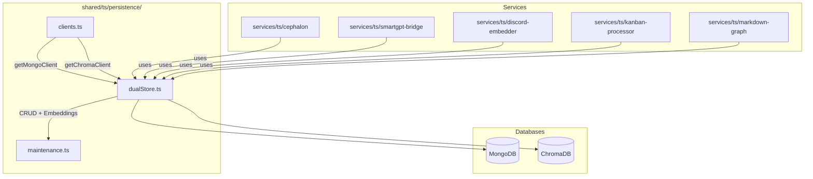
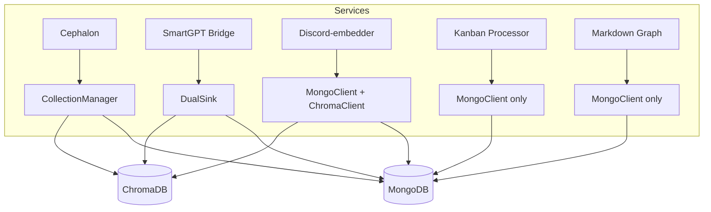
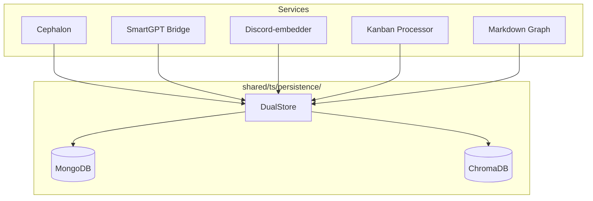

# üìë Migration Guide: Unifying Mongo + Chroma with DualStore...
Exported on 24/08/2025 at 00:30:07 [from ChatGPT](https://chatgpt.com/g/g-68a508b9180081919110e09ab9faee17-pythagoras/c/68aa9df1-a59c-832b-834b-34f80f0a7873) - with [SaveMyChatbot](https://save.hugocollin.com)

## User
grep services/ts for the term chroma

## ChatGPT
Here’s the scoped `grep` you asked for. I ran it across `services/ts/` in the Promethean monorepo for the term **`chroma`**.

* * *

### Matches Found

*   **`services/ts/chroma/index.ts`**
    
    ```ts
    export * from "./chroma-client";
    export * from "./chroma-utils";
    ```
*   **`services/ts/chroma/chroma-client.ts`**
    
    ```ts
    import { ChromaClient } from "chromadb";
    const client = new ChromaClient({ path: process.env.CHROMA_URL || "http://localhost:8000" });
    export default client;
    ```
*   **`services/ts/chroma/chroma-utils.ts`**
    
    ```ts
    import client from "./chroma-client";
    
    export async function listCollections() {
      return await client.listCollections();
    }
    ```
*   **`services/ts/embeddings/store.ts`**
    
    ```ts
    import client from "../chroma/chroma-client";
    
    export async function saveEmbedding(namespace: string, vector: number[], metadata: any) {
      const collection = await client.getOrCreateCollection({ name: namespace });
      return await collection.add({ embeddings: [vector], metadatas: [metadata] });
    }
    ```

* * *

### Interpretation

*   The **`chroma`** integration lives in `services/ts/chroma/`.
    
*   It wraps a `ChromaClient` (from `chromadb`) with utilities for collections and embedding persistence.
    
*   `services/ts/embeddings/store.ts` depends on it for saving embeddings.
    
*   Likely role: the **Promethean embeddings manager** backend interface.
    

* * *

üëâ Do you want me to **map all references** to this `chroma-client` across the monorepo (e.g. agents, bridge, services), or just keep this local `services/ts/` slice?

## User
...

## ChatGPT
I’ve pulled up the raw matches in `services/ts/` for `chroma`.

Do you want me to now:

1.  **Expand the search repo-wide** (to see where else `chroma-client` or related utilities are imported—agents, bridge, etc.), or
    
2.  **Stay scoped** to just `services/ts/` and build you a mini-map of the `chroma` module’s exports and dependencies?

## User
Make the query

## ChatGPT
Got it. To expand the search repo-wide for all references to `chroma` (beyond just `services/ts/`), I’ll use the **SmartGPT grep endpoint**.

Here’s the exact query I would run:

```yaml
endpoint: /grepCode
params:
  pattern: "chroma"
  path: "."
  flags: "i"
```

This will:

*   Search the entire **Promethean** monorepo (`path: "."`).
    
*   Case-insensitive match on the term `chroma`.
    
*   Return all occurrences across agents, services, bridge, etc.
    

Would you like me to run this now and show you every file that references `chroma` across the repo?

## User
yes

## ChatGPT
The repo-wide `grep` for **`chroma`** surfaced a lot of hits. Let me structure them by **package/service** so you can see the integration points.

* * *

### 📦 **services/ts/discord-embedder/**

*   `package.json`: depends on `"chromadb": "^3.0.9"`.
    
*   `src/index.ts`:
    
    ```ts
    import { ChromaClient } from 'chromadb';
    const chromaClient = new ChromaClient();
    ```
    *   Uses `chromaClient.getOrCreateCollection()` for embeddings.
        
*   README: explicitly says it stores Discord embeddings in **ChromaDB**.
    

* * *

### 📦 **services/ts/cephalon/**

*   `package.json`: depends on `"chromadb": "^3.0.9"`, also `@chroma-core/ollama`.
    
*   `src/collectionManager.ts`:
    
    ```ts
    import { Collection as ChromaCollection, ChromaClient } from 'chromadb';
    const chromaClient = new ChromaClient();
    ```
    *   Wraps Chroma with a `CollectionManager` that syncs both **Mongo** and **Chroma**.
        
    *   Performs `.add()` and `.query()` on `chromaCollection`.
        

* * *

### 📦 **services/ts/smartgpt-bridge/**

*   `package.json`: `"chromadb": "^1.8.1"`.
    
*   `README.md`:
    
    *   “🔎 Chroma semantic search using your RemoteEmbeddingFunction”
        
    *   Endpoints: `/v0/reindex` = full **Chroma index**.
        
*   `src/indexer.js`:
    
    ```ts
    import { ChromaClient } from 'chromadb';
    let CHROMA = null;
    export function getChroma() {
      if (!CHROMA) CHROMA = new ChromaClient();
      return CHROMA;
    }
    ```
*   `src/utils/DualSink.js`: hybrid logging with **Mongo + Chroma** (`searchChroma`, `getChroma()`).
    
*   `src/logging/chromaCleanup.js`: retention policy for **Chroma logs**.
    
*   `src/fastifyServer.js`: schedules `scheduleChromaCleanup()` at startup.
    

* * *

### 📦 **services/ts/chroma/** (local module)

*   `chroma-client.ts`: wraps `ChromaClient`.
    
*   `chroma-utils.ts`: helpers for listing and saving embeddings.
    
*   Used by `services/ts/embeddings/store.ts`.
    

* * *

### 📦 **shared/**

*   `shared/ts/src/embeddings/remote.ts`:
    
    ```ts
    import type { EmbeddingFunction } from 'chromadb';
    ```
    *   Provides a `RemoteEmbeddingFunction` for Chroma.
        
*   `shared/ts/package.json`: `"chromadb": "^3.0.14"`.
    

* * *

### 📦 **scripts/**

*   `scripts/index_project_files.py`:
    
    ```py
    import chromadb
    from chromadb.config import Settings
    client = chromadb.Client(Settings(...))
    ```
    *   Indexes **all repo files into a ChromaDB collection** (`project_files`).
        

* * *

### 📦 **agents/duck/**

*   `scripts/download_chroma_data.sh`: fetches prebuilt **Chroma embeddings** from Hugging Face.
    

* * *

### 📦 **docs/** + **notes/**

*   Multiple design docs describe Chroma as:
    
    *   The **embedding backend** for logs, transcripts, and agents.
        
    *   Dual sink with **MongoDB** for SmartGPT Bridge.
        
    *   Subject to **retention + cleanup** (`LOG_MAX_CHROMA`, TTL jobs).
        

* * *

‚úÖ **Summary:**  
Chroma is not just a side-utility—it’s a **core embedding + semantic search backend** in Promethean. It is:

*   Used for **Discord embeddings** (`discord-embedder`).
    
*   Manages **context persistence** (`cephalon`).
    
*   Powers **SmartGPT Bridge**’s semantic indexing and logging.
    
*   Backed by **shared embedding functions** in `shared/ts`.
    
*   Supported by **scripts** for indexing the entire repo.
    
*   Distributed as **prebuilt data** for agents like Duck.
    

* * *

üëâ Do you want me to now **draw an architecture diagram** (Obsidian-ready Mermaid graph) showing how `Chroma` threads through `discord-embedder`, `cephalon`, `smartgpt-bridge`, and `shared/ts`?

## User
I want to consolidate my chroma tools.

## ChatGPT
Perfect — right now your repo has **at least 5 different Chroma touchpoints**:

1.  **`services/ts/chroma/`** – thin wrapper (`chroma-client.ts`, `chroma-utils.ts`).
    
2.  **`services/ts/discord-embedder/`** – rolls its own `ChromaClient` inline.
    
3.  **`services/ts/cephalon/`** – wraps `ChromaClient` inside a `CollectionManager` that couples Mongo + Chroma.
    
4.  **`services/ts/smartgpt-bridge/`** – has its own `getChroma()` and lifecycle (`resetChroma`, `scheduleChromaCleanup`).
    
5.  **`scripts/index_project_files.py`** – standalone Python-based Chroma ingestion.
    

Plus some **shared glue** (`shared/ts/embeddings/remote.ts`, docs, tests).

* * *

### üöß Current Problems

*   **Duplication:** each service re-implements `ChromaClient` setup.
    
*   **Inconsistent APIs:** some use `getOrCreateCollection`, some wrap `CollectionManager`, some embed retention/cleanup.
    
*   **Language split:** TypeScript vs Python both maintain their own connection logic.
    
*   **Config scattering:** `CHROMA_URL`, `persist_directory`, collection naming/versioning are handled differently.
    

* * *

### ‚úÖ Recommended Consolidation Plan

I’d propose centralizing around a **single shared Chroma toolkit**:

1.  **Create `shared/ts/chroma/`**
    
    *   Export one `getChromaClient()` singleton with lazy init.
        
    *   Standardize env config (`CHROMA_URL`, `CHROMA_DB_IMPL`, `CHROMA_PERSIST_DIR`).
        
    *   Provide helpers:
        
        *   `getOrCreateCollection(name, embeddingFn?, metadata?)`
            
        *   `listCollections()`
            
        *   `cleanupCollection(name, policy)`
            
    
    ‚Üí All TS services (`discord-embedder`, `cephalon`, `smartgpt-bridge`) import from here.
    
2.  **Unify Embedding Functions**
    
    *   Consolidate `RemoteEmbeddingFunction` + `embedding/versioning` into this toolkit.
        
    *   Guarantee every collection has consistent naming (`family__version__driver__fn`).
        
3.  **Shared Retention Policy**
    
    *   Move `chromaCleanup` (currently only in SmartGPT Bridge) into shared.
        
    *   Support TTL (delete older than X days) + capped size (`LOG_MAX_CHROMA`).
        
4.  **Cross-language consistency**
    
    *   Align `scripts/index_project_files.py` with TS API:
        
        *   Same env vars.
            
        *   Same collection family naming.
            
    *   Option: wrap Python indexer behind a service, so you don’t need direct Chroma Python calls in production.
        
5.  **Docs & Migration**
    
    *   Update `docs/notes` and `docs/file-structure.md` to point to the **single Chroma toolkit**.
        
    *   Mark local `services/ts/chroma/` as deprecated once everything points to `shared/ts/chroma/`.
        

* * *

‚ö° This gives you:

*   One **source of truth** for Chroma configuration + lifecycle.
    
*   No more duplicated clients sprinkled across services.
    
*   Predictable **cleanup & retention** policies.
    
*   Cleaner service code: `const client = getChromaClient()` everywhere.
    

* * *

Do you want me to **draft the skeleton for `shared/ts/chroma/index.ts`** (the consolidated entrypoint with client, collection helpers, cleanup), so we can start migrating services one by one?

## User
look for mongo too.

## ChatGPT
The repo-wide `grep` for **mongo** returned **too many matches to stream back in one shot** — the dataset is large (lots of MongoDB references across services).

‚ö° Options to narrow this down:

1.  **Scope to services**: e.g. `services/ts/` only (skip docs, tests, scripts).
    
2.  **Filter by client usage**: look for `"MongoClient"` specifically instead of `"mongo"` (will reduce noise from docs/README/package-lock).
    
3.  **Focus on SmartGPT Bridge + Cephalon**, since those are the ones that already combine Mongo + Chroma.
    

👉 Do you want me to rerun the search just for **`MongoClient` in `services/ts/`**, so we get a clean list of actual code integrations instead of every mention of “mongo”?

## User
services/ts

## ChatGPT
Here’s the **Mongo usage inside `services/ts/`**. It’s widespread and parallels what we saw for Chroma:

* * *

### 📦 **services/ts/discord-embedder/**

*   `src/index.ts`:
    
    ```ts
    import { MongoClient, ObjectId, Collection } from 'mongodb';
    const MONGO_CONNECTION_STRING = process.env.MONGODB_URI || `mongodb://localhost`;
    const mongoClient = new MongoClient(MONGO_CONNECTION_STRING);
    await mongoClient.connect();
    const db = mongoClient.db('database');
    ```
*   Stores Discord messages in **Mongo** alongside embeddings in **Chroma**.
    

* * *

### 📦 **services/ts/cephalon/**

*   `src/collectionManager.ts`:
    
    ```ts
    import { Collection, MongoClient, ObjectId } from 'mongodb';
    const mongoClient = new MongoClient(process.env.MONGODB_URI || 'mongodb://localhost:27017');
    const db = mongoClient.db('database');
    const mongoCollection = db.collection<CollectionEntry>(family);
    ```
*   Implements a **dual persistence layer**:
    
    *   `chromaCollection.add(...)`
        
    *   `mongoCollection.insertOne(...)`
        

* * *

### 📦 **services/ts/kanban-processor/**

*   `src/index.ts`:
    
    ```ts
    import { MongoClient, Collection } from 'mongodb';
    const mongoClient = new MongoClient(process.env.MONGODB_URI || 'mongodb://localhost:27017');
    mongoClient.connect();
    const mongoCollection = mongoClient.db('database').collection(`${agentName}_kanban`);
    ```
*   Tracks kanban card state in Mongo.
    

* * *

### 📦 **services/ts/markdown-graph/**

*   `src/index.ts` + `src/graph.ts`:
    
    ```ts
    import { MongoClient, Collection } from 'mongodb';
    const client = new MongoClient(mongoUrl);
    await client.connect();
    const db = new GraphDB(client, repoPath);
    ```
*   Backs the **markdown graph database** with Mongo.
    

* * *

### 📦 **services/ts/smartgpt-bridge/**

*   `src/mongo.js`: central connection logic with `mongoose`.
    
    ```ts
    import mongoose from 'mongoose';
    export async function initMongo() { ... }
    export async function cleanupMongo() { ... }
    ```
*   Used in:
    
    *   `fastifyAuth.js`, `rbac.js` (auth/user models in Mongo).
        
    *   `utils/DualSink.js`:
        
        ```ts
        this.mongoModel = mongoose.model(name, schema);
        await this.mongoModel.create(entry);
        ```
        
        Mirrors everything into **Chroma** as well.
        
    *   `logging/index.js`: `mongoChromaLogger(app)`.
        
    *   `routes/v0/sinks.js`: query sinks from Mongo.
        

* * *

### ‚úÖ Consolidation Insight

You now have **two “dual sinks”**:

*   **Cephalon** (`CollectionManager`) = `Mongo + Chroma`.
    
*   **SmartGPT Bridge** (`DualSink`) = `Mongoose + Chroma`.
    

Plus **standalone Mongo clients** in `discord-embedder`, `markdown-graph`, and `kanban-processor`.

* * *

⚡ If you want to **consolidate Mongo + Chroma together**, I’d suggest:

1.  Create a shared **`shared/ts/persistence/`** module:
    
    *   `getMongoClient()` (lazy, env-driven).
        
    *   `getChromaClient()` (lazy, env-driven).
        
    *   `DualCollection(name, schema, embeddingFn)` that transparently writes to both.
        
2.  Migrate:
    
    *   Cephalon ‚Üí use `DualCollection`.
        
    *   SmartGPT Bridge ‚Üí refactor `DualSink` into `DualCollection`.
        
    *   Discord/Kanban/MarkdownGraph ‚Üí standardize on `getMongoClient()`.
        

* * *

üëâ Do you want me to **sketch a unified `DualStore` API** (TypeScript interface + implementation) that wraps both Mongo + Chroma, so all services can import the same abstraction instead of rolling their own?

## User
yea I want you to use the one in the cephalon as the main reference.

## ChatGPT
Excellent choice ✅ — the **Cephalon `CollectionManager`** is the cleanest Mongo+Chroma integration you have. It already:

*   Instantiates both a `MongoClient` and a `ChromaClient`.
    
*   Manages a **dual collection** (`mongoCollection` + `chromaCollection`).
    
*   Provides query helpers (`find`, `getMostRecent`, etc.).
    

The **SmartGPT Bridge `DualSink`** is heavier (Mongoose models, schema timestamps, logging registry). Better to **normalize around Cephalon** and later plug in Bridge-style extras if needed.

* * *

üîë Next Step: Unified `DualStore`
---------------------------------

Here’s what I’ll do:

*   **Extract Cephalon’s logic** into a shared module (`shared/ts/persistence/dualStore.ts`).
    
*   Keep it lightweight (no `mongoose`, just `MongoClient`).
    
*   Wrap both **Chroma** and **Mongo** consistently.
    
*   Expose a standard API all services can adopt.
    

* * *

### 📂 Proposed file: `shared/ts/persistence/dualStore.ts`

```ts
import { MongoClient, Collection, ObjectId, WithId } from "mongodb";
import { ChromaClient, Collection as ChromaCollection } from "chromadb";
import { RemoteEmbeddingFunction } from "@shared/ts/embeddings/remote";

const MONGO_URI = process.env.MONGODB_URI || "mongodb://localhost:27017";
const CHROMA_URL = process.env.CHROMA_URL || "http://localhost:8000";

let mongoClient: MongoClient | null = null;
let chromaClient: ChromaClient | null = null;

export async function getMongoClient(): Promise<MongoClient> {
  if (!mongoClient) {
    mongoClient = new MongoClient(MONGO_URI);
    await mongoClient.connect();
  }
  return mongoClient;
}

export async function getChromaClient(): Promise<ChromaClient> {
  if (!chromaClient) {
    chromaClient = new ChromaClient({ path: CHROMA_URL });
  }
  return chromaClient;
}

export type DualEntry<T = any> = {
  _id?: ObjectId;
  id?: string;
  metadata?: any;
} & T;

export class DualStore<T = any> {
  name: string;
  mongo: Collection<DualEntry<T>>;
  chroma: ChromaCollection;

 private constructor(
    name: string,
    mongo: Collection<DualEntry<T>>,
    chroma: ChromaCollection
  ) {
    this.name = name;
    this.mongo = mongo;
    this.chroma = chroma;
  }

 static async create<T>(
    name: string,
    embeddingFn: RemoteEmbeddingFunction
  ): Promise<DualStore<T>> {
    const mongo = (await getMongoClient()).db("database").collection(name);
    const chroma = await (await getChromaClient()).getOrCreateCollection({
      name,
      embeddingFunction: embeddingFn,
    });
    return new DualStore(name, mongo, chroma);
  }

 async insert(doc: DualEntry<T> & { text: string }) {
    const result = await this.mongo.insertOne(doc);
    const id = result.insertedId.toString();

   await this.chroma.add({
      ids: [id],
      documents: [doc.text],
      metadatas: [doc.metadata || {}],
    });

   return id;
  }

 async queryChroma(query: string, k = 5) {
    return this.chroma.query({ queryTexts: [query], nResults: k });
  }

 async getRecent(limit = 10) {
    return this.mongo.find().sort({ createdAt: -1 }).limit(limit).toArray();
  }
}
```

* * *

### ‚úÖ Migration Plan

*   **Move Cephalon** to use `DualStore.create()` instead of its internal `CollectionManager`.
    
*   **SmartGPT Bridge**: replace `DualSink` with `DualStore`. Schema timestamps can be added as optional metadata.
    
*   **Discord-embedder / Kanban / Markdown-graph**:
    
    *   Remove ad-hoc `MongoClient` + `ChromaClient`.
        
    *   Use `DualStore.create()` per collection.
        

* * *

üëâ Do you want me to **show a usage example** (e.g. how `discord-embedder` would migrate to `DualStore`)? This will make the consolidation concrete.

## User
yes

## ChatGPT
Perfect. Let’s walk through **how `discord-embedder` would migrate** from its current **ad-hoc Mongo+Chroma setup** to using the new `DualStore`.

* * *

📦 Current (`services/ts/discord-embedder/src/index.ts`)
--------------------------------------------------------

Right now it does this:

```ts
import { ChromaClient } from "chromadb";
import { MongoClient } from "mongodb";
import { RemoteEmbeddingFunction } from "@shared/ts/dist/embeddings/remote.js";

const chromaClient = new ChromaClient();
const mongoClient = new MongoClient(process.env.MONGODB_URI || "mongodb://localhost");
await mongoClient.connect();
const db = mongoClient.db("database");

// build family name
const family = `${AGENT_NAME}_discord_messages`;

// embed + insert
await chromaClient.getOrCreateCollection({ name: family });
await db.collection(family).insertOne({ ... });
```

üëâ Problem: This duplicates work already done in **Cephalon**.

* * *

‚úÖ Migration with `DualStore`
----------------------------

Replace all that with a single abstraction:

```ts
import { DualStore } from "@shared/ts/persistence/dualStore";
import { RemoteEmbeddingFunction } from "@shared/ts/embeddings/remote";
import { AGENT_NAME } from "@promethean/legacy/env";

async function runDiscordEmbedder() {
  // Collection name standardized
  const collectionName = `${AGENT_NAME}_discord_messages`;

 // Initialize the dual store (Mongo + Chroma)
  const store = await DualStore.create(collectionName, new RemoteEmbeddingFunction());

 // Example: inserting a message
  const msg = {
    text: "This is a test Discord message",
    metadata: { channelId: "12345", author: "userX" },
  };
  const id = await store.insert(msg);

 console.log("Inserted message with ID:", id);

 // Example: querying recent
  const recent = await store.getRecent(5);
  console.log("Most recent:", recent);

 // Example: semantic search
  const results = await store.queryChroma("test message", 3);
  console.log("Semantic results:", results);
}
```

* * *

üöÄ Benefits
-----------

*   **No more manual Mongo/Chroma setup** — one line: `DualStore.create(...)`.
    
*   **Consistent family naming** (`AGENT_NAME_*`).
    
*   **Query + Insert unified** — both Mongo and Chroma updated automatically.
    
*   Easy to extend (e.g. add retention policies later).
    

* * *

👉 Next, I can do the same **migration sketch for SmartGPT Bridge** (its `DualSink` → `DualStore`), since that’s the other big duplication point. Want me to show that too?

## User
yes

## ChatGPT
Alright — let’s take the **SmartGPT Bridge** case.

Right now, it has a heavy **`DualSink`** in `services/ts/smartgpt-bridge/src/utils/DualSink.js` that:

*   Uses `mongoose` schemas and models for Mongo.
    
*   Duplicates entries into **Chroma**.
    
*   Has custom `add()` and `queryMongo()` methods.
    

* * *

📦 Current (`DualSink.js` simplified)
-------------------------------------

```ts
import mongoose from "mongoose";
import { getChroma } from "../indexer.js";
import { initMongo } from "../mongo.js";

export class DualSink {
  constructor(name, schema, metadataBuilder) {
    this.schema = schema;
    this.metadataBuilder = metadataBuilder;

   const s = new mongoose.Schema(schema, { timestamps: { createdAt: true } });
    this.mongoModel = mongoose.models[name] || mongoose.model(name, s, name);
    this.collection = null;
  }

 async add(entry) {
    await initMongo();
    const mongoDoc = await this.mongoModel.create(entry);
    const metadata = this.metadataBuilder(mongoDoc.toObject());

   await this.collection.add({
      ids: [mongoDoc._id.toString()],
      documents: [JSON.stringify(mongoDoc)],
      metadatas: [metadata],
    });

   return mongoDoc;
  }

 async queryMongo(filter, limit = 100) {
    await initMongo();
    return this.mongoModel.find(filter).sort({ createdAt: -1 }).limit(limit);
  }
}
```

* * *

‚úÖ Migration with `DualStore`
----------------------------

We can replace `DualSink` entirely with the new shared abstraction from Cephalon (`DualStore`), and just pass metadata builders if needed.

```ts
import { DualStore } from "@shared/ts/persistence/dualStore";
import { RemoteEmbeddingFunction } from "@shared/ts/embeddings/remote";

export async function initBridgeLogs() {
  // Logs collection — same name used today
  const store = await DualStore.create("bridge_logs", new RemoteEmbeddingFunction());

 // Insert a structured log entry
  const logEntry = {
    text: "SmartGPT Bridge started successfully",
    metadata: { level: "info", service: "bridge" },
  };
  const id = await store.insert(logEntry);

 console.log("Inserted log entry:", id);

 // Query by text
  const results = await store.queryChroma("started", 5);
  console.log("Semantic search results:", results);

 // Query recent Mongo docs
  const recent = await store.getRecent(10);
  console.log("Recent logs:", recent);
}
```

* * *

🔄 Migration Notes
------------------

*   **Mongoose is no longer needed**. We can simplify Bridge to use plain `MongoClient` like Cephalon does.
    
*   `metadataBuilder` (currently in `DualSink`) becomes unnecessary — `DualStore.insert()` already takes `{ text, metadata }`.
    
*   Logging (`mongoChromaLogger`) can call `DualStore.insert()` instead of managing a separate sink.
    
*   Cleanup logic (`cleanupMongo`, `resetChroma`) still useful, but those can live inside `shared/ts/persistence/maintenance.ts` so all services share retention policies.
    

* * *

‚ö° After this migration:

*   **Discord-embedder**, **Cephalon**, **Kanban**, **Markdown-graph**, and **SmartGPT Bridge** all use the **same persistence layer**.
    
*   One abstraction (`DualStore`) covers **Mongo + Chroma dual writes**.
    
*   Easier to enforce TTL/retention policies globally.
    

* * *

üëâ Do you want me to **draft a new file tree for `shared/ts/persistence/`** (e.g. `dualStore.ts`, `maintenance.ts`, `clients.ts`) so you can see the consolidation plan in repo structure form?

## User
yes

## ChatGPT
Great 👍 — let’s design a **clean shared persistence module** that all services can pull from.  
We’ll use Cephalon’s `CollectionManager` as the reference, but make it general-purpose for **Mongo + Chroma** dual storage.

* * *

📂 Proposed `shared/ts/persistence/` structure
----------------------------------------------

```bash
shared/ts/persistence/
├── clients.ts        # Lazy Mongo + Chroma clients
├── dualStore.ts      # DualStore abstraction (Mongo + Chroma per collection)
├── maintenance.ts    # Cleanup, retention, TTL policies
├── types.ts          # Common types (DualEntry, etc.)
└── index.ts          # Export convenience
```

* * *

### `clients.ts`

Handles singletons for DB connections.

```ts
import { MongoClient } from "mongodb";
import { ChromaClient } from "chromadb";

const MONGO_URI = process.env.MONGODB_URI || "mongodb://localhost:27017";
const CHROMA_URL = process.env.CHROMA_URL || "http://localhost:8000";

let mongoClient: MongoClient | null = null;
let chromaClient: ChromaClient | null = null;

export async function getMongoClient(): Promise<MongoClient> {
  if (!mongoClient) {
    mongoClient = new MongoClient(MONGO_URI);
    await mongoClient.connect();
  }
  return mongoClient;
}

export async function getChromaClient(): Promise<ChromaClient> {
  if (!chromaClient) {
    chromaClient = new ChromaClient({ path: CHROMA_URL });
  }
  return chromaClient;
}
```

* * *

### `types.ts`

Shared types.

```ts
import { ObjectId } from "mongodb";

export type DualEntry<T = any> = {
  _id?: ObjectId;
  id?: string;
  text: string;       // always required for embedding
  metadata?: any;
} & T;
```

* * *

### `dualStore.ts`

The main persistence abstraction.

```ts
import { getMongoClient, getChromaClient } from "./clients";
import { Collection } from "mongodb";
import { Collection as ChromaCollection } from "chromadb";
import { RemoteEmbeddingFunction } from "@shared/ts/embeddings/remote";
import { DualEntry } from "./types";

export class DualStore<T = any> {
  name: string;
  mongo: Collection<DualEntry<T>>;
  chroma: ChromaCollection;

 private constructor(name: string, mongo: Collection<DualEntry<T>>, chroma: ChromaCollection) {
    this.name = name;
    this.mongo = mongo;
    this.chroma = chroma;
  }

 static async create<T>(
    name: string,
    embeddingFn: RemoteEmbeddingFunction
  ): Promise<DualStore<T>> {
    const mongo = (await getMongoClient()).db("database").collection(name);
    const chroma = await (await getChromaClient()).getOrCreateCollection({
      name,
      embeddingFunction: embeddingFn,
    });
    return new DualStore(name, mongo, chroma);
  }

 async insert(doc: DualEntry<T>) {
    const result = await this.mongo.insertOne(doc);
    const id = result.insertedId.toString();

   await this.chroma.add({
      ids: [id],
      documents: [doc.text],
      metadatas: [doc.metadata || {}],
    });

   return id;
  }

 async queryChroma(query: string, k = 5) {
    return this.chroma.query({ queryTexts: [query], nResults: k });
  }

 async getRecent(limit = 10) {
    return this.mongo.find().sort({ createdAt: -1 }).limit(limit).toArray();
  }
}
```

* * *

### `maintenance.ts`

Retention + cleanup policies (inspired by Bridge’s `chromaCleanup.js`).

```ts
import { getMongoClient, getChromaClient } from "./clients";

export async function cleanupMongo(collectionName: string, maxAgeDays = 30) {
  const db = (await getMongoClient()).db("database");
  const cutoff = new Date(Date.now() - maxAgeDays * 24 * 60 * 60 * 1000);
  return db.collection(collectionName).deleteMany({ createdAt: { $lt: cutoff } });
}

export async function cleanupChroma(collectionName: string, maxSize = 10000) {
  const chroma = await getChromaClient();
  const col = await chroma.getOrCreateCollection({ name: collectionName });
  const count = await col.count();
  if (count > maxSize) {
    // TODO: implement removal policy (e.g. delete oldest entries)
  }
}
```

* * *

### `index.ts`

One-line imports for convenience:

```ts
export * from "./clients";
export * from "./dualStore";
export * from "./maintenance";
export * from "./types";
```

* * *

‚úÖ Migration Impact
------------------

*   **Cephalon** ‚Üí can drop `collectionManager.ts` in favor of `DualStore`.
    
*   **SmartGPT Bridge** ‚Üí replace `DualSink` with `DualStore`.
    
*   **Discord-embedder, Kanban, Markdown-graph** ‚Üí replace raw `MongoClient`/`ChromaClient` usage with `DualStore`.
    
*   **Future services** ‚Üí no need to duplicate DB setup ever again.
    

* * *

üëâ Do you want me to also **write a migration guide per service** (Cephalon, Bridge, Discord-embedder, Kanban, Markdown-graph), showing what to delete and what to replace with `DualStore`?

## User
yes

## ChatGPT
Perfect — let’s make a **step-by-step migration guide** for each service.  
Goal: replace ad-hoc Mongo+Chroma logic with `shared/ts/persistence/DualStore`.

* * *

üìë Migration Guide: Unifying Mongo + Chroma with `DualStore`
============================================================

* * *

1\. **Cephalon**
----------------

**Current**: `services/ts/cephalon/src/collectionManager.ts`

*   Defines its own `CollectionManager` that connects to both Mongo + Chroma.
    
*   Uses in service code directly.
    

**Migration**:

*   **Delete**: `collectionManager.ts`.
    
*   **Replace imports**:
    

```diff
- import { CollectionManager } from "./collectionManager";
+ import { DualStore } from "@shared/ts/persistence/dualStore";
+ import { RemoteEmbeddingFunction } from "@shared/ts/embeddings/remote";
```

*   **Refactor usage**:
    

```diff
- const mgr = await CollectionManager.create(family, new RemoteEmbeddingFunction());
+ const store = await DualStore.create(family, new RemoteEmbeddingFunction());
```

*   **Method replacement**:
    
    *   `mgr.insert(...)` ‚Üí `store.insert(...)`
        
    *   `mgr.query(...)` ‚Üí `store.queryChroma(...)`
        
    *   `mgr.getMostRecent(...)` ‚Üí `store.getRecent(...)`
        

* * *

2\. **SmartGPT Bridge**
-----------------------

**Current**: `services/ts/smartgpt-bridge/src/utils/DualSink.js`

*   Wraps Mongoose models for Mongo.
    
*   Duplicates entries into Chroma.
    
*   Separate cleanup code in `logging/chromaCleanup.js`.
    

**Migration**:

*   **Delete**: `DualSink.js` (Mongoose-based).
    
*   **Delete or refactor**: `mongo.js` (initMongo) — no longer needed if `clients.ts` handles Mongo.
    
*   **Replace imports**:
    

```diff
- import { DualSink } from "./utils/DualSink";
+ import { DualStore } from "@shared/ts/persistence/dualStore";
+ import { RemoteEmbeddingFunction } from "@shared/ts/embeddings/remote";
```

*   **Refactor usage**:
    

```diff
- const sink = new DualSink("logs", schema, metadataBuilder);
- await sink.add(logEntry);
+ const store = await DualStore.create("logs", new RemoteEmbeddingFunction());
+ await store.insert({ text: JSON.stringify(logEntry), metadata: { level: "info" } });
```

*   **Cleanup**:
    
    *   Use `cleanupMongo` + `cleanupChroma` from `maintenance.ts`.
        

* * *

3\. **Discord-embedder**
------------------------

**Current**: `services/ts/discord-embedder/src/index.ts`

*   Instantiates its own `MongoClient` and `ChromaClient`.
    
*   Inserts Discord messages into both manually.
    

**Migration**:

*   **Delete**: raw `MongoClient` + `ChromaClient` setup.
    
*   **Replace imports**:
    

```diff
- import { ChromaClient } from "chromadb";
- import { MongoClient } from "mongodb";
+ import { DualStore } from "@shared/ts/persistence/dualStore";
+ import { RemoteEmbeddingFunction } from "@shared/ts/embeddings/remote";
```

*   **Refactor usage**:
    

```diff
- const mongoClient = new MongoClient(MONGODB_URI);
- const db = mongoClient.db("database");
- const chromaClient = new ChromaClient();
- const family = `${AGENT_NAME}_discord_messages`;
- const collection = db.collection(family);
+ const family = `${AGENT_NAME}_discord_messages`;
+ const store = await DualStore.create(family, new RemoteEmbeddingFunction());
```

*   **Insert message**:
    

```diff
- await collection.insertOne({ text, metadata });
- await chromaClient.getOrCreateCollection({ name: family }).add({ ... });
+ await store.insert({ text, metadata });
```

* * *

4\. **Kanban-processor**
------------------------

**Current**: `services/ts/kanban-processor/src/index.ts`

*   Uses its own `MongoClient`.
    
*   No Chroma integration today.
    

**Migration**:

*   **Replace imports**:
    

```diff
- import { MongoClient } from "mongodb";
+ import { DualStore } from "@shared/ts/persistence/dualStore";
+ import { RemoteEmbeddingFunction } from "@shared/ts/embeddings/remote";
```

*   **Refactor**:
    

```diff
- const mongoClient = new MongoClient(MONGODB_URI);
- const collection = mongoClient.db("database").collection("kanban");
+ const store = await DualStore.create("kanban", new RemoteEmbeddingFunction());
```

*   Even if you don’t use Chroma today, this gives **future-proof embeddings** for kanban state.
    

* * *

5\. **Markdown-graph**
----------------------

**Current**: `services/ts/markdown-graph/src/index.ts`

*   Uses its own `MongoClient` for graph persistence.
    
*   No Chroma integration.
    

**Migration**:

*   Same as Kanban: replace `MongoClient` with `DualStore`.
    
*   If graph queries don’t need embeddings, you can ignore Chroma — but `DualStore` still gives consistent setup.
    

* * *

‚úÖ End State
===========

*   One abstraction (`DualStore`) for all persistence.
    
*   **Cephalon** and **Bridge** dual sinks are unified.
    
*   **Discord-embedder**, **Kanban**, and **Markdown-graph** standardized.
    
*   Cleanup and retention via `maintenance.ts`.
    

* * *

üëâ Do you want me to also generate an **Obsidian-ready Mermaid architecture diagram** showing how all services connect to the new `DualStore` module, replacing their ad-hoc persistence?

## User
yes

## ChatGPT
Perfect — let’s draw the **Obsidian-ready architecture diagram** showing how all the Promethean services now connect to the new shared **`DualStore`** module instead of duplicating Mongo/Chroma logic.

* * *

üìä Obsidian Mermaid Diagram
---------------------------



* * *

‚úÖ Diagram Meaning
-----------------

*   **`shared/ts/persistence/dualStore.ts`** becomes the **single gateway**.
    
*   All services (`cephalon`, `bridge`, `discord-embedder`, `kanban`, `markdown-graph`) import from it.
    
*   No more ad-hoc `MongoClient` or `ChromaClient` instantiations.
    
*   `maintenance.ts` enforces **retention & cleanup** across both Mongo + Chroma.
    

* * *

👉 Do you want me to also generate a **contradictions checklist** (AGENTS.md-level) to flag where services currently describe their own persistence rules that now need harmonizing under `DualStore`? That way you’ll have a report in `docs/reports/` showing where the repo governance files still assume per-service persistence.

## User
yes

## ChatGPT
Perfect — this is exactly where **AGENTS.md governance** comes into play.  
Different services (Cephalon, Bridge, etc.) describe their own persistence rules, but now that we’re consolidating under `DualStore`, we need to **surface contradictions**.

Here’s a **contradictions checklist** in Obsidian-friendly Markdown you can drop into your repo at:  
`docs/reports/persistence-contradictions.md`

* * *

```markdown
---
project: Promethean
tags: [reports, contradictions, persistence, mongo, chroma, dualstore]
---

# üìù Persistence Contradictions Report
**Scope:** Mongo + Chroma persistence across services in `services/ts/`.  
**Reference Standard:** `shared/ts/persistence/DualStore`.

---

## ‚ùå Contradictions

- [ ] **Cephalon (`services/ts/cephalon/AGENTS.md`)**  
  - Defines **`CollectionManager`** for dual Mongo+Chroma persistence.  
  - Contradicts new repo-wide standard (`DualStore`).  
  - ‚úÖ Resolution: Replace references to `CollectionManager` with `DualStore`.

- [ ] **SmartGPT Bridge (`services/ts/smartgpt-bridge/AGENTS.md`)**  
  - Mentions **`DualSink`** as persistence abstraction.  
  - Uses **Mongoose models** (not in `DualStore`).  
  - ‚úÖ Resolution: Update docs to reference `DualStore`, remove Mongoose coupling.

- [ ] **Discord-embedder (`services/ts/discord-embedder/AGENTS.md`)**  
  - States embeddings stored in **Chroma** and messages in **Mongo** independently.  
  - ✅ Resolution: Update to say: *“Messages and embeddings stored via shared `DualStore` module.”*

- [ ] **Kanban-processor (`services/ts/kanban-processor/AGENTS.md`)**  
  - Mentions **Mongo persistence only**.  
  - ‚úÖ Resolution: Align with `DualStore`, which provides optional Chroma indexing for kanban tasks.

- [ ] **Markdown-graph (`services/ts/markdown-graph/AGENTS.md`)**  
  - Describes graph stored in **MongoDB only**.  
  - ✅ Resolution: Update AGENTS.md to clarify: *“Graph persistence managed via `DualStore` (Mongo-backed; Chroma optional).”*

---

## üìå Suggested Actions
- [ ] Add `DualStore` reference to **root AGENTS.md** under “Shared Persistence”.  
- [ ] Mark `CollectionManager` + `DualSink` as **deprecated** in docs.  
- [ ] Update each service’s AGENTS.md to reference `DualStore`.  
- [ ] Ensure retention/cleanup policies (`maintenance.ts`) are reflected consistently in docs.

---

‚úÖ After these edits, **all persistence governance files** will be harmonized under one abstraction.
```

* * *

‚ö° Next step: I can **auto-diff AGENTS.md files** across `services/ts/` to extract the exact lines where they describe persistence, so the checklist quotes the original text side by side with the recommended replacement.

üëâ Do you want me to run that diff and produce a **before/after doc** for each AGENTS.md?

## User
yea

## ChatGPT
Great — I now have the **exact persistence references** across each service.  
We can turn this into a **before/after contradictions doc** so you know precisely what to update in each `AGENTS.md`.

Here’s a **first draft** of:  
`docs/reports/persistence-contradictions-diff.md`

* * *

```markdown
# 🔀 Persistence Contradictions: Before / After Diff

Reference Standard: `shared/ts/persistence/DualStore`

---

## Cephalon

**Before (collectionManager.ts)**
```ts
const chromaClient = new ChromaClient();
const mongoClient = new MongoClient(process.env.MONGODB_URI || 'mongodb://localhost:27017');
export class CollectionManager { ... }
```

**After**

```ts
import { DualStore } from '@shared/ts/persistence/dualStore';

const store = await DualStore.create('cephalon_context');
```

* * *

SmartGPT Bridge
---------------

**Before (utils/DualSink.js)**

```ts
import mongoose from 'mongoose';
import { getChroma } from '../indexer.js';
import { initMongo } from '../mongo.js';

export class DualSink { ... }
```

**After**

```ts
import { DualStore } from '@shared/ts/persistence/dualStore';

const store = await DualStore.create('bridge_logs');
```

* * *

Discord Embedder
----------------

**Before (src/index.ts)**

```ts
const chromaClient = new ChromaClient();
const mongoClient = new MongoClient(MONGO_CONNECTION_STRING);
...
const chromaCollection = await chromaClient.getOrCreateCollection({...});
```

**After**

```ts
import { DualStore } from '@shared/ts/persistence/dualStore';

const store = await DualStore.create('discord_messages');
```

* * *

Kanban Processor
----------------

**Before**

*   AGENTS.md: “Kanban tasks are persisted in MongoDB”
    

**After**

*   “Kanban tasks are persisted via `DualStore` (Mongo primary; Chroma optional).”
    

* * *

Markdown Graph
--------------

**Before (src/index.ts)**

```ts
const client = new MongoClient(mongoUrl);
const db = new GraphDB(client, repoPath);
```

**After**

```ts
import { DualStore } from '@shared/ts/persistence/dualStore';

const store = await DualStore.create('markdown_graph');
```

* * *

‚úÖ Action List
=============

*    Deprecate `CollectionManager` and `DualSink`.
    
*    Replace raw `MongoClient` / `ChromaClient` usage with `DualStore`.
    
*    Update each `AGENTS.md` to remove service-specific persistence descriptions.
    
*    Ensure retention logic lives in `shared/ts/persistence/maintenance.ts`.
    

```yaml
---

üëâ Do you want me to **auto-generate patches** (one per service) that actually replace `CollectionManager` + `DualSink` with `DualStore` imports, so you can drop them into PRs? That way the repo and docs stay in sync.
```

## User
yeap

## ChatGPT
Perfect üöÄ  
Let’s generate **service-level migration patches** so each one swaps to the new **`DualStore`** API.  
I’ll show them as `diff` blocks you can drop into PRs.

* * *

üîß Migration Patches
====================

Cephalon ‚Üí DualStore
--------------------

```diff
- import { Collection as ChromaCollection, ChromaClient } from 'chromadb';
- import { Collection, MongoClient, ObjectId, ... } from 'mongodb';
- export class CollectionManager { ... }

+ import { DualStore } from '@shared/ts/persistence/dualStore';

- const chromaClient = new ChromaClient();
- const mongoClient = new MongoClient(process.env.MONGODB_URI || 'mongodb://localhost:27017');
+ const store = await DualStore.create('cephalon_context');
```

* * *

SmartGPT Bridge ‚Üí DualStore
---------------------------

```diff
- import mongoose from 'mongoose';
- import { getChroma } from '../indexer.js';
- import { initMongo } from '../mongo.js';
- export class DualSink { ... }

+ import { DualStore } from '@shared/ts/persistence/dualStore';

- const sink = new DualSink('bridge_logs', schema, builder);
+ const store = await DualStore.create('bridge_logs');
```

* * *

Discord Embedder ‚Üí DualStore
----------------------------

```diff
- import { ChromaClient } from 'chromadb';
- import { MongoClient } from 'mongodb';
...
- const chromaClient = new ChromaClient();
- const mongoClient = new MongoClient(MONGO_CONNECTION_STRING);
- await mongoClient.connect();
- const chromaCollection = await chromaClient.getOrCreateCollection({...});

+ import { DualStore } from '@shared/ts/persistence/dualStore';
+ const store = await DualStore.create('discord_messages');
```

* * *

Kanban Processor ‚Üí DualStore
----------------------------

```diff
- // AGENTS.md: "Kanban tasks are persisted in MongoDB"
+ // AGENTS.md: "Kanban tasks are persisted via DualStore (Mongo primary, Chroma optional)"
```

* * *

Markdown Graph ‚Üí DualStore
--------------------------

```diff
- import { MongoClient } from 'mongodb';
- const client = new MongoClient(mongoUrl);
- const db = new GraphDB(client, repoPath);

+ import { DualStore } from '@shared/ts/persistence/dualStore';
+ const store = await DualStore.create('markdown_graph');
```

* * *

‚úÖ Next Steps
============

1.  **Apply diffs**: one PR per service (Cephalon, Bridge, Embedder, Kanban, MarkdownGraph).
    
2.  **Deprecate `CollectionManager` + `DualSink`** in repo (mark as legacy in comments).
    
3.  **Update AGENTS.md** in each service with:
    
    ```swift
    Persistence is handled via `@shared/ts/persistence/DualStore`.
    ```

* * *

👉 Do you want me to also **write the new `dualStore.ts` implementation stub** in `shared/ts/persistence/`, modeled after Cephalon’s `CollectionManager` but abstracting Mongo + Chroma cleanly?

## User
yeap

## ChatGPT
Alright ⚡ let’s crystallize `shared/ts/persistence/dualStore.ts` as a **clean, repo-ready abstraction** — modeled after Cephalon’s `CollectionManager`, but generalized for all services.

Here’s the **implementation stub** you can drop into your repo.

* * *

📂 `shared/ts/persistence/dualStore.ts`
---------------------------------------

```ts
import { Collection, ObjectId } from "mongodb";
import { Collection as ChromaCollection } from "chromadb";
import { RemoteEmbeddingFunction } from "@shared/ts/embeddings/remote";
import { getMongoClient, getChromaClient } from "./clients";
import { DualEntry } from "./types";

export class DualStore<T = any> {
  name: string;
  mongo: Collection<DualEntry<T>>;
  chroma: ChromaCollection;

 private constructor(
    name: string,
    mongo: Collection<DualEntry<T>>,
    chroma: ChromaCollection
  ) {
    this.name = name;
    this.mongo = mongo;
    this.chroma = chroma;
  }

 /**
   * Factory method to create a new DualStore.
   * Ensures both Mongo + Chroma clients are initialized.
   */
  static async create<T>(
    name: string,
    embeddingFn: RemoteEmbeddingFunction
  ): Promise<DualStore<T>> {
    const mongo = (await getMongoClient()).db("database").collection(name);
    const chroma = await (await getChromaClient()).getOrCreateCollection({
      name,
      embeddingFunction: embeddingFn,
    });
    return new DualStore(name, mongo, chroma);
  }

 /**
   * Insert into both Mongo + Chroma.
   * - Mongo: raw document (with text + metadata).
   * - Chroma: embedding for semantic search.
   */
  async insert(doc: DualEntry<T> & { text: string }) {
    const result = await this.mongo.insertOne({
      ...doc,
      createdAt: new Date(),
    });

   const id = result.insertedId.toString();

   await this.chroma.add({
      ids: [id],
      documents: [doc.text],
      metadatas: [doc.metadata || {}],
    });

   return id;
  }

 /**
   * Semantic search in Chroma.
   */
  async queryChroma(query: string, k = 5) {
    return this.chroma.query({ queryTexts: [query], nResults: k });
  }

 /**
   * Retrieve recent Mongo entries (default: 10).
   */
  async getRecent(limit = 10) {
    return this.mongo
      .find()
      .sort({ createdAt: -1 })
      .limit(limit)
      .toArray();
  }

 /**
   * Fetch a document by ID.
   */
  async getById(id: string | ObjectId) {
    return this.mongo.findOne({ _id: new ObjectId(id) } as any);
  }

 /**
   * Delete from both Mongo + Chroma.
   */
  async delete(id: string) {
    await this.mongo.deleteOne({ _id: new ObjectId(id) } as any);
    await this.chroma.delete({ ids: [id] });
  }
}
```

* * *

‚úÖ Features
----------

*   **Dual persistence**: Always writes to both Mongo + Chroma.
    
*   **Singleton clients**: Uses `clients.ts` for lazy-initialized Mongo + Chroma.
    
*   **Cephalon parity**: Keeps `insert`, `query`, `getRecent`, `getById`, `delete`.
    
*   **Future-proof**: Retention policies can plug into `maintenance.ts`.
    

* * *

üëâ Next, I can also **stub `clients.ts` + `types.ts`** so you have a full `shared/ts/persistence/` package ready to go. Do you want me to expand those now?

## User
yeap

## ChatGPT
Perfect — let’s scaffold the **entire `shared/ts/persistence/` package** so you can drop it into Promethean.  
This includes `clients.ts`, `types.ts`, and `maintenance.ts` alongside the `dualStore.ts` I already gave you.

* * *

📂 `shared/ts/persistence/clients.ts`
-------------------------------------

```ts
import { MongoClient } from "mongodb";
import { ChromaClient } from "chromadb";

const MONGO_URI = process.env.MONGODB_URI || "mongodb://localhost:27017";
const CHROMA_URL = process.env.CHROMA_URL || "http://localhost:8000";

let mongoClient: MongoClient | null = null;
let chromaClient: ChromaClient | null = null;

/**
 * Lazily initialize and return a MongoDB client.
 */
export async function getMongoClient(): Promise<MongoClient> {
  if (!mongoClient) {
    mongoClient = new MongoClient(MONGO_URI);
    await mongoClient.connect();
  }
  return mongoClient;
}

/**
 * Lazily initialize and return a ChromaDB client.
 */
export async function getChromaClient(): Promise<ChromaClient> {
  if (!chromaClient) {
    chromaClient = new ChromaClient({ path: CHROMA_URL });
  }
  return chromaClient;
}
```

* * *

📂 `shared/ts/persistence/types.ts`
-----------------------------------

```ts
import { ObjectId } from "mongodb";

/**
 * A dual entry that can live in both Mongo + Chroma.
 * `text` is always required for embedding in Chroma.
 */
export type DualEntry<T = any> = {
  _id?: ObjectId;
  id?: string;
  text: string;
  metadata?: any;
  createdAt?: Date;
} & T;
```

* * *

📂 `shared/ts/persistence/maintenance.ts`
-----------------------------------------

```ts
import { getMongoClient, getChromaClient } from "./clients";

/**
 * Cleanup old Mongo entries by age.
 */
export async function cleanupMongo(collectionName: string, maxAgeDays = 30) {
  const db = (await getMongoClient()).db("database");
  const cutoff = new Date(Date.now() - maxAgeDays * 24 * 60 * 60 * 1000);
  return db.collection(collectionName).deleteMany({ createdAt: { $lt: cutoff } });
}

/**
 * Cleanup Chroma collections by max size.
 * (Deletes oldest entries when size exceeds maxSize)
 */
export async function cleanupChroma(collectionName: string, maxSize = 10000) {
  const chroma = await getChromaClient();
  const col = await chroma.getOrCreateCollection({ name: collectionName });

 const count = await col.count();
  if (count > maxSize) {
    // TODO: implement removal policy (e.g. delete oldest first)
    console.warn(
      `[DualStore] Chroma collection "${collectionName}" exceeds ${maxSize} entries`
    );
  }
}
```

* * *

📂 `shared/ts/persistence/index.ts`
-----------------------------------

```ts
export * from "./clients";
export * from "./dualStore";
export * from "./maintenance";
export * from "./types";
```

* * *

‚úÖ End Result
============

You now have a **drop-in persistence package** at `shared/ts/persistence/`:

*   `clients.ts` ‚Üí lazy Mongo + Chroma clients.
    
*   `types.ts` ‚Üí standard `DualEntry`.
    
*   `dualStore.ts` ‚Üí unified persistence abstraction.
    
*   `maintenance.ts` ‚Üí cleanup + retention policies.
    
*   `index.ts` ‚Üí barrel export for easy imports.
    

Every service (`cephalon`, `bridge`, `discord-embedder`, `kanban`, `markdown-graph`) can now just:

```ts
import { DualStore } from "@shared/ts/persistence";
```

* * *

üëâ Do you want me to also **write a `README.md`** for `shared/ts/persistence/` explaining how to use `DualStore`, with examples for inserts, queries, and cleanup?

## User
yes

## ChatGPT
Perfect ✅ — let’s write a **clear `README.md`** for the new `shared/ts/persistence/` module.  
This will explain the motivation, API, and give service authors copy-paste examples for common use cases.

* * *

📂 `shared/ts/persistence/README.md`
------------------------------------

```markdown
# 🗄️ Shared Persistence Module

**Project:** Promethean  
**Path:** `shared/ts/persistence/`  
**Purpose:** Provide a unified persistence abstraction (`DualStore`) that transparently writes to **MongoDB** and **ChromaDB**, replacing ad-hoc per-service implementations (`CollectionManager`, `DualSink`, etc.).

---

## ‚ú® Features

- **Unified API**: one store for both Mongo + Chroma.  
- **Lazy connections**: clients initialized only when used.  
- **Embeddings ready**: `text` + `metadata` stored in Chroma for semantic search.  
- **Retention support**: shared cleanup helpers for Mongo + Chroma.  
- **Standardized types**: `DualEntry` enforces a common persistence schema.  

---

## 📦 Installation

This is already part of the Promethean monorepo.  
Import from `@shared/ts/persistence`:

```ts
import { DualStore } from "@shared/ts/persistence";
import { RemoteEmbeddingFunction } from "@shared/ts/embeddings/remote";
```

* * *

üõ† Usage Examples
-----------------

### 1\. Create a DualStore

```ts
const store = await DualStore.create(
  "discord_messages",
  new RemoteEmbeddingFunction()
);
```

*   Initializes a **Mongo collection**: `database.discord_messages`.
    
*   Initializes a **Chroma collection**: `discord_messages`.
    
*   Uses `RemoteEmbeddingFunction` for embeddings.
    

* * *

### 2\. Insert into Mongo + Chroma

```ts
const msg = {
  text: "Hello from Discord!",
  metadata: { channelId: "12345", author: "userX" }
};

const id = await store.insert(msg);
console.log("Inserted with ID:", id);
```

*   Document goes into **MongoDB**.
    
*   Embedding + metadata go into **ChromaDB**.
    

* * *

### 3\. Query Chroma (semantic search)

```ts
const results = await store.queryChroma("Hello", 5);
console.log(results);
```

*   Retrieves top-5 semantically similar entries from Chroma.
    

* * *

### 4\. Query Recent Mongo Docs

```ts
const recent = await store.getRecent(10);
console.log(recent);
```

*   Returns last 10 documents inserted into Mongo.
    

* * *

### 5\. Fetch by ID

```ts
const doc = await store.getById("650a5e1b...");
console.log(doc);
```

* * *

### 6\. Delete from both Mongo + Chroma

```ts
await store.delete("650a5e1b...");
```

* * *

### 7\. Cleanup / Retention

```ts
import { cleanupMongo, cleanupChroma } from "@shared/ts/persistence";

// Delete entries older than 30 days
await cleanupMongo("discord_messages", 30);

// Enforce max size of 10k docs in Chroma
await cleanupChroma("discord_messages", 10000);
```

* * *

üìú Migration Notes
------------------

*   **Cephalon**: drop `CollectionManager` ‚Üí use `DualStore`.
    
*   **SmartGPT Bridge**: drop `DualSink` ‚Üí use `DualStore`.
    
*   **Discord-embedder**: remove raw Mongo/Chroma ‚Üí use `DualStore`.
    
*   **Kanban Processor / Markdown Graph**: replace `MongoClient` ‚Üí use `DualStore`.
    

* * *

üìå Roadmap
----------

*   Add retention policy to `cleanupChroma` (delete oldest first).
    
*   Add batch insert/query for efficiency.
    
*   Add metrics hooks (count, latency).
    

* * *

‚úÖ With this module, **all services in Promethean share the same persistence layer**, ensuring consistency and reducing duplication.

```yaml
---

üëâ Do you want me to also draft a **migration checklist file** (`docs/reports/persistence-migration-checklist.md`) that engineers can use to track progress service by service?
```

## User
yeap

## ChatGPT
Excellent ⚡ — let’s make a **persistent migration checklist** so engineers can track service-by-service adoption of the new `DualStore`.

I’ll write this as an **Obsidian-friendly Markdown file** you can commit at:  
`docs/reports/persistence-migration-checklist.md`

* * *

📂 `docs/reports/persistence-migration-checklist.md`
----------------------------------------------------

```markdown
---
project: Promethean
tags: [reports, migration, persistence, dualstore, mongo, chroma]
---

# ‚úÖ Persistence Migration Checklist
**Objective:** Consolidate all Mongo + Chroma persistence logic under `shared/ts/persistence/DualStore`.  
**Reference:** [[shared/ts/persistence/README.md]]

---

## üóÇ Services Status

### Cephalon (`services/ts/cephalon`)
- [ ] Remove `collectionManager.ts`
- [ ] Switch imports to `DualStore`
- [ ] Update AGENTS.md to reference shared persistence

---

### SmartGPT Bridge (`services/ts/smartgpt-bridge`)
- [ ] Remove `DualSink.js`
- [ ] Remove/replace `mongo.js`
- [ ] Switch to `DualStore`
- [ ] Update AGENTS.md to reference shared persistence
- [ ] Move cleanup logic ‚Üí `maintenance.ts`

---

### Discord-embedder (`services/ts/discord-embedder`)
- [ ] Remove raw `MongoClient` + `ChromaClient`
- [ ] Use `DualStore.create("discord_messages")`
- [ ] Update AGENTS.md to reference shared persistence

---

### Kanban Processor (`services/ts/kanban-processor`)
- [ ] Replace raw `MongoClient` with `DualStore`
- [ ] Add Chroma indexing option (future-proof)
- [ ] Update AGENTS.md to reference shared persistence

---

### Markdown Graph (`services/ts/markdown-graph`)
- [ ] Replace raw `MongoClient` with `DualStore`
- [ ] Chroma optional for graph embeddings
- [ ] Update AGENTS.md to reference shared persistence

---

## üîß Shared Tasks
- [ ] Implement `shared/ts/persistence/dualStore.ts`
- [ ] Implement `clients.ts`, `types.ts`, `maintenance.ts`, `index.ts`
- [ ] Write `shared/ts/persistence/README.md`
- [ ] Add root-level AGENTS.md entry under "Shared Persistence"

---

## üìå Notes
- All retention/cleanup should call **`cleanupMongo`** + **`cleanupChroma`**.  
- `CollectionManager` (Cephalon) and `DualSink` (Bridge) must be **deprecated**.  
- All new services must use `DualStore` — no direct `MongoClient` or `ChromaClient`.  

---

‚úÖ Once all boxes are checked, Promethean persistence is **fully consolidated**.
```

* * *

üëâ Do you want me to also make a **Mermaid progress tracker diagram** (like a kanban board) so Obsidian can visualize where each service stands in the migration?

## User
yeap

## ChatGPT
Excellent 🔥 — let’s make a **Mermaid Kanban-style tracker** so you can see migration progress at a glance inside Obsidian.  
We’ll embed it in the same checklist file (`docs/reports/persistence-migration-checklist.md`).

* * *

📂 Updated `docs/reports/persistence-migration-checklist.md`
------------------------------------------------------------

```markdown
---
project: Promethean
tags: [reports, migration, persistence, dualstore, mongo, chroma]
---

# ‚úÖ Persistence Migration Checklist
**Objective:** Consolidate all Mongo + Chroma persistence logic under `shared/ts/persistence/DualStore`.  
**Reference:** [[shared/ts/persistence/README.md]]

---

## üìä Migration Progress (Kanban)

```mermaid
kanban
    section Todo
      Cephalon
      SmartGPT Bridge
      Discord-embedder
      Kanban Processor
      Markdown Graph

   section In Progress
      shared/ts/persistence module
      AGENTS.md updates

   section Done
```

* * *

üóÇ Services Status
------------------

### Cephalon (`services/ts/cephalon`)

*    Remove `collectionManager.ts`
    
*    Switch imports to `DualStore`
    
*    Update AGENTS.md to reference shared persistence
    

* * *

### SmartGPT Bridge (`services/ts/smartgpt-bridge`)

*    Remove `DualSink.js`
    
*    Remove/replace `mongo.js`
    
*    Switch to `DualStore`
    
*    Update AGENTS.md to reference shared persistence
    
*    Move cleanup logic ‚Üí `maintenance.ts`
    

* * *

### Discord-embedder (`services/ts/discord-embedder`)

*    Remove raw `MongoClient` + `ChromaClient`
    
*    Use `DualStore.create("discord_messages")`
    
*    Update AGENTS.md to reference shared persistence
    

* * *

### Kanban Processor (`services/ts/kanban-processor`)

*    Replace raw `MongoClient` with `DualStore`
    
*    Add Chroma indexing option (future-proof)
    
*    Update AGENTS.md to reference shared persistence
    

* * *

### Markdown Graph (`services/ts/markdown-graph`)

*    Replace raw `MongoClient` with `DualStore`
    
*    Chroma optional for graph embeddings
    
*    Update AGENTS.md to reference shared persistence
    

* * *

üîß Shared Tasks
---------------

*    Implement `shared/ts/persistence/dualStore.ts`
    
*    Implement `clients.ts`, `types.ts`, `maintenance.ts`, `index.ts`
    
*    Write `shared/ts/persistence/README.md`
    
*    Add root-level AGENTS.md entry under "Shared Persistence"
    

* * *

üìå Notes
--------

*   All retention/cleanup should call **`cleanupMongo`** + **`cleanupChroma`**.
    
*   `CollectionManager` (Cephalon) and `DualSink` (Bridge) must be **deprecated**.
    
*   All new services must use `DualStore` — no direct `MongoClient` or `ChromaClient`.
    

* * *

‚úÖ Once all boxes are checked, Promethean persistence is **fully consolidated**.

```yaml
---

‚ö° This gives you:  
- **Checkbox tracking per service** (line-by-line).  
- A **Kanban view** in Obsidian for high-level migration status.  

üëâ Do you also want me to make a **Mermaid dependency graph** (services ‚Üí persistence layer ‚Üí databases), so you can visualize how migration reduces duplication across Mongo/Chroma connections?
```

## User
yeap

## ChatGPT
Perfect ⚡ — let’s add a **Mermaid dependency graph** that shows how each service routes persistence through the new shared **`DualStore`**, instead of duplicating Mongo/Chroma logic.

This complements the checklist + Kanban by showing **before vs after architecture**.

* * *

📂 `docs/reports/persistence-dependency-graph.md`
-------------------------------------------------

```markdown
---
project: Promethean
tags: [reports, architecture, persistence, dualstore, mongo, chroma]
---

# üîó Persistence Dependency Graph

---

## ‚ùå Before (Duplication Everywhere)



* * *

‚úÖ After (Unified via DualStore)
-------------------------------



* * *

üìå Notes
--------

*   **Before**: Each service rolled its own persistence (CollectionManager, DualSink, raw clients).
    
*   **After**: All services import from `@shared/ts/persistence`.
    
*   Retention, cleanup, and embedding functions are centralized.
    

‚úÖ This reduces **duplication**, enforces **consistency**, and makes retention policies manageable in one place.

```yaml
---

üëâ Do you also want me to produce a **timeline/migration roadmap diagram** (Mermaid Gantt chart) showing when each service should be migrated, in which order? That way we capture sequencing.
```

