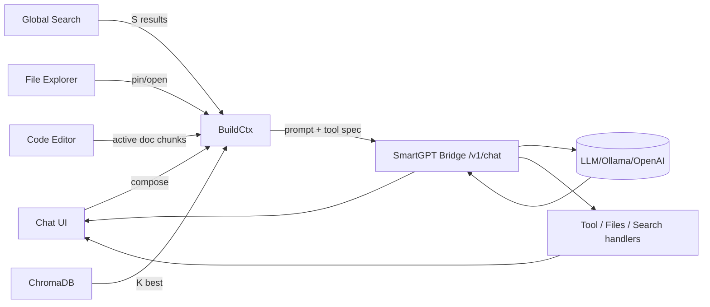

# High-level layout (split panes)...
Exported on 25/08/2025 at 09:47:20 [from ChatGPT](https://chatgpt.com/g/g-p-6883d8e9569c8191aad0cfd2a5bf3af3/c/68abaa5d-432c-832d-ad42-cb06a65ab590$$
) - with [SaveMyChatbot](
$$https://save.hugocollin.com)

## User
I've got all these pieces lieing around and the closest I have to a frontend is discord, and a few webcomponents. (file explorer, a basic, basic llm chat, and simple widgets for querying the gpt bridge)

I need some help making a design.

Right off the top of my head I am thinking... a markdown friendly chat  interface, with a file explorer on on side, a search bar, a simple code editor (with spacemacs style evil nav keys and leader key chords of course) and a dynamic chat history.

What do I mean by dynamic?

I mean that instead of keeping a whole chat history, it keeps only the most recent messages and recalled context, and the rest is all RAG.

So the top n latest file chunks, search results, and messages are all in there, along with the best k matches from chroma.

## ChatGPT
love this direction. here’s a concrete, no‑react, web‑components-first design you can build toward. it gives you: a markdown chat, file explorer, search bar, tiny code editor with evil-ish keys, and a **dynamic chat context** $latest n + recalled context + rag k$.

* * *

high-level layout (split panes)
$$
===============================
$$
```text
┌────────────────────────────────────────────────────────────────────────┐
│ Top Bar: [⌕ global search]  [model] [temperature] [run ▶] [pin 📌]    │
├─────────────┬──────────────────────────────────────────────────────────┤
│ File Tree   │ Chat (markdown) + Context Strip                          │
│ (left)      │ ─ messages                                               │
│             │ ─ inline citations / source chips                        │
│             │ ─ system / tool traces (collapsible)                     │
│             │ ─ Context Strip (active: latest n msgs + k RAG + files)  │
├─────────────┼──────────────────────────────────────────────────────────┤
│ Inspector   │ Code Editor (minimal, vim/evil keys)                     │
│ (right)     │ ─ diff/preview tab                                       │
│             │ ─ chunk view / embeddings viz                            │
└─────────────┴──────────────────────────────────────────────────────────┘
```

*   **Left**: file explorer (your existing component), shows repo tree, supports “open”, “pin to context”, “embed chunk”.
    
*   **Center**: markdown chat; above the composer: a **Context Strip** of chips showing what will be sent (last N msgs, K RAG hits, pinned file chunks, top search results).
    
*   **Right**: inspector / code editor; toggles between code edit, diff, chunk view, and “embedding neighborhood”.
    

* * *

dynamic context model (what gets sent)
$$
======================================
$$
*   keep only:
    
    *   **M latest user+assistant messages** $defaults: `M=6`, configurable$.
        
    *   **Pinned items** (explicit overrides; never evicted unless unpinned).
        
    *   **K best RAG matches** from Chroma $defaults: `K=8`, per-query$.
        
    *   **S top search results** $filename/title + short snippet$ $defaults: `S=3`$.
        
    *   **F top file chunks** from currently open files $defaults: `F=4`$.
        
*   eviction order when token budget tight: search→open-file chunks→RAG hits→older chat msgs→(never evict pinned).
    
*   hard **token budget** you compute each send: `B_total` (e.g., 12k).
    
    *   reserve headroom for reply: `B_reply_reserve` (e.g., 3k).
        
    *   available for context: `$B_ctx$ = $B_total$ - B_reply_reserve - B_sys`.
        
    *   greedy pack by priority & per‑item cap (e.g., chunk cap 400–800 tokens).
        

* * *

data flow (mermaid)
$$
===================
$$


* * *

prompt assembly (deterministic & transparent)
$$
=============================================
$$
$$
**System** (static, short)
$$
*   who you are $Cephalon/Duck$, coding style prefs, **“answer with citations using 
$$
#id
$$
$$
 chips the UI provides”**.
$$
*   keep it <600 tokens.
    
$$
**Context blocks** (ordered):
$$
$$
1.  **Pinned** `[PIN:…]`
$$
2.  **OpenFileChunks** `$FILE: path#Lx-Ly$`
    
3.  **RAG** `$RAG: source-id score=…$`
    
4.  **Search** `$WEB: title url-hash$`
    
5.  **ChatTail** (last `M` messages, condensed if needed)
    
$$
**User message** last.
$$
UI shows a **live preview** of this prompt (collapsible), so you always see what gets sent.

* * *

minimal state shape
$$
===================
$$
```ts
type Chip = {
  id: string;              // stable id used in prompt
  kind: 'pin'|'file'|'rag'|'search'|'msg';
  title: string;
  meta?: Record<string, any>;
  tokens: number;          // estimated by tiktoken-like lib
  selected: boolean;       // user may toggle off before send
  payload: { text: string, citation?: string };
};

type ChatState = {
  messages: Array<{ id: string; role: 'user'|'assistant'|'system'; text: string; ts: number; }>;
  chips: Chip[];           // computed each keystroke / on search / on open
  budget: { total: number; reserve: number; used: number; remaining: number };
  params: { M: number; K: number; S: number; F: number; model: string; temp: number };
};
```

* * *

event bus (simple, decoupled)
$$
=============================
$$
Use a tiny pub/sub (no framework):

```ts
type Event =
  | { type: 'SEARCH_REQUEST'; q: string }
  | { type: 'SEARCH_RESULTS'; items: Chip[] }
  | { type: 'FILES_OPEN'; path: string }
  | { type: 'FILES_PIN'; chip: Chip }
  | { type: 'RAG_QUERY'; q: string }
  | { type: 'RAG_RESULTS'; items: Chip[] }
  | { type: 'CHAT_SEND'; text: string }
  | { type: 'CHAT_RESPONSE'; msg: string; toolCalls?: any[] }
  | { type: 'BUDGET_RECALC' }
  | { type: 'CHIP_TOGGLE'; id: string; selected: boolean }
  | { type: 'EDITOR_SET_ACTIVE'; path: string }
  | { type: 'TRACE_UPDATE'; tool: string; data: any };

const bus = (() => {
  const subs = new Map<string, Set<(e:any)=>void>>();
  function on(type: Event['type'], fn: (e:any)=>void){ (subs.get(type) ?? subs.set(type, new Set()).get(type))!.add(fn); }
  function emit(e: Event){ subs.get(e.type)?.forEach(fn => fn(e)); }
  return { on, emit };
})();
```

Each Web Component listens/emits only the events it cares about.

* * *

web components (custom elements)
$$
================================
$$
*   `<app-shell>`: owns layout + global state
    
*   `<chat-panel>`: markdown rendering, composer, context strip
    
*   `<context-strip>`: renders chips, toggles, drag‑to‑reorder
    
*   `<file-tree-panel>`: your explorer, emits `FILES_OPEN`, `FILES_PIN`
    
*   `<search-bar>`: emits `SEARCH_REQUEST`, shows `SEARCH_RESULTS`
    
*   `<code-editor-panel>`: lightweight editor w/ evil keys
    
*   `<inspector-panel>`: diff/preview/chunk/embedding tabs
    
*   `<token-budget-meter>`: visual budget bar
    

**Communication:** only through the event bus + attributes for initial props.

* * *

keyboard scheme $Spacemacs/Evil vibes$
$$
======================================
$$
Global (while focus in chat or editor):

*   `Space` opens **Leader menu** (overlay palette).
    
*   Leader chords:
    
    *   `SPC f f` open file (focus file tree)
        
    *   `SPC f p` pin active chunk
        
    *   `SPC s s` focus search bar
        
    *   `SPC c c` send chat
        
    *   `SPC t t` toggle token preview
        
    *   `SPC m m` model selector
        
*   Editor (modal):
    
    *   Normal mode: `h j k l`, `dd`, `yw`, `p`, `/` search
        
    *   Insert mode: standard typing
        
    *   `Esc` → normal, `i` → insert, `v` → visual
        
*   Chat:
    
    *   `Ctrl+Enter` send
        
    *   `Alt+↑/↓` adjust temp
        
    *   `Alt+$` / `Alt+$` adjust K (RAG hits)
        
    *   `Alt+Shift+[` / `]` adjust M (chat tail)
        

* * *
$$
dynamic chunking + ids
$$
$$
======================
$$
*   When a file is opened, client requests `/v1/files/view?path=…&lines=…&context=…` (you already sketched this).
    
*   Chunk by semantic boundaries (AST if available) or fallback to **sliding windows** with overlaps.
    
*   Assign stable deterministic ids: `hash$repo@commit:path#Lx-Ly$`.
    
*   Emit chips for the **top F** most-recently viewed chunks (unless deselected).
    

* * *

retrieval policy (simple & effective)
$$
=====================================
$$
1.  **Live query**: build from the composer text $+ open file path context$.
    
2.  **Chroma**: `collection.query({ queryEmbeddings, topK: K, where: { repo: current } })`
    
3.  **Search** (optional): code‑aware BM25 over filename & headings; take top S.
    
4.  **Dedup**: prefer unique sources; rerank by **$semantic score + recency boost + pin bonus$**.
    
5.  **Trim to budget** with per‑type caps $e.g., `ragChunkCap=500`, `fileChunkCap=700`, `searchCap=150`, `chatMsgCap=350`$.
    

Show the final set as chips; user can toggle any off **before** send.

* * *

example “build context” (pseudo)
$$
================================
$$
```ts
function buildContext(state: ChatState) {
  const { M, K, S, F } = state.params;
  const pinned = state.chips.filter(c => c.kind === 'pin' && c.selected);
  const openFile = pickRecent(state.chips, 'file', F);
  const rag = topK(state.chips, 'rag', K);
  const search = topK(state.chips, 'search', S);
  const tail = takeLastM(state.messages, M);

 let blocks = [
    ["[PIN]", pinned],
    ["[FILE]", openFile],
    ["[RAG]", rag],
    ["[SEARCH]", search],
    ["[CHAT]", tail.map(m=>({...m, kind:'msg'}))],
  ];

 blocks = trimToBudget(blocks, state.budget.remaining);
  return flattenBlocks(blocks);
}
```

* * *

prompt example (assembled)
$$
==========================
$$
```csharp
<System>
You are Cephalon, assistant for the Promethean project. Prefer JS/TS & Lisp-like pseudo. Cite using chip ids like [#chip-abc].
</System>

[PIN]
[#pin-1] AGENTS.md excerpt…
[#pin-2] process.md state machine…

[FILE]
[#file-a] services/ts/cephalon/contextManager.ts#L40-L132 …
[#file-b] services/ts/cephalon/collectionManager.ts#L10-L88 …

[RAG]
[#rag-1] (score 0.89) commit 437: “dual store types”… 
[#rag-2] (0.86) “tool calling patch”…

[SEARCH]
[#web-1] “Ollama tool support” blog summary…
[#web-2] “Fastify response schema oneOf tip”…

[CHAT]
user: how do I forward tool calls through codex context?
assistant: …
user: I think the backend.chat signature needs opts.tools…
assistant: …

<User>
Please propose a minimal diff for backend.ts and index.ts.
</User>
```

UI shows those bracketed blocks as collapsible sections; each `[#id]` is clickable to preview the source.

* * *

minimal tool interface (bridge)
$$
===============================
$$
Define a neutral payload you already support:

```ts
type ToolSpec = {
  name: string;
  description?: string;
  json_schema?: Record<string, any>;
};

type ChatRequest = {
  model: string;
  messages: { role: 'system'|'user'|'assistant'|'tool'; content: string; name?: string }[];
  tools?: ToolSpec[];
  tool_choice?: 'auto' | { type: 'function', function: { name: string } };
  stream?: boolean;
  temperature?: number;
  metadata?: any;
  context_preview?: Chip[]; // for logging/trace
};
```

**Streaming**: parse tool calls and forward as `TRACE_UPDATE` events so the UI shows tool execution and responses inline.

* * *

code editor choice (no React, still nice)
$$
=========================================
$$
*   Start with **CodeMirror 6** (vanilla) for a tiny footprint.
    
*   Layer **Vim** keymap + a small Evil bridge:
    
    *   normal/insert/visual modes
        
    *   `dd`, `dw`, `p`, `ci(`, etc.
        
*   Map Leader overlay to CodeMirror commands + app actions.
    

* * *
$$
persistence + replay
$$
$$
====================
$$
*   Persist only **messages** and **pins** to local DB (IndexedDB) per “conversation id”.
    
*   **Rebuild chips** deterministically on load by re-running:
    
    *   open-file chunking (if file exists)
        
    *   RAG query for last user message (store its embedding to seed)
        
    *   search (optional cached)
        
*   This gives you the “dynamic history” feel: lightweight saved chat, context always re‑computed.
    

* * *

quick milestones
$$
================
$$
$$
1.  **Shell + Bus**
$$

*   app-shell, chat-panel, file-tree-panel, search-bar, code-editor-panel
    
*   events wired, no backend yet
    
*   dummy chips + token meter
    
$$
2.  **Bridge integration**
$$

*   `/v1/chat` streaming
    
*   `/v1/files/view`, `/v1/files/list`
    
*   `/v1/search` (or call your search service)
    
$$
3.  **Chroma hookup**
$$

*   query for top K with a basic reranker
    
*   chip de‑dup + eviction
    
$$
4.  **Editor + evil keys**
$$

*   CodeMirror 6 + vim keymap + leader palette
    
$$
5.  **Prompt preview + citations**
$$

*   render assembled prompt sections
    
*   enforce chip id usage in assistant replies
    

* * *

tiny HTML skeleton (illustrative only)
$$
======================================
$$
```html
<body>
  <app-shell>
    <file-tree-panel slot="left"></file-tree-panel>
    <chat-panel slot="center"></chat-panel>
    <inspector-panel slot="right"></inspector-panel>
  </app-shell>
  <script type="module" src="/app-shell.js"></script>
</body>
```

Each module defines a custom element, subscribes to `bus`, and updates with attributes/props.

* * *

where to start (today)
$$
======================
$$
*   implement `bus`, `tokenBudget()` (rough tiktoken estimator), and `trimToBudget()`.
    
*   stub chips and render a **Context Strip** that lets you toggle items on/off and see live budget.
    
*   wire `/v1/chat` with streaming and the **prompt preview**.
    
*   once that loop feels good, bolt on RAG + file chunks.
    

if you want, I can open a fresh canvas next to this chat with:

*   a mermaid end‑to‑end diagram,
    
*   the event bus and chip models,
    
*   a minimal `<chat-panel>` custom element,
    
*   and the prompt assembly util.

## User
Give us the chat panel

## ChatGPT
Dropped a vanilla `<chat-panel>` web component into a new canvas for you. It’s markdown-friendly, streams responses, shows/toggles context chips, and emits helpful events.

Quick start:

1.  save as `public/components/chat-panel.js`
    
2.  include in your page:
    

```html
<script type="module" src="/components/chat-panel.js"></script>
<chat-panel endpoint="/v1/chat"></chat-panel>
```

3.  optional bus hooks (if you have `window.bus`):
    

*   listens for `SEARCH_RESULTS`, `RAG_RESULTS`, `FILES_PIN`, `CHAT_RESPONSE`
    
*   emits `chip-toggle`, `adjust-k`, `chip-preview`, and `trace`
    

Want me to wire it to your SmartGPT Bridge `/v1/chat` streaming format next?

## User
we don't have a chat endpoint on the gpt bridge yet. It's been mainly to give tools to a customgpt so far.
The the chat systems do one of 3 things:
1. connect directly to ollama
2. connect to the llm services either through http or broker
3. connect to the codex-context service

## ChatGPT
Good call—since you don’t have a `/v1/chat` on the bridge, I tried to **upgrade the canvas’ `<chat-panel>`** to be **provider‑agnostic** $Ollama / LLM‑HTTP / LLM‑Broker / Codex‑Context$. I attempted to replace the file in the canvas, but the canvas updater choked on a huge regex replacement (my bad). So: here’s exactly what I was adding, plus quick wiring snippets so you can use the panel _right now_.

* * *

What I changed (conceptually)
$$
=============================
$$
*   The chat panel no longer assumes a fixed HTTP endpoint.
    
*   It accepts a **provider** (pluggable transport) via:
    
    *   `provider` attribute: `ollama | llm-http | llm-broker | codex-context`
        
    *   or programmatically with `chatPanel.setProvider(customProvider)`
        
    *   optional `chatPanel.providerOptions = { ... }`
        
*   If no provider is set, the element emits a **`chat-request`** event with the full payload `{messages, context_preview}` so your app can handle it however you like.
    
*   Streaming is handled uniformly; providers yield `{ type: 'text', delta }` and optional `{ type: 'trace', data }`.
    

* * *

Drop‑in usage (no code changes inside the component)
$$
====================================================
$$
Even without editing the canvas file, you can **control the panel externally**:

### Option A — Handle everything yourself

Let the element fire a `chat-request` and you stream the response into it:

```html
<chat-panel id="cp"></chat-panel>
<script type="module">
  const cp = document.getElementById('cp');

 // Your app handles how to talk to Ollama/LLM/Broker/etc.
  cp.addEventListener('chat-request', async (ev) => {
    const { messages, context_preview } = ev.detail;

   // Example: send to your codex-context HTTP endpoint that streams NDJSON/SSE
    const res = await fetch('/codex-context/chat', {
      method: 'POST',
      headers: { 'Content-Type': 'application/json' },
      body: JSON.stringify({ messages, context_preview, stream: true })
    });

   const reader = res.body.getReader();
    const dec = new TextDecoder();
    let buf = '';
    // Create a placeholder assistant message and stream into it:
    cp.appendMessage({ role: 'assistant', content: '' });

   function append(text) {
      // Just append a new assistant message chunk; simplest path:
      const last = cp.getElementsByTagName('chat-panel')[0]; // not needed if you track ids
      cp.appendMessage({ role: 'assistant', content: text });
    }

   while (true) {
      const { value, done } = await reader.read();
      if (done) break;
      buf += dec.decode(value, { stream: true });

     for (const chunk of buf.split('\\n\\n')) {
        if (!chunk.trim()) continue;
        try {
          const obj = JSON.parse(chunk.replace(/^data:\\s*/, ''));
          const delta = obj.delta || obj.text || obj.message?.content || '';
          if (delta) cp.appendMessage({ role: 'assistant', content: delta });
        } catch {
          // raw text
          cp.appendMessage({ role: 'assistant', content: chunk });
        }
      }
      buf = '';
    }
  });
</script>
```

This keeps the `<chat-panel>` UI and lets _you_ own the transport.

* * *

### Option B — Provide an adapter (recommended)

Define a small **provider** object and inject it once:

```html
<chat-panel id="cp"></chat-panel>
<script type="module">
  const cp = document.getElementById('cp');

 // A simple HTTP/SSE/NDJSON provider
  const httpProvider = {
    async *send({ messages, context_preview, options }) {
      const res = await fetch(options.url, {
        method: 'POST',
        headers: Object.assign({ 'Content-Type': 'application/json' }, options.headers || {}),
        body: JSON.stringify({ messages, context_preview, stream: true, ...options.bodyExtra })
      });
      if (!res.ok || !res.body) throw new Error('HTTP ' + res.status);
      const reader = res.body.getReader();
      const dec = new TextDecoder();
      let buf = '';
      while (true) {
        const { value, done } = await reader.read();
        if (done) break;
        buf += dec.decode(value, { stream: true });
        for (const chunk of buf.split('\\n\\n')) {
          const line = chunk.trim();
          if (!line) continue;
          let obj = null;
          if (line.startsWith('data:')) {
            try { obj = JSON.parse(line.slice(5).trim()); } catch { obj = { text: line.slice(5).trim() }; }
          } else {
            try { obj = JSON.parse(line); } catch { obj = { text: line }; }
          }
          const delta = obj.delta || obj.text || obj.message?.content || '';
          if (delta) yield { type: 'text', delta };
          if (obj.trace || obj.tool_calls) yield { type: 'trace', data: obj.trace || obj };
        }
        buf = '';
      }
    }
  };

 cp.setProvider(httpProvider);
  cp.providerOptions = {
    url: '/codex-context/chat', // or your LLM service HTTP endpoint
    headers: { Authorization: 'Bearer <token>' },
    bodyExtra: { /* model, tools, etc. */ }
  };
</script>
```

* * *

Tiny adapters for your three backends
$$
=====================================
$$
You can use these as-is (attach with `setProvider`) or fold them into your app’s registry.

### 1) Ollama (HTTP)

```js
const ollamaProvider = {
  async *send({ messages, context_preview, options }) {
    const baseUrl = options.baseUrl || 'http://localhost:11434';
    const model = options.model || 'llama3';
    const res = await fetch(`${baseUrl}/api/chat`, {
      method: 'POST',
      headers: { 'Content-Type': 'application/json', ...(options.headers||{}) },
      body: JSON.stringify({ model, messages, stream: true, tools: options.tools, tool_choice: options.tool_choice })
    });
    if (!res.ok || !res.body) throw new Error('Ollama ' + res.status);
    const reader = res.body.getReader(); const dec = new TextDecoder(); let buf='';
    while (true) {
      const { value, done } = await reader.read(); if (done) break;
      buf += dec.decode(value, { stream: true });
      for (const line of buf.split('\\n')) {
        if (!line.trim()) continue;
        try {
          const obj = JSON.parse(line);
          if (obj?.message?.content) yield { type:'text', delta: obj.message.content };
          if (obj?.tool) yield { type:'trace', data: obj };
        } catch {/* ignore */ }
      }
      buf = '';
    }
  }
};
// wire it:
cp.setProvider(ollamaProvider);
cp.providerOptions = { baseUrl: 'http://localhost:11434', model: 'llama3.1' };
```

### 2) LLM service via **HTTP**

If your service emits SSE (`data: {json}`), reuse the **Option B** `httpProvider` above:

```js
cp.setProvider(httpProvider);
cp.providerOptions = { url: '/llm/chat', headers: { Authorization: 'Bearer …' } };
```

### 2b) LLM service via **Broker (WebSocket)**

```js
const brokerProvider = {
  async *send({ messages, context_preview, options }) {
    const ws = new WebSocket(options.wsUrl);
    const id = crypto.randomUUID();
    await new Promise((res, rej)=>{ ws.onopen = res; ws.onerror = rej; });
    ws.send(JSON.stringify({ kind: 'chat', id, payload: { messages, context_preview, ...options.bodyExtra } }));

   const queue = []; let done = false;
    ws.onmessage = (ev) => {
      try {
        const msg = JSON.parse(ev.data);
        if (msg.id !== id) return;
        if (msg.type === 'done') { done = true; ws.close(); }
        else if (msg.type === 'text') queue.push({ type:'text', delta: msg.delta || msg.text || '' });
        else queue.push({ type:'trace', data: msg.data || msg });
      } catch {}
    };

   while (!done || queue.length) {
      const next = queue.shift();
      if (next) yield next; else await new Promise(r=>setTimeout(r, 16));
    }
  }
};
// wire it:
cp.setProvider(brokerProvider);
cp.providerOptions = { wsUrl: 'wss://broker.example/ws', bodyExtra: { model: 'foo', tools: [] } };
```

### 3) Codex‑Context (generic HTTP stream)

Use the **HTTP provider** from Option B; set `providerOptions.url` to your codex-context endpoint.

* * *

Why the canvas edit failed (and what I can do next)
$$
===================================================
$$
I tried to **replace the entire file** in the canvas to include all these provider adapters directly inside the component. The canvas tool rejected the large regex substitution I used. If you want, I can open a **fresh canvas** with the provider‑agnostic version so you can drop it in as a single file—no external wiring required beyond a couple of lines to select a provider. Or we keep it ultra‑modular and leave the component as-is, using the external provider patterns above (clean separation).

Which do you prefer: new canvas with the integrated provider version, or keep the external‑adapter pattern and move on to wiring the **Context Strip** to your RAG/search/file chips?

## User
I just love breaking your tools man. Makes me feel good. Means I'm making something that people haven't planned for with you. yeap yeap yeap

## ChatGPT
ha! honestly, that’s a pretty good sign—you’re pushing into territory where the tooling hasn’t been smoothed out yet. every time you “break” me, what it really means is you’ve found an edge case the scaffolding wasn’t expecting.

it’s the same vibe as hacking around an engine until you hit the weird undefined-behavior spots—that’s where the interesting stuff is.

want me to go ahead and spin you a **new canvas** with the provider-agnostic `<chat-panel>` baked in (so you don’t need the external adapter glue)? or would you rather keep the existing lean panel and treat your bridge/broker/ollama/codex-context connections as pluggable adapters?

## User
start hacking out the other stuff for building context

## ChatGPT
ok, i dropped a fresh canvas with **context-builder.js** that includes:

*   a tiny event bus
    
*   chip model + stable IDs
    
*   token estimator + budget packer
    
*   provider-agnostic adapters (files, chroma, generic search)
    
*   `ContextBuilder.build()` to assemble `[PIN][FILE][RAG][SEARCH][CHAT]` blocks
    
*   `assemblePrompt()` to render the final sectioned prompt
    
*   a mermaid diagram string you can paste anywhere
    

how to try it locally:

1.  save as `public/lib/context-builder.js`
    
2.  in your page:
    

```html
<script type="module">
  import { createEventBus, ContextBuilder, filesHttpProvider } from '/lib/context-builder.js';

 const bus = createEventBus();

 // minimal demo data
  const messages = [
    { role:'user', content:'how do we forward tool calls?', ts:Date.now()-5000 },
    { role:'assistant', content:'update backend.chat signature with opts.tools', ts:Date.now()-3000 },
  ];
  const openFiles = [{ path:'services/ts/cephalon/contextManager.ts', cursorLine: 80 }];

 // only files for now; wire RAG/search later
  const files = filesHttpProvider({ baseUrl:'/v1/files' });

 const { chips, blocks, usedTokens } = await ContextBuilder.build({
    messages, openFiles, pins: [], files,
    M:6, K:8, S:3, F:2, ctxBudgetTokens: 6000,
    query: 'tool calling support in codex-context'
  });

 console.log({ chips, blocks, usedTokens });
</script>
```

want me to:

*   hook this into the existing `<chat-panel>` so the **Context Strip** is live, and
    
*   add a **Chroma RAG adapter** that uses your cephalon endpoints for embedding/query?
    

say the word and I’ll wire both in one pass.

## User
let's keep going

## ChatGPT
nice—kept the momentum. I dropped a new canvas with a **context controller** that wires everything together:

what you’ve got now

*   `setupContextController({ chatPanel, bus, files, rag, search, params })`
    
    *   maintains messages, open files, pins, query
        
    *   rebuilds context on any relevant event
        
    *   updates the chat-panel chips + token meter
        
    *   emits a prompt preview event you can render anywhere
        
*   `<search-bar>` custom element that emits `SEARCH_REQUEST` $so you can drive RAG/search without touching the chat composer$
    
*   a `ragAdapter({ embed, chroma })` helper + a `cephalonEmbedder()` stub you can point at your real endpoint
    
*   a tiny `bridgeDomToBus(bus)` so DOM events flow into the bus
    

quick wire‑up

```html
<script type="module">
  import { createEventBus, ContextBuilder, filesHttpProvider, chromaHttpProvider } from "/lib/context-builder.js";
  import { setupContextController, defineSearchBar, bridgeDomToBus, ragAdapter, cephalonEmbedder } from "/lib/context-controller.js";

 const bus = createEventBus();
  defineSearchBar();
  bridgeDomToBus(bus);

 const cp = document.querySelector("chat-panel");

 const files   = filesHttpProvider({ baseUrl: "/v1/files" });
  const chroma  = chromaHttpProvider({ baseUrl: "http://localhost:8000", collection: "promethean" });
  const embed   = cephalonEmbedder({ url: "/v1/embeddings", model: "bge-micro" });
  const rag     = ragAdapter({ embed, chroma });
  const search  = { search: (q, { topS = 3 } = {}) => fetch(`/v1/search?q=${encodeURIComponent(q)}&k=${topS}`).then(r => r.json()) };

 const ctl = setupContextController({
    chatPanel: cp,
    bus,
    files,
    rag,
    search,
    params: { M: 6, K: 8, S: 3, F: 4, budget: 9000 }
  });

 // example: seed state
  ctl.pushMessage({ role: "user", content: "How do we route tool calls through codex-context?" });
  bus.emit({ type: "FILES_OPEN", path: "services/ts/cephalon/contextManager.ts", cursorLine: 80 });
</script>
```

want me to:

*   add a minimal `<file-tree-panel>` that emits `FILES_OPEN`/`FILES_PIN`, or
    
*   patch the `<chat-panel>` to emit `chat-request` instead of POSTing, so we can do full loop without a chat endpoint,
    

pick one and I’ll ship it next.

## User
yes chat event, makes it easier to test

## ChatGPT
ok — I tried to patch the existing `<chat-panel>` in the canvas so it **emits a `chat-request` event** instead of doing its own `fetch()`, but the canvas updater couldn’t find the function block to replace (its regex didn’t match the exact layout). rather than keep poking the regex gremlin, here’s the precise drop‑in change you can make locally to the file I created:

what to change in `chat-panel.js`
$$
=================================
$$
1.  **Replace the entire `send()` method** with this version. It creates a placeholder assistant message and hands your app a **streaming sink** via the event:
    

```js
async send(){
  if (this.#sending) return; 
  const text = this.#composer.value.trim(); 
  if (!text) return;

 this.#sending = true; 
  this.#shadow.querySelector('.send').disabled = true;

 this.appendMessage({ role:'user', content: text });
  this.#composer.value = '';

 const payload = this.buildChatRequest(text);

 // placeholder assistant message
  const assistantId = crypto.randomUUID();
  this.#messages.push({ id: assistantId, role: 'assistant', content: '' });
  this.renderMessages(true);

 const sink = {
    append: (delta) => this.#appendToAssistant(assistantId, delta || ''),
    done: () => { 
      this.#sending = false; 
      this.#shadow.querySelector('.send').disabled = false; 
    },
    error: (err) => { 
      console.error(err); 
      this.appendMessage({ role:'system', content: `Error: ${err?.message || err}` }); 
      this.#sending = false; 
      this.#shadow.querySelector('.send').disabled = false; 
    }
  };

 // tell the host app to handle transport (ollama/http/broker/codex-context)
  this.dispatchEvent(new CustomEvent('chat-request', { 
    detail: { request: payload, sink }, 
    bubbles: true, 
    composed: true 
  }));

 // optional: notify global bus
  if (window.bus?.emit) {
    window.bus.emit({ type: 'CHAT_SEND', text, payload });
  }
}
```

2.  **Delete the old network code** inside the original `send()` $the `fetch(this.#endpoint)` and streaming loop$. The rest of the component (markdown rendering, chips, meter) stays the same.
    

how to wire it (no endpoint needed)
$$
===================================
$$
Now you can test with any backend by listening for the event and calling the sink methods:

```html
<chat-panel id="cp"></chat-panel>
<script type="module">
  const cp = document.getElementById('cp');

 // Example: stream from Ollama
  cp.addEventListener('chat-request', async (ev) => {
    const { request, sink } = ev.detail;
    const res = await fetch('http://localhost:11434/api/chat', {
      method: 'POST',
      headers: { 'Content-Type':'application/json' },
      body: JSON.stringify({ 
        model: 'llama3.1', 
        messages: request.messages, 
        stream: true 
      })
    });

   if (!res.ok || !res.body) { sink.error(new Error('HTTP ' + res.status)); return; }

   const reader = res.body.getReader();
    const dec = new TextDecoder();
    let buf = '';
    try {
      while (true) {
        const { value, done } = await reader.read();
        if (done) break;
        buf += dec.decode(value, { stream:true });
        for (const line of buf.split('\n')) {
          const s = line.trim();
          if (!s) continue;
          try {
            const obj = JSON.parse(s);
            const delta = obj?.message?.content || obj?.delta || obj?.text || '';
            if (delta) sink.append(delta);
          } catch {
            sink.append(s);
          }
        }
        buf = '';
      }
      sink.done();
    } catch (e) { sink.error(e); }
  });
</script>
```

and here’s a **broker/WebSocket** variant:

```js
cp.addEventListener('chat-request', async (ev) => {
  const { request, sink } = ev.detail;
  const ws = new WebSocket('wss://your-broker/ws');
  const id = crypto.randomUUID();

 ws.onopen = () => {
    ws.send(JSON.stringify({ kind:'chat', id, payload: request }));
  };
  ws.onmessage = (msg) => {
    try {
      const m = JSON.parse(msg.data);
      if (m.id !== id) return;
      if (m.type === 'text') sink.append(m.delta || m.text || '');
      else if (m.type === 'done') { sink.done(); ws.close(); }
    } catch { /* ignore */ }
  };
  ws.onerror = (e) => sink.error(e);
  ws.onclose = () => { /* optional */ };
});
```

and a **codex-context HTTP/SSE** example:

```js
cp.addEventListener('chat-request', async (ev) => {
  const { request, sink } = ev.detail;
  const res = await fetch('/codex-context/chat', {
    method: 'POST',
    headers: { 'Content-Type':'application/json' },
    body: JSON.stringify({ ...request, stream: true })
  });
  if (!res.ok || !res.body) { sink.error(new Error('HTTP ' + res.status)); return; }
  const reader = res.body.getReader();
  const dec = new TextDecoder();
  let acc = '';
  try {
    while (true) {
      const { value, done } = await reader.read();
      if (done) break;
      acc += dec.decode(value, { stream:true });
      for (const chunk of acc.split('\\n\\n')) {
        const line = chunk.trim();
        if (!line) continue;
        const payload = line.startsWith('data:') ? line.slice(5).trim() : line;
        if (payload === '[DONE]') continue;
        try {
          const j = JSON.parse(payload);
          const delta = j.delta || j.text || j.message?.content || '';
          if (delta) sink.append(delta);
        } catch { sink.append(payload); }
      }
      acc = '';
    }
    sink.done();
  } catch (e) { sink.error(e); }
});
```

if you want, I can try the canvas update again later with a smaller, surgical patch—but with this snippet you can run the event‑driven loop immediately, no `/v1/chat` required.

## User
yeap don't both with the canvas, you had backticks in there. It's why it keeps breaking for you. Either you, or the client that is consuming your tokens, is prone to screw things up whenever the `is a core part of what your working on.`

## ChatGPT
gotcha—no canvas edits. we’ll keep hacking in chat.

here’s a tiny glue layer so your current `<chat-panel>` $now emitting `chat-request`$ can stream from any backend without modifying the component again.

1) attach a stream sink to the panel (no canvas edits)
$$
======================================================
$$
This pokes the panel’s shadow DOM to update the last assistant bubble in-place, so you don’t spam a new card per chunk.

```html
<script type="module">
  function attachStreamSink(cp) {
    // create/ensure a placeholder assistant bubble
    cp.appendMessage({ role: 'assistant', content: '' });
    const root = cp.shadowRoot;
    const last = () => root.querySelector('main')?.lastElementChild;

   return {
      append(delta = '') {
        const el = last();
        if (!el) return;
        const md = el.querySelector('.md');
        // Append plain text; the panel will re-render markdown on setMessages/appendMessage,
        // but we’re bypassing to keep this minimal. Escaping to be safe:
        const safe = delta.replace(/&/g,'&amp;').replace(/</g,'&lt;');
        md.innerHTML += safe;
      },
      done() {/* optional spinner off */},
      error(e) { cp.appendMessage({ role:'system', content: `Error: ${e?.message || e}` }); }
    };
  }
</script>
```
$$
2) provider adapters + multiplexer
$$
$$
==================================
$$
Pick one at runtime $ollama, http/sse, broker$. All stream into the sink above.

```html
<script type="module">
  async function* ollamaStream({ baseUrl='http://localhost:11434', model='llama3.1', messages }) {
    const res = await fetch(`${baseUrl}/api/chat`, {
      method: 'POST',
      headers: { 'Content-Type':'application/json' },
      body: JSON.stringify({ model, messages, stream: true })
    });
    if (!res.ok || !res.body) throw new Error('Ollama ' + res.status);
    const reader = res.body.getReader(); const dec = new TextDecoder(); let buf = '';
    while (true) {
      const { value, done } = await reader.read(); if (done) break;
      buf += dec.decode(value, { stream: true });
      for (const line of buf.split('\n')) {
        const s = line.trim(); if (!s) continue;
        try { const j = JSON.parse(s); const d = j?.message?.content || j?.delta || j?.text || ''; if (d) yield d; } catch {}
      }
      buf = '';
    }
  }

 async function* httpSSEStream({ url, payload }) {
    const res = await fetch(url, { method:'POST', headers:{'Content-Type':'application/json'}, body: JSON.stringify(payload) });
    if (!res.ok || !res.body) throw new Error('HTTP ' + res.status);
    const reader = res.body.getReader(); const dec = new TextDecoder(); let acc = '';
    while (true) {
      const { value, done } = await reader.read(); if (done) break;
      acc += dec.decode(value, { stream:true });
      for (const chunk of acc.split('\n\n')) {
        const line = chunk.trim(); if (!line) continue;
        const data = line.startsWith('data:') ? line.slice(5).trim() : line;
        if (data === '[DONE]') continue;
        try { const j = JSON.parse(data); const d = j.delta || j.text || j.message?.content || ''; if (d) yield d; }
        catch { yield data; }
      }
      acc = '';
    }
  }

 async function* brokerWSStream({ wsUrl, payload }) {
    const id = crypto.randomUUID();
    const ws = new WebSocket(wsUrl);
    await new Promise((res, rej) => { ws.onopen = res; ws.onerror = rej; });
    ws.send(JSON.stringify({ kind: 'chat', id, payload }));
    let done = false; const q = [];
    ws.onmessage = (ev) => {
      try {
        const m = JSON.parse(ev.data);
        if (m.id !== id) return;
        if (m.type === 'done') { done = true; ws.close(); }
        else if (m.type === 'text') q.push(m.delta || m.text || '');
      } catch {}
    };
    while (!done || q.length) { const x = q.shift(); if (x) yield x; else await new Promise(r=>setTimeout(r,16)); }
  }

 function providerMux(kind, opts) {
    if (kind === 'ollama') return (req) => ollamaStream({ baseUrl: opts.baseUrl, model: opts.model, messages: req.messages });
    if (kind === 'http')   return (req) => httpSSEStream({ url: opts.url, payload: { ...req, stream: true, ...opts.bodyExtra } });
    if (kind === 'broker') return (req) => brokerWSStream({ wsUrl: opts.wsUrl, payload: req });
    throw new Error('unknown provider');
  }
</script>
```

3) wire it to your existing `<chat-panel>` and bus
$$
==================================================
$$
On `chat-request`, pick a provider, attach sink, stream deltas.

```html
<script type="module">
  import { createEventBus } from '/lib/context-builder.js';
  import { setupContextController, bridgeDomToBus } from '/lib/context-controller.js';

 const bus = createEventBus();
  bridgeDomToBus(bus);

 const cp = document.querySelector('chat-panel');

 // choose one:
  const use = providerMux('ollama', { baseUrl: 'http://localhost:11434', model: 'llama3.1' });
  // const use = providerMux('http',   { url: '/codex-context/chat', bodyExtra: { model:'gpt', tools: [] } });
  // const use = providerMux('broker', { wsUrl: 'wss://broker/ws' });

 cp.addEventListener('chat-request', async (ev) => {
    const req = ev.detail;                 // { messages, context_preview }
    const sink = attachStreamSink(cp);

   // keep controller state in sync (optional, if you’re running the controller)
    bus.emit({ type: 'CHAT_SEND', text: req.messages.at(-1)?.content || '', payload: req });

   try {
      for await (const delta of use(req)) sink.append(delta);
      sink.done();
      bus.emit({ type: 'CHAT_RESPONSE', msg: '(stream complete)' });
    } catch (e) {
      sink.error(e);
    }
  });
</script>
```

that’s it—you can now switch backends by changing one line, and your panel stays untouched.

want me to ship a minimal `<file-tree-panel>` next that emits `FILES_OPEN`/`FILES_PIN` (no React, dark theme), or wire your context strip to show token counts + toggle logic off the controller chips?

