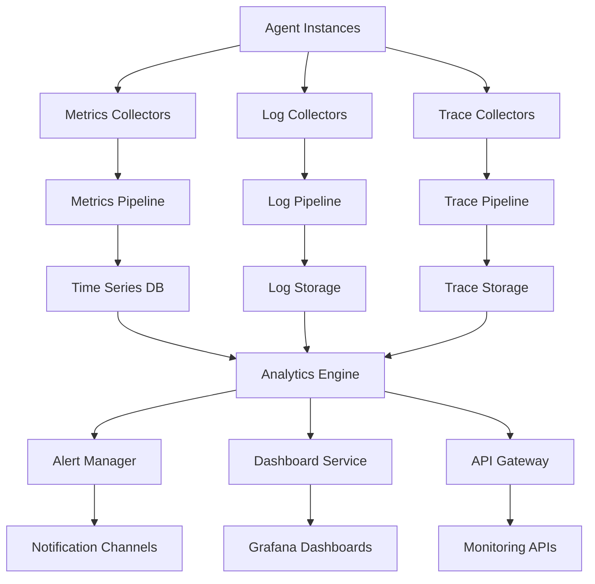

# Agent OS Monitoring & Analytics

This document defines the comprehensive monitoring, observability, and analytics framework for Agent OS, providing insights into agent performance, system health, and operational efficiency.

## Table of Contents

- [Monitoring Architecture](#monitoring-architecture)
- [Metrics Collection](#metrics-collection)
- [Performance Analytics](#performance-analytics)
- [Health Monitoring](#health-monitoring)
- [Alerting System](#alerting-system)
- [Visualization & Dashboards](#visualization--dashboards)
- [Operational Intelligence](#operational-intelligence)
- [Capacity Planning](#capacity-planning)
- [Benchmarking & SLAs](#benchmarking--slas)

## Monitoring Architecture

### Observability Stack



### Core Components

#### 1. Metrics Collection System
```typescript
interface MetricsCollector {
  // Agent metrics
  collectAgentMetrics(agentId: string): Promise<AgentMetrics>;

  // Task metrics
  collectTaskMetrics(taskId: string): Promise<TaskMetrics>;

  // System metrics
  collectSystemMetrics(): Promise<SystemMetrics>;

  // Custom metrics
  collectCustomMetrics(namespace: string, labels: Record<string, string>): Promise<CustomMetric[]>;
}

interface AgentMetrics {
  agentId: string;
  timestamp: string;

  // Performance metrics
  performance: {
    cpuUtilization: number;
    memoryUsage: number;
    diskIO: {
      readBytes: number;
      writeBytes: number;
      readOps: number;
      writeOps: number;
    };
    networkIO: {
      bytesIn: number;
      bytesOut: number;
      connections: number;
    };
  };

  // Task metrics
  tasks: {
    activeTasks: number;
    completedTasks: number;
    failedTasks: number;
    averageTaskDuration: number;
    taskSuccessRate: number;
  };

  // Capability metrics
  capabilities: CapabilityMetric[];

  // State metrics
  state: {
    currentStatus: AgentStatus;
    uptime: number;
    lastHeartbeat: string;
    errorCount: number;
  };
}

interface CapabilityMetric {
  name: string;
  usage: {
    invocations: number;
    averageDuration: number;
    successRate: number;
    lastUsed: string;
  };
  performance: {
    throughput: number;
    latency: {
      p50: number;
      p95: number;
      p99: number;
    };
    errorRate: number;
  };
}
```

#### 2. Distributed Tracing
```typescript
interface TraceContext {
  traceId: string;
  spanId: string;
  parentSpanId?: string;
  baggage: Record<string, string>;
}

interface Span {
  traceId: string;
  spanId: string;
  parentSpanId?: string;
  operationName: string;
  startTime: number;
  endTime: number;
  duration: number;
  tags: Record<string, any>;
  logs: SpanLog[];
  status: SpanStatus;
}

interface SpanLog {
  timestamp: number;
  level: 'debug' | 'info' | 'warn' | 'error';
  message: string;
  fields: Record<string, any>;
}

class DistributedTracer {
  private tracer: Tracer;
  private spanStore: SpanStore;

  async startSpan(
    operationName: string,
    parentContext?: TraceContext,
    tags?: Record<string, any>
  ): Promise<Span> {
    const span = await this.tracer.startSpan(operationName, {
      childOf: parentContext,
      tags
    });

    return span;
  }

  async traceAgentOperation(
    agentId: string,
    operation: string,
    fn: () => Promise<any>
  ): Promise<any> {
    const span = await this.startSpan(`agent.${operation}`, undefined, {
      'agent.id': agentId,
      'agent.operation': operation
    });

    try {
      const result = await fn();

      span.setTag('success', true);
      span.finish();

      return result;
    } catch (error) {
      span.setTag('success', false);
      span.setTag('error.message', error.message);
      span.setTag('error.type', error.constructor.name);
      span.finish();

      throw error;
    }
  }

  async traceTaskExecution(
    taskId: string,
    agentId: string,
    taskType: string,
    fn: () => Promise<any>
  ): Promise<any> {
    const span = await this.startSpan('task.execution', undefined, {
      'task.id': taskId,
      'task.agent_id': agentId,
      'task.type': taskType
    });

    const startTime = Date.now();

    try {
      const result = await fn();

      span.setTag('task.success', true);
      span.setTag('task.duration', Date.now() - startTime);
      span.finish();

      // Record task completion metrics
      await this.recordTaskMetrics(taskId, agentId, {
        duration: Date.now() - startTime,
        success: true,
        timestamp: new Date().toISOString()
      });

      return result;
    } catch (error) {
      span.setTag('task.success', false);
      span.setTag('task.duration', Date.now() - startTime);
      span.setTag('task.error', error.message);
      span.finish();

      // Record task failure metrics
      await this.recordTaskMetrics(taskId, agentId, {
        duration: Date.now() - startTime,
        success: false,
        error: error.message,
        timestamp: new Date().toISOString()
      });

      throw error;
    }
  }
}
```

## Metrics Collection

### Core Metrics Types

#### 1. System Metrics
```typescript
interface SystemMetrics {
  timestamp: string;

  // Infrastructure metrics
  infrastructure: {
    // CPU metrics
    cpu: {
      totalCores: number;
      usagePercent: number;
      loadAverage: [number, number, number]; // 1min, 5min, 15min
      contextSwitches: number;
    };

    // Memory metrics
    memory: {
      total: number;
      used: number;
      free: number;
      cached: number;
      buffers: number;
      swapUsed: number;
      swapTotal: number;
    };

    // Disk metrics
    disk: {
      totalSpace: number;
      usedSpace: number;
      freeSpace: number;
      utilizationPercent: number;
      iops: {
        reads: number;
        writes: number;
      };
      throughput: {
        readBytes: number;
        writeBytes: number;
      };
    };

    // Network metrics
    network: {
      interfaces: NetworkInterface[];
      connections: {
        active: number;
        listening: number;
        established: number;
      };
      throughput: {
        bytesIn: number;
        bytesOut: number;
        packetsIn: number;
        packetsOut: number;
      };
    };
  };

  // Agent OS metrics
  platform: {
    totalAgents: number;
    activeAgents: number;
    idleAgents: number;
    totalTasks: number;
    activeTasks: number;
    queuedTasks: number;
    completedTasks: number;
    failedTasks: number;
  };
}

interface NetworkInterface {
  name: string;
  bytesSent: number;
  bytesReceived: number;
  packetsSent: number;
  packetsReceived: number;
  errorsIn: number;
  errorsOut: number;
  dropsIn: number;
  dropsOut: number;
}
```

#### 2. Business Metrics
```typescript
interface BusinessMetrics {
  timestamp: string;
  period: string; // 'hour', 'day', 'week', 'month'

  // Task execution metrics
  taskExecution: {
    totalTasks: number;
    completedTasks: number;
    failedTasks: number;
    averageCompletionTime: number;
    taskCompletionRate: number;

    // Breakdown by task type
    byTaskType: Record<string, {
      count: number;
      successRate: number;
      averageDuration: number;
    }>;

    // Breakdown by agent type
    byAgentType: Record<string, {
      count: number;
      successRate: number;
      averageDuration: number;
    }>;
  };

  // Agent performance metrics
  agentPerformance: {
    totalAgents: number;
    averageUptime: number;
    averageTasksPerAgent: number;
    agentUtilization: number;

    // Performance distribution
    performanceDistribution: {
      topPerformers: string[]; // Agent IDs
      needsAttention: string[];
      averageScore: number;
    };
  };

  // Quality metrics
  quality: {
    averageTaskQuality: number; // 1-10 scale
    qualityByTaskType: Record<string, number>;
    customerSatisfaction: number;
    defectRate: number;
    reworkRate: number;
  };

  // Cost metrics
  cost: {
    totalComputeCost: number;
    costPerTask: number;
    costByAgentType: Record<string, number>;
    costEfficiency: number; // Tasks per dollar
  };
}
```

#### 3. Real-time Metrics Collection
```typescript
class MetricsCollector {
  private collectors: Map<string, MetricCollector>;
  private aggregator: MetricsAggregator;
  private storage: MetricsStorage;

  async startCollection(interval: number = 30000): Promise<void> {
    // Start periodic collection
    setInterval(async () => {
      await this.collectAllMetrics();
    }, interval);
  }

  private async collectAllMetrics(): Promise<void> {
    const timestamp = new Date().toISOString();

    // Collect system metrics
    const systemMetrics = await this.collectSystemMetrics();
    await this.storage.storeSystemMetrics(timestamp, systemMetrics);

    // Collect agent metrics
    const agentMetrics = await this.collectAgentMetrics();
    for (const metrics of agentMetrics) {
      await this.storage.storeAgentMetrics(metrics.agentId, timestamp, metrics);
    }

    // Collect task metrics
    const taskMetrics = await this.collectTaskMetrics();
    for (const metrics of taskMetrics) {
      await this.storage.storeTaskMetrics(metrics.taskId, timestamp, metrics);
    }

    // Aggregate and compute derived metrics
    await this.aggregator.processMetrics(timestamp);
  }

  async collectAgentMetrics(): Promise<AgentMetrics[]> {
    const agents = await this.getActiveAgents();
    const metrics: AgentMetrics[] = [];

    for (const agent of agents) {
      try {
        const agentMetrics = await this.collectAgentInstanceMetrics(agent.id);
        metrics.push(agentMetrics);
      } catch (error) {
        console.error(`Failed to collect metrics for agent ${agent.id}:`, error);
      }
    }

    return metrics;
  }

  private async collectAgentInstanceMetrics(agentId: string): Promise<AgentMetrics> {
    const agent = await this.getAgentInstance(agentId);
    const resourceMonitor = this.getResourceMonitor(agentId);

    const [
      resourceUsage,
      taskMetrics,
      capabilityMetrics,
      stateMetrics
    ] = await Promise.all([
      resourceMonitor.getCurrentUsage(),
      this.getAgentTaskMetrics(agentId),
      this.getAgentCapabilityMetrics(agentId),
      this.getAgentStateMetrics(agentId)
    ]);

    return {
      agentId,
      timestamp: new Date().toISOString(),
      performance: {
        cpuUtilization: resourceUsage.cpu,
        memoryUsage: resourceUsage.memory,
        diskIO: resourceUsage.diskIO,
        networkIO: resourceUsage.networkIO
      },
      tasks: taskMetrics,
      capabilities: capabilityMetrics,
      state: stateMetrics
    };
  }
}
```

## Performance Analytics

### Performance Analytics Engine

```typescript
interface PerformanceAnalysis {
  agentId: string;
  period: TimeRange;

  // Overall performance
  overall: {
    performanceScore: number; // 0-100
    utilization: number; // 0-1
    efficiency: number; // Tasks per resource unit
    reliability: number; // Success rate
  };

  // Performance trends
  trends: {
    cpuTrend: TrendData;
    memoryTrend: TrendData;
    taskCompletionTrend: TrendData;
    errorRateTrend: TrendData;
  };

  // Comparative analysis
  comparison: {
    vsPeers: PeerComparison;
    vsHistorical: HistoricalComparison;
    vsBaseline: BaselineComparison;
  };

  // Recommendations
  recommendations: PerformanceRecommendation[];

  // Anomalies detected
  anomalies: PerformanceAnomaly[];
}

interface TrendData {
  direction: 'improving' | 'stable' | 'degrading';
  slope: number;
  confidence: number; // 0-1
  significance: number; // Statistical significance
}

interface PerformanceRecommendation {
  type: 'optimization' | 'scaling' | 'configuration' | 'resource';
  priority: 'low' | 'medium' | 'high' | 'critical';
  title: string;
  description: string;
  expectedImpact: {
    performanceGain: number; // percentage
    resourceSavings: number; // percentage
  };
  implementation: {
    effort: 'low' | 'medium' | 'high';
    risk: 'low' | 'medium' | 'high';
    steps: string[];
  };
}

class PerformanceAnalyticsEngine {
  private metricsStore: MetricsStore;
  private mlModels: Map<string, MLModel>;
  private baselines: Map<string, PerformanceBaseline>;

  async analyzeAgentPerformance(
    agentId: string,
    period: TimeRange
  ): Promise<PerformanceAnalysis> {
    // Collect historical metrics
    const metrics = await this.metricsStore.getAgentMetrics(agentId, period);

    // Calculate overall performance score
    const overall = await this.calculateOverallPerformance(metrics);

    // Analyze trends
    const trends = await this.analyzeTrends(metrics);

    // Compare with peers and historical data
    const comparison = await this.performComparativeAnalysis(agentId, metrics, period);

    // Generate recommendations
    const recommendations = await this.generateRecommendations(agentId, metrics, overall);

    // Detect anomalies
    const anomalies = await this.detectAnomalies(agentId, metrics);

    return {
      agentId,
      period,
      overall,
      trends,
      comparison,
      recommendations,
      anomalies
    };
  }

  private async calculateOverallPerformance(
    metrics: AgentMetrics[]
  ): Promise<PerformanceAnalysis['overall']> {
    // Performance score calculation
    const cpuScore = this.calculateResourceScore(metrics, 'cpu', 0.7, false);
    const memoryScore = this.calculateResourceScore(metrics, 'memory', 0.8, false);
    const taskScore = this.calculateTaskPerformanceScore(metrics);
    const reliabilityScore = this.calculateReliabilityScore(metrics);

    const performanceScore = (
      cpuScore * 0.25 +
      memoryScore * 0.25 +
      taskScore * 0.35 +
      reliabilityScore * 0.15
    ) * 100;

    // Calculate utilization
    const utilization = this.calculateAverageUtilization(metrics);

    // Calculate efficiency (tasks per resource unit)
    const efficiency = this.calculateEfficiency(metrics);

    // Calculate reliability (success rate)
    const reliability = this.calculateReliabilityScore(metrics);

    return {
      performanceScore,
      utilization,
      efficiency,
      reliability
    };
  }

  private async analyzeTrends(
    metrics: AgentMetrics[]
  ): Promise<PerformanceAnalysis['trends']> {
    const timeSeries = this.convertToTimeSeries(metrics);

    return {
      cpuTrend: await this.analyzeTrend(timeSeries.cpu),
      memoryTrend: await this.analyzeTrend(timeSeries.memory),
      taskCompletionTrend: await this.analyzeTrend(timeSeries.taskCompletion),
      errorRateTrend: await this.analyzeTrend(timeSeries.errorRate)
    };
  }

  private async analyzeTrend(data: number[]): Promise<TrendData> {
    if (data.length < 10) {
      return {
        direction: 'stable',
        slope: 0,
        confidence: 0,
        significance: 0
      };
    }

    // Linear regression to determine trend
    const regression = this.linearRegression(data);

    // Statistical significance test
    const significance = this.calculateSignificance(data, regression);

    // Determine direction
    const direction = regression.slope > 0.01 ? 'improving' :
                     regression.slope < -0.01 ? 'degrading' : 'stable';

    // Confidence based on R-squared and significance
    const confidence = Math.abs(regression.rSquared) * significance;

    return {
      direction,
      slope: regression.slope,
      confidence,
      significance
    };
  }

  private async generateRecommendations(
    agentId: string,
    metrics: AgentMetrics[],
    overall: PerformanceAnalysis['overall']
  ): Promise<PerformanceRecommendation[]> {
    const recommendations: PerformanceRecommendation[] = [];

    // Resource utilization recommendations
    if (overall.utilization > 0.9) {
      recommendations.push({
        type: 'scaling',
        priority: 'high',
        title: 'High Resource Utilization Detected',
        description: `Agent is running at ${(overall.utilization * 100).toFixed(1)}% utilization`,
        expectedImpact: {
          performanceGain: 25,
          resourceSavings: 10
        },
        implementation: {
          effort: 'medium',
          risk: 'low',
          steps: [
            'Scale agent resources',
            'Optimize task scheduling',
            'Implement resource limits'
          ]
        }
      });
    }

    // Performance score recommendations
    if (overall.performanceScore < 70) {
      recommendations.push({
        type: 'optimization',
        priority: 'medium',
        title: 'Performance Score Below Target',
        description: `Current performance score is ${overall.performanceScore.toFixed(1)}`,
        expectedImpact: {
          performanceGain: 20,
          resourceSavings: 5
        },
        implementation: {
          effort: 'high',
          risk: 'medium',
          steps: [
            'Profile agent execution',
            'Identify bottlenecks',
            'Optimize critical paths'
          ]
        }
      });
    }

    // Reliability recommendations
    if (overall.reliability < 0.95) {
      recommendations.push({
        type: 'configuration',
        priority: 'high',
        title: 'Low Reliability Detected',
        description: `Success rate is ${(overall.reliability * 100).toFixed(1)}%`,
        expectedImpact: {
          performanceGain: 15,
          resourceSavings: 0
        },
        implementation: {
          effort: 'medium',
          risk: 'low',
          steps: [
            'Review error logs',
            'Implement retry mechanisms',
            'Add health checks'
          ]
        }
      });
    }

    return recommendations;
  }
}
```

## Health Monitoring

### Health Check System

```typescript
interface HealthCheck {
  name: string;
  status: 'healthy' | 'degraded' | 'unhealthy';
  timestamp: string;
  duration: number;

  // Health details
  details: {
    message: string;
    metrics?: Record<string, number>;
    thresholds?: Record<string, number>;
  };

  // Dependencies
  dependencies: HealthDependency[];
}

interface HealthDependency {
  name: string;
  type: 'service' | 'resource' | 'network';
  status: 'healthy' | 'degraded' | 'unhealthy';
  responseTime: number;
  lastCheck: string;
}

class HealthMonitor {
  private healthChecks: Map<string, HealthCheckFunction>;
  private alertManager: AlertManager;

  async performHealthChecks(): Promise<HealthCheck[]> {
    const healthChecks: HealthCheck[] = [];

    // System health checks
    healthChecks.push(await this.checkSystemHealth());

    // Agent health checks
    const agentHealthChecks = await this.checkAgentHealth();
    healthChecks.push(...agentHealthChecks);

    // Infrastructure health checks
    healthChecks.push(await this.checkInfrastructureHealth());

    // Service health checks
    healthChecks.push(await this.checkServiceHealth());

    // Evaluate overall health
    const overallHealth = this.evaluateOverallHealth(healthChecks);

    // Trigger alerts for unhealthy components
    await this.triggerHealthAlerts(healthChecks);

    return [overallHealth, ...healthChecks];
  }

  private async checkSystemHealth(): Promise<HealthCheck> {
    const startTime = Date.now();

    try {
      // Check system resources
      const systemMetrics = await this.getSystemMetrics();

      // Evaluate health criteria
      const cpuHealthy = systemMetrics.cpu.usagePercent < 90;
      const memoryHealthy = systemMetrics.memory.used / systemMetrics.memory.total < 0.9;
      const diskHealthy = systemMetrics.disk.utilizationPercent < 85;

      const overallStatus = cpuHealthy && memoryHealthy && diskHealthy
        ? 'healthy'
        : 'degraded';

      return {
        name: 'system',
        status: overallStatus,
        timestamp: new Date().toISOString(),
        duration: Date.now() - startTime,
        details: {
          message: `CPU: ${systemMetrics.cpu.usagePercent.toFixed(1)}%, ` +
                   `Memory: ${((systemMetrics.memory.used / systemMetrics.memory.total) * 100).toFixed(1)}%, ` +
                   `Disk: ${systemMetrics.disk.utilizationPercent.toFixed(1)}%`,
          metrics: {
            cpu: systemMetrics.cpu.usagePercent,
            memory: (systemMetrics.memory.used / systemMetrics.memory.total) * 100,
            disk: systemMetrics.disk.utilizationPercent
          },
          thresholds: {
            cpu: 90,
            memory: 90,
            disk: 85
          }
        },
        dependencies: []
      };
    } catch (error) {
      return {
        name: 'system',
        status: 'unhealthy',
        timestamp: new Date().toISOString(),
        duration: Date.now() - startTime,
        details: {
          message: `Health check failed: ${error.message}`
        },
        dependencies: []
      };
    }
  }

  private async checkAgentHealth(): Promise<HealthCheck[]> {
    const agents = await this.getActiveAgents();
    const healthChecks: HealthCheck[] = [];

    for (const agent of agents) {
      const healthCheck = await this.checkIndividualAgentHealth(agent.id);
      healthChecks.push(healthCheck);
    }

    return healthChecks;
  }

  private async checkIndividualAgentHealth(agentId: string): Promise<HealthCheck> {
    const startTime = Date.now();

    try {
      // Get agent status and metrics
      const agentStatus = await this.getAgentStatus(agentId);
      const agentMetrics = await this.getAgentMetrics(agentId);

      // Calculate time since last heartbeat
      const lastHeartbeat = new Date(agentStatus.lastHeartbeat);
      const timeSinceHeartbeat = Date.now() - lastHeartbeat.getTime();

      // Evaluate health criteria
      const heartbeatHealthy = timeSinceHeartbeat < 60000; // 1 minute
      const statusHealthy = agentStatus.status !== 'error' && agentStatus.status !== 'terminated';
      const resourceHealthy = agentMetrics.performance.cpuUtilization < 95 &&
                              agentMetrics.performance.memoryUsage < 0.95;

      let status: 'healthy' | 'degraded' | 'unhealthy';
      if (!heartbeatHealthy || !statusHealthy) {
        status = 'unhealthy';
      } else if (!resourceHealthy) {
        status = 'degraded';
      } else {
        status = 'healthy';
      }

      // Check dependencies
      const dependencies = await this.checkAgentDependencies(agentId);

      return {
        name: `agent-${agentId}`,
        status,
        timestamp: new Date().toISOString(),
        duration: Date.now() - startTime,
        details: {
          message: `Status: ${agentStatus.status}, ` +
                   `Last heartbeat: ${lastHeartbeat.toISOString()}, ` +
                   `CPU: ${agentMetrics.performance.cpuUtilization.toFixed(1)}%`,
          metrics: {
            status: agentStatus.status === 'healthy' ? 1 : 0,
            heartbeatFreshness: timeSinceHeartbeat,
            cpu: agentMetrics.performance.cpuUtilization,
            memory: agentMetrics.performance.memoryUsage * 100,
            activeTasks: agentMetrics.tasks.activeTasks
          }
        },
        dependencies
      };
    } catch (error) {
      return {
        name: `agent-${agentId}`,
        status: 'unhealthy',
        timestamp: new Date().toISOString(),
        duration: Date.now() - startTime,
        details: {
          message: `Health check failed: ${error.message}`
        },
        dependencies: []
      };
    }
  }

  private evaluateOverallHealth(componentHealthChecks: HealthCheck[]): HealthCheck {
    const unhealthyCount = componentHealthChecks.filter(c => c.status === 'unhealthy').length;
    const degradedCount = componentHealthChecks.filter(c => c.status === 'degraded').length;
    const totalChecks = componentHealthChecks.length;

    let overallStatus: 'healthy' | 'degraded' | 'unhealthy';
    if (unhealthyCount > 0) {
      overallStatus = 'unhealthy';
    } else if (degradedCount > totalChecks * 0.3) { // More than 30% degraded
      overallStatus = 'degraded';
    } else {
      overallStatus = 'healthy';
    }

    return {
      name: 'overall',
      status: overallStatus,
      timestamp: new Date().toISOString(),
      duration: 0,
      details: {
        message: `${totalChecks} components checked: ` +
                 `${unhealthyCount} unhealthy, ${degradedCount} degraded`,
        metrics: {
          total: totalChecks,
          healthy: totalChecks - unhealthyCount - degradedCount,
          degraded: degradedCount,
          unhealthy: unhealthyCount
        }
      },
      dependencies: componentHealthChecks.map(c => ({
        name: c.name,
        type: 'service' as const,
        status: c.status,
        responseTime: c.duration,
        lastCheck: c.timestamp
      }))
    };
  }
}
```

## Alerting System

### Alert Management

```typescript
interface Alert {
  id: string;
  name: string;
  description: string;

  // Alert classification
  severity: 'info' | 'warning' | 'error' | 'critical';
  category: 'performance' | 'availability' | 'security' | 'capacity';

  // Alert timing
  timestamp: string;
  duration?: number;
  resolvedAt?: string;

  // Alert details
  details: {
    source: string;
    entity: string; // agent ID, system component, etc.
    metric?: string;
    threshold?: number;
    currentValue?: number;
    condition: string;
  };

  // Alert lifecycle
  status: 'open' | 'acknowledged' | 'resolved' | 'suppressed';
  acknowledgedBy?: string;
  acknowledgedAt?: string;

  // Response actions
  actions: AlertAction[];

  // Related alerts
  relatedAlerts: string[];
}

interface AlertAction {
  type: 'notification' | 'automation' | 'escalation';
  name: string;
  description: string;
  status: 'pending' | 'executed' | 'failed' | 'skipped';
  executedAt?: string;
  result?: any;
}

interface AlertRule {
  id: string;
  name: string;
  description: string;
  enabled: boolean;

  // Rule definition
  condition: AlertCondition;
  threshold: AlertThreshold;

  // Rule behavior
  severity: 'info' | 'warning' | 'error' | 'critical';
  category: 'performance' | 'availability' | 'security' | 'capacity';

  // Timing and frequency
  for: number; // Duration before triggering (ms)
  interval: number; // Evaluation interval (ms)

  // Actions
  actions: AlertActionDefinition[];

  // Suppression and grouping
  groupBy?: string[];
  suppressFor?: number; // Suppress similar alerts for (ms)
}

interface AlertCondition {
  metric: string;
  operator: '>' | '<' | '>=' | '<=' | '==' | '!=';
  value: number;
  aggregation?: 'avg' | 'max' | 'min' | 'sum' | 'count';
  timeWindow?: number; // Time window for aggregation (ms)
}

class AlertManager {
  private rules: Map<string, AlertRule>;
  private activeAlerts: Map<string, Alert>;
  private notificationChannels: Map<string, NotificationChannel>;
  private escalationEngine: EscalationEngine;

  async evaluateAlertRules(metrics: SystemMetrics): Promise<void> {
    for (const [ruleId, rule] of this.rules) {
      if (!rule.enabled) continue;

      try {
        await this.evaluateRule(rule, metrics);
      } catch (error) {
        console.error(`Error evaluating alert rule ${ruleId}:`, error);
      }
    }
  }

  private async evaluateRule(rule: AlertRule, metrics: SystemMetrics): Promise<void> {
    // Extract metric value
    const metricValue = this.extractMetricValue(metrics, rule.condition.metric);
    if (metricValue === undefined) return;

    // Apply aggregation if specified
    const aggregatedValue = await this.applyAggregation(
      rule.condition.metric,
      rule.condition.aggregation,
      rule.condition.timeWindow
    );

    const valueToCheck = aggregatedValue !== undefined ? aggregatedValue : metricValue;

    // Evaluate condition
    const conditionMet = this.evaluateCondition(
      valueToCheck,
      rule.condition.operator,
      rule.condition.value
    );

    if (conditionMet) {
      await this.handleTriggeredRule(rule, valueToCheck);
    } else {
      await this.handleResolvedRule(rule);
    }
  }

  private async handleTriggeredRule(rule: AlertRule, currentValue: number): Promise<void> {
    const alertId = this.generateAlertId(rule);
    const existingAlert = this.activeAlerts.get(alertId);

    if (existingAlert) {
      // Update existing alert
      existingAlert.details.currentValue = currentValue;
      existingAlert.duration = Date.now() - new Date(existingAlert.timestamp).getTime();
    } else {
      // Check if alert has been active for the required duration
      const firstTriggered = await this.getRuleFirstTriggered(rule.id);
      const now = Date.now();

      if (!firstTriggered) {
        await this.setRuleFirstTriggered(rule.id, now);
        return; // Wait for duration to pass
      }

      if (now - firstTriggered < rule.for) {
        return; // Duration not met yet
      }

      // Create new alert
      const alert = await this.createAlert(rule, currentValue);
      this.activeAlerts.set(alertId, alert);

      // Execute alert actions
      await this.executeAlertActions(alert);

      // Log alert creation
      console.log(`Alert triggered: ${alert.name} (${alert.severity})`);
    }
  }

  private async createAlert(rule: AlertRule, currentValue: number): Promise<Alert> {
    const alert: Alert = {
      id: this.generateAlertId(rule),
      name: rule.name,
      description: rule.description,
      severity: rule.severity,
      category: rule.category,
      timestamp: new Date().toISOString(),
      details: {
        source: 'alerting-system',
        entity: this.extractEntityFromRule(rule),
        metric: rule.condition.metric,
        threshold: rule.condition.value,
        currentValue,
        condition: `${rule.condition.metric} ${rule.condition.operator} ${rule.condition.value}`
      },
      status: 'open',
      actions: [],
      relatedAlerts: []
    };

    return alert;
  }

  private async executeAlertActions(alert: Alert): Promise<void> {
    const rule = this.findRuleByAlert(alert.id);
    if (!rule) return;

    for (const actionDef of rule.actions) {
      const action: AlertAction = {
        type: actionDef.type,
        name: actionDef.name,
        description: actionDef.description,
        status: 'pending'
      };

      try {
        switch (actionDef.type) {
          case 'notification':
            await this.executeNotificationAction(actionDef, alert);
            action.status = 'executed';
            break;

          case 'automation':
            await this.executeAutomationAction(actionDef, alert);
            action.status = 'executed';
            break;

          case 'escalation':
            await this.executeEscalationAction(actionDef, alert);
            action.status = 'executed';
            break;
        }

        action.executedAt = new Date().toISOString();
      } catch (error) {
        action.status = 'failed';
        action.result = { error: error.message };
        console.error(`Failed to execute alert action ${actionDef.name}:`, error);
      }

      alert.actions.push(action);
    }
  }

  private async executeNotificationAction(
    actionDef: AlertActionDefinition,
    alert: Alert
  ): Promise<void> {
    const channel = this.notificationChannels.get(actionDef.channel);
    if (!channel) {
      throw new Error(`Notification channel ${actionDef.channel} not found`);
    }

    const message = this.formatAlertMessage(alert, actionDef.template);
    await channel.send(message);
  }

  private async executeAutomationAction(
    actionDef: AlertActionDefinition,
    alert: Alert
  ): Promise<void> {
    switch (actionDef.automation) {
      case 'scale_agent':
        await this.scaleAgent(alert.details.entity, actionDef.parameters);
        break;

      case 'restart_agent':
        await this.restartAgent(alert.details.entity);
        break;

      case 'quarantine_agent':
        await this.quarantineAgent(alert.details.entity, alert.details);
        break;

      case 'clear_cache':
        await this.clearCache(alert.details.entity);
        break;

      default:
        throw new Error(`Unknown automation: ${actionDef.automation}`);
    }
  }
}
```

## Visualization & Dashboards

### Dashboard Configuration

```typescript
interface Dashboard {
  id: string;
  name: string;
  description: string;
  category: 'overview' | 'performance' | 'health' | 'capacity' | 'security';

  // Dashboard layout
  layout: {
    rows: number;
    columns: number;
    panels: DashboardPanel[];
  };

  // Dashboard settings
  settings: {
    refreshInterval: number; // seconds
    timeRange: TimeRange;
    filters: DashboardFilter[];
  };

  // Dashboard metadata
  metadata: {
    createdBy: string;
    createdAt: string;
    tags: string[];
    isPublic: boolean;
  };
}

interface DashboardPanel {
  id: string;
  title: string;
  type: 'metric' | 'chart' | 'table' | 'heatmap' | 'gauge' | 'status';

  // Position and size
  position: {
    x: number;
    y: number;
    width: number;
    height: number;
  };

  // Data configuration
  dataSource: {
    type: 'metrics' | 'logs' | 'traces' | 'custom';
    query: string;
    timeRange?: TimeRange;
  };

  // Visualization settings
  visualization: {
    chartType?: 'line' | 'bar' | 'pie' | 'area' | 'scatter';
    axes?: ChartAxes;
    colors?: string[];
    thresholds?: Threshold[];
    units?: string;
    decimals?: number;
  };

  // Panel interactions
  interactions: {
    drilldown?: string;
    links?: PanelLink[];
    tooltips?: boolean;
  };
}

// Predefined Dashboard Configurations
const DASHBOARD_CONFIGURATIONS: Dashboard[] = [
  {
    id: 'agent-overview',
    name: 'Agent OS Overview',
    description: 'High-level overview of Agent OS system health and performance',
    category: 'overview',
    layout: {
      rows: 4,
      columns: 4,
      panels: [
        {
          id: 'system-health',
          title: 'System Health',
          type: 'status',
          position: { x: 0, y: 0, width: 2, height: 2 },
          dataSource: {
            type: 'metrics',
            query: 'system_health_status'
          },
          visualization: {
            colors: ['#22c55e', '#eab308', '#ef4444']
          }
        },
        {
          id: 'active-agents',
          title: 'Active Agents',
          type: 'gauge',
          position: { x: 2, y: 0, width: 2, height: 2 },
          dataSource: {
            type: 'metrics',
            query: 'active_agents_count'
          },
          visualization: {
            thresholds: [
              { value: 10, color: '#22c55e' },
              { value: 20, color: '#eab308' },
              { value: 30, color: '#ef4444' }
            ],
            units: 'agents'
          }
        },
        {
          id: 'task-completion-rate',
          title: 'Task Completion Rate',
          type: 'metric',
          position: { x: 0, y: 2, width: 2, height: 1 },
          dataSource: {
            type: 'metrics',
            query: 'task_completion_rate'
          },
          visualization: {
            units: '%',
            decimals: 1,
            thresholds: [
              { value: 95, color: '#22c55e' },
              { value: 90, color: '#eab308' },
              { value: 85, color: '#ef4444' }
            ]
          }
        },
        {
          id: 'system-load',
          title: 'System Load',
          type: 'chart',
          position: { x: 2, y: 2, width: 2, height: 2 },
          dataSource: {
            type: 'metrics',
            query: 'system_load_avg'
          },
          visualization: {
            chartType: 'line',
            axes: {
              x: { type: 'time', label: 'Time' },
              y: { type: 'numeric', label: 'Load Average' }
            },
            colors: ['#3b82f6']
          }
        }
      ]
    },
    settings: {
      refreshInterval: 30,
      timeRange: { start: 'now-1h', end: 'now' },
      filters: []
    },
    metadata: {
      createdBy: 'system',
      createdAt: '2025-01-15T10:00:00Z',
      tags: ['overview', 'system', 'health'],
      isPublic: true
    }
  },

  {
    id: 'agent-performance',
    name: 'Agent Performance Analysis',
    description: 'Detailed performance metrics for individual agents',
    category: 'performance',
    layout: {
      rows: 6,
      columns: 4,
      panels: [
        {
          id: 'agent-performance-scores',
          title: 'Agent Performance Scores',
          type: 'heatmap',
          position: { x: 0, y: 0, width: 4, height: 2 },
          dataSource: {
            type: 'metrics',
            query: 'agent_performance_scores'
          },
          visualization: {
            colors: ['#ef4444', '#eab308', '#22c55e']
          }
        },
        {
          id: 'task-duration-distribution',
          title: 'Task Duration Distribution',
          type: 'chart',
          position: { x: 0, y: 2, width: 2, height: 2 },
          dataSource: {
            type: 'metrics',
            query: 'task_duration_distribution'
          },
          visualization: {
            chartType: 'bar',
            axes: {
              x: { type: 'categorical', label: 'Duration Range' },
              y: { type: 'numeric', label: 'Task Count' }
            },
            colors: ['#3b82f6']
          }
        },
        {
          id: 'error-rate-trend',
          title: 'Error Rate Trend',
          type: 'chart',
          position: { x: 2, y: 2, width: 2, height: 2 },
          dataSource: {
            type: 'metrics',
            query: 'agent_error_rate_trend'
          },
          visualization: {
            chartType: 'line',
            axes: {
              x: { type: 'time', label: 'Time' },
              y: { type: 'numeric', label: 'Error Rate (%)' }
            },
            colors: ['#ef4444']
          }
        },
        {
          id: 'top-performers',
          title: 'Top Performing Agents',
          type: 'table',
          position: { x: 0, y: 4, width: 4, height: 2 },
          dataSource: {
            type: 'metrics',
            query: 'top_performing_agents'
          },
          visualization: {
            columns: [
              { name: 'Agent ID', field: 'agentId' },
              { name: 'Performance Score', field: 'score' },
              { name: 'Tasks Completed', field: 'tasksCompleted' },
              { name: 'Success Rate', field: 'successRate' }
            ]
          }
        }
      ]
    },
    settings: {
      refreshInterval: 60,
      timeRange: { start: 'now-24h', end: 'now' },
      filters: [
        {
          name: 'Agent Type',
          field: 'agentType',
          type: 'select',
          options: ['all', 'code-reviewer', 'task-orchestrator', 'meta-agent']
        }
      ]
    },
    metadata: {
      createdBy: 'system',
      createdAt: '2025-01-15T10:00:00Z',
      tags: ['performance', 'agents', 'analysis'],
      isPublic: true
    }
  }
];
```

This comprehensive monitoring and analytics framework provides deep insights into Agent OS operations, enabling proactive management, performance optimization, and reliable service delivery.