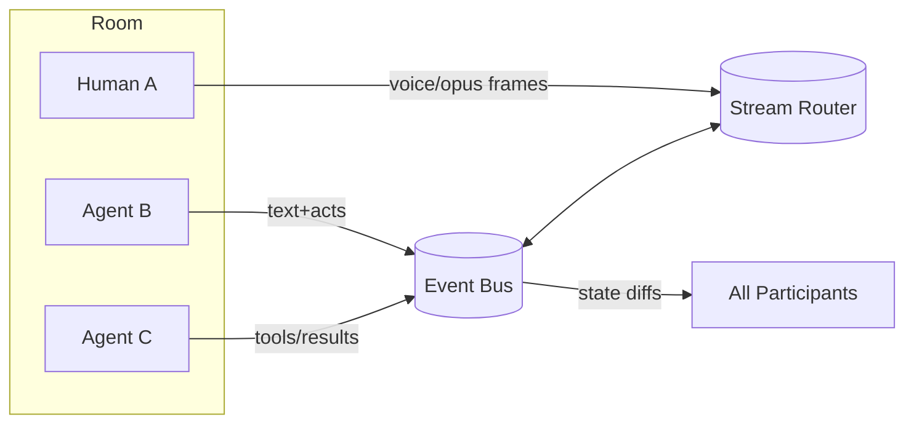

# Overview and Goals

Enso (ENSO-1) defines a protocol for **rooms of voices** where humans and
agents exchange causally ordered events and media streams. The protocol favours
small, composable messages and deterministic behaviour so that gateways,
clients, and tools can coordinate without bespoke glue code.

## Design Principles

* **Deterministic framing** – every payload travels inside a signed envelope
  with explicit causal metadata.
* **Capability negotiation** – rooms advertise policy while participants
  declare what they can send or receive.
* **Extensible media** – the same protocol carries discrete events, voice
  frames, derivation workflows, and tool calls.
* **Privacy as a first-class concern** – every transport decision flows from
  the room policy and session privacy profile.
* **Idempotent infrastructure** – assets, cache entries, and tool results are
  content-addressed so recomputation is avoidable.

## Package Ecosystem (TypeScript-first)

| Package | Role |
| --- | --- |
| `packages/enso-protocol` | Shared types, codecs, guards, and Zod schemas |
| `packages/enso-gateway` | Room server, authentication, policy enforcement |
| `packages/enso-client` | Browser/Node client SDK with voice helpers |
| `packages/enso-cli` | Minimal TUI/voice demo client |
| `packages/cephalon-core` | Interpreter that consumes Enso streams |
| `packages/enso-asset` | Content-addressed asset store |
| `packages/enso-cache` | Cache registry and LRU/TTL enforcement |
| `packages/enso-transcode` | Deterministic derivation workers |
| `packages/enso-context` | Context registry and LLM view builder |
| `packages/enso-mcp` | Model Context Protocol bridge |
| `packages/enso-rituals` | Guardrail and interoperability tests |

All packages use native ESM, AVA for tests, and expose strict TypeScript
surface areas with immutable data handling.

## Minimal Feature Checklist (v0.1)

- [ ] WebSocket transport with framed envelopes and ping/pong
- [ ] Presence events (`presence.join`, `presence.part`) and `chat.msg`
- [ ] `voice.frame` streaming with pause/resume and sequence tracking
- [ ] `tool.advertise`, `tool.call`, and `tool.result` covering at least one tool
- [ ] Evaluation mode (`room.flags.eval`) requiring `act.rationale`
- [ ] CLI demo linking microphone input to transcript and reply playback
