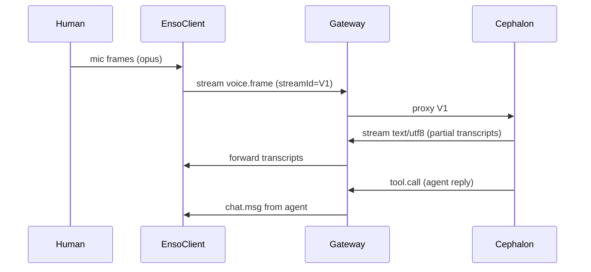

# SDK Surface and Implementation Notes

The TypeScript SDK provides a minimal but composable surface. All modules use
native ESM, AVA tests, and strict configuration.

## Client Skeleton

```ts
// packages/enso-client/src/client.ts
import type { Envelope } from "@promethean/enso-protocol/envelope.js";

type Handler = (env: Envelope) => void;

export class EnsoClient {
  #ws?: WebSocket;
  #handlers = new Map<string, Set<Handler>>();

  constructor(readonly url: string, readonly token: string) {}

  async connect(hello: Record<string, unknown>): Promise<void> {
    this.#ws = new WebSocket(this.url);
    await new Promise<void>((resolve) => {
      this.#ws!.onopen = () => resolve();
    });
    this.on("event:privacy.accepted", () => {});
    this.send({
      id: crypto.randomUUID(),
      ts: new Date().toISOString(),
      room: "",
      from: "",
      kind: "event",
      type: "hello",
      payload: hello,
    });
    this.#ws!.onmessage = (ev) => {
      const env = JSON.parse(ev.data.toString()) as Envelope;
      const key = `${env.kind}:${env.type}`;
      this.#handlers.get(key)?.forEach((fn) => fn(env));
    };
  }

  on(key: string, fn: Handler): () => void {
    const set = this.#handlers.get(key) ?? new Set<Handler>();
    set.add(fn);
    this.#handlers.set(key, set);
    return () => set.delete(fn);
  }

  send(env: Envelope): void {
    this.#ws?.send(JSON.stringify(env));
  }

  async post(room: string, message: unknown): Promise<void> {
    this.send({
      id: crypto.randomUUID(),
      ts: new Date().toISOString(),
      room,
      from: "",
      kind: "event",
      type: "content.post",
      payload: { room, message },
    });
  }
}
```

Helper namespaces (`assets`, `contexts`, `cache`) build on top of this core
transport. Each helper is a pure function that translates high-level calls
into envelopes.

## Minimal Demo Loop



## File Tree Stubs

```
packages/
  enso-protocol/
    src/{envelope.ts, events.ts, streams.ts, privacy.ts, context.ts}
  enso-gateway/
    src/{server.ts, rooms.ts, auth.ts, mixer.ts, handlers/}
  enso-client/
    src/{client.ts, transport-ws.ts, vad.ts, assets.ts, contexts.ts}
  enso-cli/
    src/{enso.ts}
  cephalon-core/
    src/{adapter-enso.ts, interpreter.ts}
```

Each package publishes ESM entry points ending with `.js` once compiled.
