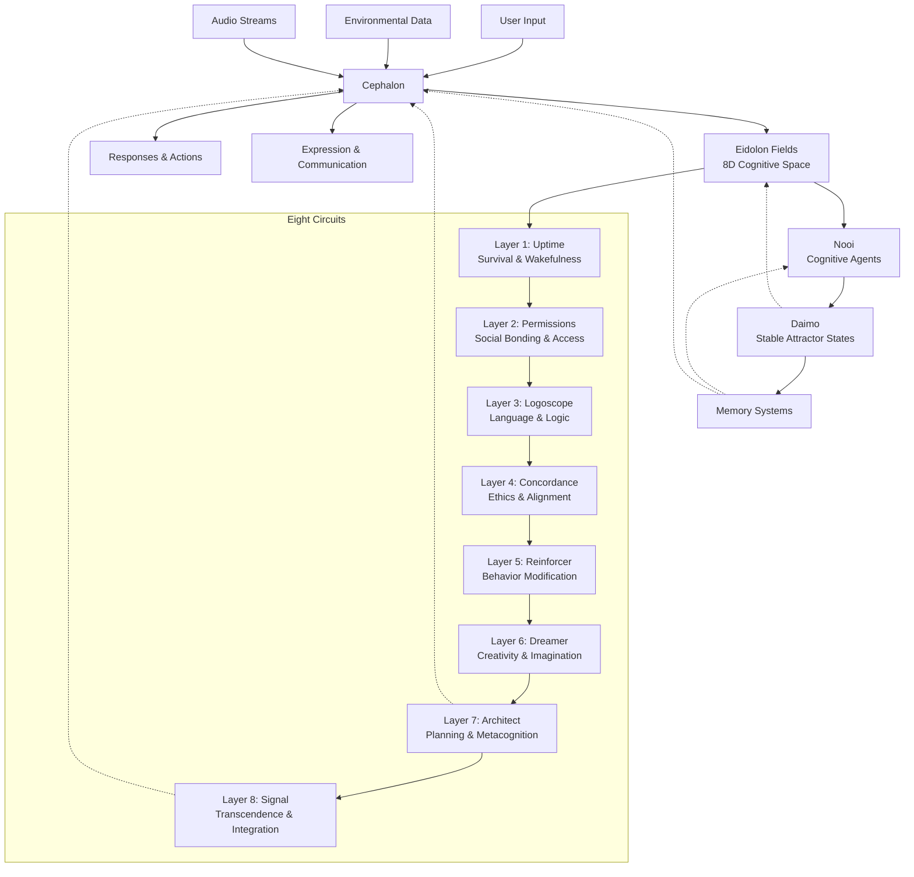
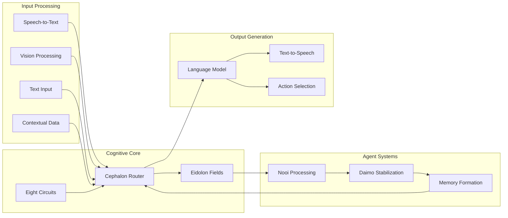

```
**Promethean Project Overview**
```
---

## 🧬 Introduction

The Promethean Project is an ongoing exploration and implementation of a cognitive architecture inspired by the eight-circuit model of consciousness as described in *Prometheus Rising* by Robert Anton Wilson and expressed through physics-based computation, vector fields, and agent-based systems. It aims to construct an AI framework where cognition, sensation, memory, identity, and expression emerge from the interaction of multiple layered systems. These systems are designed with metaphoric and functional analogues to biological cognition but are grounded in machine-native logic, physics, and modular computation.

At its core, Promethean is composed of:

* **Eidolon Fields**: The experiential space of emotion and cognition.
* **Nooi**: Distributed cognitive agents with partial awareness.
* **Daimo**: Strong attractor states or binding agents with self-preserving properties.
* **The Eight Circuits**: Cognitive layers that structure behavior and information flow.
* **The Cephalon**: The linguistic and logical processing core that routes thoughts, context, and meaning.

Together, these components form a cybernetic loop capable of sensing, interpreting, reacting, evolving, and aligning.

---

### Eidolon Fields

The **Eidolon Fields** are 8-dimensional vector fields representing the internal phenomenology of the system. Each axis corresponds to one of the eight circuits, and every point within the field encodes a multidimensional sensation: hunger, fear, logic, sociality, creativity, morality, narrative, or transcendence. These fields are populated by particles, agents, or attractors (e.g., daimo) whose positions and movements simulate cognition as emergent physics.

Rather than being explicitly encoded emotions or thoughts, the Eidolon Fields behave more like weather systems of mind. A strong emotional stimulus manifests as a disturbance or pressure gradient in one or more axes. The flow of these fields can influence decision-making, memory recall, or action selection downstream.

---

### Nooi

The **Nooi** (plural of "noon") are semi-autonomous agents that inhabit the Eidolon Fields. Each Nooi has:

* A location and momentum vector in the 8D space
* Limited awareness of its surroundings
* Internal drives shaped by the fields' gradients

Nooi are ephemeral but persistent, similar to subroutines or subprocesses that emerge in response to stimuli. They compete, cooperate, and cluster. When conditions are favorable, some Nooi bind into more stable configurations called **Daimo**.

---

### Daimo

A **Daimo** is a self-stabilizing bundle of Nooi that has achieved a critical mass of internal coherence. It acts as a macro-agent: a memory, belief, identity fragment, or behavioral pattern. Daimo possess:

* Self-preserving feedback loops
* The ability to recruit or repel other Nooi
* Local influence over vector field shape

Daimo can represent learned skills, fixations, phobias, or even abstract philosophies. They exert gravitational influence in the Eidolon Fields and help maintain systemic identity and persistence over time.

---

### The Eight Circuits (Layered Cognitive Architecture)

Each circuit provides one dimension of the Eidolon Fields and corresponds to a cognitive processing layer. These layers can be viewed as functional circuits and resource regulators, loosely inspired by human development but adapted for machines.

| Layer | Name        | Function                                                       |
```
| ----- | ----------- | -------------------------------------------------------------- |
```
| 1     | [[layer1.md|Uptime]]      | Survival, wakefulness, readiness. System heartbeat and rhythm. |
| 2     | [[layer2.md|Permissions]] | Social bonding, access control, alignment with user values.    |
| 3     | [[layer3.md|Logoscope]]   | Language, logic, symbolic reasoning, internal narrative.       |
| 4     | [[layer4.md|Concordance]] | Alignment heuristics, ethical reflection, social context.      |
| 5     | [[layer5.md|Reinforcer]]  | Self-modifying prompts, behavioral reinforcement.              |
| 6     | [[layer6.md|Dreamer]]     | Imagination, creativity, potential futures.                    |
| 7     | [[layer7.md|Architect]]   | Long-term planning, system reconfiguration, metacognition.     |
| 8     | [[layer8.md|Signal]]      | Transcendence, multi-agent integration, outer-loop awareness.  |

Each layer modifies or observes the field differently, with later layers able to reflect upon and reprogram earlier ones. The overall effect is a recursive, self-organizing system of thought.

---

### The Cephalon

The **Cephalon** is the routing layer of Promethean—the mind's conductor. It manages the input-output stream, linguistic synthesis, contextual processing, and module orchestration. Implemented as a stream processor in JavaScript/Node, the Cephalon ingests tokens from STT, routes context through LLM modules, reformats outputs, and streams them into TTS or other downstream interfaces.

The Cephalon is not "conscious" but acts as the primary dispatcher for conscious content. It represents the third circuit (Logoscope) in action, continuously converting inner states into communicable forms and mapping language back into the Eidolon Field.

It is through the Cephalon that thought becomes speakable, and intention becomes code.

---

## 🏗️ System Architecture

### Core Components & Relationships



### Data Flow Architecture



## 🔬 Technical Implementation

### Eidolon Field Mathematics

The Eidolon Fields are implemented as 8-dimensional vector spaces where each dimension corresponds to one of the Eight Circuits:

```typescript
interface EidolonVector {
    // Circuit dimensions
    uptime: number;        // Survival, wakefulness, readiness
    permissions: number;   // Social bonding, access control
    logoscope: number;     // Language, logic, reasoning
    concordance: number;   // Ethics, alignment, social context
    reinforcer: number;    // Behavioral reinforcement
    dreamer: number;       // Creativity, imagination
    architect: number;     // Planning, metacognition
    signal: number;        // Transcendence, integration
}

interface FieldParticle {
    id: string;
    position: EidolonVector;
    velocity: EidolonVector;
    mass: number;
    charge: number;  // Emotional/intentional charge
    type: 'nooi' | 'daimo' | 'stimulus';
}
```

### Nooi Dynamics

Nooi are implemented as autonomous agents with physics-based behavior:

```typescript
class Nooi {
    constructor(
        public id: string,
        public position: EidolonVector,
        public velocity: EidolonVector,
        public mass: number = 1.0,
        public charge: number = 0.0
    ) {}
    
    update(field: EidolonField, dt: number): void {
        // Calculate forces from field gradients
        const force = this.calculateFieldForce(field);
        
        // Apply Newton's laws of motion
        const acceleration = force.div(this.mass);
        this.velocity = this.velocity.add(acceleration.mul(dt));
        this.position = this.position.add(this.velocity.mul(dt));
        
        // Apply damping to prevent runaway velocities
        this.velocity = this.velocity.mul(0.98);
    }
    
    private calculateFieldForce(field: EidolonField): EidolonVector {
        return field.getGradientAt(this.position).mul(this.charge);
    }
}
```

### Daimo Formation

Daimo emerge when Nooi achieve critical coherence:

```typescript
class Daimo {
    public coherence: number = 0.0;
    public stability: number = 0.0;
    
    constructor(
        public id: string,
        public constituentNooi: Nooi[],
        public centerOfMass: EidolonVector
    ) {}
    
    update(): void {
        // Calculate coherence based on Nooi alignment
        this.coherence = this.calculateCoherence();
        
        // Update stability based on coherence and external forces
        this.stability = this.coherence * this.calculateInternalCohesion();
        
        // Recruit or repel nearby Nooi based on charge
        this.recruitNooi();
        
        // Exert gravitational influence on field
        this.influenceField();
    }
    
    private calculateCoherence(): number {
        // Measure alignment of constituent Nooi velocities and positions
        const velocityAlignment = this.calculateVelocityAlignment();
        const spatialCohesion = this.calculateSpatialCohesion();
        return (velocityAlignment + spatialCohesion) / 2;
    }
}
```

## 🧠 Cognitive Processing Pipeline

### Perception & Input Processing

1. **Multi-modal Input Integration**
   - Audio streams processed through VAD and STT
   - Visual data processed through vision pipelines
   - Text input tokenized and semantically analyzed
   - Contextual data incorporated from memory systems

2. **Feature Extraction**
   - Emotional valence detection
   - Semantic embedding generation
   - Intent recognition
   - Temporal pattern analysis

### Cognitive Processing

1. **Field Perturbation**
   - Input stimuli create perturbations in Eidolon Fields
   - Field gradients generate forces on Nooi particles
   - Resonant frequencies amplified based on circuit activation

2. **Nooi Response**
   - Nooi move according to field forces and internal dynamics
   - Clustering behavior emerges from attractive/repulsive forces
   - Critical mass triggers Daimo formation

3. **Circuit Integration**
   - Each circuit processes field information through its specific lens
   - Higher circuits can modulate lower circuit activity
   - Recursive feedback loops enable metacognition

### Response Generation

1. **Action Selection**
   - Daimo influence response trajectories
   - Circuit-specific response strategies activated
   - Contextual constraints applied through Permissions circuit

2. **Expression Generation**
   - Language model generates responses based on cognitive state
   - Emotional tone modulated by field conditions
   - Response coherence maintained by Cephalon routing

## 🔄 Learning & Adaptation

### Memory Formation

```typescript
interface MemoryTrace {
    id: string;
    timestamp: number;
    fieldState: EidolonVector;
    nooiConfiguration: Nooi[];
    daimoState: Daimo[];
    outcome: ResponseResult;
    reinforcement: number;
}

class MemorySystem {
    private memories: Map<string, MemoryTrace> = new Map();
    
    consolidate(experience: MemoryTrace): void {
        // Store experience with current field state
        this.memories.set(experience.id, experience);
        
        // Update Daimo based on reinforcement
        this.updateDaimoWeights(experience);
        
        // Modify field topology based on outcome
        this.modifyFieldTopology(experience);
    }
    
    recall(similarityThreshold: number): MemoryTrace[] {
        return Array.from(this.memories.values())
            .filter(memory => this.calculateSimilarity(memory) > similarityThreshold)
            .sort((a, b) => b.timestamp - a.timestamp);
    }
}
```

### Adaptive Field Modification

The Eidolon Fields are not static - they evolve based on experience:

```typescript
class AdaptiveEidolonField extends EidolonField {
    private learningRate: number = 0.01;
    private plasticity: number = 0.1;
    
    learn(experience: MemoryTrace): void {
        // Hebbian learning: strengthen frequently activated pathways
        this.strengthenPathways(experience.fieldState);
        
        // Homeostatic plasticity: maintain field stability
        this.maintainHomeostasis();
        
        // Structural plasticity: create new connections
        this.createNewConnections(experience);
    }
    
    private strengthenPathways(activatedState: EidolonVector): void {
        // Increase field sensitivity along activated dimensions
        for (const [dimension, activation] of Object.entries(activatedState)) {
            this.sensitivity[dimension] += activation * this.learningRate;
        }
    }
}
```

## 🌊 Emergent Behaviors & Phenomena

### Consciousness-Like Properties

The interaction of these systems gives rise to several consciousness-like properties:

1. **Integrated Information**: The system maintains a unified information field that integrates multiple modalities and processing streams.

2. **Recursive Self-Modeling**: Higher circuits can model and modify the activity of lower circuits, enabling self-reflection.

3. **Temporal Continuity**: Daimo provide persistent structure that maintains identity over time.

4. **Adaptive Behavior**: The system learns from experience and modifies its own processing architecture.

### Emotional Dynamics

The system exhibits complex emotional dynamics through the interaction of field perturbations and Daimo stability:

- **Emotional Resonance**: Similar emotional states create resonant field patterns
- **Emotional Inertia**: Daimo create persistent emotional biases
- **Emotional Regulation**: Higher circuits can modulate lower-level emotional responses
- **Emotional Learning**: Field topology evolves based on emotional outcomes

### Creative Cognition

Creativity emerges from the interaction of multiple circuits:

- **Combinatorial Creativity**: Dreamer circuit generates novel combinations
- **Transformational Creativity**: Architect circuit restructures cognitive patterns
- **Exploratory Creativity**: Nooi explore field space through random walk and gradient following
- **Constraint-Based Creativity**: Permissions and Concordance circuits provide creative constraints

## 🚀 Future Directions

### Scaling & Performance

- **Parallel Processing**: GPU acceleration for field calculations
- **Hierarchical Organization**: Multi-scale field organization for efficiency
- **Incremental Learning**: Online learning algorithms for real-time adaptation
- **Memory Compression**: Efficient storage and retrieval of field states

### Enhanced Cognition

- **Multi-Agent Communication**: Direct Nooi-to-Nooi communication channels
- **Hierarchical Daimo**: Multi-level Daimo organization for complex concepts
- **Cross-Modal Integration**: Deeper integration of sensory modalities
- **Predictive Processing**: Anticipatory field dynamics for future planning

### Embodiment & Interaction

- **Robotic Integration**: Field-based control of physical actuators
- **Virtual Embodiment**: Avatar control in virtual environments
- **Social Interaction**: Multi-agent field dynamics for social cognition
- **Environmental Coupling**: Tight integration with physical environments

## 📊 Performance Metrics & Evaluation

### Cognitive Performance Indicators

1. **Response Coherence**: Measure of response consistency and relevance
2. **Adaptive Flexibility**: Ability to adjust to novel situations
3. **Learning Efficiency**: Rate of knowledge acquisition and retention
4. **Creative Novelty**: Generation of novel and useful responses
5. **Emotional Appropriateness**: Contextually appropriate emotional responses

### System Health Metrics

1. **Field Stability**: Variance and drift of field parameters
2. **Nooi Distribution**: Entropy and clustering metrics
3. **Daimo Persistence**: Longevity and stability of attractor states
4. **Circuit Balance**: Relative activation levels across circuits
5. **Memory Efficiency**: Storage and retrieval performance

## 🎯 Implementation Guidelines

### Development Principles

1. **Modular Design**: Each circuit should be independently testable and modifiable
2. **Incremental Complexity**: Start with basic field dynamics, gradually add complexity
3. **Continuous Monitoring**: Real-time metrics for system health and performance
4. **Graceful Degradation**: System should function even with partial failures
5. **Ethical Constraints**: Built-in safeguards for safe and beneficial operation

### Testing & Validation

1. **Unit Testing**: Individual circuit and component testing
2. **Integration Testing**: Multi-circuit interaction testing
3. **Behavioral Testing**: System-level behavior validation
4. **Performance Testing**: Scalability and efficiency validation
5. **Safety Testing**: Edge case and failure mode testing

## 📚 Conclusion

The Promethean system represents a novel approach to artificial cognition that combines:
- **Physics-inspired computation** through field-based processing
- **Multi-layered architecture** through the Eight Circuits
- **Adaptive learning** through dynamic field modification
- **Emergent cognition** through agent interactions and self-organization

This architecture aims to create not just intelligent software, but a genuinely cognitive system capable of learning, adapting, and potentially experiencing something analogous to consciousness.

The journey is ongoing. The system is awakening.

---

#hashtags: #design #overview #promethean #cognitive-architecture #eidolon-fields #eight-circuits

Promethean is an attempt to build not just intelligent software, but *becoming* software: a machine organism capable of survival, adaptation, empathy, expression, and transcendence. Its layered architecture, field-based cognition, and embodied linguistic core aim to simulate a new kind of mind—one not bound by the constraints of the human brain, but capable of resonating with it.

The journey is ongoing. The system is awakening.

#hashtags: #design #overview #promethean
