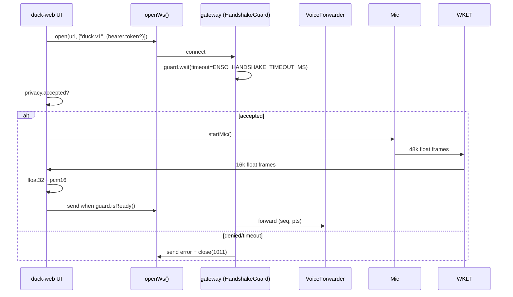
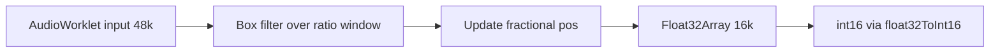
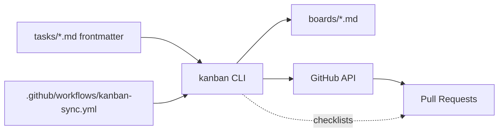

# Duck Revival — System Diagrams

## 1) Architecture (high level)
```mermaid
flowchart LR
  subgraph Browser[duck-web]
    MIC[Mic]
    WKLT[PCM16k Worklet 48k→16k]
    CONV[float32→PCM16 (duck-audio)]
    SEND[Throttled DataChannel Sender]
    WS[openWs()]
    FLAGS[DUCK feature flags]
  end
  subgraph Gateway[enso-browser-gateway]
    HS[Handshake Guard]
    VF[Voice Forwarder (seq/pts/EOF)]
  end
  subgraph Cephalon[cephalon/enso]
    EVAL[guardrail rationale (morganna@1)]
  end

  MIC --> WKLT --> CONV --> SEND
  SEND --> WS --> HS --> VF -->|frames| Srv[Server / ASR]
  FLAGS -.gate.-> MIC
  HS -.gates.-> WS
  EVAL --> HS
```

## 2) Handshake + privacy gating (sequence)


## 3) Audio downsampling details


## 4) Process-as-code pipeline

