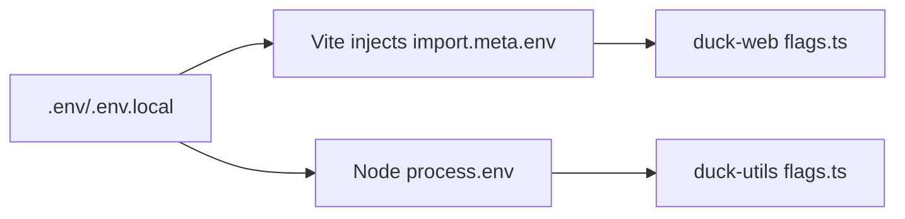

# DUCK Feature Flags

Canonical flags and where they are consumed.

## Web (Vite)
- `VITE_DUCK_USE_BLOBS` — enable Blob-backed storage paths in duck-web.
- `VITE_STT_TTS_ENABLED` — toggle STT/TTS UI features.

Access with `import.meta.env`.

## Node / Server
- `DUCK_USE_BLOBS` — enable Blob-backed paths in node utilities.
- `STT_TTS_ENABLED` — toggle STT/TTS features server-side.

Access with `process.env`.

## Parsing
Both sides parse strictly as strings: `"true"|"false"` (anything else falls back to defaults).

## Diagram


## Example
```env
# web
VITE_DUCK_USE_BLOBS=true
VITE_STT_TTS_ENABLED=false

# node
DUCK_USE_BLOBS=false
STT_TTS_ENABLED=true
```

## References
- PR #1447 (duck-web flags)
- PR #1446 (openWs)
- PR #1445 (throttled sender)
