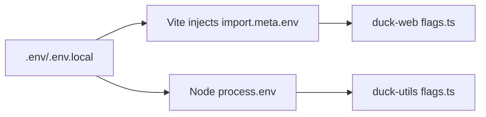

# DUCK Feature Flags

Canonical flags and where they are consumed.

## Web (Vite)
- `VITE_DUCK_USE_BLOBS` — enable Blob-backed storage paths in duck-web.
- `VITE_STT_TTS_ENABLED` — toggle STT/TTS UI features.

Access with `import.meta.env`.

## Node / Server
- `DUCK_USE_BLOBS` — enable Blob-backed paths in node utilities.
- `STT_TTS_ENABLED` — toggle STT/TTS features server-side.

Access with `process.env`.

## Parsing
Both sides parse strictly as strings: `"true"|"false"` (anything else falls back to defaults).

## Diagram


## Example
```env
# web
VITE_DUCK_USE_BLOBS=true
VITE_STT_TTS_ENABLED=false

# node
DUCK_USE_BLOBS=false
STT_TTS_ENABLED=true
```

## References
- PR #1447 $duck-web flags$
- PR #1446 (openWs)
- PR #1445 (throttled sender)
# DUCK feature flags

Default: disabled (most paths are off by default).

Values other than the case-insensitive strings `true` or `false` fall back to their default values.

## Web $`apps/duck-web`$

- `VITE_DUCK_USE_BLOBS`: enables WS binary-blob path (default: `false`)
- `VITE_STT_TTS_ENABLED`: turns on STT/TTS integrations (default: `false`)

_Source: $`apps/duck-web/src/flags.ts`$$../../apps/duck-web/src/flags.ts$_

> Non-`true`/`false` strings fall back to the default value.

## Node $`packages/duck-utils`$

- `DUCK_USE_BLOBS`: boolean read from `process.env` (default: `false`)
- `STT_TTS_ENABLED`: boolean read from `process.env` (default: `false`)

_Source: $`packages/duck-utils/src/flags.ts`$$../../packages/duck-utils/src/flags.ts$_

> Non-`true`/`false` strings fall back to the default value.

### Examples
$$
**Vite (.env)**
$$
```
VITE_DUCK_USE_BLOBS=true
VITE_STT_TTS_ENABLED=true
```
$$
**Node**
$$
```
DUCK_USE_BLOBS=true
STT_TTS_ENABLED=true
```
