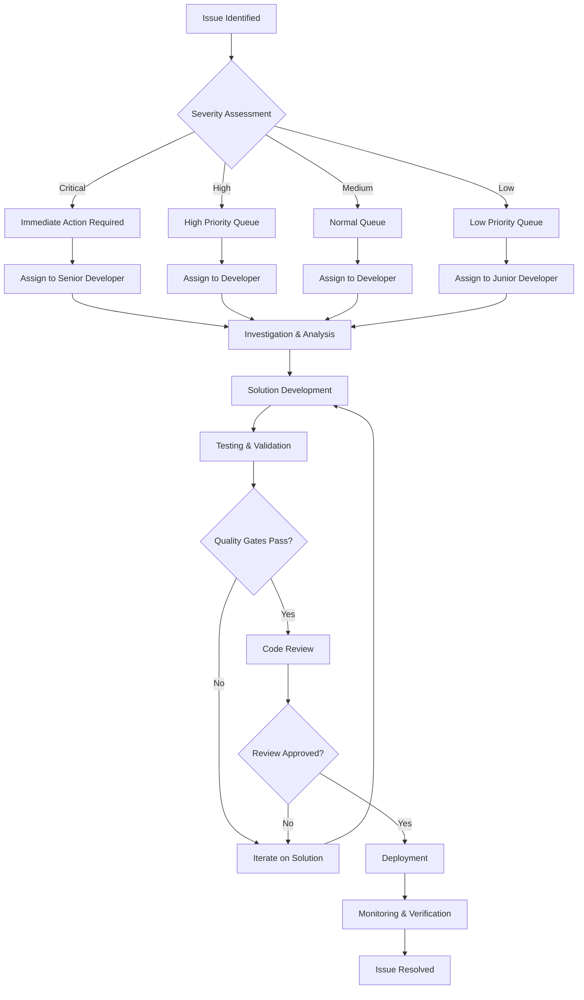

# Functional Framework Migration Progress Tracking

## Overview

This document provides templates and procedures for tracking migration progress, identifying and resolving issues, managing rollback procedures, and measuring success metrics throughout the functional framework migration project.

---

## 1. Migration Status Tracking

### 1.1 Progress Dashboard Template

#### High-Level Progress Overview
```markdown
# Functional Migration Progress Dashboard

## Project Status: [In Progress/On Track/At Risk/Delayed]

### Overall Progress
- **Total Classes**: 706
- **Converted Classes**: [X]/706 ([XX]%)
- **In Progress**: [Y] classes
- **Not Started**: [Z] classes
- **Blocked**: [N] classes

### Phase Progress
| Phase | Status | Progress | Start Date | Target Date | Actual Date |
|-------|--------|----------|------------|-------------|-------------|
| Phase 1: Foundation | [Completed/In Progress] | [XX]% | YYYY-MM-DD | YYYY-MM-DD | YYYY-MM-DD |
| Phase 2: Core Packages | [Not Started/In Progress] | [XX]% | YYYY-MM-DD | YYYY-MM-DD | YYYY-MM-DD |
| Phase 3: Service Packages | [Not Started] | 0% | YYYY-MM-DD | YYYY-MM-DD | - |
| Phase 4: System Packages | [Not Started] | 0% | YYYY-MM-DD | YYYY-MM-DD | - |
| Phase 5: Utility Packages | [Not Started] | 0% | YYYY-MM-DD | YYYY-MM-DD | - |
| Phase 6: Integration | [Not Started] | 0% | YYYY-MM-DD | YYYY-MM-DD | - |

### Package Progress
| Package | Total Classes | Converted | In Progress | Not Started | Status |
|---------|---------------|------------|-------------|-------------|---------|
| pantheon | 5 | [X] | [Y] | [Z] | [On Track/At Risk] |
| core | [X] | [X] | [Y] | [Z] | [On Track/At Risk] |
| auth | [X] | [X] | [Y] | [Z] | [On Track/At Risk] |
| ... | ... | ... | ... | ... | ... |

### Quality Metrics
- **Test Coverage**: [XX]% (Target: ≥90%)
- **Performance**: [±X]% from baseline (Target: ≤5% regression)
- **Code Quality**: [Score]/100 (Target: ≥90)
- **Documentation**: [XX]% complete (Target: 100%)
- **Security Issues**: [X] high, [Y] medium, [Z] low (Target: 0 high)
```

#### Detailed Package Progress Template
```markdown
## [Package Name] Package Progress

### Classes Status
| Class Name | File | Status | Started | Completed | Assignee | Notes |
|------------|------|--------|---------|-----------|----------|-------|
| [ClassName] | src/path/to/file.ts | [Converted/In Progress/Not Started/Blocked] | YYYY-MM-DD | YYYY-MM-DD | [Name] | [Notes] |
| [ClassName] | src/path/to/file.ts | [Converted/In Progress/Not Started/Blocked] | YYYY-MM-DD | YYYY-MM-DD | [Name] | [Notes] |

### Conversion Tasks
| Task | Status | Assignee | Due Date | Completed Date | Notes |
|------|--------|----------|----------|----------------|-------|
| Analyze class dependencies | [Done/In Progress/Not Started] | [Name] | YYYY-MM-DD | YYYY-MM-DD | [Notes] |
| Create functional actions | [Done/In Progress/Not Started] | [Name] | YYYY-MM-DD | YYYY-MM-DD | [Notes] |
| Create factory functions | [Done/In Progress/Not Started] | [Name] | YYYY-MM-DD | YYYY-MM-DD | [Notes] |
| Write tests | [Done/In Progress/Not Started] | [Name] | YYYY-MM-DD | YYYY-MM-DD | [Notes] |
| Update documentation | [Done/In Progress/Not Started] | [Name] | YYYY-MM-DD | YYYY-MM-DD | [Notes] |
| Code review | [Done/In Progress/Not Started] | [Name] | YYYY-MM-DD | YYYY-MM-DD | [Notes] |

### Quality Metrics
- **Test Coverage**: [XX]%
- **Performance**: [±X]% from baseline
- **Code Quality Score**: [XX]/100
- **Documentation**: [XX]% complete

### Issues and Blockers
| Issue | Severity | Status | Assignee | Opened | Resolved |
|-------|----------|--------|----------|--------|----------|
| [Issue description] | [Critical/High/Medium/Low] | [Open/In Progress/Resolved] | [Name] | YYYY-MM-DD | YYYY-MM-DD |
```

### 1.2 Automated Progress Tracking

#### Progress Tracking Script Template
```typescript
// src/tools/progress-tracker.ts
export interface ClassProgress {
  className: string;
  filePath: string;
  status: 'converted' | 'in-progress' | 'not-started' | 'blocked';
  startedAt?: Date;
  completedAt?: Date;
  assignee?: string;
  notes?: string;
}

export interface PackageProgress {
  packageName: string;
  totalClasses: number;
  convertedClasses: number;
  inProgressClasses: number;
  notStartedClasses: number;
  blockedClasses: number;
  classes: ClassProgress[];
  qualityMetrics: QualityMetrics;
}

export interface ProjectProgress {
  totalClasses: number;
  convertedClasses: number;
  overallProgress: number;
  phases: PhaseProgress[];
  packages: PackageProgress[];
  qualityMetrics: QualityMetrics;
  lastUpdated: Date;
}

export class ProgressTracker {
  private progressData: ProjectProgress;
  
  constructor(private config: ProgressTrackerConfig) {}
  
  async scanProject(): Promise<ProjectProgress> {
    // Scan all TypeScript files for classes
    // Analyze conversion status
    // Calculate progress metrics
    // Generate progress report
  }
  
  async updateClassProgress(
    className: string,
    status: ClassProgress['status'],
    update: Partial<ClassProgress>
  ): Promise<void> {
    // Update individual class progress
    // Recalculate package and project progress
    // Trigger notifications if needed
  }
  
  async generateProgressReport(): Promise<string> {
    // Generate markdown progress report
    // Include charts and visualizations
    // Highlight issues and blockers
  }
  
  async checkQualityGates(): Promise<QualityGateResult[]> {
    // Check all quality gates
    // Return pass/fail status with details
  }
}
```

#### Automated Quality Check Script
```typescript
// src/tools/quality-checker.ts
export class QualityChecker {
  async checkTestCoverage(packagePath: string): Promise<CoverageReport> {
    // Run coverage analysis
    // Return coverage metrics
  }
  
  async checkPerformance(packagePath: string): Promise<PerformanceReport> {
    // Run performance benchmarks
    // Compare with baseline
    // Return performance metrics
  }
  
  async checkCodeQuality(packagePath: string): Promise<CodeQualityReport> {
    // Run linting and static analysis
    // Calculate quality score
    // Return quality metrics
  }
  
  async checkSecurity(packagePath: string): Promise<SecurityReport> {
    // Run security analysis
    // Check for vulnerabilities
    // Return security metrics
  }
  
  async checkDocumentation(packagePath: string): Promise<DocumentationReport> {
    // Analyze documentation coverage
    // Check for missing documentation
    // Return documentation metrics
  }
}
```

---

## 2. Issue Identification and Resolution

### 2.1 Issue Classification System

#### Issue Categories
```typescript
export interface Issue {
  id: string;
  title: string;
  description: string;
  category: IssueCategory;
  severity: IssueSeverity;
  status: IssueStatus;
  assignee?: string;
  reporter: string;
  createdAt: Date;
  updatedAt: Date;
  resolvedAt?: Date;
  labels: string[];
  relatedClasses: string[];
  relatedPackages: string[];
  impact: IssueImpact;
  resolution?: IssueResolution;
}

export type IssueCategory = 
  | 'technical-debt'
  | 'performance-regression'
  | 'breaking-change'
  | 'test-failure'
  | 'documentation-gap'
  | 'security-vulnerability'
  | 'dependency-conflict'
  | 'tooling-issue'
  | 'process-issue'
  | 'resource-constraint';

export type IssueSeverity = 'critical' | 'high' | 'medium' | 'low';

export type IssueStatus = 
  | 'open'
  | 'in-progress'
  | 'under-review'
  | 'resolved'
  | 'closed'
  | 'wont-fix'
  | 'deferred';

export interface IssueImpact {
  classesAffected: number;
  packagesAffected: number;
  usersAffected: number;
  timelineImpact: number; // days
  costImpact?: number;
}
```

#### Issue Templates

##### Technical Debt Issue Template
```markdown
## Technical Debt: [Issue Title]

### Description
[Detailed description of technical debt issue]

### Current State
```typescript
// Show current problematic code
```

### Desired State
```typescript
// Show desired functional implementation
```

### Impact
- **Classes Affected**: [X]
- **Packages Affected**: [Y]
- **Estimated Effort**: [X] hours
- **Priority**: [Critical/High/Medium/Low]

### Resolution Steps
1. [ ] Step 1: [Description]
2. [ ] Step 2: [Description]
3. [ ] Step 3: [Description]

### Acceptance Criteria
- [ ] Code converted to functional pattern
- [ ] Tests pass with ≥90% coverage
- [ ] Performance meets benchmarks
- [ ] Documentation updated

### Related Issues
- [Issue #123](link)
- [Issue #456](link)
```

##### Performance Regression Issue Template
```markdown
## Performance Regression: [Issue Title]

### Description
[Description of performance regression]

### Metrics
- **Baseline Performance**: [X]ms
- **Current Performance**: [Y]ms
- **Regression**: [±Z]%
- **Threshold**: [Target]%

### Analysis
```typescript
// Performance test results
// Profiling data
// Bottleneck identification
```

### Root Cause
[Analysis of what caused the regression]

### Impact
- **User Experience**: [Description]
- **System Load**: [Description]
- **Resource Usage**: [Description]

### Resolution Plan
1. [ ] Optimize critical path
2. [ ] Implement caching if applicable
3. [ ] Reduce unnecessary computations
4. [ ] Update benchmarks

### Validation
- [ ] Performance meets baseline
- [ ] No functional regressions
- [ ] Load tests pass
```

### 2.2 Issue Resolution Workflow

#### Issue Resolution Process


#### Issue Resolution Tracking
```typescript
export interface IssueResolution {
  strategy: ResolutionStrategy;
  steps: ResolutionStep[];
  estimatedEffort: number; // hours
  actualEffort: number; // hours
  blockers: string[];
  dependencies: string[];
  rollbackPlan: RollbackPlan;
}

export type ResolutionStrategy = 
  | 'immediate-fix'
  | 'gradual-refactor'
  | 'compatibility-layer'
  | 'feature-flag'
  | 'deferred-resolution';

export interface ResolutionStep {
  id: string;
  description: string;
  status: 'pending' | 'in-progress' | 'completed' | 'blocked';
  assignee?: string;
  estimatedHours: number;
  actualHours?: number;
  dependencies: string[];
  artifacts: string[];
}
```

---

## 3. Rollback Procedures

### 3.1 Rollback Triggers and Criteria

#### Automatic Rollback Triggers
```typescript
export interface RollbackTrigger {
  condition: string;
  threshold: number;
  measurementWindow: number; // minutes
  severity: 'critical' | 'high' | 'medium';
  action: 'immediate-rollback' | 'manual-review' | 'alert-only';
}

export const rollbackTriggers: RollbackTrigger[] = [
  {
    condition: 'error_rate',
    threshold: 10, // 10%
    measurementWindow: 5,
    severity: 'critical',
    action: 'immediate-rollback',
  },
  {
    condition: 'response_time_p95',
    threshold: 2000, // 2 seconds
    measurementWindow: 10,
    severity: 'high',
    action: 'manual-review',
  },
  {
    condition: 'memory_usage',
    threshold: 90, // 90%
    measurementWindow: 15,
    severity: 'high',
    action: 'manual-review',
  },
];
```

#### Manual Rollback Criteria
- **Performance Regression**: >20% performance degradation
- **Critical Functionality**: Core features not working
- **Data Corruption**: Data integrity issues detected
- **Security Breach**: Security vulnerabilities exploited
- **User Impact**: Significant user complaints

### 3.2 Rollback Strategies

#### Immediate Rollback Procedure
```typescript
export interface ImmediateRollbackPlan {
  trigger: string;
  rollbackSteps: RollbackStep[];
  verificationSteps: VerificationStep[];
  communicationPlan: CommunicationPlan;
  estimatedDowntime: number; // minutes
}

export interface RollbackStep {
  description: string;
  command: string;
  expectedDuration: number; // minutes
  verification: string;
  rollbackCommand?: string; // in case rollback fails
}

export const immediateRollbackPlan: ImmediateRollbackPlan = {
  trigger: 'critical_error_rate',
  rollbackSteps: [
    {
      description: 'Switch to previous version',
      command: 'git checkout [previous-commit-hash]',
      expectedDuration: 2,
      verification: 'git rev-parse HEAD',
      rollbackCommand: 'git checkout [current-commit-hash]',
    },
    {
      description: 'Rebuild application',
      command: 'pnpm build',
      expectedDuration: 5,
      verification: 'ls -la dist/',
    },
    {
      description: 'Restart services',
      command: 'pm2 restart all',
      expectedDuration: 1,
      verification: 'pm2 status',
    },
  ],
  verificationSteps: [
    {
      description: 'Check application health',
      command: 'curl -f http://localhost:3000/health',
      expectedStatus: 200,
    },
    {
      description: 'Verify error rate',
      command: 'check-error-rate',
      threshold: 1, // 1%
    },
  ],
  communicationPlan: {
    stakeholders: ['dev-team', 'ops-team', 'product-team'],
    channels: ['slack', 'email'],
    message: 'Immediate rollback initiated due to critical errors. ETA: 10 minutes.',
  },
  estimatedDowntime: 10,
};
```

#### Gradual Rollback Procedure
```typescript
export interface GradualRollbackPlan {
  trigger: string;
  phases: RollbackPhase[];
  monitoringPlan: MonitoringPlan;
  communicationPlan: CommunicationPlan;
}

export interface RollbackPhase {
  name: string;
  percentage: number; // percentage of traffic to rollback
  duration: number; // minutes
  successCriteria: string[];
  rollbackTrigger: string;
}

export const gradualRollbackPlan: GradualRollbackPlan = {
  trigger: 'performance_regression',
  phases: [
    {
      name: 'Phase 1: 10% Rollback',
      percentage: 10,
      duration: 15,
      successCriteria: [
        'error_rate < 2%',
        'response_time_p95 < 1000ms',
      ],
      rollbackTrigger: 'error_rate > 5%',
    },
    {
      name: 'Phase 2: 50% Rollback',
      percentage: 50,
      duration: 30,
      successCriteria: [
        'error_rate < 1%',
        'response_time_p95 < 500ms',
      ],
      rollbackTrigger: 'error_rate > 3%',
    },
    {
      name: 'Phase 3: 100% Rollback',
      percentage: 100,
      duration: 15,
      successCriteria: [
        'error_rate < 0.5%',
        'response_time_p95 < 200ms',
      ],
      rollbackTrigger: 'error_rate > 1%',
    },
  ],
  monitoringPlan: {
    metrics: ['error_rate', 'response_time', 'throughput'],
    interval: 30, // seconds
    alerts: ['slack', 'email'],
  },
  communicationPlan: {
    stakeholders: ['dev-team', 'ops-team'],
    channels: ['slack'],
    message: 'Gradual rollback initiated due to performance issues. Monitoring progress.',
  },
};
```

### 3.3 Rollback Automation

#### Automated Rollback Script
```typescript
// src/tools/rollback-manager.ts
export class RollbackManager {
  constructor(
    private config: RollbackConfig,
    private monitoring: MonitoringService,
    private communication: CommunicationService
  ) {}
  
  async executeRollback(
    trigger: string,
    strategy: 'immediate' | 'gradual'
  ): Promise<RollbackResult> {
    try {
      // Notify stakeholders
      await this.communication.notifyRollbackInitiated(trigger, strategy);
      
      if (strategy === 'immediate') {
        return await this.executeImmediateRollback(trigger);
      } else {
        return await this.executeGradualRollback(trigger);
      }
    } catch (error) {
      await this.communication.notifyRollbackFailed(error);
      throw error;
    }
  }
  
  private async executeImmediateRollback(trigger: string): Promise<RollbackResult> {
    const plan = this.getImmediateRollbackPlan(trigger);
    const startTime = Date.now();
    
    for (const step of plan.rollbackSteps) {
      try {
        await this.executeRollbackStep(step);
        await this.verifyRollbackStep(step);
      } catch (error) {
        if (step.rollbackCommand) {
          await this.executeRollbackStep({
            description: 'Rollback failed step',
            command: step.rollbackCommand,
            expectedDuration: 1,
            verification: '',
          });
        }
        throw error;
      }
    }
    
    // Verify rollback success
    const verificationResults = await this.verifyRollback(plan.verificationSteps);
    
    const result: RollbackResult = {
      success: verificationResults.allPassed,
      duration: Date.now() - startTime,
      stepsExecuted: plan.rollbackSteps.length,
      verificationResults,
    };
    
    await this.communication.notifyRollbackCompleted(result);
    return result;
  }
  
  private async executeGradualRollback(trigger: string): Promise<RollbackResult> {
    const plan = this.getGradualRollbackPlan(trigger);
    const startTime = Date.now();
    
    for (const phase of plan.phases) {
      try {
        await this.executeRollbackPhase(phase);
        await this.monitorPhase(phase);
      } catch (error) {
        // If phase fails, execute immediate rollback
        return await this.executeImmediateRollback(phase.rollbackTrigger);
      }
    }
    
    return {
      success: true,
      duration: Date.now() - startTime,
      phasesExecuted: plan.phases.length,
    };
  }
}
```

---

## 4. Success Metrics

### 4.1 Quantitative Success Metrics

#### Migration Completion Metrics
```typescript
export interface MigrationMetrics {
  completion: {
    totalClasses: number;
    convertedClasses: number;
    inProgressClasses: number;
    notStartedClasses: number;
    blockedClasses: number;
    completionPercentage: number;
  };
  timeline: {
    plannedDuration: number; // days
    actualDuration: number; // days
    onTimeDelivery: boolean;
    phasesCompleted: number;
    phasesTotal: number;
  };
  quality: {
    averageTestCoverage: number;
    averageCodeQuality: number;
    performanceRegression: number;
    securityIssues: number;
    documentationCoverage: number;
  };
  efficiency: {
    classesPerDay: number;
    averageEffortPerClass: number;
    automationEfficiency: number;
    reworkRate: number;
  };
}
```

#### Performance Metrics
```typescript
export interface PerformanceMetrics {
  baseline: {
    averageResponseTime: number;
    p95ResponseTime: number;
    throughput: number;
    errorRate: number;
    memoryUsage: number;
    cpuUsage: number;
  };
  current: {
    averageResponseTime: number;
    p95ResponseTime: number;
    throughput: number;
    errorRate: number;
    memoryUsage: number;
    cpuUsage: number;
  };
  regression: {
    responseTimeRegression: number;
    throughputRegression: number;
    errorRateRegression: number;
    memoryUsageRegression: number;
    cpuUsageRegression: number;
  };
}
```

### 4.2 Qualitative Success Metrics

#### Code Quality Metrics
```typescript
export interface CodeQualityMetrics {
  maintainability: {
    cyclomaticComplexity: number;
    cognitiveComplexity: number;
    codeDuplication: number;
    technicalDebtRatio: number;
  };
  readability: {
    functionLength: number;
    fileLength: number;
    parameterCount: number;
    nestingDepth: number;
  };
  testability: {
    mockability: number;
    isolation: number;
    coverageQuality: number;
    testComplexity: number;
  };
  functionalCompliance: {
    pureFunctionRatio: number;
    immutabilityScore: number;
    dependencyInjectionScore: number;
    sideEffectFreeRatio: number;
  };
}
```

#### Team Productivity Metrics
```typescript
export interface TeamProductivityMetrics {
  velocity: {
    classesConvertedPerSprint: number;
    storyPointsPerSprint: number;
    onTimeDeliveryRate: number;
    sprintSuccessRate: number;
  };
  quality: {
    defectDensity: number;
    defectRemovalEfficiency: number;
    codeReviewEfficiency: number;
    reworkPercentage: number;
  };
  collaboration: {
    knowledgeSharing: number;
    codeReviewParticipation: number;
    documentationContributions: number;
    mentorshipHours: number;
  };
  satisfaction: {
    teamMorale: number;
    jobSatisfaction: number;
    toolSatisfaction: number;
    processSatisfaction: number;
  };
}
```

### 4.3 Success Measurement Dashboard

#### Dashboard Template
```markdown
# Migration Success Dashboard

## Overall Success Score: [XX]/100

### Completion Metrics
- **Migration Progress**: [XX]%
- **Timeline Adherence**: [On Track/Delayed]
- **Budget Adherence**: [XX]%
- **Quality Score**: [XX]/100

### Performance Impact
- **Response Time**: [±X]% from baseline
- **Throughput**: [±X]% from baseline
- **Error Rate**: [±X]% from baseline
- **Resource Usage**: [±X]% from baseline

### Code Quality Improvements
- **Maintainability**: [±X] points
- **Test Coverage**: [XX]%
- **Code Complexity**: [±X]%
- **Technical Debt**: [±X]%

### Team Productivity
- **Velocity**: [X] classes/sprint
- **Quality**: [X] defects/KLOC
- **Efficiency**: [X]%
- **Satisfaction**: [X]/10

### Business Impact
- **Development Speed**: [±X]%
- **Bug Reduction**: [±X]%
- **Feature Delivery**: [±X]%
- **Customer Satisfaction**: [±X]%

## Success Criteria Status
- [ ] All classes converted to functional patterns
- [ ] Performance benchmarks met or exceeded
- [ ] Quality gates passed for all packages
- [ ] Team trained and productive with functional patterns
- [ ] Business objectives achieved
- [ ] Stakeholder satisfaction achieved
```

### 4.4 Automated Success Measurement

#### Success Measurement Script
```typescript
// src/tools/success-measurer.ts
export class SuccessMeasurer {
  constructor(
    private config: SuccessMeasurementConfig,
    private metrics: MetricsCollector,
    private quality: QualityChecker
  ) {}
  
  async measureSuccess(): Promise<SuccessReport> {
    const completionMetrics = await this.measureCompletion();
    const qualityMetrics = await this.measureQuality();
    const performanceMetrics = await this.measurePerformance();
    const teamMetrics = await this.measureTeamProductivity();
    
    return {
      overallScore: this.calculateOverallScore({
        completionMetrics,
        qualityMetrics,
        performanceMetrics,
        teamMetrics,
      }),
      completionMetrics,
      qualityMetrics,
      performanceMetrics,
      teamMetrics,
      recommendations: this.generateRecommendations({
        completionMetrics,
        qualityMetrics,
        performanceMetrics,
        teamMetrics,
      }),
    };
  }
  
  private calculateOverallScore(metrics: CombinedMetrics): number {
    const weights = {
      completion: 0.3,
      quality: 0.25,
      performance: 0.25,
      team: 0.2,
    };
    
    return (
      metrics.completionMetrics.completionPercentage * weights.completion +
      metrics.qualityMetrics.overallScore * weights.quality +
      metrics.performanceMetrics.overallScore * weights.performance +
      metrics.teamMetrics.overallScore * weights.team
    );
  }
  
  private generateRecommendations(metrics: CombinedMetrics): string[] {
    const recommendations: string[] = [];
    
    if (metrics.completionMetrics.completionPercentage < 100) {
      recommendations.push('Focus on completing remaining class conversions');
    }
    
    if (metrics.qualityMetrics.averageTestCoverage < 90) {
      recommendations.push('Improve test coverage to meet quality standards');
    }
    
    if (metrics.performanceMetrics.responseTimeRegression > 5) {
      recommendations.push('Address performance regressions in converted code');
    }
    
    if (metrics.teamMetrics.velocity < this.config.targetVelocity) {
      recommendations.push('Investigate team productivity bottlenecks');
    }
    
    return recommendations;
  }
}
```

---

## 5. Reporting and Communication

### 5.1 Progress Reporting Templates

#### Weekly Progress Report Template
```markdown
# Functional Migration Weekly Progress Report

## Week of [Start Date] - [End Date]

### Executive Summary
- **Overall Progress**: [XX]% complete
- **Key Achievements**: [List major achievements]
- **Major Blockers**: [List significant blockers]
- **Risk Status**: [Green/Yellow/Red]

### Progress Details
#### Classes Converted This Week
- **Total**: [X] classes
- **By Package**: [Breakdown by package]
- **By Complexity**: [Simple/Medium/Complex breakdown]

#### Quality Metrics
- **Test Coverage**: [XX]% (Target: ≥90%)
- **Performance**: [±X]% from baseline
- **Code Quality**: [XX]/100
- **Documentation**: [XX]% complete

#### Issues and Blockers
| Issue | Severity | Status | Impact | Resolution Plan |
|-------|----------|--------|--------|-----------------|
| [Issue] | [Severity] | [Status] | [Impact] | [Plan] |

### Upcoming Week
#### Planned Activities
- [ ] [Activity 1]
- [ ] [Activity 2]
- [ ] [Activity 3]

#### Resource Allocation
- **Development Team**: [X] developers
- **Testing Team**: [Y] testers
- **Documentation**: [Z] writers

#### Risk Mitigation
- [Risk 1]: [Mitigation plan]
- [Risk 2]: [Mitigation plan]

### Success Metrics
- **Velocity**: [X] classes/week
- **Quality Score**: [XX]/100
- **Team Satisfaction**: [X]/10
- **Stakeholder Satisfaction**: [X]/10
```

#### Monthly Executive Report Template
```markdown
# Functional Migration Monthly Executive Report

## [Month] [Year] Migration Progress

### Executive Summary
- **Project Status**: [On Track/At Risk/Delayed]
- **Completion**: [XX]% of total migration
- **Timeline**: [On Schedule/X weeks behind/X weeks ahead]
- **Budget**: [On Budget/X% over/under]
- **Quality**: [Meeting/Not Meeting] standards

### Key Achievements
- [Achievement 1 with business impact]
- [Achievement 2 with business impact]
- [Achievement 3 with business impact]

### Business Impact
#### Performance Improvements
- **Response Time**: [±X]% improvement
- **Throughput**: [±X]% improvement
- **Error Rate**: [±X]% reduction
- **Resource Efficiency**: [±X]% improvement

#### Development Efficiency
- **Feature Delivery Speed**: [±X]% improvement
- **Bug Fix Time**: [±X]% reduction
- **Code Review Time**: [±X]% reduction
- **Deployment Frequency**: [±X]% improvement

#### Team Productivity
- **Developer Satisfaction**: [X]/10
- **Code Quality**: [XX]/100
- **Knowledge Sharing**: [X] sessions
- **Training Completion**: [XX]%

### Risk and Issues
#### High-Priority Risks
| Risk | Probability | Impact | Mitigation Status |
|------|-------------|--------|-------------------|
| [Risk 1] | [High/Medium/Low] | [High/Medium/Low] | [In Progress/Completed] |
| [Risk 2] | [High/Medium/Low] | [High/Medium/Low] | [In Progress/Completed] |

#### Budget and Timeline
- **Spent**: [$X] of [$Y] total
- **Timeline**: [X] weeks completed of [Y] total
- **Resource Utilization**: [XX]%

### Next Month Focus
- [Priority 1]
- [Priority 2]
- [Priority 3]

### Success Indicators
- [ ] All quality gates passed
- [ ] Performance targets met
- [ ] Team adoption successful
- [ ] Business objectives achieved
```

### 5.2 Automated Reporting

#### Automated Report Generator
```typescript
// src/tools/report-generator.ts
export class ReportGenerator {
  constructor(
    private progressTracker: ProgressTracker,
    private qualityChecker: QualityChecker,
    private metricsCollector: MetricsCollector
  ) {}
  
  async generateWeeklyReport(): Promise<WeeklyReport> {
    const progress = await this.progressTracker.getCurrentProgress();
    const quality = await this.qualityChecker.getProjectQuality();
    const metrics = await this.metricsCollector.getWeeklyMetrics();
    
    return {
      week: this.getCurrentWeek(),
      executiveSummary: this.generateExecutiveSummary(progress, quality, metrics),
      progressDetails: this.generateProgressDetails(progress),
      qualityMetrics: quality,
      issuesAndBlockers: await this.getCurrentIssues(),
      upcomingWeek: await this.getUpcomingActivities(),
      successMetrics: this.calculateSuccessMetrics(progress, quality, metrics),
    };
  }
  
  async generateMonthlyReport(): Promise<MonthlyReport> {
    const weeklyReports = await this.getWeeklyReportsForMonth();
    const progress = await this.progressTracker.getCurrentProgress();
    const businessMetrics = await this.getBusinessMetrics();
    
    return {
      month: this.getCurrentMonth(),
      executiveSummary: this.generateMonthlyExecutiveSummary(
        weeklyReports,
        progress,
        businessMetrics
      ),
      keyAchievements: this.identifyKeyAchievements(weeklyReports),
      businessImpact: businessMetrics,
      riskAndIssues: await this.getCurrentRisks(),
      budgetAndTimeline: await this.getBudgetAndTimelineStatus(),
      nextMonthFocus: await this.getNextMonthPriorities(),
      successIndicators: this.evaluateSuccessIndicators(progress, businessMetrics),
    };
  }
  
  async generateRealTimeDashboard(): Promise<Dashboard> {
    const progress = await this.progressTracker.getCurrentProgress();
    const quality = await this.qualityChecker.getProjectQuality();
    const performance = await this.metricsCollector.getRealTimeMetrics();
    
    return {
      timestamp: new Date(),
      overallStatus: this.calculateOverallStatus(progress, quality, performance),
      progressMetrics: progress,
      qualityMetrics: quality,
      performanceMetrics: performance,
      alerts: await this.getActiveAlerts(),
      recentActivity: await this.getRecentActivity(),
    };
  }
}
```

---

## Summary

### Progress Tracking Components
1. **Automated Progress Monitoring**: Continuous tracking of conversion progress
2. **Quality Gate Validation**: Automated quality checks and reporting
3. **Issue Management**: Systematic issue identification and resolution
4. **Rollback Procedures**: Comprehensive rollback strategies and automation
5. **Success Measurement**: Quantitative and qualitative success metrics
6. **Reporting and Communication**: Regular progress reports and dashboards

### Key Success Factors
- **Real-time Visibility**: Continuous monitoring and reporting
- **Proactive Issue Management**: Early identification and resolution
- **Quality Assurance**: Rigorous quality gates and validation
- **Risk Mitigation**: Comprehensive rollback procedures
- **Stakeholder Communication**: Regular, transparent reporting
- **Continuous Improvement**: Learning and adaptation throughout project

### Implementation Timeline
- **Week 1**: Set up tracking infrastructure and reporting
- **Week 2-16**: Continuous monitoring and reporting
- **Week 16**: Final success measurement and reporting

This comprehensive progress tracking system ensures the functional framework migration project stays on track, maintains high quality standards, and delivers measurable business value.