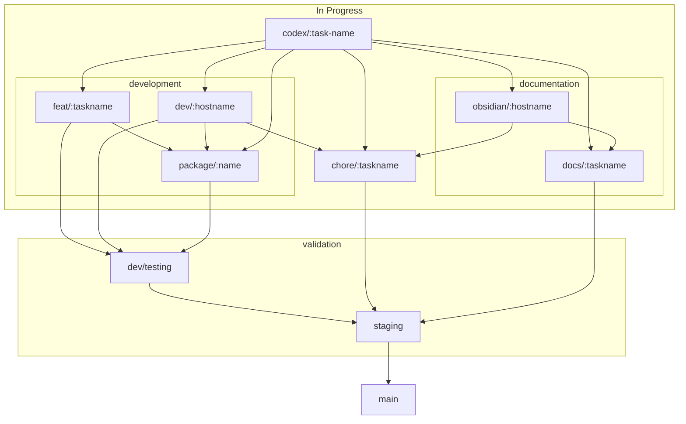

# Promethean GitHub Branching Strategy

## Philosophy

There should not be more types of branches than is necessary
It becomes confusing, introduces complexity

Complexity and confusion lead to non compliance.

Complexity can arise in other ways too.
If a branch is allowed to get too large
Reviewing it becomes more difficult.

The review gets deferred, and deferred, then it is done in haste.
The number of files overwhelming.

The branching strategy should resemble the workflow
Implementing the strategy should be transparent.
Each distinction should have a purpose

Examples of reasonable branch purposes:
- Separation of concerns
- to facilitate the [[process]]
- to aggregate work from upstream
- To isolate unique elements which require special processing
- To facilitate the use of a specific tool
- To facilitate a deployment of the software
- To facilitate a workflow
- To preserve an idea
- To preserve a workspace

## Branch Types

We have 4 main types of branches on this projects:

- tasks: work for a requested feature
- workspaces: an instance of the repository configured for a specific purpose
- packages: Isolates changes to a package for review when expecting many task branches to target a specific package.
- workflows: Run targeted actions on changes aggregated from many other branches to either assess the readiness of a body of work, or to execute a functional pipeline from the repositories configuration

### Tasks
All tasks have a namespace describing the kind of task, and a task identifier.

- `codex/:task` Work generated by codex cloud agent
- `docs/:task` A documentation only task
- `feat/:task` Captures work related to a requested feature
- `chore/:task` A simple task that will require minimal code, or documentation. Typos, update a lock files, etc

### Workspaces

All workspaces have a namespace that describes the purpose the workspace is configured for,
and the name of the workspace, by convention the hostname of the system it is operating on.
- `obsidian/:hostname`: We use obsidian as a knowledge management tool on this project,
  To use to it's fullest extent, we can't open it on an installed instance of the repo.
  The node modules, dist folder and other runtime artifacts greatly slow it down.
- `dev/:hostname`: Captures the current state of a known development environment

### Packages
Sometimes, either when the package is initially created in the scope of an in progress task, or
when a feature requires many changes to the same package, it can be helpful to isolate all work on that package to it's own branch to keep the PRs easier to manage, and remove the possibility work happening outside the package can interfere with extensive in package work.
- `package/:packagename`

### Workflows/validation
as tasks are reviewed and completed, the cumulative change may have problems not obvious in an isolated review.
workflows capture actions taken on aggregated up stream changes. At the time of writing, all workflows are
related to validation. That may not always be the case. If we ever had anything to deploy,
we would do it from a workflow.
- testing
- staging

### Release targets
- main

## Merging Rules

### any branch -> `dev/testing`

To merge into `dev/testing`:
- PR must build and install without errors.
- Otherwise, it should be green.

### From `dev/testing` -> `staging`

To merge into staging:
- No linting errors on the touched diffs.
- No failing unit tests along the changed paths.
- Only `dev/testing` may merge into `dev/staging`.

### From `dev/staging` -> `main`

Full test suite is ran, to merge:
- No failing unit tests
- No failing e2e tests
- no failing integration tests

## Conclusion

By following these branching and merging rules, we ensure a systematic and
error-free workflow that maintains the integrity of our codebase. This structure
not only helps in managing changes efficiently but also ensures that any issues
are caught early on in the development process.
