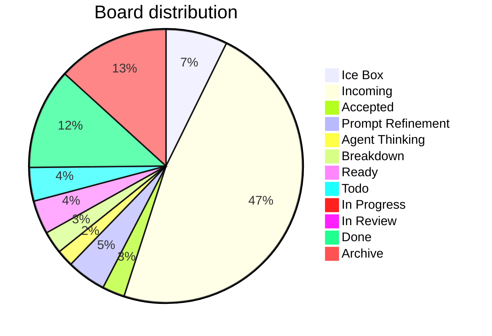

---
```
uuid: 7aa1eb92-7f9a-485b-8218-9b553aa9eefc
```
```
created_at: 2025.08.11.09.08.32.md
```
```
filename: Board Walk – 2025-08-11
```
```
description: >-
```
  Analysis of current board state with WIP limit check and aging WIP
  recommendations. Highlights discrepancies between header and actual counts,
  proposes actions for WIP management and tag normalization.
tags:
  - board
  - wip
  - aging
  - discrepancy
  - normalization
  - tags
  - queue
  - workflow
```
related_to_title:
```
  - Admin Dashboard for User Management
  - Board Automation Improvements
  - Promethean-native config design
  - Dynamic Context Model for Web Components
  - Chroma Toolkit Consolidation Plan
  - Exception Layer Analysis
  - 'Agent Tasks: Persistence Migration to DualStore'
  - Cross-Language Runtime Polymorphism
  - Cross-Target Macro System in Sibilant
  - aionian-circuit-math
  - api-gateway-versioning
  - Performance-Optimized-Polyglot-Bridge
```
related_to_uuid:
```
  - 2901a3e9-96f0-497c-ae2c-775f28a702dd
  - ac60a1d6-fd9f-46dc-bbe7-176dd8017c59
  - ab748541-020e-4a7e-b07d-28173bd5bea2
  - f7702bf8-f7db-473c-9a5b-8dbf66ad3b9e
  - 5020e892-8f18-443a-b707-6d0f3efcfe22
  - 21d5cc09-b005-4ede-8f69-00b4b0794540
  - 93d2ba51-8689-49ee-94e2-296092e48058
  - c34c36a6-80c9-4b44-a200-6448543b1b33
  - 5f210ca2-54e9-445b-afe4-fb340d4992c5
  - f2d83a77-7f86-4c56-8538-1350167a0c6c
  - 0580dcd3-533d-4834-8a2f-eae3771960a9
  - f5579967-762d-4cfd-851e-4f71b4cb77a1
references:
  - uuid: 2901a3e9-96f0-497c-ae2c-775f28a702dd
    line: 35
    col: 1
    score: 0.9
  - uuid: 2901a3e9-96f0-497c-ae2c-775f28a702dd
    line: 35
    col: 3
    score: 0.9
  - uuid: f5579967-762d-4cfd-851e-4f71b4cb77a1
    line: 440
    col: 1
    score: 1
  - uuid: f5579967-762d-4cfd-851e-4f71b4cb77a1
    line: 440
    col: 3
    score: 1
  - uuid: f5579967-762d-4cfd-851e-4f71b4cb77a1
    line: 449
    col: 1
    score: 0.92
  - uuid: f5579967-762d-4cfd-851e-4f71b4cb77a1
    line: 449
    col: 3
    score: 0.92
  - uuid: f5579967-762d-4cfd-851e-4f71b4cb77a1
    line: 448
    col: 1
    score: 0.91
  - uuid: f5579967-762d-4cfd-851e-4f71b4cb77a1
    line: 448
    col: 3
    score: 0.91
  - uuid: 93d2ba51-8689-49ee-94e2-296092e48058
    line: 130
    col: 1
    score: 1
  - uuid: 93d2ba51-8689-49ee-94e2-296092e48058
    line: 130
    col: 3
    score: 1
  - uuid: f2d83a77-7f86-4c56-8538-1350167a0c6c
    line: 159
    col: 1
    score: 1
  - uuid: f2d83a77-7f86-4c56-8538-1350167a0c6c
    line: 159
    col: 3
    score: 1
  - uuid: 5020e892-8f18-443a-b707-6d0f3efcfe22
    line: 168
    col: 1
    score: 1
  - uuid: 5020e892-8f18-443a-b707-6d0f3efcfe22
    line: 168
    col: 3
    score: 1
  - uuid: c34c36a6-80c9-4b44-a200-6448543b1b33
    line: 209
    col: 1
    score: 1
  - uuid: c34c36a6-80c9-4b44-a200-6448543b1b33
    line: 209
    col: 3
    score: 1
  - uuid: 0580dcd3-533d-4834-8a2f-eae3771960a9
    line: 285
    col: 1
    score: 1
  - uuid: 0580dcd3-533d-4834-8a2f-eae3771960a9
    line: 285
    col: 3
    score: 1
  - uuid: 5020e892-8f18-443a-b707-6d0f3efcfe22
    line: 167
    col: 1
    score: 1
  - uuid: 5020e892-8f18-443a-b707-6d0f3efcfe22
    line: 167
    col: 3
    score: 1
  - uuid: 5f210ca2-54e9-445b-afe4-fb340d4992c5
    line: 180
    col: 1
    score: 1
  - uuid: 5f210ca2-54e9-445b-afe4-fb340d4992c5
    line: 180
    col: 3
    score: 1
  - uuid: 21d5cc09-b005-4ede-8f69-00b4b0794540
    line: 157
    col: 1
    score: 1
  - uuid: 21d5cc09-b005-4ede-8f69-00b4b0794540
    line: 157
    col: 3
    score: 1
  - uuid: 93d2ba51-8689-49ee-94e2-296092e48058
    line: 134
    col: 1
    score: 1
  - uuid: 93d2ba51-8689-49ee-94e2-296092e48058
    line: 134
    col: 3
    score: 1
  - uuid: f2d83a77-7f86-4c56-8538-1350167a0c6c
    line: 156
    col: 1
    score: 1
  - uuid: f2d83a77-7f86-4c56-8538-1350167a0c6c
    line: 156
    col: 3
    score: 1
  - uuid: f7702bf8-f7db-473c-9a5b-8dbf66ad3b9e
    line: 386
    col: 1
    score: 1
  - uuid: f7702bf8-f7db-473c-9a5b-8dbf66ad3b9e
    line: 386
    col: 3
    score: 1
  - uuid: 21d5cc09-b005-4ede-8f69-00b4b0794540
    line: 155
    col: 1
    score: 1
  - uuid: 21d5cc09-b005-4ede-8f69-00b4b0794540
    line: 155
    col: 3
    score: 1
---
# Board Walk – 2025-08-11
```
**Assumptions**
```
* WIP limit (global Doing) = **3** (change if you want).
* Doing lanes (for now): **Prompt Refinement**, **Agent Thinking**, **Breakdown**, **In Progress**.
* Aging threshold: **> 2 days** in a Doing lane.

---

## Column counts (actual from pasted board)

| Column            | Count |
```
| ----------------- | ----- |
```
| Ice Box           | 11    |
| Incoming          | 72    |
| Accepted          | 4     |
| Prompt Refinement | 7     |
| Agent Thinking    | 3     |
| Breakdown         | 4     |
| Ready             | 6     |
| Todo              | 6     |
| In Progress       | 0     |
| In Review         | 1     |
| Done              | 18    |
| Archive           | 20    |

> Header ↔ actual mismatches detected:
>
```
> * **Accepted (8)** → has **4** items
```
```
> * **Prompt Refinement (24)** → has **7** items
```
```
> * **Agent Thinking (24)** → has **3** items
```
```
> * **Breakdown (16)** → has **4** items
```
```
> * **Ready (24)** → has **6** items
```
```
> * **Todo (16)** → has **6** items
```
```
> * **In Progress (8)** → has **0** items
```


---

## Blockers

* No items tagged **#blocked** found in the paste.

> If any are blocked, add **#blocked** (and optionally a short reason), e.g., `#blocked:waiting-on-PR-123`.

---

## WIP check (Doing lanes)

* Current **Doing total** Prompt Refinement + Agent Thinking + Breakdown + In Progress: **14**
* With WIP limit **3**, we’re **over**.
```
**Proposal**
```
* Confirm which lanes count as Doing. If all four above are Doing, pull back to **≤3** by:

  1. Moving non‑active cards back to **Ready**.
  2. Splitting any large Doing card into a small slice that can finish in ≤1 day; park the rest in Ready.

---

## Aging WIP (>2 days)

* Not evaluated: timestamps weren’t provided in the paste.
```
**Recommendation**
```
* Add `last_touched: YYYY‑MM‑DD` to frontmatter, or let me read file mtimes; then I’ll auto‑flag aging WIP.

---

## Next pull (single)

**Flow goal (stated recently):** extend WS message broker with **queue semantics** and connect services.

* **Best pull promote from Incoming → Ready:** `[add_manualack_to_event_bus_and_re_run_tests.md|Add manualAck to event bus and re-run tests]` (unblocks reliable delivery & retries).
* **If restricted to current Ready only:** `[[Update makefile to have commands specific for agents.md|Update Makefile for agent commands]]` (quick win that improves daily flow) **or** `[Mirror shared utils with language-specific doc folders.md]` (reduces duplication before deeper queue work).

> Pick **one**. Everything else waits.

---

## Tag hygiene / normalization

You said you want **column-normalized** hashtags on tasks and files. Proposed canonical set:

* `#ice-box`, `#incoming`, `#accepted`, `#prompt-refinement`, `#agent-thinking`, `#breakdown`, `#ready`, `#todo`, `#in-progress`, `#in-review`, `#done`, `#archive`
```
**Findings**
```
* Many **Incoming** items are tagged `#todo`. Suggest adding **`#incoming`** (you can keep `#todo` if you like, but column tag should exist).
* Several **Accepted** items still carry `#todo`.
```
**Action**
```
* Run/finish the hashtag-normalizer so each card has both:

  1. the **column tag** (normalized), and
  2. any **status/phase** tag you want (e.g., `#todo`, `#accepted`).

---

## Quick decisions (checklist)
```
*
```
---

## Notes / Misc

* **In Progress** is empty—nice. Let’s keep it that way until we explicitly pull the next slice.
* Incoming is **72** items; consider a 10‑minute nightly triage to keep it from ballooning.
<!-- GENERATED-SECTIONS:DO-NOT-EDIT-BELOW -->
## Related content
- [admin-dashboard-for-user-management|Admin Dashboard for User Management]
- [board-automation-improvements|Board Automation Improvements]
- [promethean-native-config-design|Promethean-native config design]
- [dynamic-context-model-for-web-components|Dynamic Context Model for Web Components]
- [chroma-toolkit-consolidation-plan|Chroma Toolkit Consolidation Plan]
- [exception-layer-analysis|Exception Layer Analysis]
- [docs/unique/agent-tasks-persistence-migration-to-dualstore|Agent Tasks: Persistence Migration to DualStore]
- [cross-language-runtime-polymorphism|Cross-Language Runtime Polymorphism]
- [cross-target-macro-system-in-sibilant|Cross-Target Macro System in Sibilant]
- [docs/unique/aionian-circuit-math|aionian-circuit-math]
- [api-gateway-versioning]
- [performance-optimized-polyglot-bridge]

## Sources
- [admin-dashboard-for-user-management#L35|Admin Dashboard for User Management — L35] (line 35, col 1, score 0.9)
- [admin-dashboard-for-user-management#L35|Admin Dashboard for User Management — L35] (line 35, col 3, score 0.9)
- [performance-optimized-polyglot-bridge#L440|Performance-Optimized-Polyglot-Bridge — L440] (line 440, col 1, score 1)
- [performance-optimized-polyglot-bridge#L440|Performance-Optimized-Polyglot-Bridge — L440] (line 440, col 3, score 1)
- [performance-optimized-polyglot-bridge#L449|Performance-Optimized-Polyglot-Bridge — L449] (line 449, col 1, score 0.92)
- [performance-optimized-polyglot-bridge#L449|Performance-Optimized-Polyglot-Bridge — L449] (line 449, col 3, score 0.92)
- [performance-optimized-polyglot-bridge#L448|Performance-Optimized-Polyglot-Bridge — L448] (line 448, col 1, score 0.91)
- [performance-optimized-polyglot-bridge#L448|Performance-Optimized-Polyglot-Bridge — L448] (line 448, col 3, score 0.91)
- [docs/unique/agent-tasks-persistence-migration-to-dualstore#L130|Agent Tasks: Persistence Migration to DualStore — L130] (line 130, col 1, score 1)
- [docs/unique/agent-tasks-persistence-migration-to-dualstore#L130|Agent Tasks: Persistence Migration to DualStore — L130] (line 130, col 3, score 1)
- [docs/unique/aionian-circuit-math#L159|aionian-circuit-math — L159] (line 159, col 1, score 1)
- [docs/unique/aionian-circuit-math#L159|aionian-circuit-math — L159] (line 159, col 3, score 1)
- [chroma-toolkit-consolidation-plan#L168|Chroma Toolkit Consolidation Plan — L168] (line 168, col 1, score 1)
- [chroma-toolkit-consolidation-plan#L168|Chroma Toolkit Consolidation Plan — L168] (line 168, col 3, score 1)
- [cross-language-runtime-polymorphism#L209|Cross-Language Runtime Polymorphism — L209] (line 209, col 1, score 1)
- [cross-language-runtime-polymorphism#L209|Cross-Language Runtime Polymorphism — L209] (line 209, col 3, score 1)
- [api-gateway-versioning#L285|api-gateway-versioning — L285] (line 285, col 1, score 1)
- [api-gateway-versioning#L285|api-gateway-versioning — L285] (line 285, col 3, score 1)
- [chroma-toolkit-consolidation-plan#L167|Chroma Toolkit Consolidation Plan — L167] (line 167, col 1, score 1)
- [chroma-toolkit-consolidation-plan#L167|Chroma Toolkit Consolidation Plan — L167] (line 167, col 3, score 1)
- [cross-target-macro-system-in-sibilant#L180|Cross-Target Macro System in Sibilant — L180] (line 180, col 1, score 1)
- [cross-target-macro-system-in-sibilant#L180|Cross-Target Macro System in Sibilant — L180] (line 180, col 3, score 1)
- [exception-layer-analysis#L157|Exception Layer Analysis — L157] (line 157, col 1, score 1)
- [exception-layer-analysis#L157|Exception Layer Analysis — L157] (line 157, col 3, score 1)
- [docs/unique/agent-tasks-persistence-migration-to-dualstore#L134|Agent Tasks: Persistence Migration to DualStore — L134] (line 134, col 1, score 1)
- [docs/unique/agent-tasks-persistence-migration-to-dualstore#L134|Agent Tasks: Persistence Migration to DualStore — L134] (line 134, col 3, score 1)
- [docs/unique/aionian-circuit-math#L156|aionian-circuit-math — L156] (line 156, col 1, score 1)
- [docs/unique/aionian-circuit-math#L156|aionian-circuit-math — L156] (line 156, col 3, score 1)
- [dynamic-context-model-for-web-components#L386|Dynamic Context Model for Web Components — L386] (line 386, col 1, score 1)
- [dynamic-context-model-for-web-components#L386|Dynamic Context Model for Web Components — L386] (line 386, col 3, score 1)
- [exception-layer-analysis#L155|Exception Layer Analysis — L155] (line 155, col 1, score 1)
- [exception-layer-analysis#L155|Exception Layer Analysis — L155] (line 155, col 3, score 1)
<!-- GENERATED-SECTIONS:DO-NOT-EDIT-ABOVE -->
