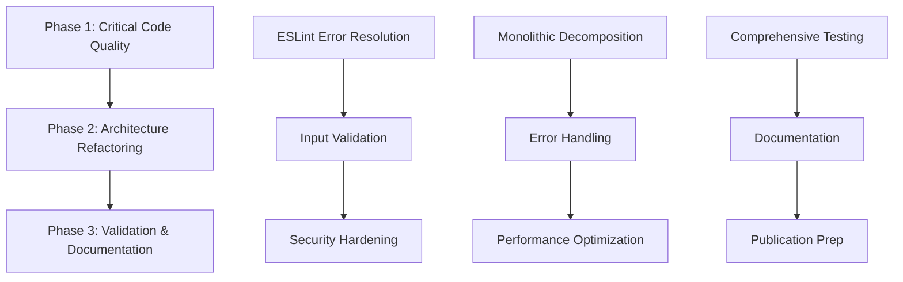

# @promethean/kanban npm Publication Task Breakdown

## Epic Overview

**Title**: Prepare @promethean/kanban for npm publication  
**Priority**: P0  
**Estimated Effort**: 6-8 weeks  
**Team Size**: 2-3 developers

### Definition of Done

- [ ] All ESLint errors and warnings resolved (0 errors, 0 warnings)
- [ ] Code coverage > 90%
- [ ] Security audit passed with no high/critical vulnerabilities
- [ ] Documentation complete and accurate
- [ ] All tests passing in CI/CD
- [ ] Package builds successfully without warnings
- [ ] API stability verified with semantic versioning
- [ ] Performance benchmarks meet targets
- [ ] Ready for npm publish with proper tags

---

## Phase 1: Critical Code Quality (Weeks 1-3)

**Priority**: P0 - Blocking publication  
**Focus**: Fix all blocking issues for npm publication

### 1.1 ESLint Error Resolution (P0)

**Estimated Effort**: 5-7 days  
**Dependencies**: None

#### Subtasks:

1. **Fix Import/Export Issues** (1 day)

   - [ ] Resolve import/order warnings across all files
   - [ ] Fix missing/incorrect import statements
   - [ ] Ensure consistent import grouping
   - **Acceptance Criteria**: All import-related ESLint errors resolved

2. **Fix TypeScript Type Issues** (2 days)

   - [ ] Replace all `any` types with proper TypeScript types
   - [ ] Fix unsafe assignments and member access
   - [ ] Add proper type annotations where missing
   - [ ] Resolve template literal expression type issues
   - **Acceptance Criteria**: Zero TypeScript-related ESLint errors

3. **Reduce Function Complexity** (2 days)

   - [ ] Refactor functions exceeding complexity limits (>15)
   - [ ] Break down large arrow functions (>50 lines)
   - [ ] Reduce cognitive complexity in critical functions
   - [ ] Split functions with too many parameters (>4)
   - **Acceptance Criteria**: All functions within ESLint complexity limits

4. **Fix Code Style Issues** (1 day)

   - [ ] Replace `let` with `const` where appropriate
   - [ ] Fix prefer-const violations
   - [ ] Resolve unused variable issues
   - [ ] Fix other style-related warnings
   - **Acceptance Criteria**: All style-related ESLint errors resolved

5. **File Size Optimization** (1 day)
   - [ ] Address max-lines violations in large files
   - [ ] Split kanban.ts into smaller, focused modules
   - **Acceptance Criteria**: No files exceed line limits

### 1.2 Input Validation Enhancement (P0)

**Estimated Effort**: 3-4 days  
**Dependencies**: 1.1 partially complete

#### Subtasks:

1. **API Input Validation** (2 days)

   - [ ] Add comprehensive input validation to all public APIs
   - [ ] Implement parameter type checking
   - [ ] Add range and format validation
   - [ ] Create validation utilities for common patterns
   - **Acceptance Criteria**: All public functions validate inputs

2. **CLI Input Sanitization** (1 day)

   - [ ] Sanitize all CLI command inputs
   - [ ] Add argument validation
   - [ ] Implement path traversal protection
   - **Acceptance Criteria**: CLI commands secure against injection

3. **Error Message Standardization** (1 day)
   - [ ] Create consistent error message format
   - [ ] Add user-friendly error descriptions
   - [ ] Implement error codes for categorization
   - **Acceptance Criteria**: Consistent, helpful error messages

### 1.3 Security Hardening (P0)

**Estimated Effort**: 2-3 days  
**Dependencies**: 1.2 complete

#### Subtasks:

1. **Dependency Security Audit** (1 day)

   - [ ] Run npm audit and fix all vulnerabilities
   - [ ] Update dependencies to secure versions
   - [ ] Remove unnecessary dependencies
   - **Acceptance Criteria**: Zero high/critical security vulnerabilities

2. **Web UI Security** (1 day)

   - [ ] Add security headers to UI server
   - [ ] Implement CSRF protection
   - [ ] Add rate limiting for API endpoints
   - **Acceptance Criteria**: Security headers and protections in place

3. **File System Security** (1 day)
   - [ ] Validate all file paths to prevent directory traversal
   - [ ] Add permission checks for file operations
   - [ ] Implement safe file handling practices
   - **Acceptance Criteria**: File operations secured against attacks

---

## Phase 2: Architecture Refactoring (Weeks 3-6)

**Priority**: P1 - Critical for maintainability  
**Focus**: Break down monolithic structure

### 2.1 Monolithic File Decomposition (P1)

**Estimated Effort**: 7-10 days  
**Dependencies**: Phase 1 complete

#### Subtasks:

1. **Analyze kanban.ts Structure** (1 day)

   - [ ] Identify logical groupings of functionality
   - [ ] Map dependencies between functions
   - [ ] Plan module separation strategy
   - **Acceptance Criteria**: Clear refactoring plan documented

2. **Extract Core Utilities** (2 days)

   - [ ] Move utility functions to separate modules
   - [ ] Create `src/lib/utils/` directory structure
   - [ ] Update imports across codebase
   - **Acceptance Criteria**: Utility functions properly modularized

3. **Extract Task Operations** (2 days)

   - [ ] Move task CRUD operations to dedicated module
   - [ ] Create `src/lib/task-operations.ts`
   - [ ] Maintain backward compatibility
   - **Acceptance Criteria**: Task operations separated with stable API

4. **Extract Board Operations** (2 days)

   - [ ] Move board management to dedicated module
   - [ ] Create `src/lib/board-operations.ts`
   - [ ] Ensure clean separation of concerns
   - **Acceptance Criteria**: Board operations properly separated

5. **Extract CLI Logic** (2 days)

   - [ ] Move CLI-specific logic to command handlers
   - [ ] Refactor command structure for better organization
   - [ ] Maintain CLI compatibility
   - **Acceptance Criteria**: CLI logic properly separated

6. **Update Main kanban.ts** (1 day)
   - [ ] Reduce main file to orchestration only
   - [ ] Import and re-export public APIs
   - [ ] Ensure backward compatibility
   - **Acceptance Criteria**: Main file < 300 lines, clean structure

### 2.2 Error Handling Standardization (P1)

**Estimated Effort**: 3-4 days  
**Dependencies**: 2.1 partially complete

#### Subtasks:

1. **Create Error Classes** (1 day)

   - [ ] Define custom error classes for different error types
   - [ ] Implement error hierarchy with proper inheritance
   - [ ] Add error codes and metadata
   - **Acceptance Criteria**: Comprehensive error class hierarchy

2. **Implement Error Handling Patterns** (2 days)

   - [ ] Standardize try-catch patterns across codebase
   - [ ] Add proper error propagation
   - [ ] Implement error logging with context
   - **Acceptance Criteria**: Consistent error handling everywhere

3. **Add Recovery Mechanisms** (1 day)
   - [ ] Implement graceful degradation where possible
   - [ ] Add retry logic for transient failures
   - [ ] Create fallback mechanisms for critical operations
   - **Acceptance Criteria**: Robust error recovery in place

### 2.3 Performance Optimization (P1)

**Estimated Effort**: 2-3 days  
**Dependencies**: 2.1 complete

#### Subtasks:

1. **Database Query Optimization** (1 day)

   - [ ] Optimize MongoDB queries for better performance
   - [ ] Add proper indexing
   - [ ] Implement query result caching
   - **Acceptance Criteria**: Query performance benchmarks met

2. **Memory Usage Optimization** (1 day)

   - [ ] Identify and fix memory leaks
   - [ ] Optimize large data structure handling
   - [ ] Implement streaming for large file operations
   - **Acceptance Criteria**: Memory usage within acceptable limits

3. **Async Operation Optimization** (1 day)
   - [ ] Optimize async/await patterns
   - [ ] Implement proper concurrency control
   - [ ] Add timeout handling for long operations
   - **Acceptance Criteria**: Async operations optimized and responsive

---

## Phase 3: Validation & Documentation (Weeks 6-8)

**Priority**: P1 - Critical for publication  
**Focus**: Testing, docs, and publication prep

### 3.1 Comprehensive Testing (P1)

**Estimated Effort**: 4-5 days  
**Dependencies**: Phase 2 complete

#### Subtasks:

1. **Unit Test Coverage** (2 days)

   - [ ] Achieve >90% code coverage
   - [ ] Add tests for all refactored modules
   - [ ] Test edge cases and error conditions
   - **Acceptance Criteria**: Coverage report shows >90%

2. **Integration Testing** (1 day)

   - [ ] Add comprehensive integration tests
   - [ ] Test module interactions
   - [ ] Validate API contracts
   - **Acceptance Criteria**: All integration paths tested

3. **End-to-End Testing** (1 day)

   - [ ] Add CLI workflow tests
   - [ ] Test complete user scenarios
   - [ ] Validate file system operations
   - **Acceptance Criteria**: Critical user journeys tested

4. **Performance Testing** (1 day)
   - [ ] Create performance benchmarks
   - [ ] Test under load conditions
   - [ ] Validate memory usage patterns
   - **Acceptance Criteria**: Performance meets defined targets

### 3.2 Documentation Enhancement (P1)

**Estimated Effort**: 3-4 days  
**Dependencies**: 3.1 partially complete

#### Subtasks:

1. **API Documentation** (2 days)

   - [ ] Generate comprehensive TypeDoc documentation
   - [ ] Add JSDoc comments to all public APIs
   - [ ] Create usage examples for major functions
   - **Acceptance Criteria**: Complete API documentation generated

2. **User Guide Updates** (1 day)

   - [ ] Update README with latest features
   - [ ] Add installation and quick start guides
   - [ ] Document configuration options
   - **Acceptance Criteria**: User documentation complete and accurate

3. **Developer Documentation** (1 day)
   - [ ] Create architecture overview
   - [ ] Document contribution guidelines
   - [ ] Add development setup instructions
   - **Acceptance Criteria**: Developer resources comprehensive

### 3.3 Publication Preparation (P1)

**Estimated Effort**: 2-3 days  
**Dependencies**: 3.2 complete

#### Subtasks:

1. **Version Management** (1 day)

   - [ ] Implement semantic versioning
   - [ ] Create changelog generation
   - [ ] Set up automated version bumping
   - **Acceptance Criteria**: Version management system in place

2. **Build Process Validation** (1 day)

   - [ ] Validate build process works cleanly
   - [ ] Test package installation from tarball
   - [ ] Verify all exports work correctly
   - **Acceptance Criteria**: Package builds and installs without issues

3. **Publication Pipeline** (1 day)
   - [ ] Set up automated publishing pipeline
   - [ ] Create pre-publish validation checks
   - [ ] Configure npm registry settings
   - **Acceptance Criteria**: Automated publication ready

---

## Task Dependencies

## Risk Assessment

### High Risk Items

1. **Monolithic file refactoring** - Could introduce breaking changes
2. **ESLint error resolution** - May require significant API changes
3. **Performance optimization** - Risk of regressions

### Mitigation Strategies

1. Maintain backward compatibility during refactoring
2. Use feature flags for major changes
3. Comprehensive testing at each phase
4. Incremental deployment approach

## Success Metrics

### Quality Metrics

- [ ] ESLint errors: 0
- [ ] ESLint warnings: 0
- [ ] Code coverage: >90%
- [ ] Security vulnerabilities: 0 (high/critical)
- [ ] Build time: <2 minutes
- [ ] Test suite runtime: <5 minutes

### Publication Metrics

- [ ] Package size: <10MB compressed
- [ ] Dependencies: <20 direct dependencies
- [ ] Installation time: <30 seconds
- [ ] First import time: <100ms

## Team Allocation Recommendations

### Senior Developer (Lead)

- Architecture refactoring
- Complex ESLint error resolution
- Performance optimization
- Code review and quality assurance

### Mid-Level Developer

- Input validation implementation
- Security hardening
- Testing implementation
- Documentation updates

### Junior Developer

- Basic ESLint fixes
- Test case writing
- Documentation improvements
- Build process validation

## Timeline Summary

| Week | Focus                        | Key Deliverables        |
| ---- | ---------------------------- | ----------------------- |
| 1-2  | ESLint Resolution            | All lint errors fixed   |
| 3    | Input Validation & Security  | Secure APIs implemented |
| 4-5  | Architecture Refactoring     | Modular codebase        |
| 6    | Error Handling & Performance | Robust, optimized code  |
| 7    | Testing & Documentation      | Comprehensive coverage  |
| 8    | Publication Prep             | Ready for npm publish   |

## Final Acceptance Criteria

The package is ready for npm publication when:

1. **Code Quality**: Zero ESLint errors/warnings, >90% test coverage
2. **Security**: No high/critical vulnerabilities, secure input handling
3. **Architecture**: Clean, modular structure with proper separation of concerns
4. **Documentation**: Complete API docs and user guides
5. **Performance**: Meets defined benchmarks and responsive under load
6. **Compatibility**: Maintains backward compatibility where possible
7. **Build**: Builds cleanly and installs without issues
8. **Testing**: All tests pass consistently in CI/CD

---

_This task breakdown provides a comprehensive roadmap for preparing @promethean/kanban for npm publication. Adjust timelines and resource allocation based on team availability and specific project constraints._
