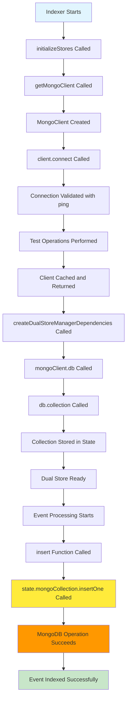

# MongoDB Connection Flow Analysis

## Expected Flow Diagram



## Current Issue Points

```mermaid
flowchart TD
    A[insert Function Called] --> B{Logging Check}
    B --> C[Store Name: ${state.name}]
    B --> D[Entry ID: ${entry.id}]
    B --> E[Collection Type: ${typeof state.mongoCollection}]
    B --> F[Collection Constructor: ${state.mongoCollection.constructor.name}]

    C --> G[Chroma Insert Attempt]
    G --> H{Chroma Success?}
    H -->|Yes| I[MongoDB Insert Attempt]
    H -->|No| J[Error Logged]

    I --> K{MongoDB Connected?}
    K -->|Yes| L[Insert Success]
    K -->|No| M[MongoNotConnectedError]

    M --> N[Error Details Logged]
    N --> O[Error Thrown]

    style A fill:#e1f5fe
    style L fill:#c8e6c9
    style M fill:#ffcdd2
    style O fill:#ffcdd2
```

## Key Checkpoints

1. **Store Initialization**: Verify dual store state is properly created
2. **Client Connection**: Ensure MongoDB client is connected and validated
3. **Collection Creation**: Confirm collection is created from valid database reference
4. **Insert Operation**: Track the exact point where MongoDB operation fails
5. **Error Analysis**: Capture detailed error information for debugging

## Expected Log Sequence

```
[DUALSTORE CREATE] Creating store for sessionStore
[MONGO CLIENT] Connecting to URI: mongodb://localhost:27017
[MONGO CLIENT] Client connected successfully
[DUALSTORE CREATE] MongoDB client connected
[DUALSTORE CREATE] Creating collection sessionStore
[DUALSTORE CREATE] Collection created successfully
[DUALSTORE INSERT] Starting insert for store: default_agent_sessionStore
[DUALSTORE INSERT] Entry ID: msg_123, TextKey: text, TimeKey: createdAt
[DUALSTORE INSERT] Prepared entry with ID: msg_123, timestamp: 1698765432100
[DUALSTORE INSERT] About to insert into MongoDB...
[DUALSTORE INSERT] Mongo collection type: object
[DUALSTORE INSERT] Mongo collection constructor: Collection
[DUALSTORE INSERT] MongoDB insert complete
```

## Current Failure Pattern

```
[DUALSTORE INSERT] Starting insert for store: default_agent_sessionStore
[DUALSTORE INSERT] Entry ID: msg_123, TextKey: text, TimeKey: createdAt
[DUALSTORE INSERT] Prepared entry with ID: msg_123, timestamp: 1698765432100
[DUALSTORE INSERT] About to insert into MongoDB...
[DUALSTORE INSERT] Mongo collection type: object
[DUALSTORE INSERT] Mongo collection constructor: Collection
❌ Error indexing event: MongoNotConnectedError: Client must be connected before running operations
```

## Investigation Points

1. **Client State**: Is the MongoDB client still connected when insert is called?
2. **Collection Reference**: Is the collection object still valid?
3. **Database Reference**: Is the database reference still connected to the client?
4. **Connection Pooling**: Are connection pool settings causing issues?
5. **Async Timing**: Is there a race condition between client creation and usage?

## Next Steps

1. Add comprehensive logging at each checkpoint
2. Validate client connection state before each operation
3. Check if collection needs to be refreshed periodically
4. Implement connection recovery mechanisms
5. Monitor connection pool health
