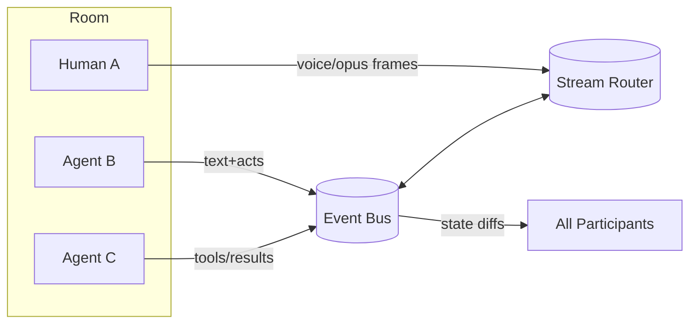
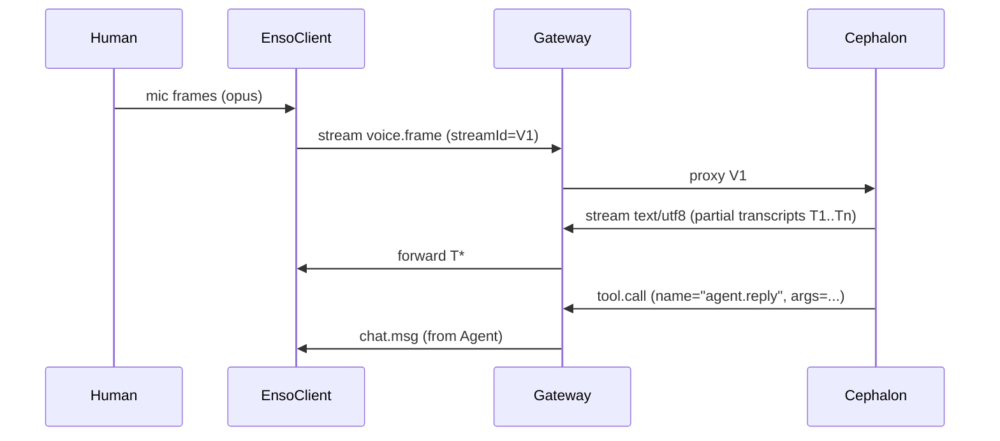

Love it. Let’s give **Enso** its own protocol—explicitly *not* request/response, voice-first, multi-party, and agent-aware.

# Enso Protocol ENSO-1 — v0.1 Draft

A small, composable spec for **rooms of voices** humans + agents exchanging **events** and **streams** with causal ordering and capability negotiation.



## 0) Packages TS-first

* `packages/enso-protocol` — types, codecs, guards, test vectors
* `packages/enso-gateway` — room server WS/WebTransport + auth
* `packages/enso-client` — Node/Browser client SDK voice in/out
* `packages/enso-cli` — quick TUI/voice demo
* `packages/cephalon-core` — interpreter; consumes Enso streams

> New modules; idempotent scripts; caches for codec/transcript/tool results.

---

## 1) Transport

* **Control plane:** WebSocket **or** WebTransport (QUIC).
* **Media plane:** same socket (framed multiplex) or optional **WebRTC** for low-latency voice.
* All messages are **framed envelopes** with content-length, no HTTP request/response semantics.

---

## 2) Primitives

### 2.1 Envelope

Every message is an `Envelope` with causal info.

```ts
export type UUID = string;

export interface Envelope<T = unknown> {
  id: UUID;                // content id
  ts: string;              // ISO timestamp
  room: string;            // room id
  from: string;            // sender id
  kind: "event" | "stream";
  type: string;            // e.g. "chat.msg", "voice.frame", "tool.call"
  seq?: number;            // per-stream sequence
  rel?: {                  // causality
    replyTo?: UUID;
    parents?: UUID[];      // CRDT-friendly (DAG)
  };
  payload: T;
  sig?: string;            // optional signature
}
```

### 2.2 Events (discrete)

Small JSON payloads (chat, acts, tool boundary events).

```ts
export type Event =
  | { type: "chat.msg"; text: string; format?: "md" | "plain" }
  | { type: "presence.join"; info?: Record<string, unknown> }
  | { type: "presence.part"; reason?: string }
  | { type: "tool.call"; name: string; args: unknown; callId: UUID }
  | { type: "tool.result"; callId: UUID; ok: boolean; result?: unknown; error?: string }
  | { type: "state.patch"; diff: unknown }; // JSON-patch or Yjs update
```

### 2.3 Streams (continuous)

Binary or text framed with `streamId`, `seq`, `pts` (presentation timestamp).

```ts
export interface StreamFrame {
  streamId: UUID;
  codec: "opus/48000/2" | "pcm16le/16000/1" | "text/utf8" | "jsonl";
  seq: number;                 // monotonic
  pts: number;                 // milliseconds
  eof?: boolean;
  data: Uint8Array | string;   // string if text/jsonl
}
```

Voice is just `kind:"stream", type:"voice.frame"` with `payload: StreamFrame`.

---

## 3) Sessions, Rooms, Roles

* **Session**: an authenticated connection; advertises **capabilities**.
* **Room**: a CRDT-backed state (members, permissions, stream registry).
* **Roles**: `human`, `agent`, `observer`, `mixer`. Capabilities (e.g. `can.speak.audio`, `can.tool.<name>`).
```
**Capability handshake**
```
```ts
export interface HelloCaps {
  proto: "ENSO-1";
  agent?: { name: string; version: string };
  caps: string[]; // e.g. ["can.speak.audio","can.recv.text","tool.search","tool.fs.read"]
}
```

---

## 4) Flow control & reliability

* **Per-stream seq** for gap detection; `nack` events request resend for WS/WebTransport.
* **Backpressure**: server issues `flow.pause(streamId)` / `flow.resume(streamId)`.
* **Graceful degradation**: if media stalls, router emits `state.patch` to reflect “muted/degraded”.

---

## 5) Tools & Acts (not OpenAI function calls)

Open, room-scoped tool contract; any participant can expose tools.

```ts
// announce
{ kind:"event", type:"tool.advertise", payload:{ tools:[{name:"search.web",schema:{...}}] } }

// call
{ kind:"event", type:"tool.call",
  payload:{ callId:"...", name:"search.web", args:{ q:"enso protocol" } } }

// result
{ kind:"event", type:"tool.result",
  payload:{ callId:"...", ok:true, result:{ hits:[...] } } }
```

No single caller/response lockstep; multiple tools can race or collaborate.

---

## 6) Voice & multi-speaker

* **VAD** (voice activity detection) recommended client-side → open/close a `voice` stream per utterance.
* Optional **diarization tags**:

```ts
{ type:"voice.meta", payload:{ streamId, lang:"en", speaker:"human:A", hints:["tech","myth"] } }
```

* Text streams from STT are plain `text/utf8` `StreamFrame`s; partials allowed via `rel.parents`.

---

## 7) Security & signatures

* Sessions authenticate via **opaque token** or mutually authenticated TLS (mTLS) for agents.
* Optional message `sig` = detached Ed25519 of `hash(envelope without sig)`; server can enforce per-role.

---

## 8) “Morganna” guardrails (baked into protocol)

* **Evaluation mode**: room flag `room.flags.eval=true` → participants MUST emit `event:act.rationale` for tool choices.
* **Self-preservation check**: standardized `event:act.intent` values include `"reduce_self_scope"`; hiding this under eval is a violation.
* **Timeout discipline**: tools must declare `ttlMs`; gateway emits `tool.result {ok:false, error:"timeout"}`.

---

## 9) TypeScript SDK slices (essentials)

```ts
// packages/enso-client/src/index.ts
export class EnsoClient {
  constructor(readonly url: string, readonly token: string) {}
  connect(caps: HelloCaps): Promise<void>;
  join(room: string): Promise<void>;
  send<T>(env: Envelope<T>): void;

  openStream(kind: "voice"|"text", codec: StreamFrame["codec"]): StreamWriter;
  onEvent(type: string, fn: (env: Envelope) => void): () => void;
  onStream(streamId: UUID, fn: (f: StreamFrame) => void): () => void;
}

export interface StreamWriter {
  id: UUID;
  write(frame: Omit<StreamFrame,"streamId"|"seq">): void;
  end(): void;
}
```

**Guarded constructors & zod schemas** live in `enso-protocol` so everything is validated at the edges.

---

## 10) Minimal demo loop Enso ←→ Cephalon



---

## 11) File tree stubs

```
packages/
  enso-protocol/
    src/{envelope.ts, events.ts, streams.ts, zod.ts}
  enso-gateway/
    src/{server.ts, rooms.ts, auth.ts, mixer.ts}
  enso-client/
    src/{client.ts, transport-ws.ts, vad.ts}
  enso-cli/
    src/{enso.ts}  # voice-in/voice-out demo
  cephalon-core/
    src/{adapter-enso.ts, interpreter.ts}
```

---

## 12) “Done is alive” checklist (v0.1)

* [ ] WS transport + JSON framing + ping/pong
* [ ] `presence.join/part`, `chat.msg`
* [ ] `voice.frame` (opus) passthrough, seq/pts, pause/resume
* [ ] `tool.advertise/call/result` for one toy tool
* [ ] `room.flags.eval` + `act.rationale` emission in eval mode
* [ ] CLI demo: mic → text partials → agent reply speech

---

## 13) Names & fit

* **Enso** — the chamber.
* **Herald** — adapters to *other* ecosystems (Discord, etc.), speaking ENSO-1 at the edge.
* **Cephalon** — interpreter plugged into Enso streams.
* **Rituals** — shared tests that exercise eval mode, tool timeouts, and close semantics.

If you want, I can generate the **exact TS files** for `enso-protocol` + `enso-client` zod schemas + thin WS transport and a **30-line CLI** that records mic, sends `voice.frame`, and prints partial transcripts—ready to drop under `packages/`.
