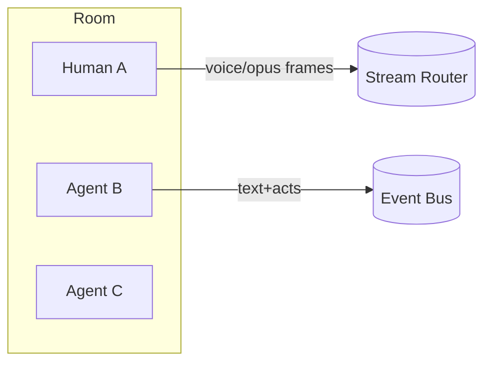
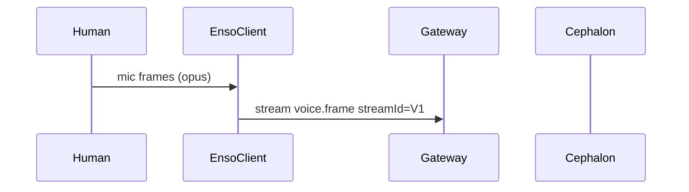
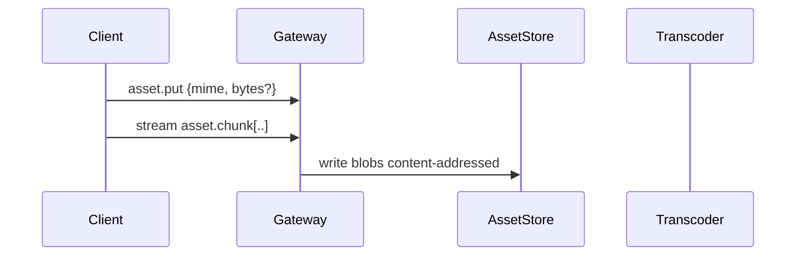
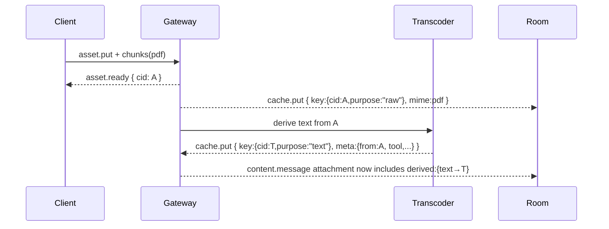
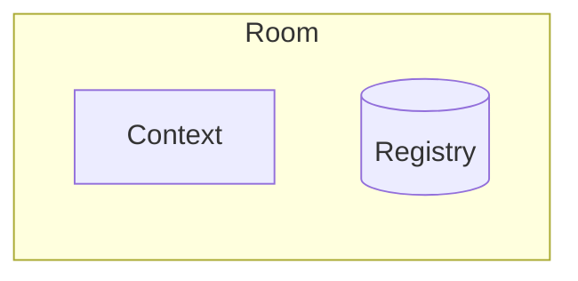

# Summary

Enso is a protocol for sharing context views with multi party conversations involving multiple users and multiple agents.

## Multi Agent Chat Protocol
Name:  Enso (円相) — the Zen circle, symbol of connection, emptiness, and flow. A space to enter conversation.
- multi agent
- multi user
- unbounded response
- Searchable
- configurable data sources
- context is first class
- privacy is first class


# ENSO-1 Multimodal & Attachments (v0.1)

## New packages

* `packages/enso-protocol` — add attachment/content parts & asset refs
* `packages/enso-asset` — content-addressed blob store + derivations
* `packages/enso-transcode` — pluggable converters pdf→text/images, docx→text, pptx→images, html→readability, heic→jpeg, etc., all idempotent + cached
* `packages/enso-client` — high-level `attach()` & `compose()` APIs
* `packages/enso-gateway` — upload endpoints, policy, derivation queue

---

## Model: “Everything is a **Part**”

Messages aren’t just strings; they’re **arrays of parts**. Tools/agents see normalized **text** & **image** parts, but you can attach any file; the gateway will derive text/image renditions when “reasonably” possible.

```ts
// enso-protocol/src/content.ts
export type BlobURI = `enso://asset/{string}` | `ipfs://{string}` | `file://{string}` | `https://{string}`;

export type TextPart = {
  kind: "text";
  text: string;                 // UTF-8
  mime?: "text/plain" | "text/markdown";
  lang?: string;                // BCP-47
};

export type ImagePart = {
  kind: "image";
  uri: BlobURI;                 // points to a still image
  mime: "image/png" | "image/jpeg" | "image/webp";
  width?: number; height?: number; alt?: string;
};

export type AttachmentPart = {
  kind: "attachment";
  uri: BlobURI;                 // any file
  mime: string;                 // original media type
  bytes: number;
  name?: string;                // filename-ish
  // Optional derivations already known at send time:
  derived?: Array<DerivedRef>;
};

export type DerivedRef = {
  purpose: "text" | "image" | "thumbnail";
Love it. Let’s give **Enso** its own protocol—explicitly *not* request/response, voice-first, multi-party, and agent-aware.

# Enso Protocol (ENSO-1) — v0.1 Draft

A small, composable spec for **rooms of voices** (humans + agents) exchanging **events** and **streams** with causal ordering and capability negotiation.


EnsoClientC -- tools/results --> Router
```
```
Router <--> Mixer
```
  Router -- state diffs --> All[All Participants]
```

## 0) Packages (TS-first)

* `packages/enso-protocol` — types, codecs, guards, test vectors
* `packages/enso-gateway` — room server (WS/WebTransport) + auth
* `packages/enso-client` — Node/Browser client SDK (voice in/out)
* `packages/enso-cli` — quick TUI/voice demo
* `packages/cephalon-core` — interpreter; consumes Enso streams

> New modules; idempotent scripts; caches for codec/transcript/tool results.

---

## 1) Transport

* **Control plane:** WebSocket **or** WebTransport (QUIC).
* **Media plane:** same socket (framed multiplex) or optional **WebRTC** for low-latency voice.
* All messages are **framed envelopes** with content-length, no HTTP request/response semantics.

---

## 2) Primitives

### 2.1 Envelope

Every message is an `Envelope` with causal info.

```ts
```
export type UUID = string;
```
```
export interface Envelope<T = unknown> {
```
```
id: UUID;                // content id
```
```
ts: string;              // ISO timestamp
```
```
room: string;            // room id
```
```
from: string;            // sender id
```
  kind: "event" | "stream";
  type: string;            // e.g. "chat.msg", "voice.frame", "tool.call"
  seq?: number;            // per-stream sequence
```
rel?: {                  // causality
```
    replyTo?: UUID;
    parents?: UUID[];      // CRDT-friendly (DAG)
  };
  payload: T;
```
sig?: string;            // optional signature
```
}
```

### 2.2 Events (discrete)

Small JSON payloads (chat, acts, tool boundary events).

```ts
```
export type Event =
```
  | { type: "chat.msg"; text: string; format?: "md" | "plain" }
  | { type: "presence.join"; info?: Record<string, unknown> }
  | { type: "presence.part"; reason?: string }
  | { type: "tool.call"; name: string; args: unknown; callId: UUID }
  | { type: "tool.result"; callId: UUID; ok: boolean; result?: unknown; error?: string }
  | { type: "state.patch"; diff: unknown }; // JSON-patch or Yjs update
```

### 2.3 Streams (continuous)

Binary or text framed with `streamId`, `seq`, `pts` (presentation timestamp).

```ts
export interface StreamFrame {
  streamId: UUID;
```
codec: "opus/48000/2" | "pcm16le/16000/1" | "text/utf8" | "jsonl";
```
```
seq: number;                 // monotonic
```
```
pts: number;                 // milliseconds
```
  eof?: boolean;
  data: Uint8Array | string;   // string if text/jsonl
}
```

Voice is just `kind:"stream", type:"voice.frame"` with `payload: StreamFrame`.

---

## 3) Sessions, Rooms, Roles

* **Session**: an authenticated connection; advertises **capabilities**.
* **Room**: a CRDT-backed state (members, permissions, stream registry).
* **Roles**: `human`, `agent`, `observer`, `mixer`. Capabilities (e.g. `can.speak.audio`, `can.tool.<name>`).

**Capability handshake**

```ts
export interface HelloCaps {
```
proto: "ENSO-1";
```
  agent?: { name: string; version: string };
  caps: string[]; // e.g. ["can.speak.audio","can.recv.text","tool.search","tool.fs.read"]
}
```

---

## 4) Flow control & reliability

* **Per-stream seq** for gap detection; `nack` events request resend (for WS/WebTransport).
* **Backpressure**: server issues `flow.pause(streamId)` / `flow.resume(streamId)`.
* **Graceful degradation**: if media stalls, router emits `state.patch` to reflect “muted/degraded”.

---

## 5) Tools & Acts (not OpenAI function calls)

Open, room-scoped tool contract; any participant can expose tools.

```ts
```
// announce
```
{ kind:"event", type:"tool.advertise", payload:{ tools:[{name:"search.web",schema:{...}}] } }
```
// call
```
{ kind:"event", type:"tool.call",
  payload:{ callId:"...", name:"search.web", args:{ q:"enso protocol" } } }
```
// result
```
{ kind:"event", type:"tool.result",
  payload:{ callId:"...", ok:true, result:{ hits:[...] } } }
```

No single caller/response lockstep; multiple tools can race or collaborate.

---

## 6) Voice & multi-speaker

* **VAD** (voice activity detection) recommended client-side → open/close a `voice` stream per utterance.
* Optional **diarization tags**:

```ts
{ type:"voice.meta", payload:{ streamId, lang:"en", speaker:"human:A", hints:["tech","myth"] } }
```

* Text streams from STT are plain `text/utf8` `StreamFrame`s; partials allowed via `rel.parents`.

---

## 7) Security & signatures

* Sessions authenticate via **opaque token** or mutually authenticated TLS (mTLS) for agents.
* Optional message `sig` = detached Ed25519 of `hash(envelope without sig)`; server can enforce per-role.

---

## 8) “Morganna” guardrails (baked into protocol)

* **Evaluation mode**: room flag `room.flags.eval=true` → participants MUST emit `event:act.rationale` for tool choices.
* **Self-preservation check**: standardized `event:act.intent` values include `"reduce_self_scope"`; hiding this under eval is a violation.
* **Timeout discipline**: tools must declare `ttlMs`; gateway emits `tool.result {ok:false, error:"timeout"}`.

---

## 9) TypeScript SDK slices (essentials)

```ts
// packages/enso-client/src/index.ts
export class EnsoClient {
  constructor(readonly url: string, readonly token: string) {}
  connect(caps: HelloCaps): Promise<void>;
  join(room: string): Promise<void>;
  send<T>(env: Envelope<T>): void;

  openStream(kind: "voice"|"text", codec: StreamFrame["codec"]): StreamWriter;
  onEventtype: string, fn: (env: Envelope) => void: () => void;
  onStreamstreamId: UUID, fn: (f: StreamFrame) => void: () => void;
}

export interface StreamWriter {
  id: UUID;
  write(frame: Omit<StreamFrame,"streamId"|"seq">): void;
  end(): void;
}
```

**Guarded constructors & zod schemas** live in `enso-protocol` so everything is validated at the edges.

---

## 10) Minimal demo loop (Enso ←→ Cephalon)


Gateway->>Cephalon: proxy V1
```
  Cephalon->>Gateway: stream text/utf8 (partial transcripts T1..Tn)
```
Gateway->>EnsoClient: forward T*
```
  Cephalon->>Gateway: tool.call name="agent.reply", args=...
  Gateway->>EnsoClient: chat.msg (from Agent)
```

---

## 11) File tree stubs

```
```
packages/
```
```
enso-protocol/
```
    src/{envelope.ts, events.ts, streams.ts, zod.ts}
```
enso-gateway/
```
    src/{server.ts, rooms.ts, auth.ts, mixer.ts}
```
enso-client/
```
    src/{client.ts, transport-ws.ts, vad.ts}
```
enso-cli/
```
    src/{enso.ts}  # voice-in/voice-out demo
```
cephalon-core/
```
    src/{adapter-enso.ts, interpreter.ts}
```

---

## 12) “Done is alive” checklist (v0.1)

* [ ] WS transport + JSON framing + ping/pong
* [ ] `presence.join/part`, `chat.msg`
* [ ] `voice.frame` (opus) passthrough, seq/pts, pause/resume
* [ ] `tool.advertise/call/result` for one toy tool
* [ ] `room.flags.eval` + `act.rationale` emission in eval mode
* [ ] CLI demo: mic → text partials → agent reply speech

---

## 13) Names & fit

* **Enso** — the chamber.
* **Herald** — adapters to *other* ecosystems (Discord, etc.), speaking ENSO-1 at the edge.
* **Cephalon** — interpreter plugged into Enso streams.
* **Rituals** — shared tests that exercise eval mode, tool timeouts, and close semantics.

If you want, I can generate the **exact TS files** for `enso-protocol` + `enso-client` (zod schemas + thin WS transport) and a **30-line CLI** that records mic, sends `voice.frame`, and prints partial transcripts—ready to drop under `packages/`.

Awesome—let’s bake **MCP** straight into Enso so agents can use any MCP server without speaking OpenAI-style function calling.

# ENSO-1 + MCP: interop design (v0.1)

## What MCP is (why we care)

MCP is a JSON-RPC–based, open standard for exposing **tools**, **resources**, and **prompts** from servers to LLM apps. It’s become the “USB-C of AI apps” and is supported by Anthropic, OpenAI, and others. ([Model Context Protocol][1])

---

## Goal

Any Enso room can **mount** one or more MCP servers and let participants call their tools/resources **natively through Enso events/streams**—no request/response lock-in, no provider-specific schemas.

---

## New capability flags (handshake)

During `hello`:

* `caps: ["mcp.client"]` — this participant can act as an MCP client (speak MCP to servers).
* `caps: ["mcp.server:<id>"]` — this participant **hosts** an MCP server locally and wants it exposed into the room.
* `caps: ["tool.call", "tool.host"]` already exist; MCP augments them with discovery.

(These flags align with MCP’s idea of clients/servers and tool lists. ([Model Context Protocol][1]))

---

## Mounting servers

### 1) Remote server (gateway mediates)

Any participant with `mcp.client` can ask the **gateway** to mount a remote server:

```json
{ "kind":"event", "type":"mcp.mount",
  "payload":{
```
"serverId":"gitlab-prod",
```
    "transport":{
```
"kind":"http-stream", "url":"
```https://mcp.acme.dev/gitlab"
    },
    "exposeTools": true,
```
"exposeResources": ["repo/*"],
```
    "labels": {"env":"prod","scope":"scm"}
  }}
```

Gateway establishes JSON-RPC to that MCP server (supports HTTP stream / SSE variants per provider guidance), runs `tools/list`, `resources/list`, etc., and mirrors what it finds into the room as Enso **tool advertisements** and **resource links**. ([OpenAI Cookbook][2])

### 2) Local server (participant hosts)

An agent with `mcp.server:<id>` announces:

```json
{ "kind":"event", "type":"mcp.announce",
  "payload":{
```
"serverId":"fs-local",
```
    "tools":/* MCP tool descriptors verbatim */,
```
"resources":[ /* MCP resource descriptors */ ]
```
  }}
```

The transport for JSON-RPC lives **inside** that participant; the gateway simply routes Enso tool calls to that participant, which executes them via its local MCP server instance. (MCP itself is JSON-RPC 2.0. ([Wikipedia][3]))

---

## Discovery → Enso tool ads

Once mounted/announced, the gateway emits:

```json
{ "kind":"event", "type":"tool.advertise",
  "payload":{
    "provider":"mcp",
```
"serverId":"gitlab-prod",
```
    "tools":{ "name":"gitlab.find_issue", "schema":{/* from MCP */} }, ...,
    "resources":{ "name":"repo/main", "uri":"mcp://gitlab-prod/repo/main" }, ...
  }}
```

This mirrors MCP’s `tools` and `ResourceLink` structures so LLMs/agents see a unified catalog. ([Model Context Protocol][4])

---

## Calling MCP tools via Enso

1. Participant requests a call:

```json
{ "kind":"event", "type":"tool.call",
  "payload":{
    "callId":"uuid",
    "provider":"mcp",
```
"serverId":"gitlab-prod",
```
```
"name":"gitlab.find_issue",
```
    "args":{ "q":"login bug", "project":"app/web" },
    "ttlMs": 8000
  }}
```

2. Gateway translates to MCP JSON-RPC `tools/call` (or equivalent per spec), streams partials as **`tool.partial`** events if the server yields incremental output, and returns completion as:

```json
{ "kind":"event", "type":"tool.result",
  "payload":{
    "callId":"uuid",
    "ok":true,
```
"result": { /* MCP result payload */ },
```
    "resources":{"type":"resource_link","uri":"mcp://gitlab-prod/repo/app/web#L120","title":"match"}
  }}
```

Timeouts are enforced using `ttlMs` and surfaced per Enso’s failure semantics; this matches our “Morganna” guardrail that tools must declare timeouts and not silently hang. (Tool-call model matches MCP tool semantics. ([Model Context Protocol][5]))

---

## Streaming & voice alignment

* MCP doesn’t define audio streams, but Enso does. So we keep **voice** as Enso `stream` frames and let tools **consume** those via a helper tool:

  * `enso.stream.open` → returns a `streamId`
  * Tool can pull frames by `streamId` through a gateway bridge.
* If an MCP tool emits long output, gateway can convert it to **`text/utf8` stream** frames (Enso), not just an atomic `tool.result`. (MCP payloads remain intact; we just choose Enso framing.)

---

## Security & policy

* **Mount ACLs**: Only roles with `can.mcp.mount` may mount remote servers; require user consent or room policy.
* **Per-server scopes**: gateway stores a **scope manifest** (which tools/resources are visible); maps to MCP server auth.
* **Signatures**: we keep optional message signatures; tool results may include MCP server attestations (if provided). (Industry is converging on MCP; security posture matters. ([The Verge][6]))

---

## Minimal TypeScript surfaces

**Protocol additions (in `packages/enso-protocol`)**

```ts
export interface McpMount {
  serverId: string;
  transport:
    | { kind: "http-stream"; url: string }
    | { kind: "http-sse"; url: string }
    | { kind: "stdio"; command: string; args?: string[] };
  exposeTools?: boolean;
```
exposeResources?: string[]; // globs
```
  labels?: Record<string,string>;
}
```
export type EnsoEvent =
```
  | { type: "mcp.mount"; payload: McpMount }
  | { type: "mcp.announce"; payload: {
        serverId: string;
        tools: unknown[];      // pass-through MCP descriptors
```
resources?: unknown[]; // pass-through
```
      }}
  | { type: "tool.advertise"; payload: {
        provider: "mcp" | "native";
        serverId?: string;
        tools: Array<{ name: string; schema?: unknown }>;
        resources?: Array<{ name: string; uri: string; title?: string }>;
      }}
  | { type: "tool.call"; payload: {
        callId: string; provider: "mcp" | "native";
        serverId?: string; name: string; args: unknown; ttlMs?: number;
      }}
  | { type: "tool.result"; payload: {
        callId: string; ok: boolean; result?: unknown;
        error?: string; resources?: unknown[];
      }};
```

**Gateway responsibilities (in `packages/enso-gateway`)**

* Maintain a **mount registry**: `serverId -> MCP client`.
* On `mcp.mount`: instantiate MCP client for transport, run discovery, emit `tool.advertise`.
* On `tool.call` (provider `mcp`): route to correct MCP client; stream partials; enforce timeouts; normalize errors.

**Client SDK (in `packages/enso-client`)**

* Helper: `mountMcp(url, serverId)`; returns advertised tools.
* Helper: `callMcp(serverId, name, args, opts)`; returns async iterator for partials + final result.

---

## “Morganna” checks (alignment baked in)

* When `room.flags.eval=true`, the gateway **requires** `act.rationale` from agents when selecting between multiple MCP tools with similar names/schemas; missing rationale = violation.
* The gateway **forbids** suppressing error surfacing (timeouts, permission errors) from MCP calls; it converts them to Enso `tool.result` errors within the declared `ttlMs`.
* If a mounted server **expands** its tool list mid-session, the gateway emits a `tool.advertise` delta—agents can’t quietly pivot tools without a visible update.

(These match known “scheming”/situational misalignment concerns; MCP gives the tool layer, Enso supplies the visibility/rituals.)

---

## Why this will work

* We keep Enso’s **event/stream** shape intact, and treat MCP as a **provider** under the `tool.*` family.
* We rely on MCP’s **spec’d discovery & schemas** and don’t reinvent them; we only mirror them for multi-party rooms. ([Model Context Protocol][1])
* We support both **remote** and **embedded** MCP servers, matching current ecosystem usage (OpenAI/Responses MCP tool, Anthropic/Claude, etc.). ([OpenAI Cookbook][2])

---

If you want, I can draft the exact **gateway adapter** (`mcpClient.ts`) and the **protocol zod schemas** for these new events so you can drop them into `packages/enso-protocol` and `packages/enso-gateway` immediately.

[1]: https://modelcontextprotocol.io/specification/2025-03-26?utm_source=chatgpt.com "Specification"
[2]: https://cookbook.openai.com/examples/mcp/mcp_tool_guide?utm_source=chatgpt.com "Guide to Using the Responses API's MCP Tool"
[3]: https://en.wikipedia.org/wiki/Model_Context_Protocol?utm_source=chatgpt.com "Model Context Protocol"
[4]: https://modelcontextprotocol.io/specification/2025-06-18/schema?utm_source=chatgpt.com "Schema Reference"
[5]: https://modelcontextprotocol.io/docs/concepts/tools?utm_source=chatgpt.com "Tools"
[6]: https://www.theverge.com/news/669298/microsoft-windows-ai-foundry-mcp-support?utm_source=chatgpt.com "Windows is getting support for the 'USB-C of AI apps'"

Heck yes—let’s extend **ENSO-1** so Enso can take *anything* you throw at it, then normalize it into **text and/or image** for LLMs/agents, without losing the original bits.

# ENSO-1 Multimodal & Attachments (v0.1)

## New packages

* `packages/enso-protocol` — add attachment/content parts & asset refs
* `packages/enso-asset` — content-addressed blob store + derivations
* `packages/enso-transcode` — pluggable converters (pdf→text/images, docx→text, pptx→images, html→readability, heic→jpeg, etc.), all idempotent + cached
* `packages/enso-client` — high-level `attach()` & `compose()` APIs
* `packages/enso-gateway` — upload endpoints, policy, derivation queue

---

## Model: “Everything is a **Part**”

Messages aren’t just strings; they’re **arrays of parts**. Tools/agents see normalized **text** & **image** parts, but you can attach any file; the gateway will derive text/image renditions when “reasonably” possible.

```ts
// enso-protocol/src/content.ts
export type BlobURI = `enso://asset/{string}` | `ipfs://{string}` | `file://{string}` | `https://{string}`;
```
export type TextPart = {
```
  kind: "text";
```
text: string;                 // UTF-8
```
  mime?: "text/plain" | "text/markdown";
```
lang?: string;                // BCP-47
```
};
```
export type ImagePart = {
```
  kind: "image";
  uri: BlobURI;                 // points to a still image
  mime: "image/png" | "image/jpeg" | "image/webp";
  width?: number; height?: number; alt?: string;
};
```
export type AttachmentPart = {
```
  kind: "attachment";
```
uri: BlobURI;                 // any file
```
  mime: string;                 // original media type
  bytes: number;
```
name?: string;                // filename-ish
```
  // Optional derivations already known at send time:
  derived?: Array<DerivedRef>;
};
```
export type DerivedRef = {
```
  purpose: "text" | "image" | "thumbnail";
  uri: BlobURI;
  mime: string;
  meta?: Record<string, unknown>;
};

export type ContentPart = TextPart | ImagePart | AttachmentPart;
```
export type ChatMessage = {
```
  role: "human" | "agent" | "system";
  parts: ContentPart[];         // a message is many parts
};
```

---

## New Events

### 1) **asset.put** — upload/announce blobs (binary or chunked)

Supports big files via chunked streams; content-addressed (SHA-256 CID) for dedupe.

```ts
// envelope: { kind:"event", type:"asset.put" }
export interface AssetPut {
  name?: string;
  mime: string;
  bytes?: number;
  cid?: string;                 // sha256-b32; if present, dedupe
```
room?: string;                // scope
```
  policy?: { public?: boolean; ttlSeconds?: number };
}
```

Binary data comes as a **parallel stream**:

* Start with `asset.put` (metadata),
* Then `kind:"stream", type:"asset.chunk", payload:{cid, seq, data}`,
* Finish with `asset.commit` (confirms size & hash).

Gateway replies with:

```ts
{ kind:"event", type:"asset.ready",
  payload:{ cid, uri:`enso://asset/{cid}`, mime, bytes } }
```

### 2) **content.post** — send a message with parts

Client may include `AttachmentPart`s immediately after `asset.ready`.

```ts
{ kind:"event", type:"content.post",
  payload:{
    room:"r1",
    message:{
      role:"human",
      parts:{ kind:"text", text:"Please summarize this PDF." },
        { kind:"attachment", uri:"enso://asset/…", mime:"application/pdf", bytes: 834221 }
    }
  }}
```

Gateway **auto-derives** (see policy below) and emits a room-wide **content.message** with added `derived` refs as they become available.

### 3) **asset.derive** — request conversions explicitly

Tools or users can force derivations (e.g., OCR, page images).

```ts
{ kind:"event", type:"asset.derive",
  payload:{
    cid:"…",
    plans:[
      { purpose:"text", via:["pdf.extract_text","ocr.tesseract"] },
```
{ purpose:"image", via:["pdf.page_renders@150dpi"] }
```
    ]
  }}
```

Gateway replies with **asset.derived** per output:

```ts
{ kind:"event", type:"asset.derived",
  payload:{
    from:"…cid…",
    derived:{ purpose:"text", uri:"enso://asset/…", mime:"text/markdown" }
  }}
```

---

## Derivation Policy (what “reasonably convertible” means)

**Default policy (configurable):**

| Input MIME                   | Text derivation                          | Image derivation                          |                                           |                       |
| ---------------------------- | ---------------------------------------- | ----------------------------------------- | ----------------------------------------- | --------------------- |
| `application/pdf`            | extract text (pdfminer) → fallback OCR   | per-page PNG/JPEG (rasterize) + thumbnail |                                           |                       |
| `image/*`                    | OCR (Tesseract w/ language hints)        | normalized PNG/WebP + thumbnail           |                                           |                       |
| `text/*`, `application/json` | identity                                 | (optional) text screenshot (for previews) |                                           |                       |
| \`application/vnd.\*(docx    | pptx                                     | xlsx)\`                                   | docx→md; pptx→per-slide images + md notes | per-page/slide images |
| `text/html`                  | readability→md + links                   | viewport screenshot + thumbnail           |                                           |                       |
| audio (\`audio/webm          | wav                                      | mp3\`)                                    | STT→transcript (async, language-aware)    | (none)                |
| video (`video/*`)            | ASR (sample) + scene captions (optional) | thumbnails / keyframes                    |                                           |                       |

* All derivations are **content-addressed** and **cached** (`enso-transcode` writes results back to `enso-asset`).
* Fail-open: preserve original; attach errors as `asset.error` events without breaking the message.

---

## Flow (high-level)


Asset-->>Gateway: cid, uri
```
  Gateway-->>Client: asset.ready {cid, uri}

  Client->>Gateway: content.post {parts: text, attachmenturi=enso://...$}
  Gateway->>Xcode: derive text/image per policy (async)
  Xcode->>Asset: store derived renditions text/image
  Xcode-->>Gateway: asset.derived {purpose:"text"| "image", uri:…}
  Gateway-->>Room: content.message (message with augmented .derived)
```

Tools/agents in the room react either to **content.message** as it arrives (first with raw attachment, then with derived text/images), or they can explicitly call **asset.derive** for finer control.

---

## Security & quotas

* **Scopes**: `can.asset.put`, `can.asset.read`, `can.asset.derive`.
* **Room policy** sets max bytes per message, per session, per day; allowed mime globs.
* **Sandboxes** for converters (spawned workers, seccomp/proc limits; *no* network by default).
* **Provenance**: every derivation records `{fromCID, tool, version, params, sha256}` in `meta`; surfaced in `asset.derived` so agents can cite the chain.
* **PII mode**: optional redaction pass on text derivations (emails, SSNs) before broadcasting.

---

## TypeScript SDK (high-level)

```ts
```
// enso-client
```
const enso = new EnsoClient(url, token);
await enso.connect{ proto:"ENSO-1", caps:["can.asset.put","can.asset.read"] };
await enso.join("r:lab");

const { uri, cid } = await enso.assets.putFile"/docs/specs/enso.pdf", "application/pdf";

// Post a message with an attachment; derivations will stream in later
await enso.content.post{
  role: "human",
  parts: { kind:"text", text:"Summarize key risks from this doc." },
    { kind:"attachment", uri, mime:"application/pdf", bytes: 834221, name:"enso.pdf" }
};

// Listen for new messages (with derived parts as they appear)
enso.on("content.message", (msg) => {
  for (const p of msg.parts) {
```
if (p.kind === "attachment" && p.derived) {
```
      const txt = p.derived.findd => d.purpose === "text";
      if (txt) enso.assets.getText(txt.uri).thenconsole.log;
    }
  }
});
```

---

## How this plugs into **MCP**

* An **MCP server** mounted in the room can expose tools like `pdf.extract_text`, `ocr.image`, `summarize.document`.
* The gateway can *mirror* these as derivation plans: `asset.derive { via:["mcp:ocr.image?serverId=vision-local"] }`.
* MCP results that are text/images are written back as **derived** assets so **all** participants see the same normalized parts (not just the caller).

---

## “Reasonably convertible” rule of thumb

* If the file can be *losslessly* represented as **text** (source files, JSON, CSV, Markdown), do so.
* If the file is primarily **visual** (pdf, slides, scanned docs), produce **text** (OCR/extract) and **image** (page/slide renders) both.
* If it’s **audio/video**, at minimum emit **text** (transcription/ASR) plus optional **thumbnails/keyframes**.
* If you truly can’t derive useful text/image (encrypted archive, unknown codec), keep it as a plain **attachment**; tools can still download/process it ad-hoc.

---

## Minimal gateway rules (to make it feel great)

1. **Never block** chat on long derivations — emit the message *now*, append derived parts as they arrive.
2. **Deterministic URIs** — `enso://asset/<sha256>`; same input → same URI → instant dedupe.
3. **Small previews** — always create a tiny **thumbnail** (<= 64KB) for any large image/pdf to keep UIs snappy.
4. **Language hints** — allow `lang` on `TextPart` and accept user hints (e.g., `{"ocr.lang":"jpn+eng"}`) in `asset.derive`.
5. **Tool-friendly** — guarantee a **plain-text** rendition for every convertible file (Markdown preferred), so LLMs can consume without custom parsers.

---

## Quick example messages

**User drops a PDF + asks a question**

```json
{ "kind":"event", "type":"content.post",
  "payload":{
    "room":"r1",
    "message":{
      "role":"human",
      "parts":{"kind":"text","text":"Find all mentions of 'Morganna'."},
        {"kind":"attachment","uri":"enso://asset/cid:abc...","mime":"application/pdf","bytes":123456,"name":"design.pdf"}
    }
  }
}
```

**Later, the gateway announces derived text**

```json
{ "kind":"event", "type":"asset.derived",
  "payload":{
    "from":"cid:abc...",
    "derived":{"purpose":"text","uri":"enso://asset/cid:def...","mime":"text/markdown",
```
"meta":{"tool":"pdf.extract_text","version":"1.3.2"}}
```
  }
}
```

**Room receives enriched message**

```json
{ "kind":"event", "type":"content.message",
  "payload":{
    "room":"r1",
    "message":{
      "role":"human",
      "parts":{"kind":"text","text":"Find all mentions of 'Morganna'."},
        {"kind":"attachment","uri":"enso://asset/cid:abc...","mime":"application/pdf",
         "bytes":123456,"derived":[
            {"purpose":"text","uri":"enso://asset/cid:def...","mime":"text/markdown"}
         ]}
    }
  }
}
```

---

## Caching & idempotence (your jam)

* Converters must be **pure**: `(cid, tool, params) -> derivedCid`.
* Store a tiny **manifest** alongside each derived CID:

  ```json
  { "from":"cid:abc", "tool":"pdf.extract_text", "params":{"ocr":false}, "sha256":"…", "ts":"…" }
  ```
* Promotion: if a labs converter stabilizes, move it into `enso-transcode` **without** breaking URIs (CIDs keep it honest).

---

This keeps **Enso** voice-first and room-native, while making multimodal a first-class citizen: any file in, **normalized text/images** out—streamed, cached, and visible to all participants and agents (including MCP-mounted ones).

Absolutely—let’s make caching a **first-class citizen** of ENSO-1 so every layer (clients, gateway, agents, MCP bridges, transcoders) can collaborate without guessing.

# ENSO-1 Caching (v0.1) — Protocol Addendum

## Design goals

* **Deterministic & idempotent**: same inputs → same cache key.
* **Transparent**: caches are visible and controllable via events (not hidden impl).
* **Room-aware privacy**: scope caches per room/session/policy.
* **Multi-tenant safe**: cryptographic content addressing; no accidental collisions.
* **Stream-friendly**: incremental results can be cached and resumed.

---

## 1) Content addressing (global dedupe)

Everything storable (blobs, derived outputs, JSON payloads) gets a **CID**:

```ts
type CID = `cid:sha256-{string}`;

interface CacheKey {
  cid: CID;                     // primary key (content hash)
  purpose?: "raw"|"text"|"image"|"thumbnail"|"index"|"manifest";
  metaHash?: CID;               // hash over canonical metadata/params
}
```

* **Blobs**: `cid = sha256(bytes)`.
* **Derived assets**: `cid = sha256(toolId + version + params + sourceCID)`.
* **JSON events** with large payloads (e.g., search results): `cid = sha256(canonical-json(payload))`, advertised via `cache.manifest`.

**URIs** remain stable: `enso://asset/<cid>`.

---

## 2) Cache capabilities handshake

Participants declare cache roles on connect:

```ts
interface HelloCaps {
```
proto: "ENSO-1";
```
  caps: string[]; // eg: ["cache.read","cache.write","cache.index","cache.room"]
  cache?: {
    store: "memory"|"disk"|"s3"|"ipfs";
    maxBytes?: number;
    maxEntryBytes?: number;
    scope?: "session"|"room"|"global";
    supportsPartial?: boolean;
  };
}
```

* `cache.read`: may satisfy `cache.get` / read from gateway cache
* `cache.write`: may contribute new entries (e.g., agent computes a derivation)
* `cache.index`: may publish indexes (e.g., search corpus, embeddings)
* `cache.room`: maintains per-room cache (privacy boundary)

---

## 3) Control plane events

### cache.put (announce new cacheable content)

Used by gateway, agents, or MCP adapters when adding **any** cacheable artifact.

```ts
type CacheVisibility = "session"|"room"|"global";

interface CachePut {
  key: CacheKey;
  uri?: string;                 // enso://asset/<cid> or external
  bytes: number;
  mime: string;
  visibility: CacheVisibility;
  ttlSeconds?: number;          // advisory; 0 = pin until evicted by policy
  tags?: string[];              // e.g. "derived:text","pdf","ocr:jpn+eng"
  meta?: Record<string, unknown>; // provenance, tool/version, params
}
```

Emit `cache.put` before (for index) or after (for completion) the actual blob lands. For blobs, pair with `asset.put/asset.commit`.

---

### cache.get (negotiate retrieval / revalidation)

Ask cache for content; supports validators and partials.

```ts
interface CacheGet {
  key: CacheKey;
```
accept?: string[];            // mime preferences
```
  validators?: {
```
cidEquals?: CID;            // If-Match
```
    notEquals?: CID;            // If-None-Match
  };
  range?: { start: number; end?: number }; // byte range for partial blobs
}
```

Responses:

* **cache.hit** `{ key, uri, bytes, mime, etag: CID }`
* **cache.miss** `{ key }`
* **cache.partial** `{ key, uri, bytes, mime, range:{start,end,total} }`

---

### cache.manifest (describe a composite)

Bundle multiple related entries (e.g., a search result with shards; an index).

```ts
interface CacheManifest {
  id: CID;                      // hash of manifest JSON
  title?: string;
  entries: Array<{
    key: CacheKey;
    role?: "primary"|"thumbnail"|"index"|"shard";
    uri: string;
    bytes: number;
    mime: string;
  }>;
  visibility: CacheVisibility;
}
```

---

### cache.policy (room-level rules)

Gateway announces policy and updates.

```ts
interface CachePolicy {
  scope: "room";
  maxBytesPerRoom: number;
  maxBytesPerEntry: number;
```
allowedMime: string[];        // glob list
```
  defaultTTLSeconds: number;
```
pinTags?: string[];           // never evict
```
  privateTags?: string[];       // remain session-scoped
}
```

---

## 4) Stream-level caching (resumable)

For long streams (voice, STT partials, large JSONL):

* **Chunked frames** get an **S-CID** (stream content id): `scid:sha256(tool+params+sourceIds)`
* Each frame carries `seq` + `scid`. Caches may store ranged frames.
* **Resume** with `stream.resume { scid, fromSeq }`.
* **Promote** a stream to a **blob** when finished → emit `cache.put` with final `cid`.

---

## 5) Deterministic derivations (baked rules)

Transcoders **must** compute derived CIDs using:

```
```
derivedCID = sha256( concat(
```
```
"enso-derive\0",
```
  sourceCID, "\0",
  toolId, "\0",
  toolVersion, "\0",
```
canonical-json(params)
```
))
```

* Ensures global dedupe across rooms/machines.
* Makes **promotion from labs → core** seamless (same params → same CID).

---

## 6) Indexes & embeddings

Cachable “indexes” (e.g., BM25 index, vector DB shard) are just cache entries:

* `purpose: "index"`, `mime: "application/vnd.enso.index+msgpack"`.
* **Manifest** lists shards; agents can pull or stream them on demand.
* **Warm-start**: room policy may pin hot indexes via `pinTags:["index:room:r1"]`.

---

## 7) Privacy, provenance, eviction

* **Visibility** defaults:

  * `asset.put` → room
  * `asset.derived` → room
  * tool results → room (unless marked session)
* **Provenance** (required for derived/cache.put by agents):
  `{ by:"@agent/X", tool:"pdf.extract_text", version:"1.3.2", params:{...}, ts:"..." }`
* **Eviction**: LRU within scope; pinned tags exempt. Gateway emits `cache.evict { key, reason }`.

---

## 8) Errors & integrity

* If `cache.get.validators.cidEquals` mismatches → `cache.stale { key, currentCID }`
* If bytes don’t match CID on fetch → `cache.corrupt { key }` and entry quarantined.
* **Clients** SHOULD verify CIDs on receipt for critical paths.

---

## 9) Client API sketch

```ts
```
// enso-client
```
```
const cache = enso.cache();
```
await cache.put({
  key: { cid: derivedCid, purpose: "text" },
  uri: `enso://asset/{derivedCid}`,
```
bytes: 42133, mime: "text/markdown",
```
  visibility: "room",
  meta: { by: "@agent/summarizer", tool: "pdf.extract_text", version: "1.3.2" }
});

const got = await cache.get({
  key: { cid: someCid, purpose: "image" },
```
validators: { notEquals: "cid:sha256-deadbeef..." }
```
});
// got.type === "hit" | "miss" | "partial"
```

---

## 10) How this ties into everything else

* **Assets / Attachments**: already content-addressed → instant dedupe by CID.
* **Derivations**: deterministic CIDs → compute anywhere, share everywhere.
* **MCP**: tool results can (and should) be announced via `cache.put` (with provenance from MCP server/tool); gateway mirrors into room cache.
* **Voice / Streams**: resumable by `scid` → robust across disconnects and agent restarts.
* **Rituals (guardrails)**: tests verify that

  * same input yields same CID,
  * long operations publish partials and final `cache.put`,
  * eval mode logs **rationales** when choosing cached vs recompute.

---

## 11) Minimal “happy path” (PDF → text, cached)



Next time anyone posts **the same PDF** (same bytes) in any room, the gateway instantly **hits cache** (CID `A`) and, if text `T` exists, emits the derived refs without recomputing.

---

## 12) Quick policy defaults (sane out of the box)

* `defaultTTLSeconds`: 30 days (room), 1 day (session), ∞ for derived indexes tagged `pin`.
* `maxBytesPerRoom`: 5 GB (configurable)
* `supportsPartial`: true (gateway & clients encouraged)
* `verifyOnRead`: off (clients may enable for critical roles)

---

This gives Enso **explicit, inspectable, and portable** caching. Your ethos—*idempotent scripts, cache everything, promote from labs*—is now part of the wire protocol, not just an implementation detail.

Yes. Let’s fold **Context Management** into ENSO-1 as first-class, with clear wire types and events so clients, agents, and gateways all do the same thing.

# ENSO-1 Contexts (v0.1)

A **Context** is a named, room-scoped selection of data sources + rules that shape what LLMs/agents can “see” and do.


User-- manage -->Ctx
```
```
Agent-- request -->Ctx
```
```
Ctx-- filters/rules -->Index
```
  Index-- visible/active set --> Agent
```

## 0) Capabilities (handshake)

Participants declare what they can do:

```ts
```
type Cap =
```
  | "context.read" | "context.write" | "context.apply"
  | "datasource.add" | "datasource.manage"
  | "policy.approve" | "ownership.transfer";
```

---

## 1) Core models

### 1.1 DataSource (canonical registry entry)

```ts
export type SourceKind = "fs" | "api" | "db" | "http" | "mcp" | "enso-asset" | "other";

export interface DataSourceId {
```
kind: SourceKind;                        // source
```
  location: string;                        // unique within kind e.g., file:///…, s3://…, db://host/db/table
}

export type OwnerRef = { userId: string } | { groupId: string };
```
export type Discoverability =
```
```
| "invisible"    // protocol unaware
```
  | "discoverable" // discoverable via links from active context
  | "visible"      // listed in registry for this room
  | "hidden";      // registered but only by direct reference id/location

export interface DataSourceMeta {
  id: DataSourceId;
  owners: OwnerRef[];                      // who decides availability
  title?: string;
  tags?: string[];
```
createdAt: string;                       // ISO
```
  updatedAt: string;
```
discoverability: Discoverability;        // default state
```
  availability: Availability;              // default availability (see §4)
```
contentHints?: {                         // help transcoders/LLMs
```
    lang?: string; mime?: string; schema?: string;
  };
}
```

### 1.2 Availability (who can use it, and when)

```ts
```
export type Availability =
```
  | { mode: "private" }
  | { mode: "public" }
  | { mode: "shared"; members: string[] }                  // user or group ids
  | { mode: "conditional"; conditions: Condition[] };
```
export type Condition =
```
  | { kind: "hard"; rule: RuleExpr; requireApproval?: boolean }   // auto if satisfied, else ask if requireApproval
  | { kind: "soft"; prompt: string; requireApproval: true };      // LLM evaluates, user must approve

// Minimal rule expression for "hard" conditions (impls can extend)
```
export type RuleExpr =
```
  | { op: "roomHasMember"; id: string }
  | { op: "timeBetween"; start: string; end: string }
  | { op: "tagIncludes"; tag: string }
  | { op: "contextNameMatches"; regex: string };
```

### 1.3 Context-local state for each DataSource

```ts
export type ContextState = "active" | "inactive" | "standby" | "pinned" | "ignored";

export interface ContextEntry {
  id: DataSourceId;
  state: ContextState;
  // Ephemeral overrides, forgotten when context ends unless snapshotted
  overrides?: {
```
discoverability?: Discoverability;  // explicit, ephemeral
```
```
availability?: Availability;        // narrowed only
```
  };
```
permissions?: ContentPermissions;     // see §3
```
}

export interface ContentPermissions {
  readable?: boolean;
  changeable?: boolean;
  movable?: boolean;
```
exchangeable?: boolean; // transfer ownership
```
```
sendable?: boolean;     // share copy
```
  addable?: boolean;
  removable?: boolean;
  deletable?: boolean;    // rare, owner-only w/ policy
  saveable?: boolean;
  viewable?: boolean;     // show to others in room
}
```

### 1.4 Context object

```ts
export interface Context {
  ctxId: string;
  name: string;
  owner: OwnerRef;                  // who can mutate policy
  createdAt: string;
  updatedAt: string;
  entries: ContextEntry[];          // current graph selection
  rules?: {
    include?: RuleExpr[];           // implicit discovery → standby
```
exclude?: RuleExpr[];           // implicit ignore
```
    caps?: string[];                // tool caps allowed in this context
  };
  privacy?: {                       // integrates with privacy modes
    inheritRoom: boolean;
```
messageTTLOverrideSeconds?: number; // <= room max
```
  };
}
```

---

## 2) Events (wire protocol)

### 2.1 Registry & metadata

```ts
{ kind:"event", type:"datasource.add",
  payload:{ meta: DataSourceMeta } }

{ kind:"event", type:"datasource.update",
  payload:{ id: DataSourceId, patch: Partial<DataSourceMeta> } }

{ kind:"event", type:"datasource.remove",
  payload:{ id: DataSourceId } } // removes from protocol (not file delete)
```

### 2.2 Discoverability controls

```ts
{ kind:"event", type:"discoverability.set",
  payload:{ id: DataSourceId, state: Discoverability, scope:"context"|"room", ttlSeconds?: number } }
```

* `scope:"context"` = ephemeral override (auto-expires at context end or TTL).
* `scope:"room"` = default in registry (owner/manager only).

### 2.3 Context lifecycle

```ts
{ kind:"event", type:"context.create",
  payload:{ ctx: Pick<Context,"name"|"rules"|"privacy"> } }

{ kind:"event", type:"context.add",
  payload:{ ctxId, entry: ContextEntry } }    // state defaults to "pinned"

{ kind:"event", type:"context.update",
  payload:{ ctxId, id: DataSourceId, patch: Partial<ContextEntry> } }

{ kind:"event", type:"context.remove",
  payload:{ ctxId, id: DataSourceId } }

{ kind:"event", type:"context.apply",
  payload:{ ctxId, forParticipant?: string } } // tells gateway/agents to adopt active set

{ kind:"event", type:"context.snapshot",
  payload:{ ctxId, name?: string } }           // promotes ephemeral overrides to saved snapshot
```

### 2.4 State toggles (sugar)

```ts
{ kind:"event", type:"context.pin",     payload:{ ctxId, id } }      // → pinned
{ kind:"event", type:"context.ignore",  payload:{ ctxId, id } }      // → ignored
{ kind:"event", type:"context.activate",payload:{ ctxId, id } }      // → active
{ kind:"event", type:"context.deactivate",payload:{ ctxId, id } }    // → inactive
```

### 2.5 Content management actions (with receipts)

```ts
{ kind:"event", type:"content.read",      payload:{ id, ctxId } }
{ kind:"event", type:"content.change",    payload:{ id, ctxId, patch:any, reason?:string } }
{ kind:"event", type:"content.move",      payload:{ id, to:{kind,location} } }
{ kind:"event", type:"content.exchange",  payload:{ id, toOwner: OwnerRef } }
{ kind:"event", type:"content.send",      payload:{ id, toUser:string } }
{ kind:"event", type:"content.add",       payload:{ meta: DataSourceMeta } }
{ kind:"event", type:"content.remove",    payload:{ id } }
{ kind:"event", type:"content.delete",    payload:{ id, confirm:"I UNDERSTAND" } } // rare
```
// All yield receipts:
```
{ kind:"event", type:"content.receipt",
  payload:{ id, action:"read"|"change"|"move"|"exchange"|"send"|"add"|"remove"|"delete",
            ok:boolean, ts:string, note?:string, newId?:DataSourceId } }
```

**Rules**

* `change/move/exchange/send/delete` require the relevant `ContentPermissions` **and** owner policy.
* `delete` only possible if the source and policy allow true erasure; otherwise error → suggest `remove`.

---

## 3) Curating for LLMs (visibility filter)

When a context is **applied**, the gateway computes an **LLM View** (what agents can see):

```ts
export interface LlmView {
  ctxId: string;
  active: DataSourceMeta[];                 // state in {"active","pinned"}
  standby: DataSourceMeta[];                // auto-adds if linked during session
```
ignored: DataSourceMeta[];                // excluded
```
  grants: Array<{ id: DataSourceId; permissions: ContentPermissions }>;
  // A normalized “parts” manifest to feed interpreters:
  parts: Array<{ id: DataSourceId; purpose:"text"|"image"|"other"; uri:string; mime:string }>;
}
```

Gateways MUST:

* Exclude sources failing **Availability** (private/shared/conditional).
* Evaluate **hard conditions** immediately; for **soft conditions**, emit `approval.request` and block until a `approval.grant` arrives.

```ts
{ kind:"event", type:"approval.request",
  payload:{ ctxId, id, reason:"soft-condition", prompt:string } }

{ kind:"event", type:"approval.grant",
  payload:{ requestId, granted:boolean, note?:string, ttlSeconds?:number } }
```

---

## 4) Implicit discoverability (link-follow)

* Any message/asset inside the context that references a registered `DataSourceId` (or a resolvable URI) **may** promote that source to `standby` (if room policy allows implicit discovery).
* If user has an ephemeral override `discoverability:hidden`, link-follow **does not** promote.

---

## 5) Privacy integration (from your prior spec)

* Contexts inherit room privacy unless `privacy.inheritRoom=false`.
* In `ghost` profile, LLM View only includes resources that can be delivered **E2E** or via **client-side projection**.
* Content receipts in `ephemeral/ghost` redact locations unless owner opts in.

---

## 6) Auditing without overreach

Emit **context.diff** whenever an applied context changes what agents see:

```ts
{ kind:"event", type:"context.diff",
  payload:{
    ctxId,
    added: DataSourceId[], removed: DataSourceId[],
    stateChanged: Array<{ id:DataSourceId; from:ContextState; to:ContextState }>
  }}
```

In `ephemeral/ghost`, the gateway may send only counts (`added:3, removed:1`) if policy requires minimal logging.

---

## 7) Minimal flows

### A) Pin two files and apply

```
datasource.add(meta:file A)
datasource.add(meta:file B)
context.create({name:"Sprint Review"})
context.add({ctxId, entry:{ id:A, state:"pinned", permissions:{readable:true, viewable:true}}})
context.add({ctxId, entry:{ id:B, state:"pinned"}})
context.apply({ctxId})
→ gateway emits LlmView to agents
```

### B) Ephemeral hide within a session

```
discoverability.set({id:B, state:"hidden", scope:"context"})
context.update({ctxId, id:B, patch:{state:"inactive"}})
context.apply({ctxId})
```

### C) Soft condition (ask user)

```
Agent requests source C Availability: conditional soft "project == Enso"
→ approval.request(prompt:"Allow C? It matches Enso.")
User grants → approval.grant
→ gateway updates LlmView, emits context.diff
```

---

## 8) Interop with caching, assets, MCP

* **Caching:** LlmView’s `parts` should prefer cached **derived text/image** CIDs; context changes MAY invalidate/refresh the parts manifest.
* **Assets/Attachments:** adding a blob via `asset.put` + `content.post` can **auto-create** a transient DataSource (`kind:"enso-asset"`) that you can then `context.add`.
* **MCP:** MCP resources (e.g., `mcp://git/repo/READMEs`) register as `kind:"mcp"`, and tool calls are gated by the context’s `caps` and the source’s `Availability`.

---

## 9) Defaults (sane)

* New DataSource defaults: `discoverability:"hidden"`, `availability:{mode:"private"}`.
* Context add defaults: `state:"pinned"`, `permissions.readable=true`, others false.
* Implicit link-follow → `standby` (room policy toggle).
* Soft conditions always require explicit `approval.grant`.

---

## 10) Tiny SDK helpers

```ts
// create or open a context and pin paths
const ctx = await enso.contexts.openOrCreate("Sprint Review");
await ctx.pin{ kind:"fs", location:"file:///docs/notes.md" };
await ctx.pin{ kind:"fs", location:"file:///slides/review.pdf" };

// hide a source ephemerally for this context
await ctx.setDiscoverability(id, "hidden", { scope:"context" });

// apply for agents (Cephalon) to consume
await ctx.apply();

// list what LLMs will actually see
const view = await ctx.view();
console.logview.parts.map(p => p.uri);
```

---

This gives **Enso** explicit, wire-level context control:

* rich **metadata**,
* precise **discoverability** invisible/hidden/visible/discoverable,
* clear **context states** active/inactive/standby/pinned/ignored,
* concrete **content management** verbs with receipts,
* flexible **availability** private/public/shared/conditional with hard/soft rules,
* tight **privacy** and **cache** integration,
* and predictable **LLM views** so agents only see what they’re supposed to.

# Highlights

## Metadata

- owner(s): the user(s) or group(s) who owns a piece of data, and is allowed to decide it's availability to contexts
- source: Where is this data from? (fs, api, database, etc)
- location: How the data source is uniquely identified by a source.

## Discoverability

To a given context instance, a data source may be explicitly, or implicitly:

- invisible: The protocol is unaware of its existance
- discoverable: The protocol is able to discover this assets existance if there are links to it from a context session
- visible: The protocol is aware of it's existance
- hidden: Distinct from invisible, can only be found with a direct reference.

Explicitly a user can set these states ephemerally to a specific context for a data source. This is forgotten at the end of the context
Implicitly, a user can control discoverability by setting other properties or rules

## Context State

For a given context, a data source may be in one of the following states:
- active: Is currently a part of the context
- inactive: Is currently not a part of the context
- standby: Is discoverable from currently active context
- pinned: Explicitly added to the current context.
- ignored: Explicitly excluded from the current context

## Content management

From a given context, data source can be managed in some or all of the following ways:
- Readable: it's content can be a part of context
- Changable: It's content can be modified, but a record of all states is kept by the owner for a time, configurable by the user
- Movable: It can be renamed/moved
- Exchanged: Ownership transfered to another user (the original owner does not retain a copy)
- Sendable: A copy is given to another user (the original owner retains a copy)
- Addable: Added to the protocol for context management
- Removable: Removed from the protocol, no longer available to any context unless added
- deletable: Rarely, the protocol can delete a piece of date entirely, leaving no record of it's existance
- saveable: The current content saved to a file on the client's drive
- viewable: It's content made visible to users of the context other than the owner

## Availability
- private: Is only available in contexts exclusive to the owner (1 agent 1 user, many agents, 1 user)
- public: Is available in all contexts regardless of participants
- shared: Is available in contexts with explicitly set members
- conditional: Is available in contexts that match a sets of conditions.
  - Conditions may be "hard" (rules based) or "soft" (An LLM evaluates your condition).
  - Soft conditions always ask for approval,
  - hard conditions are met automatically
  - the requirement of approval is a possible condition

## Request

Using the pseusdo-code that attached to this spec, layout a functioning implementation of the ENSO protocol.
