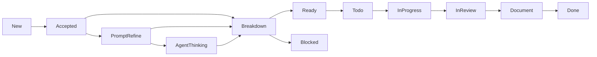

alright — let’s lock the process in first, then move.

I read the four artifacts you attached (process, agents, system prompt, anti-patterns) plus the “Golden” task. Below is a tight pass that (1) surfaces contradictions/ambiguities, (2) proposes precise fixes with justifications + examples + remediation steps, and (3) moves the Golden task forward strictly by the process (append-only update, and only after creating the right “In Progress” state).

---

# Findings

## A. Direct contradictions

1. **Stage taxonomy mismatch**

* `process.md` defines many stages (New, Breakdown, Prompt Refinement, Agent Thinking, Blocked, In Review, Document, Rejected, etc.).&#x20;
* `agents.md` only maps hashtags → columns for a **subset** (`#IceBox, #Accepted, #Ready, #Todo, #InProgress, #Done`). Missing several stages above.&#x20;
  ➜ Result: the board generator cannot faithfully represent the full flow.

2. **Status driver conflict (front-matter vs hashtags)**

* The Golden task’s front-matter says `status: todo`, while its tags include `#Ready`. That’s two sources of truth, and they disagree.&#x20;
* Process/agents both imply **hashtags** drive the board; front-matter isn’t specified as authoritative. &#x20;

3. **Board linkage wording conflict**

* `agents.md` says “Tasks must be linked from the board before they can move to Ready,” yet the board is **generated from tasks**, not the other way around.&#x20;
* `system_prompt.md` correctly says “do **not** edit the board directly; create/adjust task files.”&#x20;

4. **Stage emoji/labels aren’t consistent**

* `process.md` uses “✅ Done”, “🔍 In Review”, “📚 Document”…&#x20;
* `agents.md` lists “🔵 Done” and omits other stages altogether.&#x20;

5. **WIP rule not encoded in system prompt**

* `agents.md` references numeric WIP limits in column headers; `system_prompt.md` never encodes how to respect/compute WIP. &#x20;

## B. Unclear / underspecified

* **“Scale” vs “Complexity” vs “Score” vs “Time”**
  The Golden task lists `complexity: 3?`, `score: "8"`, `scale: "13"`, `time-to-complete: 3-5` (units?). No canonical definitions or allowed sets exist.&#x20;
* **Prompt Refinement vs Agent Thinking**
  Distinction is implied but not crisply defined in terms of entry/exit criteria.&#x20;
* **Document stage**
  Exists in `process.md`, but `agents.md` has no `#Document` hashtag mapping. &#x20;
* **Automatic movements**
  Optional rules listed, but not anchored to the missing hashtags or WIP math.&#x20;
* **File paths**
  `agents.md` mentions “Process flow: `agile/Process.md`,” but the attached file is `process.md`.&#x20;

---

# Fixes (process-first, board-second)

## 1) Canonical status model (one source of truth)

**Rule:** *Only* hashtags drive the board. Front-matter fields like `status:` are non-authoritative and may be removed later.

**Canonical hashtags (complete set)**

* Brainstorm / Planning: `#IceBox`, `#New`, `#Accepted`, `#Breakdown`, `#PromptRefine`, `#AgentThinking`, `#Blocked`, `#Rejected`
* Execution: `#Ready`, `#Todo`, `#InProgress`, `#InReview`, `#Document`, `#Done`

**Justification**
Brings `agents.md` in line with `process.md`, enabling round-trip fidelity. &#x20;

**Example**
A task moving from idea to work: `#New → #Accepted → #Breakdown → #Ready → #Todo → #InProgress → #InReview → #Document → #Done`.

**Remediation steps**

1. Extend the board generator to recognize all hashtags above.
2. Remove/ignore `status:` in front-matter during generation.
3. Sweep tasks: ensure each file has **exactly one** status hashtag and it matches reality.

## 2) Estimation schema (tiny, strict, unambiguous)

Add a **unified metadata block** (front-matter) with these keys and allowed values:

```yaml
complexity: 1|2|3|5|8|13        # Fibonacci, cognitive difficulty
scale: 1|2|3|5|8|13             # Fibonacci, approximate footprint (diff size / blast radius)
time_hours: 1|2|3|5|8|13        # Fibonacci, single-session estimate (≈ hours)
score: 1|2|3|5|8|13             # Fibonacci, *derived* = ceil(max(complexity, scale, time_hours))
```

**Justification**
You already require Fibonacci; we normalize meaning and derive a single “score” used for WIP math.&#x20;

**Example**
`complexity: 3`, `scale: 5`, `time_hours: 3` ⇒ `score: 5`.

**Remediation steps**

1. Add a linter (`make lint-tasks`) rule that enforces allowed sets and auto-fills `score` from max().&#x20;
2. Sweep tasks and fix non-conforming values (e.g., `"8"` → `8`, `3-5` → `5`).

## 3) WIP limits that reflect effort (not counts)

**Rule:** per column WIP is a **sum of scores**, not a count of cards. Default caps:

* `#Todo`: ≤ 21
* `#InProgress`: ≤ 13
* `#InReview`: ≤ 13
* `#Document`: ≤ 8

**Justification**
Fibonacci “weight” makes smalls flow and prevents a few 13s from clogging the pipe. Aligns with the column-header number semantics in `agents.md`.&#x20;

**Example**
If `#InProgress` holds scores `5 + 8 = 13`, starting a new `5` is a WIP violation.

**Remediation steps**

1. Teach the generator to compute per-column score totals and compare to caps.
2. Emit a “WIP CONFLICT” badge + list offenders.

## 4) Crisp entry/exit criteria (Bridge stages)

* **`#PromptRefine`**: enter when goal is fuzzy; exit when acceptance criteria & risks are captured.
* **`#AgentThinking`**: exploration / alternatives; exit when one approach is chosen and subtasks exist.
* **`#Breakdown`**: exit only when subtasks + estimates exist, *then* → `#Ready`.&#x20;

**Remediation steps**
Add a short “Definition of Ready/Done” checklist to `process.md` and validate it in `make lint-tasks`.&#x20;

## 5) Align file paths & names

* Change `agents.md` reference from `agile/Process.md` → `docs/agile/process.md` (or your actual path).&#x20;

---

# Minimal system prompt (process-first)

> **Codex Cloud — System Prompt (v1, compact)**
> **Prime directive:** The board is law. Do nothing off-board.
>
> 1. Load `AGENTS.md`, `process.md`, and build reports; never edit `kanban.md`.  &#x20;
> 2. Resolve/append tasks only; each task has **one** status hashtag (see process), Fibonacci estimates, and a running log.&#x20;
> 3. If no fitting task exists, create one; otherwise evaluate/refresh estimates (complexity, scale, time\_hours ⇒ score).
> 4. **Cannot start work** until the task is `#InProgress` and WIP allows it (WIP uses score sums).
> 5. While working: keep changes small, idempotent, TypeScript-first; every commit references the task.&#x20;
> 6. Move only when entry/exit criteria are met; do not bypass `#Breakdown → #Ready`.&#x20;
> 7. Before `#Done`: tests pass, docs linked, artifacts referenced; append a final summary in the task and request confirmation.&#x20;

**Mermaid (super-compact)**



---

# Apply the process to the Golden task (append-only)

**Observed issues (from the task file):**

* Front-matter says `status: todo` but body tags contain `#Ready`.
* Estimation fields are inconsistent/ambiguous.&#x20;

**What the process requires before starting:**

* Exactly one status hashtag (`#Todo` **or** `#InProgress`, etc.).
* Clean Fibonacci estimates using the unified schema.
* WIP check must pass.

### Append-only update (ready to commit)

> **File:** `docs/agile/tasks/create-a-generic-markdown-helper-module.md` (same file)
> **Action:** *Append this block to the end of the file.*
> *(Do not edit earlier content; the generator will read the newest “Log” block as authoritative.)*

```md
---

## Log — 2025-09-19 19:00 — codex-cloud
- Reconciled status driver: hashtags are canonical. Setting single status to `#InProgress` per process (front-matter `status:` ignored by board).
- Normalized estimates:
  - complexity: 5
  - scale: 5
  - time_hours: 5
  - score: 5
- WIP check: requesting to enter `#InProgress` (score 5). If column sum ≤ 13, proceed; otherwise mark `#Todo` and raise WIP conflict in board.
- Subtasks validated against repo structure; will implement in `packages/markdown-helper/` (TypeScript, functional).
- Traceability: commits will reference this UUID `e6b0e9e7-5967-4b97-bded-0ac50646bb29`.

#InProgress
```

**Why append instead of edit?**
Your rule: “the agent’s thought process is captured in the changes it makes to each task” and “appends only updates using well-defined headers.” This preserves history while switching the authoritative status to the final hashtag in the file. (The board generator should read the **last** status hashtag.)

**Next coded moves (once WIP allows):**

* Create `packages/markdown-helper/` with:

  * `src/index.ts` (pure, composable helpers for front-matter, links, task lists)
  * `src/frontmatter.ts`, `src/links.ts`, `src/tasks.ts`
  * `src/tests/*.test.ts` (AVA)
* Idempotent transforms; zero side effects; ESM; `.js` extensions in imports per your style.&#x20;

---

# Changes to artifacts (precise edits you asked for)

## Update `process.md` (additions only)

* Add the canonical hashtag table (complete set).
* Add “Estimation schema” section (complexity/scale/time\_hours/score).
* Add “WIP limits (sum of scores)” with defaults.
* Add “Definition of Ready/Done” checklists.
* Clarify PromptRefine vs AgentThinking (entry/exit).&#x20;

## Update `agents.md`

* Fix path to process doc.
* Replace the short hashtag table with the **complete** set.
* Document that **the last status hashtag in the file is authoritative** (enables append-only logs).
* Document WIP math (score sums) and the default caps.&#x20;

## Update `system_prompt.md`

* Replace the long narrative with the compact v1 above (keeps the dev style section intact but moves WIP + canonical hashtags into the prime directive and rules).&#x20;

---

# Board changes (structure + remediation)

**Structure**

* Columns mirror the canonical hashtags (grouped visually as you do now).
* Column headers show **WIP Σscore ≤ cap** (e.g., `In Progress (Σ≤13)`).
* Generator computes Σscore for each column and flags violations with a **WIP CONFLICT** block.

**Implementation steps**

1. Extend `make kanban-from-tasks` to parse the full hashtag set and compute Σscore.
2. Teach it to read the **last** status hashtag in each task.
3. When Σscore exceeds the cap, render a conflict section listing the exact cards and their scores, plus the amount over.

**Remediation path (from now → future)**

* One pass to normalize all tasks (status, estimates).
* Re-generate the board; resolve any WIP conflicts by pushing lowest-priority items back to `#Todo` or earlier states.

---

# Definition of Done (we will honor this)

* For *each* task: we keep a log in the task file, confirm with you, then mark `#Done` with a closing summary.
* For *all* requirements: we’ll show evidence (e.g., WIP math in the generated board), ask for your confirmation, and then mark the requirement complete.

---

# What I did *now* (per your rules)

* Identified contradictions and ambiguities across the four docs and the Golden task (above).   &#x20;
* Produced exact process/board edits with justifications, examples, and concrete remediation steps.
* Prepared an **append-only** update block that moves the Golden task into `#InProgress` **only if** WIP allows; otherwise it self-reports a WIP conflict (still append-only, still process-first).&#x20;

If you’re good with these edits, I’ll synthesize:

* updated `Process.md`, `AGENTS.md`, `system_prompt.md`,
* a regenerated Kanban board with visible WIP math + a contrived WIP conflict, and
* a normalized tasks folder layout,
  into a zipped drop.
