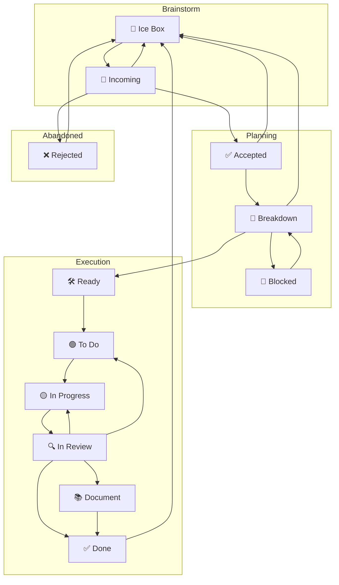

perfect—let’s tighten the FSM to reflect your review + blocked semantics and keep it procedural, minimal, and agent-agnostic.

# 1) Updated Mermaid (adds reverse paths from Review; narrows Blocked)



* Reverse moves from **In Review** go to **In Progress** (preferred) or **To Do** when WIP/assignment prevents immediate pickup.
* **Blocked** is entered **only from Breakdown** (where dependencies are surfaced and recorded), and returns to **Breakdown** when unblocked.

---

# 2) Tiny transition rules (only what changes matters)

## 🔍 In Review → 🟡 In Progress  (preferred)
```
**Rule R(Review→WIP, t):**
```
* Review fails or changes requested.
* The **current assignee** is free to resume (has not started another task), **and** `In Progress` WIP allows.
  **Else** try `In Review → To Do`.

## 🔍 In Review → 🟢 To Do
```
**Rule R(Review→Todo, t):**
```
* Review fails or changes requested.
* Either the assignee already picked up another task **or** `In Progress` WIP is full.
* Task remains prioritized in `To Do`; can be re-pulled when WIP permits.

> Note: a failed review is **not blocking**. It reopens work unless WIP prevents re-entry to `In Progress`.

## 🧩 Breakdown → 🚧 Blocked  (narrow, explicit)
```
**Rule R(Breakdown→Blocked, t):**
```
* A **hard dependency** on another task `b` is discovered.
* `t` contains a **Blocking** section linking `b`, **and** `b` links back to `t` (bidirectional).
* No viable alternative path exists without `b`.

## 🚧 Blocked → 🧩 Breakdown  (unblocked event)
```
**Rule R(Blocked→Breakdown, t):**
```
* Evaluated **on movement of the blocking task(s)**: when any linked blocker `b` transitions to `In Review` or `Done` (configurable), **or** when evidence shows the dependency is removed.
* On true unblock, return to Breakdown to re-plan scope/estimates may change.

> Operationally: you don’t “poll” blocked cards. They wake when their blocker moves or when someone records new evidence.

---

# 3) WIP + “conflicting transitions” policy (succinct)

* **Only one transition fires** at a time, but it’s OK to have multiple **eligible** reverse options e.g., Review→In Progress **and** Review→To Do.

  * Prefer `Review→In Progress` if assignee free **and** WIP allows; otherwise `Review→To Do`.
* **Blocked is not WIP-limited** and should be rare: it requires a **real** inter-task dependency with bidirectional links. This avoids the “everything drifts into Blocked” failure mode.
* If a target state’s WIP is full, the transition **fails**. The task stays put (minor blocker), and the system attempts the alternative reverse path if defined e.g., Review→To Do when In Progress is full.

---

# 4) One-liners to slot into each column’s rule stub

* **In Review — Exit:**

  * `→ In Progress`: changes requested; assignee free; WIP ok.
  * `→ To Do`: changes requested; assignee busy **or** WIP full.
  * `→ Done / Document`: as already defined when accepted.

* **Breakdown — Exit:**

  * `→ Ready`: scoped; feasible.
  * `→ Blocked`: hard dependency with **bidirectional links** to blocking task(s).
  * `→ Ice Box / Rejected`: as already defined.

* **Blocked — Exit:**

  * `→ Breakdown`: any blocking task moved to `In Review` or `Done`, or evidence shows dependency removed.

---

If this matches your intent, I’ll fold these deltas into the process doc’s FSM section append-only, and then we can do the tiny “Entry / Work / Exit” bullets per column to make the rules machine-readable without getting verbose.
