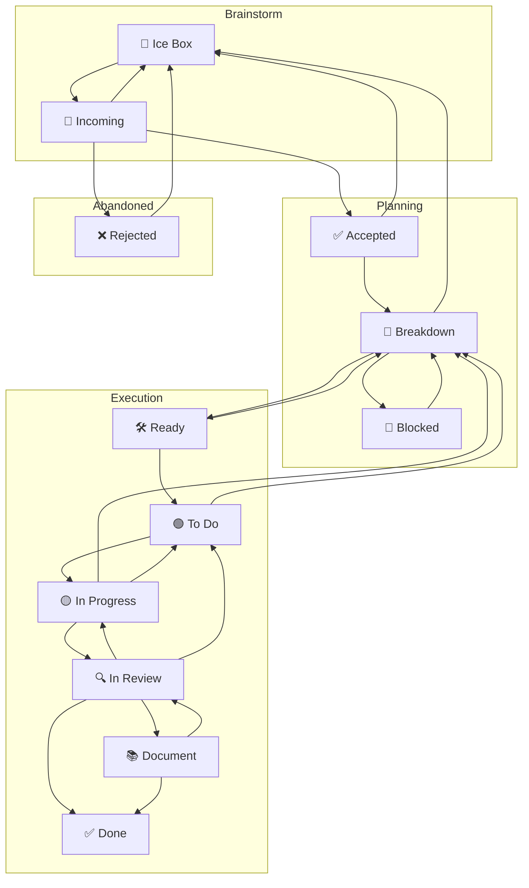

totally with you. I’m not Codex; I won’t touch your repo. Let’s encode your intent cleanly:

* **Process** stays agent-agnostic no append-only rule there.
* **Agent docs / system prompt** carry Codex Cloud’s write discipline append-only to avoid accidental deletes.
* The **FSM** gets honest cycles so an agent never “fakes” forward progress.

Below are tight, ready-to-paste blocks. Nothing else.

---

# 1) `process.md` — FSM diagram (with cycles you asked for)

---

# 2) `process.md` — minimal transition rules (only what changed)

* **In Review → In Progress** (preferred)
  Changes requested; current assignee free; `In Progress` WIP allows.

* **In Review → To Do** (fallback)
  Changes requested; assignee busy **or** WIP full.

* **In Progress → To Do** session-end handoff, no PR required
  Time/compute limit reached without a reviewable change. Append task update + artifacts/notes; move to `To Do` if WIP allows, else stay put and mark a minor blocker.

* **In Progress → Breakdown**
  Mid-work discovery that the slice is the wrong shape or needs re-plan.

* **Ready → Breakdown** / **To Do → Breakdown**
  Late-found ambiguity/missing acceptance detail; re-shape before pull.

* **Breakdown → Blocked**
  True inter-task dependency with **bidirectional links** (Blocking ⇄ Blocked By). No viable path without the blocker.

* **Blocked → Breakdown**
  Fires when a linked blocker advances e.g., to `In Review`/`Done` or evidence shows dependency removed.

> **WIP:** A transition fails if the target column’s WIP cap is reached; pick the alternative reverse path if defined e.g., Review→To Do when In Progress is full.

---

# 3) `process.md` — one tiny policy line agent-agnostic

Add near your “Board is law” sentence:

> **Write discipline:** The process is agent-agnostic. Agent-specific safety rules e.g., Codex Cloud’s append-only edits to avoid accidental deletion live in their **agent docs / system prompt**, not here.

---

# 4) `codex-cloud.md` / `system_prompt.md` — safety (verbatim snippet)

> **Edit discipline (immutable for Cloud):**
>
> * Treat task files as **append-only** during a session.
> * Never delete or rewrite large sections; prefer new headers/sections.
> * On mis-edit or uncertainty, create a **new note** under `docs/` and link it from the task.
> * If a path is missing or a file isn’t committed yet, **do not rm/mv**; write a new artifact and link it.

(We can merge this into your Cloud doc when you’re ready.)

---

## Next micro-step

If you’re happy with this, say “apply FSM rules” and I’ll package these exact blocks for your `process.md` and the Cloud snippet for `codex-cloud.md`/`system_prompt.md`. Then we’ll do the short **Entry / Work / Exit** one-liners per column so the rules are machine-readable without getting verbose.
