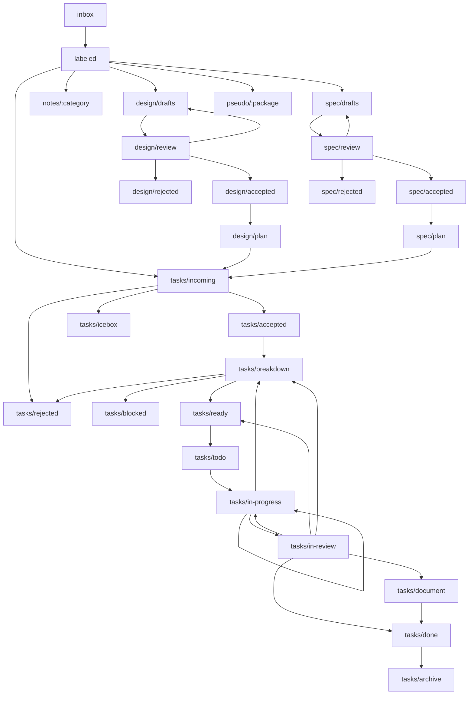

# doc driven workflow diagram

```mermaid
flowchart TD

inbox --> labeled
labeled --> tasks/incoming
labeled --> design/drafts
labeled --> notes/:category
labeled --> spec/drafts
labeled --> pseudo/:package
design/drafts --> design/review
design/review --> design/accepted
design/review --> design/rejected
design/review --> design/drafts
design/accepted --> design/plan
design/plan --> tasks/incoming


spec/drafts --> spec/review
spec/review --> spec/accepted
spec/review --> spec/rejected
spec/review --> spec/drafts
spec/accepted --> spec/plan
spec/plan --> tasks/incoming

tasks/incoming --> tasks/accepted
tasks/incoming --> tasks/rejected
tasks/incoming --> tasks/icebox
tasks/accepted --> tasks/breakdown
tasks/breakdown --> tasks/rejected
tasks/breakdown --> tasks/blocked
tasks/breakdown --> tasks/ready
tasks/ready --> tasks/todo
tasks/todo --> tasks/in-progress

tasks/in-progress --> tasks/in-progress
tasks/in-progress --> tasks/in-review
tasks/in-progress --> tasks/breakdown
tasks/in-review --> tasks/document
tasks/in-review --> tasks/in-progress
tasks/in-review --> tasks/ready
tasks/in-review --> tasks/done
tasks/in-review --> tasks/breakdown
tasks/document --> tasks/done
tasks/done --> tasks/archive
```

At some point I want a flow that'll use the rejected and final states to learn why and why not, to reduce the number of rejected items as time goes on
