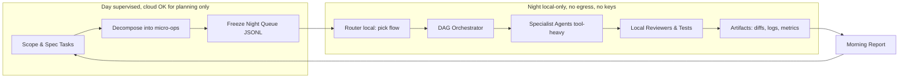
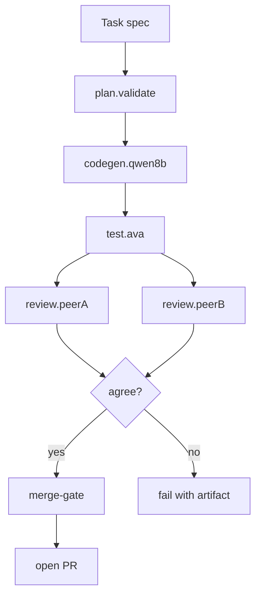

Solid. Here’s a tight **Pantheon primer**—diagrams, math, and the minimum you need to start proving this out without violating your “no automatic cloud fallback” rule.

---

# Architecture at 10,000 ft



**Non-negotiables**: night mode strips cloud creds; runner user has outbound egress blocked; orchestrator refuses agents whose `runtime.origin !== "local"`. The “router” only chooses among **your** specialists, never a cloud model.

---

# Night flow (example for code work)



Each node is **bounded** max tool calls, timeouts and emits signed artifacts (input, output, logs, diff). No success? It **stops** and leaves a breadcrumb for you to fix by day.

---

# Why this can work (math you can measure)

## 1) Throughput & stability

Let:

* \lambda = average micro-tasks enqueued per night
* ( M ) agents with service rates \mu_i tasks/hour
* success probability (before review) p_i for agent (i)
* night budget ( T ) hours

**Stability** (don’t overload the night):
```
\rho \equiv \frac{\lambda}{\sum_{i=1}^{M}\mu_i} < 1
```
Use a simple M/M/c approximation for wait times; keep \rho ~ 0.7–0.8 so test/review contention doesn’t starve the tail. vLLM’s **continuous batching** (PagedAttention) is how you keep \mu_i up even with small local models. ([arXiv][1])

**Expected accepted outputs/night** after dual-review with independence assumption:
```
E[\text{accept}] \approx T \sum_{i=1}^{M} \mu_i \cdot \underbrace{\big(p_i^2 + (1-p_i)^2 \cdot 0\big)}*{\text{both agree}}
= T \sum*{i=1}^{M} \mu_i , p_i^2
```
If you require both peers to agree “pass”, the false-positive rate collapses fast; tune to your risk.

## 2) Specialization learning curve

For an agent fine-tuned via QLoRA on your traces, model its task success with a saturating curve:
```
p_i(k) = p_{0,i} + (\bar{p}*i - p*{0,i})\left(1 - e^{-\alpha_i , N_k}\right)
```
* (k) = training iteration, N_k = high-quality examples consumed
* \alpha_i increases when the task is narrow & repeatable (your setup)
* Use this to forecast when a specialist reaches your “merge-eligible” p_i threshold.
  QLoRA/LoRA give you these gains on commodity GPUs without blowing VRAM. ([arXiv][2])

## 3) Batching economics tool-heavy

Let tool overhead per task be \tau and model step latency be ( s ). With continuous batching of (b) items:
```
\text{amortized latency} \approx \tau + \frac{s_{\text{prefill}}}{b} + s_{\text{decode}}
```
As (b) grows, you flatten prefill cost—why your “many tiny, repeatable tasks across many files” pays off. ([arXiv][1])

## 4) Curriculum & task shaping

Start easy (rename, add headers, trivial refactors), then ratchet complexity:
```
\min_{\theta} ; \mathbb{E}_{x \sim \mathcal{D}*t} ; \mathcal{L}(f*\theta(x))
\quad \text{s.t.}\quad \mathcal{D}_1 \prec \mathcal{D}_2 \prec \dots \prec \mathcal{D}_T
```
Classic curriculum learning: reorder and stage your datasets so “narrow + repeatable” comes first; you’ll converge faster for small models. ([ACM Digital Library][3])

---

# Tool-use is the superpower (not bigger weights)

* Train small models to **call tools reliably** strict JSON schemas; finite-state tool loop; retries on schema error; cap iterations.
* Toolformer showed tool-use can be **learned** from self-labeled traces; you can mimic that with your artifacts (no cloud). ([arXiv][4])
* Qwen’s function-calling + **Qwen-Agent** patterns are pragmatic for local tool loops OpenVINO/vLLM. ([Qwen][5])

---

# Data & evaluation backbone

**Artifacts per node append-only:**

* `input.json` (validated by Zod)
* `llm_prompt.txt` (thick prompt)
* `tool_calls.jsonl` (each call: name, args, result, ms)
* `output.json` (Zod)
* `stdout/stderr.log` (short)
* `diff.patch` (when code changes)
* `review.json` (verdict, rationales)
* `metrics.json` (latency, tokens, memory, exit code)

**Nightly metrics dashboard (what matters):**

* Task throughput & queue depth
* Pass rate by agent/version & by package
* Tool-call error rate (schema mismatch, retries)
* Unit test deltas failures introduced/fixed
* Reviewer disagreement matrix (drift detector)
* Costed time budget CPU/GPU hours, wall time

---

# Minimal formal spec (to keep agents honest)

* **I/O contracts**: use Zod schemas for every agent’s input/output (serializable & small).
* **Termination**: each agent’s loop is a DFA: `PROMPT → {TOOL|FINAL}` with `max_steps` and `max_failures`.
* **Determinism goal**: prompts are strictly templated; tools are idempotent; failures produce replayable states.
* **Security**: night runner uses a user with no net egress; only whitelisted tools on PATH; fs access limited to the repo worktree.

---

# “Thick prompt” and loop (pattern)

1. **System prelude**: role, constraints, “never write free-form code to stdout; only via tools”.
2. **Schema cards**: show each tool’s JSON schema and examples.
3. **Repository conventions**: FP TS, AVA, Native ESM, Web Components, GPL-3.
4. **Acceptance tests**: echo them as goals.
```
5. **Loop**:
```
   * LLM proposes a tool call (JSON).
   * Orchestrator validates against schema; runs tool; appends result.
   * LLM sees *only* the last N tool results + running goals.
   * If `finalize`, orchestrator computes `diff.patch`, runs tests, returns `output.json`.

This is boring by design. Boring systems ship.

---

# Training plan (no cloud, iterative)

1. **Collect**: mine last night’s artifacts for input, tool-trace, output.
2. **Filter**: keep only “green” runs (tests pass, reviewers agree).
3. **Synthesize**: for tool-use, create prompt → tool call pairs from traces; for generation, create prompt → output pairs.
4. **QLoRA fine-tune**: per-agent adapters, tiny rank; freeze base. Validate on held-out tasks. Promote only if benchmarks improve. ([arXiv][2])
5. **Curriculum**: each week, lift a subset to slightly harder micro-ops. ([ACM Digital Library][3])

---

# First 2 weeks (concrete)
```
**Week 1**
```
* Pick **one** night flow: “DocOps rename + front-matter normalize + AVA harness stub”.
* Implement 3 agents: `doc.rename`, `doc.frontmatter`, `code.ava-stub`.
* Put everything behind vLLM with **continuous batching** on a single GPU; measure μ, τ, b. ([docs.vllm.ai][6])
* Enforce DFA loop + Zod I/O + artifacts.
```
**Week 2**
```
* Add `review.peerA/B` and `test.ava`.
* Start logging disagreements; set accept rule to “both peers agree”.
* Begin tiny QLoRA on `doc.frontmatter` only (fast win). ([arXiv][2])
* Morning report: PRs, pass rates, tool error heatmap.

Once that’s stable, scale horizontally: more micro-ops across more packages. Your Kanban CLI feeds the queue; DocOps & NNS help target clusters where repetition is highest.

---

## The bar for “cloud parity”

You won’t match breadth. You **can** out-execute on narrow, repetitive ops with: (1) ruthless flow boundaries, (2) tool-first loops, (3) curriculum + adapters, (4) continuous batching. That’s the whole bet.

---

### Sources (key ideas)

* **QLoRA**: efficient local finetuning via 4-bit adapters—practical path to specialist agents. ([arXiv][2])
* **vLLM / PagedAttention**: continuous batching raises throughput for your night runs. ([arXiv][1])
* **Toolformer**: self-supervised tool-use—your trace mining mirrors this. ([arXiv][4])
* **Curriculum learning**: stage tasks from trivial → harder to accelerate small-model learning. ([ACM Digital Library][3])
* **Qwen function-calling & Qwen-Agent**: pragmatic patterns for local tool loops. ([Qwen][5])

If you want, I’ll translate this into a seed `packages/pantheon-*` scaffold (FP TS, AVA, flat pkgs, native ESM) with: (1) orchestrator, (2) Zod IO types, (3) two agents, (4) one flow, (5) artifact logger, (6) vLLM driver, and (7) a tiny QLoRA script template.

[1]: https://arxiv.org/pdf/2309.06180?utm_source=chatgpt.com "Efficient Memory Management for Large Language Model ..."
[2]: https://arxiv.org/abs/2305.14314?utm_source=chatgpt.com "QLoRA: Efficient Finetuning of Quantized LLMs"
[3]: https://dl.acm.org/doi/10.1145/1553374.1553380?utm_source=chatgpt.com "Curriculum learning | Proceedings of the 26th Annual ..."
[4]: https://arxiv.org/pdf/2302.04761?utm_source=chatgpt.com "arXiv:2302.04761v1 [cs.CL] 9 Feb 2023"
[5]: https://qwen.readthedocs.io/en/latest/framework/function_call.html?utm_source=chatgpt.com$
 "Function Calling - Qwen"
[6]: https://docs.vllm.ai/?utm_source=chatgpt.com "vLLM"
