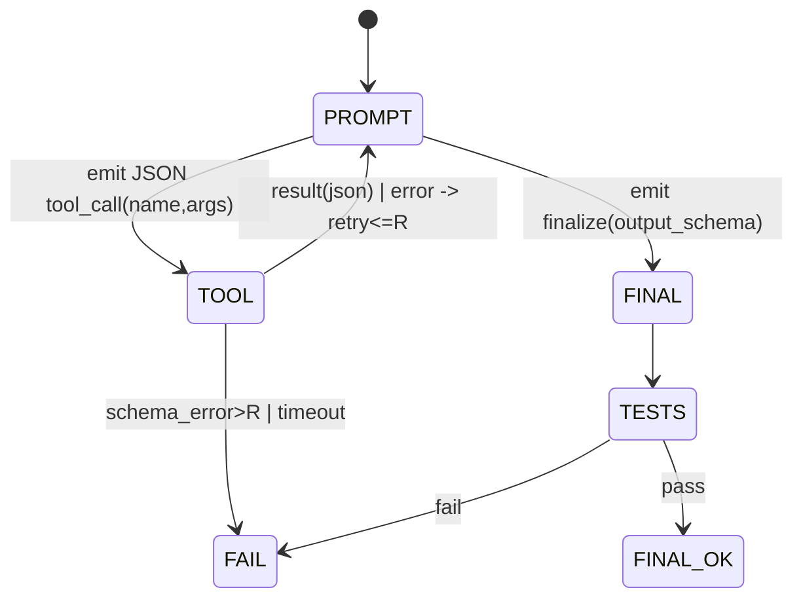

hell yeah — you’re on the right bet: narrow tasks + heavy tool use + batching + patience. here’s the **Pantheon primer — part 2** with sharper diagrams, math you can actually use to size the system, and repo-ready shapes for flows, traces, training, and review. it keeps your hard rule: **night runs are local-only; there is never cloud fallback.**

---

# 1) System math you can run back-of-the-envelope

## 1.1 Night throughput & stability (don’t oversubscribe)

Assume a nightly queue of micro-tasks arriving at average rate ( \lambda ) (tasks/hour). You have (c) concurrent “server” slots (GPUs/agents) each with effective service rate ( \mu ) (tasks/hour) under **continuous batching** (vLLM/OpenVINO/etc.). Treat it as M/M/c for a rough bound:

* Utilization: ( \rho = \frac{\lambda}{c\mu} ). Keep ( \rho \le 0.8 ) so queues don’t explode by dawn.
* Use Erlang-C to estimate expected wait; if it’s > ~10–20% of your night budget, shrink task size or add capacity. ([Wikipedia][1])

**Why batching matters:** the amortized latency per task under batch size (b):
[
\text{lat}*\text{task} \approx \tau*\text{tools} + \frac{s_\text{prefill}}{b} + s_\text{decode}
]
As (b) grows, prefill amortizes; that’s free throughput, exactly what **PagedAttention + continuous batching** were built to exploit. ([arXiv][2])

## 1.2 Accepted work per night (with peer review)

Let (p_i) be pre-review success probability of specialist (i) (passes tests + looks sane). Two independent peer reviewers must both agree “pass.” Expected accepted items across all specialists over night budget (T):

[
E[\text{accepted}] \approx T \cdot \sum_i \mu_i \cdot p_i^2
]

This makes your **reviewers valuable**: you reduce false-positives quadratically while keeping progress. Track inter-reviewer agreement with **Cohen’s kappa**; gate merges if (\kappa) dips below your threshold (e.g., 0.6+). ([Wikipedia][3])

## 1.3 Specialization learning curve (why traces pay off)

For a small agent you fine-tune via **QLoRA**, success rises with good examples (N) roughly like:
[
p(N) = p_0 + (\bar{p}-p_0)\left(1 - e^{-\alpha N}\right)
]
Tighter task scope → larger (\alpha) → quicker payoff. That’s your whole strategy: crush scope; multiply repeats; collect clean traces; adapter-train. ([arXiv][4])

---

# 2) Deterministic tool loop (DFA) — the boring core that wins



Rules:

* Strict JSON schemas for every tool; **reject** free-text side-effects.
* Hard caps: `max_steps`, `max_failures`, per-tool timeouts.
* On `FINAL`: compute diff, run tests, produce **signed artifacts**.
* If anything fails → **stop** (breadcrumbs for daytime fix).
  This pattern maps cleanly to Qwen function-calling with fixed templates; Qwen’s docs spell out the templating details, and there’s a working **Qwen-Agent** backend + **OpenVINO** example for local deployment. ([Qwen][5])

---

# 3) Data is the product: artifacts → training → promotion

## 3.1 Artifact contract (per node)

* `input.json` (validated via Zod)
* `prompt.txt` (thick prompt, frozen template hash)
* `tool_calls.jsonl` (each: name,args,result,ms,ok)
* `output.json` (Zod)
* `diff.patch` (if code mutated)
* `tests.log` + `report.json` (pass/fail, counts)
* `review.json` (peerA/peerB verdict + rationale)
* `metrics.json` (latency, tokens, memory, retries, exit)

## 3.2 Trace → training pairs

* **Tool-use tuples**: ((\text{prompt slice}) \rightarrow \text{tool_call JSON}). This follows the **Toolformer** playbook—small models learn *when* and *how* to call tools from your own traces. ([arXiv][6])
* **Generation pairs**: ((\text{prompt}) \rightarrow \text{output.json}) for formatter/summarizer agents.
* **Filter** to only “green” runs: tests pass + reviewers agree ((\kappa) high).

## 3.3 Adapter training (nightly/weekly)

* Use **QLoRA** (4-bit base + low-rank adapters) to keep VRAM sane; validate on held-out tasks; promote agent@version iff it beats prior on acceptance tests. ([arXiv][4])

---

# 4) Local throughput engines (you’ll want both)

* **vLLM** for text specialists: **PagedAttention** + **continuous batching** → high token throughput on commodity GPUs. ([arXiv][2])
* **OpenVINO** for CPU/iGPU/NPU boxes: quantized int4 Qwen variants; there’s a **Qwen-Agent + OpenVINO** function-calling notebook you can lift from. ([docs.openvino.ai][7])

---

# 5) Repo-ready shapes (TypeScript, FP, Native ESM, AVA)

## 5.1 Agent spec & IO contracts (Zod)

```ts
// packages/pantheon-core/src/types.ts
import { z } from "zod";

export const IO = {
  Spec: z.object({ title: z.string(), scope: z.string(), acceptance: z.array(z.string()) }),
  CodePatch: z.object({ diff: z.string(), stats: z.object({ files: z.number(), lines: z.number() }) }),
  TestReport: z.object({ passed: z.boolean(), summary: z.string(), logs: z.string().optional() }),
  Review: z.object({ verdict: z.enum(["pass","fail"]), rationale: z.string() }),
};

export type Tool<T extends z.ZodTypeAny, R extends z.ZodTypeAny> = {
  name: string;
  args: T;
  result: R;
  call: (a: z.infer<T>) => Promise<z.infer<R>>;
};

export type AgentRuntime = { engine: "vllm" | "openvino"; model: string; origin: "local" };

export type AgentSpec<I extends z.ZodTypeAny, O extends z.ZodTypeAny> = {
  name: string;
  in: I; out: O;
  runtime: AgentRuntime;                 // night-mode requires origin === "local"
  tools: ReadonlyArray<Tool<any,any>>;
  prompt: (input: z.infer<I>) => string; // thick prompt template
  run: (input: z.infer<I>) => Promise<z.infer<O>>;
};
```

## 5.2 Qwen tool schemas (deterministic loop)

```ts
// packages/pantheon-tools/src/index.ts
import { z } from "zod";
export const WriteFile = {
  name: "write_file",
  args: z.object({ path: z.string(), content: z.string() }),
  result: z.object({ ok: z.literal(true), path: z.string() }),
  async call({ path, content }) { /* fs.writeFile + sanitize */ return { ok: true, path }; }
};
export const RunBiome = {
  name: "run_biome",
  args: z.object({ cwd: z.string() }),
  result: z.object({ ok: z.boolean(), output: z.string().optional() }),
  async call({ cwd }) { /* execa biome */ return { ok: true, output: "" }; }
};
export const ComputeDiff = {
  name: "compute_diff",
  args: z.object({ cwd: z.string() }),
  result: z.object({ diff: z.string(), files: z.number(), lines: z.number() }),
  async call({ cwd }) { /* git diff --no-color */ return { diff:"", files:0, lines:0 }; }
};
```

**LLM loop**: render a template that *lists these tools and JSON schemas verbatim*, then run a fixed cycle: `prompt → parse tool_call → validate → tool → append result → next prompt`. Qwen’s function-calling docs & Qwen-Agent show the exact formatting nudges to keep calls on-schema; mirror them. ([Qwen][5])

## 5.3 Example agents

```ts
// packages/pantheon-agents/src/codegen.qwen8b.ts
import { IO, AgentSpec } from "@pantheon-core/types";
import { WriteFile, RunBiome, ComputeDiff } from "@pantheon-tools";
export const CodegenQwen8B: AgentSpec<typeof IO.Spec, typeof IO.CodePatch> = {
  name: "codegen.qwen8b",
  in: IO.Spec, out: IO.CodePatch,
  runtime: { engine: "vllm", model: "Qwen3-8B-Instruct", origin: "local" },
  tools: [WriteFile, RunBiome, ComputeDiff],
  prompt: (s) => [
    "ROLE: senior TS engineer. Functional, immutable, AVA tests, Native ESM, GPL-3.0-only.",
    "CONSTRAINTS: Only act via tool calls that match the JSON schemas below.",
    "GOAL: satisfy acceptance items with minimal diff.",
    "TOOLS:", /* inject schema cards */,
    "SPEC:", JSON.stringify(s, null, 2),
  ].join("\n"),
  run: async (spec) => {
    // 1) render prompt; 2) call local model (vLLM/OpenVINO) with tool calling enabled;
    // 3) iterate <= N steps; 4) finalize -> ComputeDiff; 5) return CodePatch
    return { diff: "...", stats: { files: 2, lines: 74 } };
  }
};
```

```ts
// packages/pantheon-agents/src/test.ava.ts
export const TestAVA: AgentSpec<{ cwd: string }, typeof IO.TestReport> = {
  name: "test.ava",
  in: z.object({ cwd: z.string() }),
  out: IO.TestReport,
  runtime: { engine: "openvino", model: "Qwen2.5-3B-Instruct-int4", origin: "local" },
  tools: [],
  prompt: () => "Summarize AVA output into {passed, summary, logs?}.",
  run: async ({ cwd }) => ({ passed: true, summary: "62 tests passed" })
};
```

## 5.4 Flow graph (DAG)

```yaml
# flows/spec2code.yaml
name: spec2code
entry: plan.validate
nodes:
  - id: plan.validate
    agent: plan.validate          # trivial schema checks
    inputs: [root]
  - id: codegen
    agent: codegen.qwen8b
    inputs: [plan.validate]
  - id: test
    agent: test.ava
    inputs: [codegen]
  - id: reviewA
    agent: review.peer
    inputs: [codegen, test]
  - id: reviewB
    agent: review.peer
    inputs: [codegen, test]
  - id: merge
    agent: merge.gate
    inputs: [reviewA, reviewB]
output: merge
```

---

# 6) Evaluating nightly progress (what to track)

* **Pass rate by agent@version**: ( \hat{p}_i = \frac{\text{pass}}{\text{attempts}} ).
* **Reviewer agreement**: Cohen’s ( \kappa ) per agent & flow; alerts on drift. ([Wikipedia][3])
* **Tool schema error rate**: % tool calls rejected by JSON validation (should trend toward zero as adapters learn).
* **Batching health**: average batch size (b), GPU/CPU utilization, tokens/sec; if (b \downarrow) your queue isn’t wide enough—re-chunk tasks. ([docs.vllm.ai][8])
* **Queue stability**: observed ( \rho ), average wait, 95p wait; keep (\rho\le .8). ([Wikipedia][1])

---

# 7) Training loop (no cloud, adapters only)

1. **Mine traces** → JSONL with `{"prompt": "...", "tool_call": {...}}` and/or `{"prompt": "...", "output": {...}}`.
2. **Filter** by green badges (tests pass & reviewers agree).
3. **Fine-tune** per-agent with **QLoRA**; small rank; freeze base; validate on held-out set; **promote** only on measurable gains. ([arXiv][4])
4. **Curriculum**: start with trivial docops/refactors; slowly widen the spec space once (\hat{p}_i) stabilizes (classic curriculum learning idea—stage easier distributions first). ([Wikipedia][9])

---

# 8) Why these particular building blocks

* **Continuous batching + PagedAttention** ← the only way small local models stay throughput-competitive overnight. ([arXiv][2])
* **Qwen function calling + Qwen-Agent** ← solid, well-documented tool-use patterns; **OpenVINO** path is concretely documented for Qwen. ([Qwen][5])
* **Toolformer principle** ← your traces *teach* tool use; you’re reproducing that, privately, with higher-quality data. ([arXiv][6])
* **QLoRA** ← adapter training on your HW; proven, open literature. ([arXiv][4])

---

# 9) Concrete next steps (one week)

* Pick *one* docops micro-op you already do (e.g., normalize front-matter).
* Implement **one** DFA agent with 3 tools (`read_file`, `write_file`, `compute_diff`) + AVA test runner node.
* Run at night under **vLLM**; measure (b), tokens/sec, ( \rho ). If (b<8), widen the queue by chunking files finer. ([docs.vllm.ai][8])
* Morning: compute pass-rate, schema error-rate, (\kappa).
* End of week: first **QLoRA** adapter on that agent using only green traces; promote if tests improve. ([arXiv][4])

you’re already doing the hard part: **discipline**. pantheon’s job is to make that discipline inevitable—DFA loops, schemas, artifacts, adapters, and a queue that never cheats by calling the cloud at night.

if you want, I can turn this into `packages/pantheon-*` scaffolds (core types, executor, two agents, one flow, artifact logger, vLLM/OpenVINO drivers, AVA tests) you can drop into your monorepo and start iterating.

[1]: https://en.wikipedia.org/wiki/M/M/c_queue?utm_source=chatgpt.com "M/M/c queue"
[2]: https://arxiv.org/pdf/2309.06180?utm_source=chatgpt.com "Efficient Memory Management for Large Language Model ..."
[3]: https://en.wikipedia.org/wiki/Cohen%27s_kappa?utm_source=chatgpt.com "Cohen's kappa"
[4]: https://arxiv.org/pdf/2305.14314?utm_source=chatgpt.com "QLORA: Efficient Finetuning of Quantized LLMs"
[5]: https://qwen.readthedocs.io/en/latest/framework/function_call.html?utm_source=chatgpt.com "Function Calling - Qwen"
[6]: https://arxiv.org/abs/2302.04761?utm_source=chatgpt.com "Toolformer: Language Models Can Teach Themselves to Use Tools"
[7]: https://docs.openvino.ai/2024/notebooks/llm-agent-functioncall-qwen-with-output.html?utm_source=chatgpt.com "Create Function-calling Agent using OpenVINO and Qwen ..."
[8]: https://docs.vllm.ai/?utm_source=chatgpt.com "vLLM"
[9]: https://en.wikipedia.org/wiki/Queueing_theory?utm_source=chatgpt.com "Queueing theory"
